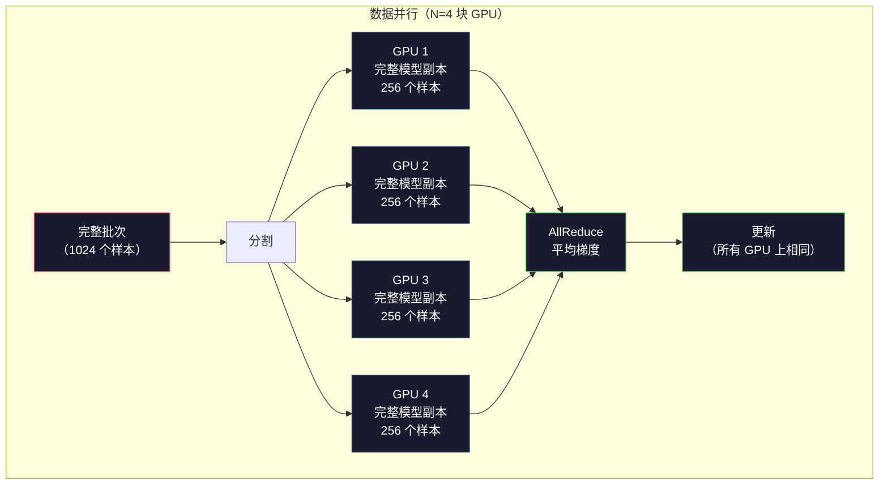
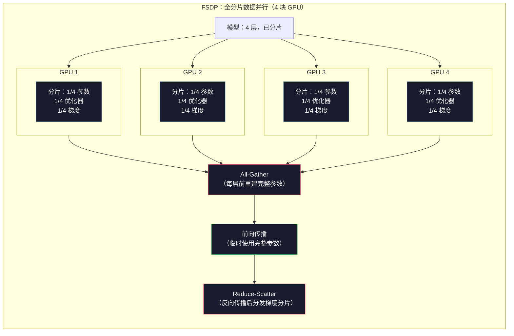
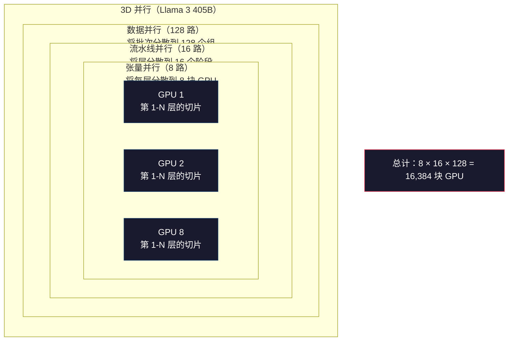

# 扩展：分布式训练、FSDP、DeepSpeed

> 你的 1.24 亿参数模型在单个 GPU 上训练完了。现在试试 70 亿参数。模型装不进内存，数据在单机上需要数周。规模化分布式训练不是可选项，而是唯一的出路。

**类型：** 构建
**语言：** Python
**前置条件：** Phase 10 · 04（预训练迷你 GPT）
**时长：** 约 120 分钟

## 学习目标

- 解释三种并行类型（数据并行、张量并行、流水线并行），以及在什么模型规模和集群规模下各自是必要的
- 使用 PyTorch DDP 实现数据并行训练，带有跨多 GPU 的梯度同步
- 计算给定模型大小的内存预算（权重 + 优化器状态 + 梯度 + 激活值），以确定所需最低硬件
- 配置 FSDP 或 DeepSpeed ZeRO 阶段，在 GPU 间分片模型状态，以适配超过单 GPU 内存的模型

## 问题背景

FP16 格式的 70 亿参数模型光权重就需要 14GB。Adam 优化器为每个参数额外存储两份副本（一阶矩和二阶矩估计），这又需要 28GB。反向传播中的梯度再加 14GB。在存储任何激活值之前，你已经用了 56GB。

一块 NVIDIA A100 有 80GB 内存。

56GB 中的 80GB 已用完，剩下 24GB 用于激活值——前向传播中计算的、必须在反向传播期间保持存活的中间值。对于 4096 维模型的 2048 token 序列，单层的激活值约需 64MB。32 层则每个样本需要 2GB，批次大小为 8 需要 16GB，还有 24GB 可用。批次大小为 12 就爆了。

再试试 700 亿参数。仅权重：FP16 下 140GB，装不进单个 GPU。你至少需要 2 块 A100（2 × 80GB = 160GB）来存放权重。加上优化器状态和梯度，你还需要更多：至少 3+ 块 GPU，实际上根据分片策略需要 8-16 块。

Llama 3 405B 在 16,384 块 NVIDIA H100 GPU 上训练，估计训练费用约 1 亿美元。DeepSeek V3 通过聪明的架构（专家混合架构意味着每个 token 只激活一小部分参数）和训练效率，以约 560 万美元训练出了相当的模型。

本课涵盖使大规模训练成为可能的四种策略：数据并行、张量并行、流水线并行和全分片数据并行。你将用纯 Python 模拟每一种，在触碰分布式训练框架之前理解其机制。

## 核心概念

### 为什么需要分布式

以下是真实模型的内存计算，每个数字都是精确计算的，而非估算：

| 模型 | 参数量 | 权重（FP16） | Adam 优化器状态 | 梯度（FP16） | 总计（不含激活值） |
|------|-------|------------|--------------|------------|----------------|
| GPT-2 Small | 1.24 亿 | 248 MB | 992 MB | 248 MB | 1.5 GB |
| Llama 3 8B | 80 亿 | 16 GB | 64 GB | 16 GB | 96 GB |
| Llama 3 70B | 700 亿 | 140 GB | 560 GB | 140 GB | 840 GB |
| Llama 3 405B | 4050 亿 | 810 GB | 3,240 GB | 810 GB | 4,860 GB |

"Adam 优化器状态"这一列是杀手。Adam 为每个参数存储一个运行均值（m）和运行方差（v），都是 FP32。对于 700 亿参数模型，那是 700 亿 × 4 字节 × 2 = 560GB，优化器本身就需要 7 块 A100。

一块 H100 有 80GB，Llama 3 405B 至少需要 61 块 H100 来存放权重、优化器和梯度。加上激活值，数字还会更大。Meta 使用 16,384 块 GPU 不是因为他们想要——而是因为别无他法。

### 数据并行

最简单的分布式策略。将整个模型复制到 N 块 GPU 上，将每个训练批次分成 N 等份，每块 GPU 对其数据分片运行前向和反向传播。反向传播后，在所有 GPU 间平均梯度，每块 GPU 用相同的平均梯度更新其权重副本，保持所有副本同步。

**优点：** 吞吐量线性扩展，N 块 GPU 每步处理 N 倍数据。通信仅限于梯度平均，与计算重叠。

**缺点：** 每块 GPU 持有模型、优化器状态和梯度的完整副本。对 700 亿模型，每块 GPU 需要 840GB。数据并行对降低单 GPU 内存没有任何帮助，只减少训练时间。

**数学：** 有效批次大小 = 每 GPU 批次大小 × N。N=64 块 GPU，每 GPU 批次为 16，则有效批次为 1,024。Llama 3 每步使用 1600 万 token 的有效批次。



### 张量并行

将单个层分散到多块 GPU 上。一次矩阵乘法被分配给多块 GPU，每块计算部分结果。

考虑前馈层中形状为 (8192, 8192) 的权重矩阵。4 路张量并行时，每块 GPU 持有 (8192, 2048) 分片，每块 GPU 将输入乘以其分片，产生部分结果。部分结果通过 all-reduce 或 all-gather 合并，产生完整输出。

**优点：** 减少模型权重的单 GPU 内存。700 亿模型分散到 8 块 GPU 上，每块 GPU 持有约 87.5 亿参数的权重。

**缺点：** 每层后都需要快速的 GPU 间通信。每次矩阵乘法后的 all-reduce 增加延迟。这在 NVLink（同节点 GPU 间 900 GB/s）下效果好，但在 InfiniBand（400 Gb/s，约 50 GB/s）跨节点连接时效果差。张量并行几乎总是限制在单节点内（8 块 GPU）。

**实际使用：** Megatron-LM 首创了张量并行。Llama 3 405B 在每个节点内使用 8 路张量并行。

### 流水线并行

将模型按层分割到不同 GPU 上。GPU 1 运行第 1-8 层，GPU 2 运行第 9-16 层，GPU 3 运行第 17-24 层，GPU 4 运行第 25-32 层。数据流经流水线：GPU 1 计算其层后将激活值发送给 GPU 2，后者计算后发给 GPU 3，依此类推。

**优点：** GPU 间通信最少——只有层边界处的激活值，远小于梯度或权重。因带宽需求低而适合跨节点使用。

**缺点：** 流水线气泡（bubble）。当 GPU 4 在计算微批次 1 的前向传播时，GPU 1、2、3 处于空闲状态（它们已经转发了自己的部分）。反向传播期间，模式反转。朴素流水线中，N 个流水线阶段下 GPU 利用率仅为 1/N。

**GPipe 和 PipeDream** 通过将批次分成微批次来解决气泡问题。GPU 1 完成微批次 1 的前向传播后立即开始微批次 2。这使各流水线阶段的计算重叠。M 个微批次和 N 个阶段时，气泡比例降至 (N-1)/M。4 个阶段使用 16 个微批次，气泡为 3/16 = 18.75% 的空闲时间。

### FSDP：全分片数据并行

FSDP 将数据并行的可扩展性与分片的内存效率结合起来。每块 GPU 不再持有完整的模型副本，而只持有参数、梯度和优化器状态的 1/N。

在层的前向传播之前，FSDP 运行 **all-gather** 从所有 GPU 收集完整参数到每块 GPU 的内存。前向传播后，每块 GPU 丢弃非本地参数。反向传播时，all-gather 再次运行以重建参数进行梯度计算。反向传播后，**reduce-scatter** 分发梯度分片，使每块 GPU 只存储 1/N 的梯度。

**8 块 GPU 上的 700 亿参数模型数学：**

| 组件 | 不使用 FSDP | 使用 FSDP |
|------|-----------|---------|
| 权重（FP16） | 每块 GPU 140 GB | 每块 GPU 17.5 GB |
| Adam 优化器状态（FP32） | 每块 GPU 560 GB | 每块 GPU 70 GB |
| 梯度（FP16） | 每块 GPU 140 GB | 每块 GPU 17.5 GB |
| **总计** | **每块 GPU 840 GB** | **每块 GPU 105 GB** |

没有 FSDP，700 亿模型无法装进单块 80GB GPU。8 块 GPU 的 FSDP 下，每块 GPU 用 105GB——等等，还是装不下。你需要至少 16 块 GPU 才能将每块 GPU 降至 80GB 以下，或者将 FSDP 与激活检查点（activation checkpointing，在反向传播期间重新计算激活值而不是存储它们）结合。

通信成本高于普通数据并行，因为每层之前都有 all-gather。但内存节省使原本不可能的训练运行成为可能。



### DeepSpeed ZeRO

DeepSpeed 的 ZeRO（零冗余优化器）在概念上与 FSDP 相同，但由微软独立开发。它定义了三个阶段，每个阶段分片更激进：

| 阶段 | 分片对象 | 内存节省 | 通信 |
|------|---------|---------|------|
| ZeRO-1 | 仅优化器状态 | 约 4 倍减少 | 与数据并行相同 |
| ZeRO-2 | + 梯度 | 约 8 倍减少 | 略多 |
| ZeRO-3 | + 参数 | 约 N 倍减少（N 块 GPU） | 每层 all-gather |

ZeRO-3 等价于 FSDP，命名不同，机制相同。PyTorch 在 DeepSpeed 证明了这个概念后将 FSDP 作为原生实现加入。

DeepSpeed 还引入了 ZeRO-Offload（将优化器状态卸载到更便宜、更大的 CPU RAM）和 ZeRO-Infinity（卸载到 NVMe SSD）。这些以计算速度换取内存容量——卸载操作较慢，但释放了 GPU 内存。

### 混合精度训练

现代训练同时使用多种浮点格式：

- **前向传播**：FP16 或 BF16（16位），内存是 FP32 的一半，矩阵乘法在张量核上快 2 倍
- **主权重**：FP32（32位），优化器维护以保证权重更新的数值精度
- **损失缩放**：在反向传播前将损失乘以一个大常数，防止 FP16 梯度下溢至零；优化器步骤前除以相同常数

BF16（Brain Float 16）与 FP32 有相同的指数范围（8 个指数位），但精度降低（7 个尾数位 vs FP32 的 23 个）。它很少需要损失缩放，因为可以表示相同范围的值。FP16 有 5 个指数位和 10 个尾数位——可以表示精细值，但在极端量级时溢出/下溢。

Google 的 TPU 原生使用 BF16。NVIDIA A100 和 H100 同时支持 FP16 和 BF16。业界已大量迁移到 BF16，因为它消除了损失缩放的麻烦。

**70 亿参数模型的内存对比：**

| 精度 | 权重 | 优化器 | 梯度 | 总计 |
|------|------|--------|------|------|
| FP32 全程 | 28 GB | 56 GB | 28 GB | 112 GB |
| 混合（BF16 + FP32 主权重） | 14 GB | 56 GB | 14 GB | 84 GB |

混合精度在该模型上节省了 28GB。无论精度如何，优化器状态都保持在 FP32——这是内存消耗的主要来源。

### Megatron-LM 和 3D 并行

真实的大规模训练结合了三种并行：

- **数据并行**：跨节点组（扩大批次大小）
- **张量并行**：节点内（将层分布到 8 块 GPU）
- **流水线并行**：跨节点（将层组分布到多台机器）

16,384 块 H100 上的 Llama 3 405B：
- 每个节点内 8 路张量并行（每节点 8 块 GPU）
- 16 路流水线并行（16 个流水线阶段）
- 128 路数据并行（16,384 / 8 / 16 = 128）

这种 3D 分解（8 × 16 × 128 = 16,384）是扩展到数千块 GPU 的方法。每块 GPU 看到不同的数据分片（数据并行），持有每层的一个切片（张量并行），计算不同的层组（流水线并行）。

DeepSeek V3 采用了不同的方法。其专家混合架构（MoE）每个 token 只激活 6710 亿参数中的 370 亿。这意味着每块 GPU 只需计算（并存储激活值）活跃参数。他们在 2,048 块 H800 GPU 上训练——不到 Meta GPU 数量的 1/8——花费 560 万美元 vs Meta 估计的 1 亿美元。



## 动手构建

### 步骤一：模拟数据并行

将批次分散到模拟 GPU 上，每块 GPU 对其分片进行前向传播，然后平均"梯度"（我们将其模拟为损失值）。

```python
import numpy as np

def simulate_data_parallelism(data, num_gpus, model_fn):
    batch_size = len(data)
    shard_size = batch_size // num_gpus
    remainder = batch_size % num_gpus

    gpu_losses = []
    gpu_gradients = []

    offset = 0
    for gpu_id in range(num_gpus):
        extra = 1 if gpu_id < remainder else 0
        shard = data[offset:offset + shard_size + extra]
        offset += shard_size + extra

        loss, grad = model_fn(shard)
        gpu_losses.append(loss)
        gpu_gradients.append(grad)

    avg_loss = np.mean(gpu_losses)
    avg_gradient = np.mean(gpu_gradients, axis=0)

    return avg_loss, avg_gradient
```

all-reduce 操作（平均梯度）是数据并行中唯一的通信。在实践中，这使用 NVIDIA GPU 上的 NCCL 库，实现环形 all-reduce：每块 GPU 将其 1/N 的梯度发送给邻居，从另一个邻居接收 1/N，经过 N-1 步后每块 GPU 都有完整的平均值。总通信量：2 × 梯度大小 × (N-1)/N，对大 N 趋近于 2 倍梯度大小。

### 步骤二：模拟张量并行

将权重矩阵分散到 GPU 上，每块 GPU 计算部分矩阵乘法，然后合并结果。

```python
def simulate_tensor_parallelism(input_data, weight_matrix, num_gpus):
    d_in, d_out = weight_matrix.shape
    assert d_out % num_gpus == 0, f"d_out {d_out} 不能被 num_gpus {num_gpus} 整除"
    shard_size = d_out // num_gpus

    partial_results = []
    for gpu_id in range(num_gpus):
        start = gpu_id * shard_size
        end = start + shard_size
        weight_shard = weight_matrix[:, start:end]

        partial = input_data @ weight_shard
        partial_results.append(partial)

    full_output = np.concatenate(partial_results, axis=-1)

    direct_output = input_data @ weight_matrix
    error = np.abs(full_output - direct_output).max()

    return full_output, error
```

误差应该恰好为零（或机器 epsilon）。张量并行在数学上是精确的——它产生与在单 GPU 上计算完整矩阵乘法相同的结果。分割是沿输出维度进行的，因此每块 GPU 产生不同的列块，拼接重建完整结果。

对于列并行线性层（分割输出维度），使用拼接。对于行并行（分割输入维度），使用求和。在 Transformer FFN 中，第一个线性层（扩展）使用列并行，第二个线性层（压缩）使用行并行。这避免了两层之间的 all-reduce。

### 步骤三：模拟流水线并行

将模型层分散到虚拟 GPU 上，展示早期阶段等待后期阶段计算时的气泡问题。

```python
def simulate_pipeline_parallelism(num_layers, num_stages, num_microbatches):
    layers_per_stage = num_layers // num_stages

    timeline = {}
    clock = 0

    for mb in range(num_microbatches):
        for stage in range(num_stages):
            start_time = max(
                timeline.get((stage, mb - 1, "fwd"), (0, 0))[1] if mb > 0 else 0,
                timeline.get((stage - 1, mb, "fwd"), (0, 0))[1] if stage > 0 else 0,
            )
            end_time = start_time + layers_per_stage
            timeline[(stage, mb, "fwd")] = (start_time, end_time)

    last_fwd_end = max(v[1] for v in timeline.values())

    for mb in range(num_microbatches - 1, -1, -1):
        for stage in range(num_stages - 1, -1, -1):
            deps = [last_fwd_end]
            if mb < num_microbatches - 1 and (stage, mb + 1, "bwd") in timeline:
                deps.append(timeline[(stage, mb + 1, "bwd")][1])
            if stage < num_stages - 1 and (stage + 1, mb, "bwd") in timeline:
                deps.append(timeline[(stage + 1, mb, "bwd")][1])
            start_time = max(deps)
            end_time = start_time + layers_per_stage
            timeline[(stage, mb, "bwd")] = (start_time, end_time)

    total_time = max(v[1] for v in timeline.values())
    compute_time = num_microbatches * num_stages * layers_per_stage * 2
    bubble_fraction = 1.0 - compute_time / (total_time * num_stages)

    return timeline, total_time, bubble_fraction
```

4 个阶段 1 个微批次时，气泡比例为 75%——任何时刻都有四分之三的 GPU 空闲。16 个微批次时，降至约 19%。消除气泡的代价是内存：你必须同时存储所有在途微批次的激活值。

### 步骤四：内存计算器

计算任意模型大小训练的精确内存需求。

```python
def memory_calculator(
    params_billions,
    precision_bytes=2,
    optimizer="adam",
    num_gpus=1,
    sharding="none",
    sequence_length=2048,
    batch_size_per_gpu=1,
    hidden_dim=None,
    num_layers=None,
):
    params = params_billions * 1e9

    weight_memory = params * precision_bytes

    if optimizer == "adam":
        optimizer_memory = params * 4 * 2
    elif optimizer == "sgd":
        optimizer_memory = params * 4
    else:
        optimizer_memory = 0

    gradient_memory = params * precision_bytes

    total_no_activation = weight_memory + optimizer_memory + gradient_memory

    if hidden_dim and num_layers:
        activation_per_layer = (
            sequence_length * batch_size_per_gpu * hidden_dim * precision_bytes * 4
        )
        activation_memory = activation_per_layer * num_layers
    else:
        activation_memory = params * precision_bytes * 0.5

    if sharding == "fsdp" or sharding == "zero3":
        weight_memory /= num_gpus
        optimizer_memory /= num_gpus
        gradient_memory /= num_gpus
    elif sharding == "zero2":
        optimizer_memory /= num_gpus
        gradient_memory /= num_gpus
    elif sharding == "zero1":
        optimizer_memory /= num_gpus

    per_gpu_total = weight_memory + optimizer_memory + gradient_memory + activation_memory

    return {
        "params_billions": params_billions,
        "weights_gb": weight_memory / 1e9,
        "optimizer_gb": optimizer_memory / 1e9,
        "gradients_gb": gradient_memory / 1e9,
        "activations_gb": activation_memory / 1e9,
        "per_gpu_total_gb": per_gpu_total / 1e9,
        "total_across_gpus_gb": per_gpu_total * num_gpus / 1e9,
        "fits_on_80gb": per_gpu_total / 1e9 <= 80,
        "num_gpus": num_gpus,
        "sharding": sharding,
    }
```

这个计算器回答了每个 ML 工程师都会问的问题："我需要多少块 GPU？"输入模型大小，查看是否能装下。调整分片策略，直到每块 GPU 的总量降至 80GB 以下。

### 步骤五：混合精度模拟

比较 FP32、FP16 和混合精度训练之间的内存使用。

```python
def mixed_precision_comparison(params_billions):
    params = params_billions * 1e9

    fp32_weights = params * 4
    fp32_optimizer = params * 4 * 2
    fp32_gradients = params * 4
    fp32_total = fp32_weights + fp32_optimizer + fp32_gradients

    fp16_weights = params * 2
    fp16_master = params * 4
    fp16_optimizer = params * 4 * 2
    fp16_gradients = params * 2
    fp16_total = fp16_weights + fp16_master + fp16_optimizer + fp16_gradients

    mixed_weights = params * 2
    mixed_optimizer = params * 4 * 2
    mixed_gradients = params * 2
    mixed_total = mixed_weights + mixed_optimizer + mixed_gradients

    return {
        "fp32_total_gb": fp32_total / 1e9,
        "fp16_with_master_gb": fp16_total / 1e9,
        "mixed_bf16_gb": mixed_total / 1e9,
        "savings_vs_fp32": 1 - mixed_total / fp32_total,
    }
```

大多数人最惊讶的是：混合精度并不能将内存减半。无论精度如何，优化器状态（Adam 的 m 和 v）都保持在 FP32。对于 70 亿参数模型，FP32 训练使用 112GB，混合精度使用 84GB——减少了 25%，而不是 50%，优化器占主导。

## 实际使用

### 运行所有模拟

```python
def run_all_demos():
    print("=" * 70)
    print("数据并行模拟")
    print("=" * 70)

    np.random.seed(42)
    data = np.random.randn(64, 32)
    weight = np.random.randn(32, 16)

    def model_fn(batch):
        output = batch @ weight
        loss = np.mean(output ** 2)
        grad = 2 * batch.T @ (batch @ weight) / len(batch)
        return loss, grad

    for n_gpus in [1, 2, 4, 8]:
        loss, grad = simulate_data_parallelism(data, n_gpus, model_fn)
        print(f"  {n_gpus} 块 GPU：loss={loss:.4f}，grad_norm={np.linalg.norm(grad):.4f}")

    print()
    print("=" * 70)
    print("张量并行模拟")
    print("=" * 70)

    x = np.random.randn(4, 8192)
    W = np.random.randn(8192, 8192)

    for n_gpus in [1, 2, 4, 8]:
        output, error = simulate_tensor_parallelism(x, W, n_gpus)
        print(f"  {n_gpus} 块 GPU：output_shape={output.shape}，max_error={error:.2e}")

    print()
    print("=" * 70)
    print("流水线并行模拟")
    print("=" * 70)

    for n_mb in [1, 4, 8, 16, 32]:
        _, total_t, bubble = simulate_pipeline_parallelism(32, 4, n_mb)
        print(f"  {n_mb:2d} 个微批次：total_time={total_t:4d}，bubble={bubble:.1%}")

    print()
    print("=" * 70)
    print("内存计算器")
    print("=" * 70)

    configs = [
        (7, "none", 1),
        (7, "fsdp", 8),
        (70, "none", 1),
        (70, "fsdp", 8),
        (70, "fsdp", 16),
        (405, "fsdp", 64),
        (405, "fsdp", 128),
    ]

    print(f"  {'模型':>8} {'分片':>8} {'GPU数':>5} {'每GPU':>10} {'适合80GB':>10}")
    print("  " + "-" * 50)
    for params, shard, gpus in configs:
        result = memory_calculator(params, num_gpus=gpus, sharding=shard)
        fits = "是" if result["fits_on_80gb"] else "否"
        print(f"  {params:>6}B {shard:>8} {gpus:>5} {result['per_gpu_total_gb']:>8.1f}GB {fits:>10}")

    print()
    print("=" * 70)
    print("混合精度对比")
    print("=" * 70)

    for params_b in [7, 13, 70, 405]:
        result = mixed_precision_comparison(params_b)
        print(f"  {params_b}B：FP32={result['fp32_total_gb']:.0f}GB，"
              f"混合 BF16={result['mixed_bf16_gb']:.0f}GB，"
              f"节省={result['savings_vs_fp32']:.0%}")
```

## 产出物

本课产出 `outputs/prompt-distributed-training-planner.md`——一个接受模型大小和可用硬件，然后生成完整分布式训练方案的提示词：并行策略、内存预算、通信开销和预期吞吐量。

## 练习

1. 修改内存计算器以包含激活检查点。使用检查点时，只在每第 K 层存储激活值（典型 K=1，意味着重新计算所有激活值）。展示内存-计算权衡：检查点节省多少内存，会使训练慢多少（完整检查点大约增加 33% 的计算量）？

2. 扩展流水线并行模拟以实现 PipeDream 使用的 1F1B（一前向一反向）调度。对 4 个阶段和 8 个微批次，比较气泡比例与朴素调度。1F1B 调度的峰值内存应该更小，因为它更早开始反向传播。

3. 实现梯度累积模拟器。不是每个微批次后都 all-reduce，而是在本地累积 K 步的梯度，然后 all-reduce。展示这如何将通信减少 K 倍，但产生相同的最终梯度（因此相同的训练结果）。

4. 构建成本估算器。给定模型大小、目标 token 数、GPU 类型（A100 每小时 $2，H100 每小时 $3.50）和并行策略，估算总训练成本（美元）。用已知成本验证：Llama 3 405B 据报告约花费 1 亿美元，DeepSeek V3 约花费 560 万美元。

5. 在内存计算器中添加 ZeRO-Offload。假设每节点 CPU RAM 为 512GB，NVMe 为 2TB。展示将优化器状态卸载到 CPU 如何使 700 亿模型在 4 块 GPU 而不是 16 块 GPU 上训练，代价是优化器步骤慢 30-50%。

## 关键术语

| 术语 | 常见说法 | 实际含义 |
|------|---------|---------|
| 数据并行（Data parallelism） | "把模型复制到每块 GPU" | 每块 GPU 处理不同的数据分片；每步后通过 all-reduce 平均梯度 |
| 张量并行（Tensor parallelism） | "将层分割到 GPU 上" | 分割权重矩阵使每块 GPU 计算部分矩阵乘法；需要快速的 NVLink 互连 |
| 流水线并行（Pipeline parallelism） | "将层分散到 GPU 上" | 每块 GPU 运行不同的层组；数据通过流水线流动，用微批次减少气泡 |
| FSDP | "分片所有东西" | 全分片数据并行——每块 GPU 持有 1/N 的权重、梯度和优化器状态；计算前 all-gather |
| ZeRO | "DeepSpeed 版的 FSDP" | 零冗余优化器，3 个阶段：分片优化器（阶段1）、+ 梯度（阶段2）、+ 参数（阶段3） |
| All-reduce | "跨 GPU 平均" | 每块 GPU 都能得到所有 GPU 输入的总和（或平均值）的集合操作——通常实现为环形 all-reduce |
| All-gather | "从所有 GPU 收集" | 每块 GPU 都能得到所有 GPU 数据的拼接的集合操作——在 FSDP 中用于重建完整参数 |
| Reduce-scatter | "求和并分发" | 归约（求和）数据并将不同块分散到不同 GPU 的集合操作——在 FSDP 中用于梯度分片 |
| 混合精度（Mixed precision） | "用半精度训练" | 前向/反向使用 FP16/BF16，优化器状态使用 FP32——节省约 25% 内存，不是 50%，因为优化器占主导 |
| 流水线气泡（Pipeline bubble） | "流水线中的空闲时间" | GPU 等待前一阶段数据的空闲时间比例——通过使用更多微批次来减少 |

## 延伸阅读

- [Rajbhandari 等，2020——"ZeRO：面向万亿参数模型训练的内存优化"](https://arxiv.org/abs/1910.02054) — 定义了三个分片阶段的 DeepSpeed ZeRO 论文
- [Shoeybi 等，2020——"Megatron-LM：使用模型并行训练数十亿参数语言模型"](https://arxiv.org/abs/1909.08053) — NVIDIA 为 Transformer 设计的张量并行
- [Narayanan 等，2021——"在 GPU 集群上高效大规模语言模型训练"](https://arxiv.org/abs/2104.04473) — 结合数据、张量和流水线的 3D 并行
- [Zhao 等，2023——"PyTorch FSDP：全分片数据并行扩展经验"](https://arxiv.org/abs/2304.11277) — PyTorch 的原生 FSDP 实现
- [Llama 3 技术报告](https://arxiv.org/abs/2407.21783) — 16,384 块 GPU 训练，包含 3D 并行细节
- [DeepSeek-V3 技术报告](https://arxiv.org/abs/2412.19437) — MoE 架构如何将训练成本降低一个数量级
