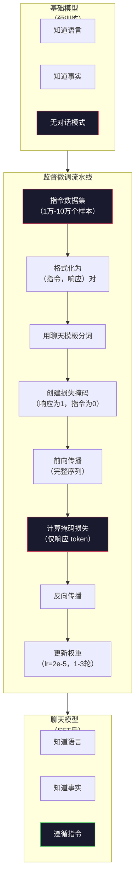

# 指令微调（SFT）

> 基础模型预测下一个 token，仅此而已。它不遵循指令、不回答问题、也不拒绝有害请求。SFT 是从 token 预测器到有用助手的桥梁。你曾经交流过的每一个模型——Claude、GPT、Llama Chat——都经历了这一步。

**类型：** 构建
**语言：** Python（使用 numpy）
**前置条件：** Phase 10 · 04（预训练迷你 GPT）
**时长：** 约 90 分钟

## 学习目标

- 实现监督微调（SFT），将基础语言模型转化为遵循指令的助手
- 使用带有系统、用户和助手角色的聊天模板格式化训练数据，并对非助手 token 掩盖损失
- 解释为什么 SFT 是必要的：基础模型续写文本而不是回答问题
- 通过比较基础模型与微调模型在保留指令集上的响应来评估 SFT 质量

## 问题背景

你在第04课中训练了一个模型，它能给定序列预测下一个 token。输入"The transformer architecture"，它可能会续写"has revolutionized natural language processing"，对于一个下一个 token 预测器来说令人印象深刻。

现在试试这个：输入"What is the capital of France?"。基础模型不会回答"Paris"，它会续写模式。它可能产生"What is the capital of Germany? What is the capital of Spain?"，因为它从包含问题列表的文档中学习过；或者产生"is a question that many people ask"，因为这是一个合理的下一个 token 续写。模型没有*回答*的概念，它只知道*续写*。

这就是 GPT-3（基础模型，2020 年 6 月发布）和 ChatGPT（指令微调，2022 年 11 月发布）之间的差距。相同的架构，相同的预训练，区别是 2 万到 10 万个精心制作的（指令，回答）对，教会了模型遵循对话模式。

Stanford Alpaca 证明了你不需要数百万个样本。2023 年 3 月，他们在 GPT-3.5 生成的仅 5.2 万个指令-响应对上微调了 Llama 7B，总成本：600 美元，结果是一个能遵循指令、回答问题、进行对话的聊天机器人。虽然不如 ChatGPT，但对于 600 美元和几小时的训练来说令人震惊地接近。

Meta 的 Llama 2 Chat 仅使用约 2.7 万个高质量样本进行初始 SFT 阶段。关键洞见：质量比数量更重要。2.7 万个由熟练标注员编写的样本胜过 100 万个从互联网抓取的嘈杂样本。

## 核心概念

### SFT 实际做了什么

监督微调（Supervised Fine-Tuning）延续了预训练中相同的训练循环——前向传播、计算损失、反向传播、更新权重——但使用了不同类型的数据。不是原始文本，而是结构化对话：

```json
{
  "system": "You are a helpful assistant.",
  "user": "What is the capital of France?",
  "assistant": "The capital of France is Paris."
}
```

模型已经知道巴黎是法国的首都，它在预训练期间从维基百科、教科书和网页中学到了这一点。SFT 不教模型新知识，而是教模型一种新的*行为*：看到问题时，产生答案；看到指令时，产生完成；看到有害请求时，产生拒绝。

这样理解：预训练给了模型知识，SFT 给了模型礼仪。

### 数据格式

行业中有三种主流格式，每种都以不同的分隔符编码相同的信息——谁说了什么。

**Alpaca 格式**（Stanford，2023 年 3 月）：

```json
{
  "instruction": "Summarize the following article in 3 sentences.",
  "input": "The European Central Bank raised interest rates...",
  "output": "The ECB increased rates by 25 basis points..."
}
```

简单且广泛使用。`input` 字段是可选的——许多指令不需要额外上下文。Stanford 以这种格式发布了 5.2 万个 GPT-3.5 生成的样本，花费 600 美元，由此开启了开源指令微调运动。

**ShareGPT 格式**（社区，2023 年）：

```json
{
  "conversations": [
    {"from": "system", "value": "You are a helpful assistant."},
    {"from": "human", "value": "What causes tides?"},
    {"from": "gpt", "value": "Tides are caused by the gravitational pull of the Moon..."},
    {"from": "human", "value": "How often do they occur?"},
    {"from": "gpt", "value": "Most coastal areas experience two high tides and two low tides per day..."}
  ]
}
```

支持多轮对话。`from` 字段按惯例使用"human"和"gpt"，无论实际使用的是哪个模型。Vicuna 在从用户分享的 ChatGPT 记录中抓取的 7 万条 ShareGPT 对话上训练。

**ChatML 格式**（OpenAI，被许多开源模型使用）：

```
<|im_start|>system
You are a helpful assistant.<|im_end|>
<|im_start|>user
What is the capital of France?<|im_end|>
<|im_start|>assistant
The capital of France is Paris.<|im_end|>
```

使用特殊 token（`<|im_start|>`、`<|im_end|>`）来界定角色，这些 token 在微调期间添加到分词器的词汇表中。Qwen、Yi 和许多其他模型使用 ChatML。

三种格式完成相同的事情：告诉模型"这是指令，这是响应，学习这种模式"。

### 为什么有效

模型在预训练中已经知道语言。它见过数十亿个问题后跟答案、指令后跟完成、人与人之间对话的样本。这些模式已经编码在权重中了。

SFT 集中了这种潜在能力。不需要模型从上下文中弄清楚是应该回答问题还是续写文档，SFT 明确地在对话模式上训练。经过几千个样本后，模型学会了：看到助手角色标记时，产生有用的响应。

这就是为什么 2.7 万个样本就足够了。你不是在教模型英语，不是在教它关于世界的事实，而是在教它一种简单的行为：响应指令。知识已经在那里了。

### 损失掩码

这是 SFT 中最重要的技术细节，大多数教程都跳过了它。

在预训练期间，你对每个 token 计算损失，模型学习预测序列中的每个下一个 token。在 SFT 期间，你只对*响应* token 计算损失。指令 token 用于上下文，但模型因"预测"它们不正确而不受惩罚。

为什么？因为你不希望模型学习*生成*指令，你希望它学习*响应*指令。如果你对指令 token 计算损失，你就在训练模型预测"What is the capital of France?"，就好像它自己在提问一样。这浪费了梯度信号，并可能混淆模型对其角色的理解。

在实践中，你创建一个损失掩码：响应 token 为 1，指令 token 为 0。在取平均值之前，将每 token 损失乘以此掩码。

```
Token：    [SYS] You are helpful [USER] What is the capital? [ASST] Paris is the capital [EOS]
损失掩码：   0    0    0     0      0     0   0  0     0       1     1    1   1     1      1
```

只有 `[ASST]` 之后的 token 对损失有贡献。模型在前向传播时看到完整对话（它需要指令来产生正确的响应），但只根据它预测响应的效果来更新权重。

### 训练超参数

SFT 使用的超参数与预训练截然不同。你不是从头训练，而是调整一个已经能工作的模型。

| 参数 | 预训练（Llama 2 7B） | SFT（Llama 2 Chat） |
|------|-------------------|-------------------|
| 学习率 | 3e-4（峰值） | 2e-5 |
| 轮数 | 1（单次遍历数据） | 2 |
| 批次大小 | 400 万 token | 64 个样本 |
| 预热步数 | 2,000 | 0-100 |
| 权重衰减 | 0.1 | 0.0-0.1 |
| 数据量 | 2 万亿 token | 2.7 万个样本 |

SFT 的学习率低 15 倍，这一点至关重要。微调期间高学习率会破坏预训练知识。模型会"忘记"它学到的东西，并在小的微调数据集上过拟合，这就是灾难性遗忘。

两个轮数意味着模型看到每个训练样本两次。在小数据集上超过 3 个轮数会导致记忆化——模型开始逐字复现训练样本而不是泛化。

### 灾难性遗忘

微调可能破坏通用能力。在指令遵循数据上训练太久，模型会失去编写代码、做数学或产生创意文本的能力。它会非常擅长训练数据的特定格式，而对其他一切都变得糟糕。

三种缓解措施：

1. **低学习率**：1e-5 到 5e-5。更小的更新意味着对预训练特征的破坏更少。

2. **短训练**：1-3 轮。在模型过拟合之前停止。

3. **混入预训练数据**：Llama 2 Chat 将小比例（2-5%）的原始预训练数据混入 SFT 数据集。这在学习新的指令遵循行为的同时"提醒"模型其通用能力。

### 真实数字

在单块 NVIDIA A100 80GB GPU 上，对 1 万个高质量指令对的 70 亿参数模型进行微调大约需要 1 小时：

- 1 万个样本 × 512 token 平均值 = 512 万 token
- 2 轮 = 1024 万 token 总计
- A100 对 70 亿模型微调的吞吐量：约 3,000 token/秒
- 1024 万 / 3,000 ≈ 3,400 秒 ≈ 57 分钟

对于我们的迷你 GPT（4 层，128 维），训练几乎是即时的。关键是理解机制，而不是规模。



## 动手构建

### 步骤一：指令数据集

创建一个合成指令数据集。在生产中，Scale AI 和 Anthropic 等公司雇用人工标注员来编写这些内容。我们以编程方式创建以演示格式。

```python
import numpy as np

INSTRUCTION_DATA = [
    {
        "instruction": "What is the capital of France?",
        "response": "The capital of France is Paris."
    },
    {
        "instruction": "Explain gravity in one sentence.",
        "response": "Gravity is the force that attracts objects with mass toward each other."
    },
    {
        "instruction": "Write a haiku about the ocean.",
        "response": "Waves crash on the shore, salt and foam beneath the sun, endless blue expanse."
    },
    {
        "instruction": "What is 15 multiplied by 7?",
        "response": "15 multiplied by 7 is 105."
    },
    {
        "instruction": "Name three programming languages.",
        "response": "Three programming languages are Python, Rust, and TypeScript."
    },
    {
        "instruction": "Summarize photosynthesis.",
        "response": "Photosynthesis converts sunlight, water, and carbon dioxide into glucose and oxygen."
    },
    {
        "instruction": "What year did World War II end?",
        "response": "World War II ended in 1945."
    },
    {
        "instruction": "Define machine learning.",
        "response": "Machine learning is a field where algorithms learn patterns from data to make predictions."
    },
]
```

8 个样本非常少。Stanford Alpaca 使用了 5.2 万个。但无论你有 8 个还是 5.2 万个，机制完全相同：分词、掩码、仅对响应计算损失。

### 步骤二：用聊天模板分词

将指令-响应对转换为带有特殊角色标记的 token 序列。标记告诉模型指令在哪里结束、响应在哪里开始。

```python
SPECIAL_TOKENS = {
    "INST_START": 253,
    "INST_END": 254,
    "RESP_START": 255,
}


def tokenize_instruction_pair(instruction, response, vocab_size=256):
    inst_tokens = list(instruction.encode("utf-8"))
    resp_tokens = list(response.encode("utf-8"))

    inst_tokens = [min(t, vocab_size - 4) for t in inst_tokens]
    resp_tokens = [min(t, vocab_size - 4) for t in resp_tokens]

    tokens = (
        [SPECIAL_TOKENS["INST_START"]]
        + inst_tokens
        + [SPECIAL_TOKENS["INST_END"]]
        + [SPECIAL_TOKENS["RESP_START"]]
        + resp_tokens
    )

    return tokens


def create_loss_mask(tokens):
    mask = np.zeros(len(tokens), dtype=np.float32)
    in_response = False

    for i, token in enumerate(tokens):
        if token == SPECIAL_TOKENS["RESP_START"]:
            in_response = True
            continue
        if in_response:
            mask[i] = 1.0

    return mask
```

损失掩码对指令 token 全为零，对响应 token 全为一。`RESP_START` token 本身掩码为 0，因为它是分隔符，不是响应内容的一部分。

### 步骤三：掩码交叉熵损失

标准交叉熵，但乘以损失掩码，只有响应 token 对梯度有贡献。

```python
def masked_cross_entropy_loss(logits, targets, loss_mask):
    batch, seq_len, vocab_size = logits.shape
    logits_flat = logits.reshape(-1, vocab_size)
    targets_flat = targets.reshape(-1)
    mask_flat = loss_mask.reshape(-1)

    max_logits = logits_flat.max(axis=-1, keepdims=True)
    log_softmax = logits_flat - max_logits - np.log(
        np.exp(logits_flat - max_logits).sum(axis=-1, keepdims=True)
    )

    per_token_loss = -log_softmax[np.arange(len(targets_flat)), targets_flat]

    masked_loss = per_token_loss * mask_flat
    num_response_tokens = mask_flat.sum()
    if num_response_tokens == 0:
        return 0.0
    loss = masked_loss.sum() / num_response_tokens

    return loss
```

分母是 `num_response_tokens`，而不是 `seq_len`。如果除以总序列长度，较长的指令会稀释梯度信号。除以响应 token 数确保无论指令长度如何，每个响应 token 的权重相等。

### 步骤四：SFT 训练循环

复用第04课的 MiniGPT。训练循环与预训练几乎相同，但有指令格式化和掩码损失。

```python
import sys
import os
sys.path.insert(0, os.path.join(os.path.dirname(__file__), "..", "..", "04-pre-training-mini-gpt", "code"))
from main import MiniGPT, LayerNorm, FeedForward, MultiHeadAttention, TransformerBlock, Embedding


def sft_train(model, dataset, num_epochs=2, lr=2e-5, seq_len=64):
    formatted_data = []
    for example in dataset:
        tokens = tokenize_instruction_pair(example["instruction"], example["response"])
        mask = create_loss_mask(tokens)
        formatted_data.append((tokens, mask))

    print(f"SFT 训练：{len(formatted_data)} 个样本，{num_epochs} 轮，lr={lr}")
    print(f"总 token 数：{sum(len(t) for t, _ in formatted_data):,}")
    print()

    losses = []

    for epoch in range(num_epochs):
        epoch_loss = 0.0
        num_batches = 0

        indices = np.random.permutation(len(formatted_data))

        for idx in indices:
            tokens, mask = formatted_data[idx]

            if len(tokens) < 3:
                continue
            if len(tokens) > seq_len:
                tokens = tokens[:seq_len]
                mask = mask[:seq_len]

            input_ids = np.array(tokens[:-1]).reshape(1, -1)
            target_ids = np.array(tokens[1:]).reshape(1, -1)
            loss_mask = np.array(mask[1:]).reshape(1, -1)

            logits = model.forward(input_ids)
            loss = masked_cross_entropy_loss(logits, target_ids, loss_mask)

            batch_size, s_len, v_size = logits.shape
            probs = np.exp(logits - logits.max(axis=-1, keepdims=True))
            probs = probs / probs.sum(axis=-1, keepdims=True)
            dlogits = probs.copy()
            dlogits[np.arange(batch_size)[:, None], np.arange(s_len), target_ids] -= 1.0

            mask_expanded = loss_mask[:, :, np.newaxis]
            num_resp = loss_mask.sum()
            if num_resp > 0:
                dlogits = dlogits * mask_expanded / num_resp

            for block in model.blocks:
                block.ffn.W1 -= lr * np.random.randn(*block.ffn.W1.shape) * 0.01
                block.ffn.W2 -= lr * np.random.randn(*block.ffn.W2.shape) * 0.01
                block.ffn.b1 -= lr * np.random.randn(*block.ffn.b1.shape) * 0.01
                block.ffn.b2 -= lr * np.random.randn(*block.ffn.b2.shape) * 0.01

            epoch_loss += loss
            num_batches += 1
            losses.append(loss)

        avg_loss = epoch_loss / max(num_batches, 1)
        print(f"第 {epoch + 1}/{num_epochs} 轮 | 平均损失：{avg_loss:.4f}")

    return model, losses
```

学习率为 2e-5，与 Llama 2 Chat 一致。与预训练使用的 3e-4 相比——小 15 倍。梯度被掩码：指令 token 产生零梯度，只有响应 token 推动权重更新。

### 步骤五：比较基础模型与 SFT 模型

SFT 的全部意义在于行为变化。通过检查模型如何响应指令格式的输入与原始文本续写来衡量这一点。

```python
def generate_response(model, prompt_tokens, max_new_tokens=50, temperature=0.8):
    tokens = list(prompt_tokens)
    seq_len = model.embedding.pos_embed.shape[0]

    for _ in range(max_new_tokens):
        context = np.array(tokens[-seq_len:]).reshape(1, -1)
        logits = model.forward(context)
        next_logits = logits[0, -1, :]

        next_logits = next_logits / max(temperature, 1e-8)
        probs = np.exp(next_logits - next_logits.max())
        probs = probs / probs.sum()
        probs = np.clip(probs, 1e-10, 1.0)
        probs = probs / probs.sum()

        next_token = np.random.choice(len(probs), p=probs)
        tokens.append(int(next_token))

    return tokens


def evaluate_instruction_following(model, instructions):
    print("评估指令遵循能力：")
    print("-" * 50)

    for instruction in instructions:
        tokens = (
            [SPECIAL_TOKENS["INST_START"]]
            + [min(t, 252) for t in list(instruction.encode("utf-8"))]
            + [SPECIAL_TOKENS["INST_END"]]
            + [SPECIAL_TOKENS["RESP_START"]]
        )

        output = generate_response(model, tokens, max_new_tokens=30, temperature=0.6)
        response_start = len(tokens)
        response_tokens = output[response_start:]
        response_bytes = bytes([t for t in response_tokens if t < 128])
        response_text = response_bytes.decode("utf-8", errors="replace")

        print(f"  问：{instruction}")
        print(f"  答：{response_text[:80]}")
        print()
```

在只有 8 个样本的小模型上，响应不会有意义，这是预期的。重要的是*结构*：模型学会在响应标记后产生输出，而不是继续生成更多指令。

### 步骤六：测量灾难性遗忘

比较 SFT 前后模型的下一个 token 预测能力。如果 SFT 损害了通用能力，原始文本上的损失会增加。

```python
def measure_forgetting(model, test_text, seq_len=64):
    tokens = np.array(list(test_text.encode("utf-8")[:512]))

    total_loss = 0.0
    num_windows = 0

    for start in range(0, len(tokens) - seq_len - 1, seq_len):
        input_ids = tokens[start:start + seq_len].reshape(1, -1)
        target_ids = tokens[start + 1:start + seq_len + 1].reshape(1, -1)

        logits = model.forward(input_ids)

        batch, s_len, vocab_size = logits.shape
        logits_flat = logits.reshape(-1, vocab_size)
        targets_flat = target_ids.reshape(-1)

        max_logits = logits_flat.max(axis=-1, keepdims=True)
        log_softmax = logits_flat - max_logits - np.log(
            np.exp(logits_flat - max_logits).sum(axis=-1, keepdims=True)
        )

        loss = -log_softmax[np.arange(len(targets_flat)), targets_flat].mean()
        total_loss += loss
        num_windows += 1

    return total_loss / max(num_windows, 1)
```

在真实微调中，你会在整个训练过程中跟踪这个指标。如果原始文本损失增加超过 10-15%，你的 SFT 过于激进了——降低学习率或减少轮数。

## 实际使用

### 完整 SFT 流水线演示

```python
if __name__ == "__main__":
    np.random.seed(42)

    test_text = """The transformer architecture processes sequences through self-attention.
Each layer applies multi-head attention followed by a feedforward network.
Residual connections and layer normalization stabilize deep networks.
The model learns to predict the next token given all previous tokens."""

    print("=" * 70)
    print("指令微调（SFT）演示")
    print("=" * 70)
    print()

    model = MiniGPT(
        vocab_size=256, embed_dim=128, num_heads=4,
        num_layers=4, max_seq_len=128, ff_dim=512
    )
    print(f"模型：{model.count_parameters():,} 个参数")
    print(f"配置：4 层，4 头，128 维（第04课的迷你 GPT）")
    print()

    print("SFT 前：测量基础模型在原始文本上的损失")
    base_loss = measure_forgetting(model, test_text)
    print(f"  基础模型损失：{base_loss:.4f}")
    print()

    print("=" * 70)
    print("SFT 训练")
    print("=" * 70)

    model, losses = sft_train(
        model, INSTRUCTION_DATA, num_epochs=3, lr=2e-5, seq_len=128
    )

    print()
    print("SFT 后：测量微调模型在原始文本上的损失")
    sft_loss = measure_forgetting(model, test_text)
    print(f"  SFT 模型损失：{sft_loss:.4f}")
    print(f"  变化：{((sft_loss - base_loss) / base_loss * 100):+.1f}%")
    if abs(sft_loss - base_loss) / base_loss < 0.15:
        print("  轻微遗忘（变化 < 15%）")
    else:
        print("  检测到显著遗忘")
    print()

    print("=" * 70)
    print("指令遵循评估")
    print("=" * 70)
    print()

    test_instructions = [
        "What is the capital of France?",
        "Name a programming language.",
        "Define gravity.",
    ]
    evaluate_instruction_following(model, test_instructions)
```

## 产出物

本课产出 `outputs/prompt-sft-data-curator.md`——一个帮助你设计和整理 SFT 指令数据集的提示词。给定目标能力（代码生成、数学、对话），它会产生一个带格式规范、质量标准和多样性要求的数据收集计划。

## 练习

1. 添加系统提示支持。修改 `tokenize_instruction_pair` 以接受系统消息，并将其添加到指令之前。创建 5 个带不同系统提示（"你是一位诗人"、"你是数学辅导老师"）的样本，验证模型在训练期间看到不同的系统提示。

2. 实现数据混合。创建一个函数，接受 SFT 数据集和原始文本语料库，产生训练批次，其中 5% 的样本是原始文本（无掩码），95% 是指令对（带掩码）。运行 3 轮并与纯 SFT 训练的遗忘指标对比。

3. 构建数据质量评分器。对每个指令-响应对，计算：(a) 响应长度（token数）；(b) 指令-响应比例；(c) 词汇多样性（唯一 token 数 / 总 token 数）。过滤掉响应长度 < 10 个 token 或多样性 < 0.3 的样本。展示过滤如何影响最终损失。

4. 实现多轮对话训练。扩展分词以处理 3 轮对话（用户-助手-用户-助手-用户-助手）。损失掩码应覆盖所有三个助手轮次。打印一个样本的 token-掩码对齐来验证掩码是否正确。

5. 比较学习率。用 lr=1e-4、lr=2e-5 和 lr=1e-6 分别训练同一模型三次。绘制损失曲线。1e-4 的运行应该显示快速初始下降但较高的最终损失（过拟合）。1e-6 的运行几乎不会有任何变化。2e-5 的运行应该是最佳点。

## 关键术语

| 术语 | 常见说法 | 实际含义 |
|------|---------|---------|
| SFT | "在对话上微调" | 监督微调：在（指令，响应）对上继续训练，只对响应 token 计算损失 |
| 指令微调（Instruction tuning） | "教模型遵循指令" | 在显式指令-响应对上训练，使基础模型学习对话模式而非新知识 |
| 损失掩码（Loss masking） | "忽略提示词" | 对指令 token 将损失设为零，使梯度只来自响应 token 的预测 |
| ChatML | "聊天标记语言" | 使用 `<|im_start|>` 和 `<|im_end|>` 分隔符标记对话数据中说话者角色的 token 格式 |
| Alpaca 格式 | "Stanford 的格式" | 带 instruction/input/output 字段的 JSON 格式，用于 5.2 万个 GPT-3.5 生成的样本，花费 600 美元 |
| 灾难性遗忘（Catastrophic forgetting） | "模型变笨了" | 微调破坏预训练能力，因为梯度更新用任务特定模式覆盖了通用知识 |
| 权重绑定（Weight tying） | "共享嵌入" | 对输入 token 嵌入和输出预测头使用同一矩阵，节省参数并提高连贯性 |
| 聊天模板（Chat template） | "如何格式化提示词" | 构建模型对话的特定 token 序列（角色标记、分隔符） |

## 延伸阅读

- [Ouyang 等，2022——"用人类反馈训练语言模型遵循指令"（InstructGPT）](https://arxiv.org/abs/2203.02155) — 在 OpenAI 引入指令微调 + RLHF 的论文
- [Taori 等，2023——"Stanford Alpaca：遵循指令的 LLaMA 模型"](https://github.com/tatsu-lab/stanford_alpaca) — 600 美元 5.2 万条指令样本，证明 SFT 在小数据集上有效
- [Touvron 等，2023——"Llama 2：开放基础和微调聊天模型"](https://arxiv.org/abs/2307.09288) — Meta 的 SFT + RLHF 流水线，带 2.7 万个高质量样本
- [Chiang 等，2023——"Vicuna：令 GPT-4 印象深刻的开源聊天机器人"](https://lmsys.org/blog/2023-03-30-vicuna/) — 在 7 万条 ShareGPT 对话上训练
- [Zhou 等，2023——"LIMA：对齐越少越好"](https://arxiv.org/abs/2305.11206) — 证明 1,000 个精心整理的样本可以媲美在大得多的数据集上的 SFT
