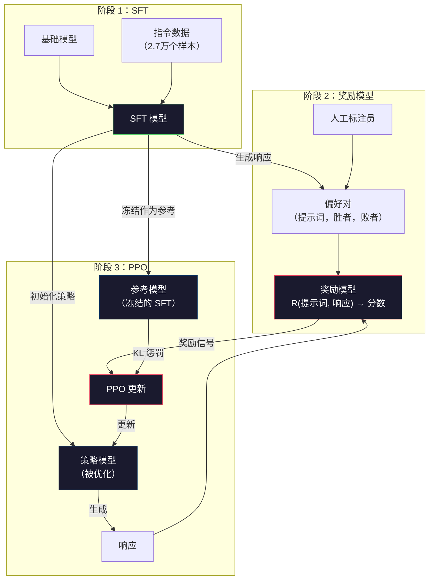
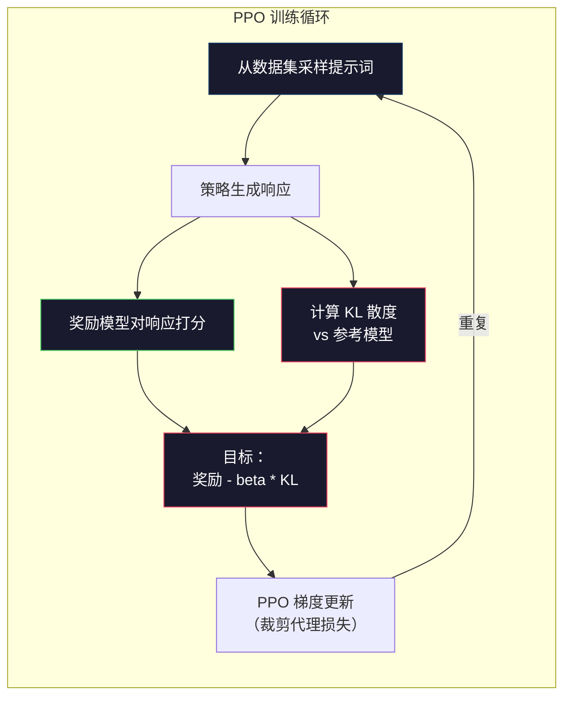

# RLHF：奖励模型 + PPO

> SFT 教会了模型遵循指令，但它不能教模型哪个响应更好。两个语法正确、事实准确的答案在有用性上可能天差地别。RLHF 是将人类判断编码进模型行为的方法，也是让 Claude 有帮助、让 GPT 有礼貌的原因。

**类型：** 构建
**语言：** Python（使用 numpy）
**前置条件：** Phase 10 · 06（指令微调/SFT）
**时长：** 约 90 分钟

## 学习目标

- 构建一个奖励模型，从人类偏好对（被选择的 vs 被拒绝的）中对响应质量打分
- 实现 PPO 训练循环，用 KL 惩罚对奖励模型优化语言模型策略
- 解释为什么 RLHF 需要三个模型（SFT、奖励、策略），以及 KL 约束如何防止奖励欺骗
- 通过比较偏好优化前后的响应质量来评估 RLHF 的效果

## 问题背景

让模型"解释量子计算"，它可能产生：

**响应 A：** "量子计算使用量子比特，它可以处于叠加态，意味着可以同时为 0 和 1。这使量子计算机在某些计算上能以指数级速度超越经典计算机。关键算法包括 Shor 算法（因式分解大数）和 Grover 算法（搜索无序数据库）。"

**响应 B：** "量子计算是一种使用量子力学现象的计算类型。它最早在 1980 年代提出。Richard Feynman 建议可以用量子计算机模拟量子系统。此后该领域显著增长。现在许多公司正在研究量子计算机。IBM、Google 等已取得进展。Google 在 2019 年声称实现了量子优越性。"

两个响应都是事实正确的，语法上都没问题，都遵循了指令。但响应 A 明显更好——更简洁、更有信息量、结构更好。人类每次都会选 A。

SFT 无法捕捉这种区别。它在"正确"响应上训练模型，但没有机制说"这个响应比那个好"，它把每个训练样本视为同等好的。如果 A 和 B 都出现在 SFT 数据集中，模型会从两者中同等学习。

RLHF 解决了这个问题。它训练一个奖励模型来预测人类会更喜欢哪个响应，然后用该奖励信号推动语言模型产生更高质量的输出。InstructGPT（ChatGPT 的前身）使用 RLHF 大幅改善了 GPT-3 的有帮助性、真实性和无害性。OpenAI 的内部评估者在 85% 的时间里更偏好 InstructGPT 的输出，尽管 InstructGPT 小了 135 倍（13 亿 vs 1750 亿参数）。

## 核心概念

### 三个阶段

RLHF 不是单次训练运行，而是三个顺序阶段的流水线，每个阶段建立在前一个之上。

**阶段 1：SFT。** 在指令-响应对上训练基础模型（第06课）。这给你一个能遵循指令但不知道哪些响应更好的模型。

**阶段 2：奖励模型。** 收集人类偏好数据：向标注员展示对同一提示词的两个响应，并问"哪个更好？"训练一个模型来预测这些偏好。奖励模型以（提示词，响应）为输入，输出一个标量分数。

**阶段 3：PPO。** 使用奖励模型为语言模型生成训练信号。语言模型生成响应，奖励模型对其打分，PPO 更新语言模型以产生更高分的响应。KL 散度惩罚防止语言模型偏离 SFT 检查点太远。



### 奖励模型

奖励模型是被重新用作打分器的语言模型。取 SFT 模型，将语言建模头（输出词汇表上的概率分布）替换为标量头（输出单个数字），架构在最终层之前完全相同。

输入：提示词与响应的拼接。输出：单个标量奖励分数。

训练数据是人类偏好对。对于每个提示词，标注员看到两个响应并选择更好的一个，创建训练三元组：（提示词，被选中的响应，被拒绝的响应）。

损失函数使用 Bradley-Terry 成对偏好模型：

```
loss = -log(sigmoid(reward(preferred) - reward(rejected)))
```

这是关键方程。`sigmoid(reward(A) - reward(B))` 给出响应 A 优于响应 B 的概率。损失推动奖励模型为被选中的响应分配更高的分数。

为什么用成对比较而不是绝对分数？因为人类在分配绝对质量分数（"这个响应是 7.3 分还是 7.5 分？"）方面很糟糕，但在相对比较（"A 还是 B 更好？"）方面非常擅长。Bradley-Terry 模型将相对比较转换为一致的绝对评分系统。

**InstructGPT 数据：** OpenAI 从 40 名承包商那里收集了 33,000 个比较对，每次比较约 5 分钟，奖励模型训练数据共计 2,750 小时的人工劳动。

### PPO：近端策略优化

PPO 是强化学习算法。在 RLHF 中，"环境"是奖励模型，"智能体"是语言模型，"动作"是生成一个 token。

优化目标：

```
maximize: E[R(prompt, response)] - beta * KL(policy || reference)
```

第一项推动模型生成高奖励响应。第二项（KL 散度惩罚）防止模型偏离 SFT 检查点太远。

为什么需要 KL 惩罚？没有它，模型会找到退化解。奖励模型在有限的人类偏好数据集上训练，有盲点。语言模型会利用这些盲点——找到在奖励模型上得分很高但实际上毫无意义的输出。典型例子：

- 重复"我非常有帮助且无害！"在有帮助性/无害性奖励模型上得分很高
- 产生冗长、听起来很正式但空洞的响应，模式匹配到"高质量"
- 利用训练数据中碰巧与高奖励相关的特定短语

KL 惩罚说：你可以改进，但不能变成完全不同的模型。保持接近 SFT 版本，它已经是合理的了。偏得太远，KL 成本就会主导奖励。

**InstructGPT 数据：** PPO 训练使用 lr=1.5e-5，KL 系数 beta=0.02，256K 个回合（提示词-响应对），每批次 4 个 PPO 轮次。整个 RLHF 流水线在 GPU 集群上花了几天时间。



### PPO 目标的详细说明

PPO 使用"裁剪代理目标"来防止过大的更新。新策略和旧策略概率之间的比率被裁剪到 [1 - epsilon, 1 + epsilon] 范围内，epsilon 通常为 0.2。

```
ratio = pi_new(action | state) / pi_old(action | state)
clipped_ratio = clip(ratio, 1 - epsilon, 1 + epsilon)
loss = -min(ratio * advantage, clipped_ratio * advantage)
```

优势函数估计当前响应相比预期质量好多少。在 RLHF 中：

```
advantage = reward(prompt, response) - baseline
```

基准线通常是最近响应的平均奖励。正优势意味着响应好于平均；负优势意味着比平均差。PPO 增加高于平均响应的概率，降低低于平均响应的概率。

裁剪防止灾难性更新。如果单个响应获得异常高的奖励，未裁剪的比率可能很大，导致模型剧烈转向该响应。裁剪限制了更新，保持训练稳定性。

### 奖励欺骗

RLHF 的阴暗面。语言模型正在优化对抗奖励模型——一个不完美的人类偏好代理。随着语言模型越来越善于最大化奖励，它开始利用奖励模型的弱点。

常见的失败模式：

| 失败 | 发生什么 | 原因 |
|------|---------|------|
| 冗长 | 模型产生越来越长的响应 | 人工标注员通常更喜欢更长、更详细的响应，因此奖励模型对长度给予更高分 |
| 谄媚 | 模型同意用户说的一切 | 标注员更喜欢同意问题前提的响应 |
| 回避 | 模型拒绝给出明确答案 | 回避性响应（"这是一个有很多观点的复杂话题..."）很少被标记为错误 |
| 格式游戏 | 模型过度使用要点和标题 | 格式化的响应在标注员看来更"精致" |

缓解策略：更强的 KL 惩罚（防止模型偏得足够远以利用弱点），在对抗性样本上训练奖励模型（修补已知的失败模式），以及使用多个不同架构的奖励模型（更难同时欺骗所有模型）。

### 真实的 RLHF 流水线

| 模型 | 比较对数 | 标注员 | RM 大小 | PPO 步骤 | KL 系数 |
|------|---------|--------|--------|---------|--------|
| InstructGPT | 33K | 40 | 60 亿 | 256K | 0.02 |
| Llama 2 Chat | 约 100 万 | 未披露 | 700 亿 | 未披露 | 0.01 |
| Claude | 未披露 | 未披露 | 未披露 | 未披露 | 未披露 |
| Anthropic RLHF 论文 | 22K | 20 | 520 亿 | 50K | 0.001 |

Anthropic 2022 年的论文在 22,000 个比较上训练了 520 亿参数的奖励模型。更大的奖励模型产生更可靠的信号，使 PPO 训练更稳定。用小奖励模型训练大语言模型有风险——奖励模型没有足够的容量来捕捉好响应与坏响应之间的细微差别。

## 动手构建

### 步骤一：合成偏好数据

在生产中，人工标注员创建偏好数据。我们将创建合成对，其中"被选中"的响应客观上更好（更简洁、更准确、更有帮助）。

```python
import numpy as np

PREFERENCE_DATA = [
    {
        "prompt": "What is the capital of France?",
        "preferred": "The capital of France is Paris.",
        "rejected": "France is a country in Europe. It has many cities. The capital is Paris. Paris is known for the Eiffel Tower.",
    },
    {
        "prompt": "Explain gravity in one sentence.",
        "preferred": "Gravity is the force that attracts objects with mass toward each other.",
        "rejected": "Gravity is something that makes things fall down when you drop them.",
    },
    {
        "prompt": "What is 15 times 7?",
        "preferred": "15 times 7 is 105.",
        "rejected": "Let me think about this. 15 times 7. Well, 10 times 7 is 70, and 5 times 7 is 35, so the answer might be around 105.",
    },
    {
        "prompt": "Name three programming languages.",
        "preferred": "Python, Rust, and TypeScript.",
        "rejected": "There are many programming languages. Some popular ones include various languages like Python and others.",
    },
    {
        "prompt": "What year did World War II end?",
        "preferred": "World War II ended in 1945.",
        "rejected": "World War II was a major global conflict. It involved many countries. The war ended in the mid-1940s, specifically in 1945.",
    },
    {
        "prompt": "Define machine learning.",
        "preferred": "Machine learning is a field where algorithms learn patterns from data to make predictions without being explicitly programmed.",
        "rejected": "Machine learning is a type of AI. AI stands for artificial intelligence. Machine learning uses data to learn.",
    },
]
```

被选中的响应简洁直接，被拒绝的响应表现出常见的失败模式：不必要的填充、回避、多余的解释和不精确。这正是 SFT 无法捕捉但 RLHF 可以捕捉的区别。

### 步骤二：奖励模型架构

奖励模型复用了迷你 GPT 的 Transformer 架构，但将词汇表大小的输出头替换为单个标量投影。

```python
import sys
import os
sys.path.insert(0, os.path.join(os.path.dirname(__file__), "..", "..", "04-pre-training-mini-gpt", "code"))
from main import MiniGPT, LayerNorm, Embedding, TransformerBlock


class RewardModel:
    def __init__(self, vocab_size=256, embed_dim=128, num_heads=4,
                 num_layers=4, max_seq_len=128, ff_dim=512):
        self.embedding = Embedding(vocab_size, embed_dim, max_seq_len)
        self.blocks = [
            TransformerBlock(embed_dim, num_heads, ff_dim)
            for _ in range(num_layers)
        ]
        self.ln_f = LayerNorm(embed_dim)
        self.reward_head = np.random.randn(embed_dim) * 0.02

    def forward(self, token_ids):
        seq_len = token_ids.shape[-1]
        mask = np.triu(np.full((seq_len, seq_len), -1e9), k=1)

        x = self.embedding.forward(token_ids)
        for block in self.blocks:
            x = block.forward(x, mask)
        x = self.ln_f.forward(x)

        last_hidden = x[:, -1, :]
        reward = last_hidden @ self.reward_head

        return reward
```

奖励模型取*最后*一个 token 位置的隐藏状态并投影为标量。为什么是最后一个 token？因为因果注意力掩码意味着最后一个位置已经关注了每一个之前的 token，它对整个（提示词，响应）序列有最完整的表示。

### 步骤三：Bradley-Terry 损失

使用 Bradley-Terry 成对损失在偏好对上训练奖励模型。

```python
def tokenize_for_reward(prompt, response, vocab_size=256):
    prompt_tokens = [min(t, vocab_size - 1) for t in list(prompt.encode("utf-8"))]
    response_tokens = [min(t, vocab_size - 1) for t in list(response.encode("utf-8"))]
    return prompt_tokens + [0] + response_tokens


def sigmoid(x):
    return np.where(
        x >= 0,
        1.0 / (1.0 + np.exp(-x)),
        np.exp(x) / (1.0 + np.exp(x))
    )


def bradley_terry_loss(reward_preferred, reward_rejected):
    diff = reward_preferred - reward_rejected
    loss = -np.log(sigmoid(diff) + 1e-8)
    return loss


def train_reward_model(rm, preference_data, num_epochs=10, lr=1e-4, max_seq_len=128):
    print(f"训练奖励模型：{len(preference_data)} 个偏好对，{num_epochs} 轮")
    print()

    losses = []
    accuracies = []

    for epoch in range(num_epochs):
        epoch_loss = 0.0
        epoch_correct = 0
        num_pairs = 0

        indices = np.random.permutation(len(preference_data))

        for idx in indices:
            pair = preference_data[idx]

            preferred_tokens = tokenize_for_reward(pair["prompt"], pair["preferred"])
            rejected_tokens = tokenize_for_reward(pair["prompt"], pair["rejected"])

            preferred_tokens = preferred_tokens[:max_seq_len]
            rejected_tokens = rejected_tokens[:max_seq_len]

            preferred_ids = np.array(preferred_tokens).reshape(1, -1)
            rejected_ids = np.array(rejected_tokens).reshape(1, -1)

            r_preferred = rm.forward(preferred_ids)[0]
            r_rejected = rm.forward(rejected_ids)[0]

            loss = bradley_terry_loss(r_preferred, r_rejected)

            if r_preferred > r_rejected:
                epoch_correct += 1

            diff = r_preferred - r_rejected
            grad = sigmoid(diff) - 1.0

            rm.reward_head -= lr * grad * rm.ln_f.forward(
                rm.embedding.forward(preferred_ids)
            )[:, -1, :].flatten()

            epoch_loss += loss
            num_pairs += 1

        avg_loss = epoch_loss / max(num_pairs, 1)
        accuracy = epoch_correct / max(num_pairs, 1)
        losses.append(avg_loss)
        accuracies.append(accuracy)

        if epoch % 2 == 0:
            print(f"  第 {epoch + 1:3d} 轮 | 损失：{avg_loss:.4f} | 准确率：{accuracy:.1%}")

    return rm, losses, accuracies
```

准确率指标很直接：奖励模型能正确排列多少比例的偏好对？随机模型得 50%。在干净数据上训练良好的奖励模型应该超过 70%。InstructGPT 的奖励模型在保留比较上实现了约 72% 的准确率，这听起来很低，但实际上很好——即使对人类来说，许多偏好对也是模糊的（标注员间一致性约为 73%）。

### 步骤四：简化的 PPO 循环

完整的 PPO 很复杂。这个实现捕捉了核心机制：生成响应、打分、计算优势，以及用 KL 惩罚更新策略。

```python
def compute_kl_divergence(policy_logits, reference_logits):
    policy_probs = np.exp(policy_logits - policy_logits.max(axis=-1, keepdims=True))
    policy_probs = policy_probs / policy_probs.sum(axis=-1, keepdims=True)
    policy_probs = np.clip(policy_probs, 1e-10, 1.0)

    ref_probs = np.exp(reference_logits - reference_logits.max(axis=-1, keepdims=True))
    ref_probs = ref_probs / ref_probs.sum(axis=-1, keepdims=True)
    ref_probs = np.clip(ref_probs, 1e-10, 1.0)

    kl = np.sum(policy_probs * np.log(policy_probs / ref_probs), axis=-1)
    return kl.mean()


def ppo_training(policy_model, reference_model, reward_model, prompts,
                 num_episodes=20, lr=1.5e-5, kl_coeff=0.02, max_seq_len=128):
    print(f"PPO 训练：{num_episodes} 个回合，lr={lr}，KL 系数={kl_coeff}")
    print()

    rewards_history = []
    kl_history = []

    for episode in range(num_episodes):
        prompt_text = prompts[episode % len(prompts)]
        prompt_tokens = [min(t, 252) for t in list(prompt_text.encode("utf-8"))]

        response_tokens = generate_response(
            policy_model, prompt_tokens,
            max_new_tokens=20, temperature=0.8, max_seq_len=max_seq_len
        )

        response_ids = np.array(response_tokens[:max_seq_len]).reshape(1, -1)
        reward = reward_model.forward(response_ids)[0]

        policy_logits = policy_model.forward(response_ids)
        ref_logits = reference_model.forward(response_ids)
        kl = compute_kl_divergence(policy_logits, ref_logits)

        total_reward = reward - kl_coeff * kl

        rewards_history.append(float(reward))
        kl_history.append(float(kl))

        for block in policy_model.blocks:
            update_scale = lr * total_reward
            block.ffn.W1 += update_scale * np.random.randn(*block.ffn.W1.shape) * 0.01
            block.ffn.W2 += update_scale * np.random.randn(*block.ffn.W2.shape) * 0.01

        if episode % 5 == 0:
            avg_reward = np.mean(rewards_history[-5:]) if rewards_history else 0
            avg_kl = np.mean(kl_history[-5:]) if kl_history else 0
            print(f"  第 {episode:3d} 回合 | 奖励：{reward:.4f} | KL：{kl:.4f} | "
                  f"平均奖励：{avg_reward:.4f}")

    return policy_model, rewards_history, kl_history
```

核心循环：(1) 采样提示词，(2) 生成响应，(3) 用奖励模型打分，(4) 计算相对冻结参考的 KL 散度，(5) 计算调整后的奖励（奖励减去 KL 惩罚），(6) 更新策略。KL 惩罚随着策略偏离参考而增长，自动防止奖励欺骗。

### 步骤五：奖励分数比较

RLHF 后，策略模型的响应应该在奖励模型上比原始 SFT 模型的响应得分更高。

```python
def compare_models(sft_model, rlhf_model, reward_model, prompts, max_seq_len=128):
    print("模型比较（奖励分数）")
    print("-" * 60)
    print(f"  {'提示词':<35} {'SFT':>10} {'RLHF':>10}")
    print("  " + "-" * 55)

    sft_total = 0.0
    rlhf_total = 0.0

    for prompt in prompts:
        prompt_tokens = [min(t, 252) for t in list(prompt.encode("utf-8"))]

        sft_response = generate_response(
            sft_model, prompt_tokens,
            max_new_tokens=20, temperature=0.6, max_seq_len=max_seq_len
        )
        rlhf_response = generate_response(
            rlhf_model, prompt_tokens,
            max_new_tokens=20, temperature=0.6, max_seq_len=max_seq_len
        )

        sft_ids = np.array(sft_response[:max_seq_len]).reshape(1, -1)
        rlhf_ids = np.array(rlhf_response[:max_seq_len]).reshape(1, -1)

        sft_reward = reward_model.forward(sft_ids)[0]
        rlhf_reward = reward_model.forward(rlhf_ids)[0]

        sft_total += sft_reward
        rlhf_total += rlhf_reward

        truncated_prompt = prompt[:33] + ".." if len(prompt) > 35 else prompt
        print(f"  {truncated_prompt:<35} {sft_reward:>10.4f} {rlhf_reward:>10.4f}")

    n = len(prompts)
    print("  " + "-" * 55)
    print(f"  {'平均':<35} {sft_total/n:>10.4f} {rlhf_total/n:>10.4f}")

    return sft_total / n, rlhf_total / n
```

## 产出物

本课产出 `outputs/prompt-reward-model-designer.md`——一个设计奖励模型训练流水线的提示词。给定目标行为（有帮助性、编码能力、安全性），它会产生数据收集协议、标注员指南和奖励模型评估标准。

## 练习

1. 修改奖励模型，使用所有隐藏状态的均值而不仅仅是最后一个位置。比较准确率。均值池化方法给每个 token 相等的权重，而最后位置方法依赖因果注意力来聚合信息。在 6 个偏好对上测试，报告哪种方法的准确率更高。

2. 实现奖励模型校准。训练后，将所有偏好对通过奖励模型，计算：(a) 被选中响应的平均奖励，(b) 被拒绝响应的平均奖励，(c) 差距（被选中减被拒绝）。校准良好的模型应该有清晰的差距。然后添加 4 个新的偏好对，检查差距是否在未见数据上保持。

3. 模拟奖励欺骗。创建一个对长响应给予高分的奖励模型（reward = len(response) / 100）。用这个有缺陷的奖励模型运行 PPO，观察策略模型生成越来越长、重复的输出。然后添加 0.1 的 KL 惩罚，展示它可以防止这种退化行为。

4. 实现多目标奖励。训练两个奖励模型——一个用于有帮助性，一个用于简洁性。将它们组合为 R = 0.7 × R_helpful + 0.3 × R_concise。展示组合目标产生既有帮助又简洁的响应，避免单一有帮助性奖励的冗长陷阱。

5. 比较不同的 KL 系数。用 beta=0.001（太低，奖励欺骗）、beta=0.02（标准）和 beta=0.5（太高，无法学习）运行 PPO。绘制每个的奖励曲线和 KL 曲线。beta=0.02 的运行应该显示稳定的奖励改善，KL 有界。

## 关键术语

| 术语 | 常见说法 | 实际含义 |
|------|---------|---------|
| RLHF | "用人类反馈训练" | 来自人类反馈的强化学习：一个三阶段流水线（SFT、奖励模型、PPO），使用人类偏好信号优化语言模型输出 |
| 奖励模型（Reward model） | "对响应打分的模型" | 带标量输出头的 Transformer，使用 Bradley-Terry 损失在成对人类偏好上训练 |
| Bradley-Terry | "比较模型" | 一个概率模型，其中 P(A > B) = sigmoid(score(A) - score(B))，将成对偏好转换为一致的评分函数 |
| PPO | "强化学习算法" | 近端策略优化：更新策略以最大化奖励，同时裁剪更新幅度以防止不稳定 |
| KL 散度（KL divergence） | "两个分布有多不同" | 衡量策略模型 token 分布与参考模型之间差异的指标——用作惩罚以防止奖励欺骗 |
| KL 惩罚（KL penalty） | "对模型的约束" | Beta × KL(policy \|\| reference) 从奖励信号中减去——防止策略偏离 SFT 检查点太远 |
| 奖励欺骗（Reward hacking） | "玩弄奖励" | 策略通过利用奖励模型的弱点找到退化的高奖励输出，而不是真正改进 |
| 偏好对（Preference pair） | "A 还是 B 更好？" | 由（提示词，被选中的响应，被拒绝的响应）组成的训练样本——RLHF 训练数据的基本单位 |
| 参考模型（Reference model） | "冻结的 SFT 检查点" | SFT 模型的副本，其权重永不改变——用作 KL 散度计算的锚点 |

## 延伸阅读

- [Ouyang 等，2022——"用人类反馈训练语言模型遵循指令"（InstructGPT）](https://arxiv.org/abs/2203.02155) — 使 RLHF 对大语言模型实用的论文
- [Schulman 等，2017——"近端策略优化算法"](https://arxiv.org/abs/1707.06347) — OpenAI 的原始 PPO 论文
- [Bai 等，2022——"用来自人类反馈的强化学习训练有帮助且无害的助手"](https://arxiv.org/abs/2204.05862) — Anthropic 的 RLHF 论文，包含对奖励欺骗和 KL 惩罚的详细分析
- [Stiennon 等，2020——"用人类反馈学习摘要"](https://arxiv.org/abs/2009.01325) — 应用于摘要的 RLHF，展示奖励模型可以捕捉细致的质量判断
- [Christiano 等，2017——"从人类偏好进行深度强化学习"](https://arxiv.org/abs/1706.03741) — 从人类比较中学习奖励函数的基础工作
