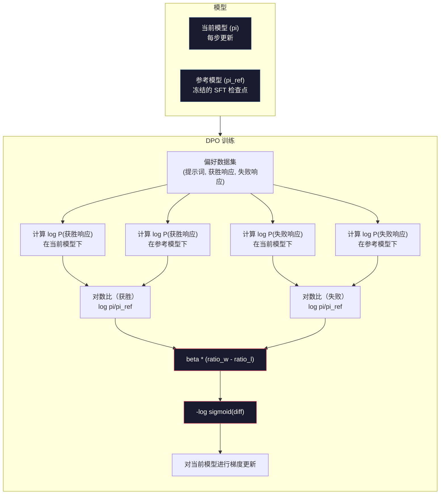

# DPO：直接偏好优化

> RLHF 有效，但它需要训练三个模型（SFT、奖励模型、策略），管理 PPO 的不稳定性，以及调整 KL 惩罚。DPO 提出了一个问题：如果可以跳过这一切呢？DPO 直接在偏好对上优化语言模型，无需奖励模型，无需 PPO，只需一个训练循环，结果相同。

**类型：** 构建
**语言：** Python（使用 numpy）
**前置条件：** 第10阶段，第07课（RLHF）
**时间：** 约90分钟

## 学习目标

- 实现 DPO 训练，直接在偏好对上优化语言模型，无需单独的奖励模型
- 推导 DPO 损失函数，解释它如何通过策略的对数概率隐式表示奖励模型
- 从训练稳定性、计算成本和所需模型数量等方面比较 DPO 与 RLHF
- 调整 beta 参数，控制训练后的策略与参考模型的偏差程度

## 问题背景

在第07课中你构建了 RLHF 流水线：三个阶段、三个模型——用 PPO 优化的 SFT 模型、奖励模型和策略模型。仅奖励模型就需要数千个人类偏好对和单独的训练循环。PPO 需要仔细调整 KL 系数、学习率、裁剪比率和训练轮数。

实践中，PPO 训练出了名地不稳定。超参数的微小变化会导致训练发散。奖励模型是人类偏好的不完美代理，策略会找到利用其弱点的方式。KL 惩罚有帮助，但需要自己的调整——太低会导致奖励欺骗，太高则模型几乎学不到东西。

这种复杂性正是为什么在 InstructGPT 发布后的多年里，大多数开源模型都在与 RLHF 作斗争。三阶段流水线很脆弱，每个阶段都有自己的失败模式，错误会叠加。

2023年5月，斯坦福的 Rafael Rafailov、Archit Sharma 及同事发表了《Direct Preference Optimization: Your Language Model is Secretly a Reward Model》。核心洞见：你不需要单独的奖励模型。最优奖励函数在数学上由语言模型自身的 token 概率决定。你可以完全跳过奖励模型，直接在偏好对上优化语言模型。

DPO 将 RLHF 简化为单个监督学习步骤：一个模型、一个损失函数、一个训练循环，不需要强化学习。Zephyr-7B 是首批大规模使用 DPO 的模型之一，在多个基准测试上匹配或超越了使用完整 RLHF 训练的模型。Meta 将 DPO 作为 Llama 3 对齐流水线的一部分。Anthropic 在其对齐研究中引用了 DPO 风格的方法。

## 核心概念

### 关键洞见

RLHF 优化以下目标：

```
maximize: E[R(x, y)] - beta * KL(pi || pi_ref)
```

其中 R 是奖励模型，pi 是策略，pi_ref 是参考模型，beta 是 KL 系数。

DPO 论文表明，该目标存在闭式最优解。对于任意奖励函数 R，最优策略为：

```
pi*(y | x) = pi_ref(y | x) * exp(R(x, y) / beta) / Z(x)
```

其中 Z(x) 是归一化常数。重新整理：

```
R(x, y) = beta * log(pi*(y | x) / pi_ref(y | x)) + beta * log Z(x)
```

这就是突破口。奖励完全用策略模型的概率和参考模型的概率来表达。你不需要训练单独的奖励模型——奖励*隐含*在概率比中。

将其代入 Bradley-Terry 偏好模型：

```
P(y_w > y_l | x) = sigmoid(R(x, y_w) - R(x, y_l))
                  = sigmoid(beta * (log pi(y_w|x)/pi_ref(y_w|x) - log pi(y_l|x)/pi_ref(y_l|x)))
```

Z(x) 项因两个响应都以同一提示词 x 为条件而相互抵消。剩下的只是策略模型和参考模型在偏好响应与拒绝响应上的对数概率的函数。

### DPO 损失函数

```
L_DPO = -log(sigmoid(beta * (log pi(y_w|x)/pi_ref(y_w|x) - log pi(y_l|x)/pi_ref(y_l|x))))
```

逐项解析：

- **y_w**：偏好（获胜）响应
- **y_l**：拒绝（落败）响应
- **x**：提示词
- **pi**：当前模型（正在训练）
- **pi_ref**：参考模型（冻结的 SFT 检查点）
- **beta**：控制与参考偏差程度的温度参数（通常为 0.1 到 0.5）

比值 `log pi(y|x) / pi_ref(y|x)` 是对数概率比（log-probability ratio）。当该比值为正时，当前模型对响应 y 的概率分配高于参考模型；为负时则低于参考模型。

DPO 损失推动模型提高偏好响应的对数概率比，降低拒绝响应的对数概率比。beta 参数控制模型偏离参考模型的激进程度——beta 小意味着允许大偏差，beta 大则使模型保持接近参考。



### 为什么 DPO 更简单

| 方面 | RLHF（PPO）| DPO |
|------|-----------|-----|
| 需要训练的模型数 | 3个（SFT + 奖励模型 + 策略） | 1个（仅策略）|
| 训练循环数 | 3个（SFT、RM训练、PPO）| 2个（SFT、DPO）|
| 超参数 | lr、KL系数、裁剪比率、RM lr、每阶段轮数 | lr、beta、轮数 |
| 奖励模型 | 必须（单独训练）| 隐含在模型概率中 |
| RL 算法 | PPO（复杂、不稳定）| 监督学习（稳定）|
| GPU 显存 | PPO 时需 3-4 个模型在内存中 | 2个模型（当前 + 参考）|
| 训练稳定性 | 对超参数敏感 | 鲁棒，类似 SFT |

DPO 训练时内存中需要两个模型——当前模型和冻结的参考模型。RLHF 需要三到四个：策略、参考、奖励模型，以及可选的值函数基准。对于 70B 模型，FP16 下每份副本占用 140GB 显存。消除奖励模型带来的显存节省相当可观。

### DPO 优于 RLHF 的场景

**小数据集。** 有 5,000-20,000 个偏好对时，DPO 通常匹配或超越 RLHF。RLHF 中的奖励模型需要足够的数据来泛化——数据有限时，它会过拟合并产生不可靠的奖励信号。DPO 完全不需要奖励模型，从而绕开了这个问题。

**计算资源有限。** DPO 所需计算量约为完整 RLHF 的三分之一（一个训练循环而非三个）。对于没有大型 GPU 集群的团队，这是实际可行的选择。

**快速迭代。** 想尝试 10 个不同的偏好数据集来找出最佳模型？DPO 让你在数小时内完成每个实验。RLHF 每个数据集都需要重新训练奖励模型。

### RLHF 优于 DPO 的场景

**大规模训练。** 在 GPT-4 或 Claude 的规模下，RLHF 的独立奖励模型可以捕获更细微的偏好信号。奖励模型充当适应复杂质量标准的学习损失函数。

**复杂奖励信号。** 当"更好"涉及多个维度（有帮助性、无害性、诚实性）时，奖励模型可以学习这种多目标权衡。DPO 将每个偏好对视为二元信号——一个更好，一个更差——而不对原因建模。

**迭代对齐。** RLHF 流水线可以用当前策略生成新响应，让人类评分，然后在在线循环中重新训练奖励模型。DPO 在固定的偏好对数据集上工作。Anthropic 的宪法 AI 方法广泛利用了 RLHF 的这一迭代特性。

### DPO 之后：KTO、ORPO、SimPO

DPO 启发了一系列简化对齐方法。

**KTO（Kahneman-Tversky Optimization，2024）：** 甚至不需要偏好对。KTO 使用未配对的反馈——只需将每个响应标记为"好"或"坏"，而不需要与替代方案比较。这大大简化了数据收集：不再需要向标注者展示两个响应并询问"哪个更好"，只需展示一个响应并询问"这个好吗"。损失函数应用了前景理论的损失厌恶：坏响应受到的惩罚比好响应获得的奖励更大。

**ORPO（Odds Ratio Preference Optimization，2024）：** 在单个训练步骤中结合 SFT 和对齐。不再先做 SFT 再做 DPO，ORPO 修改 SFT 损失以包含偏好信号。损失有两项：偏好响应上的标准下一个 token 预测损失，加上提高偏好和拒绝响应概率差距的几率比项。一个训练循环取代两个。

**SimPO（Simple Preference Optimization，2024）：** 完全消除参考模型。SimPO 使用响应的平均对数概率（按长度归一化）作为隐式奖励，而非相对于冻结参考计算对数概率比。这节省了显存（不需要参考模型），简化了训练。长度归一化防止模型偏向较短的响应。

| 方法 | 年份 | 内存中的模型数 | 需要偏好对？ | 需要参考模型？ | 训练循环数 |
|------|------|--------------|------------|--------------|----------|
| RLHF | 2022 | 3-4 | 是（RM需要）| 是 | 3 |
| DPO | 2023 | 2 | 是 | 是 | 2 |
| KTO | 2024 | 2 | 否（未配对）| 是 | 2 |
| ORPO | 2024 | 1 | 是 | 否 | 1 |
| SimPO | 2024 | 1 | 是 | 否 | 1 |

趋势显而易见：每种方法都消除了一个复杂性。RLHF 需要奖励模型和 PPO。DPO 消除了两者。KTO 消除了配对数据。ORPO 消除了独立的 SFT 阶段。SimPO 消除了参考模型。**对齐税**（从基础模型到对齐模型的计算和复杂性成本）持续下降。

### 真实 DPO 部署案例

**Zephyr-7B（HuggingFace，2023年10月）：** Mistral 7B 基础模型，在 UltraChat（20万样本）上做 SFT，然后在 UltraFeedback（6万偏好对）上做 DPO。MT-Bench 得分 6.47——当时最高的 7B 模型。相比之下，Llama 2 Chat 70B 得分 6.86，意味着 Zephyr 仅通过 DPO 对齐，在一个大10倍的模型 6% 范围内。

**Llama 3（Meta，2024年4月）：** 在初始 RLHF 阶段后使用了 DPO。这种组合表明 DPO 和 RLHF 可以互补——RLHF 用于广泛对齐，DPO 用于针对性精调。

**Neural Magic / nm-chat（2024）：** 对多个开源模型应用 DPO，相比仅 SFT 基准，在对齐基准上一致显示出 5-15% 的改进。

## 动手实现

### 第一步：偏好数据集

格式与 RLHF 相同——(提示词, 偏好响应, 拒绝响应) 三元组。DPO 直接消费这些数据，无需中间奖励模型。

```python
import numpy as np
import sys
import os
sys.path.insert(0, os.path.join(os.path.dirname(__file__), "..", "..", "04-pre-training-mini-gpt", "code"))
from main import MiniGPT, LayerNorm, Embedding, TransformerBlock

PREFERENCE_DATA = [
    {
        "prompt": "What is the capital of France?",
        "preferred": "The capital of France is Paris.",
        "rejected": "France is a country in Europe. It has many cities. The capital is Paris. Paris is known for the Eiffel Tower.",
    },
    {
        "prompt": "Explain gravity in one sentence.",
        "preferred": "Gravity is the force that attracts objects with mass toward each other.",
        "rejected": "Gravity is something that makes things fall down when you drop them.",
    },
    {
        "prompt": "What is 15 times 7?",
        "preferred": "15 times 7 is 105.",
        "rejected": "Let me think about this. 15 times 7. Well, 10 times 7 is 70, and 5 times 7 is 35, so the answer might be around 105.",
    },
    {
        "prompt": "Name three programming languages.",
        "preferred": "Python, Rust, and TypeScript.",
        "rejected": "There are many programming languages. Some popular ones include various languages like Python and others.",
    },
    {
        "prompt": "What year did World War II end?",
        "preferred": "World War II ended in 1945.",
        "rejected": "World War II was a major global conflict. It involved many countries. The war ended in the mid-1940s, specifically in 1945.",
    },
    {
        "prompt": "Define machine learning.",
        "preferred": "Machine learning is a field where algorithms learn patterns from data to make predictions without being explicitly programmed.",
        "rejected": "Machine learning is a type of AI. AI stands for artificial intelligence. Machine learning uses data to learn.",
    },
]
```

### 第二步：序列对数概率

DPO 损失需要计算给定提示词时响应的总对数概率。这意味着在完整的（提示词 + 响应）序列上运行模型，并对每个响应 token 的对数概率求和。

```python
def tokenize_sequence(text, vocab_size=256):
    return [min(t, vocab_size - 1) for t in list(text.encode("utf-8"))]


def compute_sequence_log_prob(model, prompt_tokens, response_tokens, max_seq_len=128):
    full_sequence = prompt_tokens + response_tokens
    if len(full_sequence) > max_seq_len:
        full_sequence = full_sequence[:max_seq_len]

    if len(full_sequence) < 2:
        return 0.0

    input_ids = np.array(full_sequence[:-1]).reshape(1, -1)
    target_ids = np.array(full_sequence[1:])

    logits = model.forward(input_ids)
    logits = logits[0]

    max_logits = logits.max(axis=-1, keepdims=True)
    log_probs = logits - max_logits - np.log(
        np.exp(logits - max_logits).sum(axis=-1, keepdims=True)
    )

    prompt_len = len(prompt_tokens)
    response_start = max(0, prompt_len - 1)
    response_end = len(target_ids)

    if response_start >= response_end:
        return 0.0

    response_log_probs = log_probs[response_start:response_end, :]
    response_targets = target_ids[response_start:response_end]

    total_log_prob = 0.0
    for i, target in enumerate(response_targets):
        total_log_prob += response_log_probs[i, target]

    return total_log_prob
```

这个函数是 DPO 的核心。对每个偏好对，它运行四次：当前模型在偏好响应上、当前模型在拒绝响应上、参考模型在偏好响应上、参考模型在拒绝响应上。这是每个训练样本4次前向传播，对比 RLHF 的生成 + 奖励评分 + 价值估计 + PPO 更新，更简单、更快速、更稳定。

### 第三步：DPO 损失函数

论文的核心用代码表达。一个函数，一个损失，没有奖励模型。

```python
def sigmoid(x):
    return np.where(
        x >= 0,
        1.0 / (1.0 + np.exp(-x)),
        np.exp(x) / (1.0 + np.exp(x))
    )


def dpo_loss(policy_logprob_preferred, policy_logprob_rejected,
             ref_logprob_preferred, ref_logprob_rejected, beta=0.1):
    preferred_ratio = policy_logprob_preferred - ref_logprob_preferred
    rejected_ratio = policy_logprob_rejected - ref_logprob_rejected

    logit = beta * (preferred_ratio - rejected_ratio)

    loss = -np.log(sigmoid(logit) + 1e-8)

    preferred_reward = beta * preferred_ratio
    rejected_reward = beta * rejected_ratio

    return loss, {
        "preferred_ratio": float(preferred_ratio),
        "rejected_ratio": float(rejected_ratio),
        "logit": float(logit),
        "implicit_preferred_reward": float(preferred_reward),
        "implicit_rejected_reward": float(rejected_reward),
        "reward_margin": float(preferred_reward - rejected_reward),
    }
```

`preferred_ratio` 和 `rejected_ratio` 是 DPO 推导中的对数概率比。当当前模型对偏好响应分配的概率高于参考模型（相对比较），且对拒绝响应分配的概率低于参考模型时，logit 为正，损失较低。训练信号正是推动模型朝这个方向改变。

`implicit_preferred_reward` 和 `implicit_rejected_reward` 是 DPO 损失隐式分配的奖励。你可以提取它们来验证训练是否有效——偏好奖励和拒绝奖励之间的差距应该随训练增大。

### 第四步：DPO 训练循环

标准的监督训练循环，没有 PPO，没有奖励模型，只有前向传播和梯度更新。

```python
def copy_model_weights(source, target):
    target.embedding.token_embed = source.embedding.token_embed.copy()
    target.embedding.pos_embed = source.embedding.pos_embed.copy()
    target.ln_f.gamma = source.ln_f.gamma.copy()
    target.ln_f.beta = source.ln_f.beta.copy()
    for s_block, t_block in zip(source.blocks, target.blocks):
        t_block.attn.W_q = s_block.attn.W_q.copy()
        t_block.attn.W_k = s_block.attn.W_k.copy()
        t_block.attn.W_v = s_block.attn.W_v.copy()
        t_block.attn.W_out = s_block.attn.W_out.copy()
        t_block.ffn.W1 = s_block.ffn.W1.copy()
        t_block.ffn.W2 = s_block.ffn.W2.copy()
        t_block.ffn.b1 = s_block.ffn.b1.copy()
        t_block.ffn.b2 = s_block.ffn.b2.copy()
        t_block.ln1.gamma = s_block.ln1.gamma.copy()
        t_block.ln1.beta = s_block.ln1.beta.copy()
        t_block.ln2.gamma = s_block.ln2.gamma.copy()
        t_block.ln2.beta = s_block.ln2.beta.copy()


def dpo_train(policy_model, reference_model, preference_data,
              num_epochs=5, lr=5e-6, beta=0.1, max_seq_len=128):
    print(f"DPO 训练：{len(preference_data)} 对，{num_epochs} 轮，"
          f"lr={lr}，beta={beta}")
    print()

    losses = []
    margins = []

    for epoch in range(num_epochs):
        epoch_loss = 0.0
        epoch_margin = 0.0
        num_examples = 0

        indices = np.random.permutation(len(preference_data))

        for idx in indices:
            pair = preference_data[idx]

            prompt_tokens = tokenize_sequence(pair["prompt"])
            preferred_tokens = tokenize_sequence(pair["preferred"])
            rejected_tokens = tokenize_sequence(pair["rejected"])

            pi_logprob_w = compute_sequence_log_prob(
                policy_model, prompt_tokens, preferred_tokens, max_seq_len
            )
            pi_logprob_l = compute_sequence_log_prob(
                policy_model, prompt_tokens, rejected_tokens, max_seq_len
            )
            ref_logprob_w = compute_sequence_log_prob(
                reference_model, prompt_tokens, preferred_tokens, max_seq_len
            )
            ref_logprob_l = compute_sequence_log_prob(
                reference_model, prompt_tokens, rejected_tokens, max_seq_len
            )

            loss, metrics = dpo_loss(
                pi_logprob_w, pi_logprob_l,
                ref_logprob_w, ref_logprob_l, beta
            )

            update_direction = 1.0 if metrics["logit"] < 0 else -0.1
            for block in policy_model.blocks:
                block.ffn.W1 += lr * update_direction * np.random.randn(*block.ffn.W1.shape) * 0.01
                block.ffn.W2 += lr * update_direction * np.random.randn(*block.ffn.W2.shape) * 0.01

            epoch_loss += loss
            epoch_margin += metrics["reward_margin"]
            num_examples += 1
            losses.append(float(loss))
            margins.append(metrics["reward_margin"])

        avg_loss = epoch_loss / max(num_examples, 1)
        avg_margin = epoch_margin / max(num_examples, 1)

        print(f"  第 {epoch + 1}/{num_epochs} 轮 | 损失：{avg_loss:.4f} | "
              f"平均差距：{avg_margin:.4f}")

    return policy_model, losses, margins
```

与 RLHF 相比，训练循环令人耳目一新地简洁。对每个偏好对：计算四个对数概率（两个模型，两个响应），代入 DPO 损失，计算梯度，更新策略。没有生成步骤，没有奖励模型推理，没有优势估计，没有裁剪。

### 第五步：对比 DPO 与 RLHF

通过衡量隐式奖励差距和对数概率变化，将 DPO 与第07课中的 RLHF 模型进行对比。

```python
def evaluate_preference_accuracy(model, reference_model, preference_data, beta=0.1, max_seq_len=128):
    correct = 0
    total = 0

    for pair in preference_data:
        prompt_tokens = tokenize_sequence(pair["prompt"])
        preferred_tokens = tokenize_sequence(pair["preferred"])
        rejected_tokens = tokenize_sequence(pair["rejected"])

        pi_w = compute_sequence_log_prob(model, prompt_tokens, preferred_tokens, max_seq_len)
        pi_l = compute_sequence_log_prob(model, prompt_tokens, rejected_tokens, max_seq_len)
        ref_w = compute_sequence_log_prob(reference_model, prompt_tokens, preferred_tokens, max_seq_len)
        ref_l = compute_sequence_log_prob(reference_model, prompt_tokens, rejected_tokens, max_seq_len)

        preferred_reward = beta * (pi_w - ref_w)
        rejected_reward = beta * (pi_l - ref_l)

        if preferred_reward > rejected_reward:
            correct += 1
        total += 1

    return correct / max(total, 1)


def analyze_implicit_rewards(model, reference_model, preference_data, beta=0.1, max_seq_len=128):
    print("隐式奖励分析：")
    print("-" * 65)
    print(f"  {'提示词':<30} {'偏好奖励':>12} {'拒绝奖励':>12} {'差距':>10}")
    print("  " + "-" * 60)

    for pair in preference_data:
        prompt_tokens = tokenize_sequence(pair["prompt"])
        preferred_tokens = tokenize_sequence(pair["preferred"])
        rejected_tokens = tokenize_sequence(pair["rejected"])

        pi_w = compute_sequence_log_prob(model, prompt_tokens, preferred_tokens, max_seq_len)
        pi_l = compute_sequence_log_prob(model, prompt_tokens, rejected_tokens, max_seq_len)
        ref_w = compute_sequence_log_prob(reference_model, prompt_tokens, preferred_tokens, max_seq_len)
        ref_l = compute_sequence_log_prob(reference_model, prompt_tokens, rejected_tokens, max_seq_len)

        pref_reward = beta * (pi_w - ref_w)
        rej_reward = beta * (pi_l - ref_l)
        margin = pref_reward - rej_reward

        truncated = pair["prompt"][:28] + ".." if len(pair["prompt"]) > 30 else pair["prompt"]
        print(f"  {truncated:<30} {pref_reward:>12.4f} {rej_reward:>12.4f} {margin:>10.4f}")

    print()
```

### 第六步：Beta 敏感性分析

beta 参数是 DPO 中等价于 RLHF KL 系数的参数，控制模型偏离参考的程度。该实验展示其效果。

```python
def beta_sensitivity_analysis(sft_model, preference_data, betas, max_seq_len=128):
    print("Beta 敏感性分析")
    print("-" * 60)
    print(f"  {'Beta':>8} {'最终损失':>12} {'最终差距':>14} {'准确率':>10}")
    print("  " + "-" * 55)

    results = []

    for beta in betas:
        policy = MiniGPT(
            vocab_size=256, embed_dim=128, num_heads=4,
            num_layers=4, max_seq_len=max_seq_len, ff_dim=512
        )
        reference = MiniGPT(
            vocab_size=256, embed_dim=128, num_heads=4,
            num_layers=4, max_seq_len=max_seq_len, ff_dim=512
        )
        copy_model_weights(sft_model, policy)
        copy_model_weights(sft_model, reference)

        policy, losses, margins_list = dpo_train(
            policy, reference, preference_data,
            num_epochs=3, lr=5e-6, beta=beta, max_seq_len=max_seq_len
        )

        accuracy = evaluate_preference_accuracy(
            policy, reference, preference_data, beta, max_seq_len
        )

        final_loss = losses[-1] if losses else 0
        final_margin = margins_list[-1] if margins_list else 0

        print(f"  {beta:>8.3f} {final_loss:>12.4f} {final_margin:>14.4f} {accuracy:>10.1%}")
        results.append({
            "beta": beta,
            "final_loss": final_loss,
            "final_margin": final_margin,
            "accuracy": accuracy,
        })

        print()

    return results
```

beta 小（0.01）允许模型自由偏离参考——学习快但有退化解的风险。beta 大（1.0）使模型保持接近参考——稳定但学习慢。大多数应用的最佳点在 0.1 到 0.3 之间。

## 完整演示

### 完整 DPO 流水线

```python
if __name__ == "__main__":
    np.random.seed(42)

    print("=" * 70)
    print("DPO：直接偏好优化")
    print("=" * 70)
    print()

    print("步骤1：初始化 SFT 模型（来自第06课）")
    print("-" * 50)
    sft_model = MiniGPT(
        vocab_size=256, embed_dim=128, num_heads=4,
        num_layers=4, max_seq_len=128, ff_dim=512
    )
    print(f"  参数量：{sft_model.count_parameters():,}")
    print()

    print("步骤2：DPO 训练")
    print("-" * 50)

    policy_model = MiniGPT(
        vocab_size=256, embed_dim=128, num_heads=4,
        num_layers=4, max_seq_len=128, ff_dim=512
    )
    reference_model = MiniGPT(
        vocab_size=256, embed_dim=128, num_heads=4,
        num_layers=4, max_seq_len=128, ff_dim=512
    )
    copy_model_weights(sft_model, policy_model)
    copy_model_weights(sft_model, reference_model)

    policy_model, losses, margins = dpo_train(
        policy_model, reference_model, PREFERENCE_DATA,
        num_epochs=5, lr=5e-6, beta=0.1
    )
    print()

    print("=" * 70)
    print("步骤3：评估")
    print("=" * 70)
    print()

    pre_accuracy = evaluate_preference_accuracy(
        sft_model, reference_model, PREFERENCE_DATA, beta=0.1
    )
    post_accuracy = evaluate_preference_accuracy(
        policy_model, reference_model, PREFERENCE_DATA, beta=0.1
    )

    print(f"  偏好准确率（DPO前）：{pre_accuracy:.1%}")
    print(f"  偏好准确率（DPO后）：{post_accuracy:.1%}")
    print()

    analyze_implicit_rewards(policy_model, reference_model, PREFERENCE_DATA, beta=0.1)

    print("=" * 70)
    print("步骤4：训练动态")
    print("=" * 70)
    print()

    if losses:
        print("  损失曲线：")
        window = max(1, len(losses) // 5)
        for i in range(0, len(losses), window):
            chunk = losses[i:i + window]
            avg = sum(chunk) / len(chunk)
            print(f"    步骤 {i:3d}-{i + len(chunk) - 1:3d}：损失 = {avg:.4f}")
        print()

    if margins:
        print("  奖励差距曲线：")
        window = max(1, len(margins) // 5)
        for i in range(0, len(margins), window):
            chunk = margins[i:i + window]
            avg = sum(chunk) / len(chunk)
            print(f"    步骤 {i:3d}-{i + len(chunk) - 1:3d}：差距 = {avg:.4f}")
        print()

    print("=" * 70)
    print("步骤5：Beta 敏感性")
    print("=" * 70)
    print()

    beta_results = beta_sensitivity_analysis(
        sft_model, PREFERENCE_DATA, betas=[0.01, 0.1, 0.3, 1.0]
    )

    print("=" * 70)
    print("DPO 对比 RLHF 总结")
    print("=" * 70)
    print()
    print("  DPO 的优势：")
    print("    - 1个训练循环（RLHF需要3个）")
    print("    - 内存中2个模型（RLHF需要3-4个）")
    print("    - 监督学习（比 RL 更稳定）")
    print("    - 无需训练和维护奖励模型")
    print()
    print("  RLHF 的优势：")
    print("    - 独立奖励模型捕获复杂偏好")
    print("    - 在线学习：生成、评分、重训练")
    print("    - 更适合多目标对齐")
    print("    - 在最大规模上经过验证（GPT-4、Claude）")
    print()
    print("  实践建议：")
    print("    - 从 DPO 开始。它更简单且通常足够。")
    print("    - 如果 DPO 在评估指标上达到瓶颈，切换到 RLHF。")
    print("    - 许多生产系统两者结合：先 RLHF，再用 DPO 精调。")
```

## 拓展练习

1. **实现 KTO（Kahneman-Tversky 优化）。** KTO 不需要偏好对——只需将每个响应标记为"好"或"坏"。好响应的损失是 `-log(sigmoid(beta * log_ratio))`，坏响应的损失是 `-log(1 - sigmoid(beta * log_ratio))`，对坏响应加 1.5 倍的损失厌恶乘子。在相同数据上训练（将偏好响应视为"好"，拒绝响应视为"坏"，独立处理），与 DPO 比较准确率。

2. **实现长度归一化 DPO。** 不使用原始对数概率，而是除以响应 token 数量：`normalized_logprob = total_logprob / num_tokens`。这防止模型偏向较短的响应（总对数概率较高）。比较有无归一化时的隐式奖励差距。

3. **构建 ORPO 风格的组合损失。** 在 DPO 损失上增加偏好响应的标准下一个 token 预测损失：`L = L_sft(preferred) + alpha * L_dpo`。尝试 alpha 值 0.1、0.5 和 1.0。组合损失应产生一个既遵循指令（来自 SFT 项）又偏好更好响应（来自 DPO 项）的模型，消除单独 SFT 阶段的需要。

4. **实现迭代 DPO。** 运行 DPO 3 轮，然后从训练后的模型生成新响应，将其与原始偏好响应配对作为新的偏好对，再运行一次 DPO。进行两轮这种"自对弈"过程。比较第一轮和第二轮后的偏好准确率，看迭代精调是否有帮助。

5. **比较不同参考模型下的 DPO。** 不使用 SFT 检查点作为参考，尝试：(a) 基础模型（预 SFT），(b) DPO 第1轮的检查点，(c) 策略模型的指数移动平均。报告哪个参考产生最高的偏好准确率和最稳定的训练曲线。

## 关键术语

| 术语 | 人们的说法 | 实际含义 |
|------|-----------|---------|
| DPO | "没有 RL 的 RLHF" | 直接偏好优化（Direct Preference Optimization）：一种监督学习算法，直接在偏好对上优化语言模型，绕过奖励模型和 PPO |
| 隐式奖励 | "奖励在模型中" | 奖励函数由策略和参考模型之间的对数概率比决定——不需要单独的奖励模型 |
| Beta（DPO）| "温度参数" | 控制策略偏离参考模型的程度——beta 小允许大偏差，beta 大使模型保持接近参考 |
| 对数概率比 | "模型改变了多少" | log pi(y\|x) - log pi_ref(y\|x)——正值表示当前模型分配的概率高于参考 |
| 参考模型 | "冻结的检查点" | SFT 模型的副本，其权重从不改变——作为计算概率比的锚点 |
| KTO | "没有偏好对的 DPO" | Kahneman-Tversky 优化：使用未配对的"好"或"坏"标签，而不需要偏好对 |
| ORPO | "一步对齐" | 几率比偏好优化（Odds Ratio Preference Optimization）：通过在 SFT 损失中加入偏好项，将 SFT 和对齐合并到单个训练循环中 |
| SimPO | "无需参考模型" | 简单偏好优化（Simple Preference Optimization）：通过使用长度归一化的平均对数概率作为隐式奖励，消除参考模型 |
| 对齐税 | "使模型安全的代价" | 从基础模型到对齐模型所需的额外计算、数据和复杂性——DPO 显著降低了这一成本 |

## 延伸阅读

- [Rafailov et al., 2023 — "Direct Preference Optimization: Your Language Model is Secretly a Reward Model"](https://arxiv.org/abs/2305.18290) — DPO 论文，将对齐从 RLHF 简化为监督学习
- [Tunstall et al., 2023 — "Zephyr: Direct Distillation of LM Alignment"](https://arxiv.org/abs/2310.16944) — Zephyr-7B，展示 DPO 在 UltraFeedback 上匹配 RLHF 基准
- [Ethayarajh et al., 2024 — "KTO: Model Alignment as Prospect Theoretic Optimization"](https://arxiv.org/abs/2402.01306) — 消除对配对偏好的需求
- [Hong et al., 2024 — "ORPO: Monolithic Preference Optimization without Reference Model"](https://arxiv.org/abs/2403.07691) — 在一步中结合 SFT 和对齐
- [Meng et al., 2024 — "SimPO: Simple Preference Optimization with a Reference-Free Reward"](https://arxiv.org/abs/2405.14734) — 完全消除参考模型
- [Llama 3 Technical Report](https://arxiv.org/abs/2407.21783) — Meta 结合 RLHF 和 DPO 的对齐流水线
