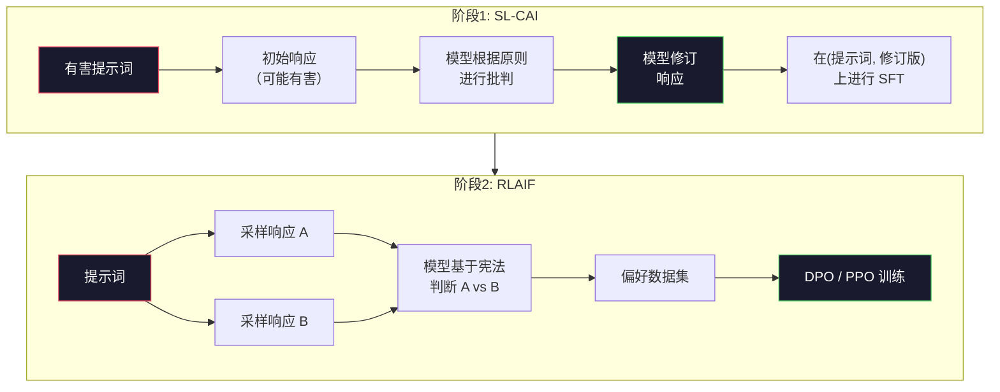
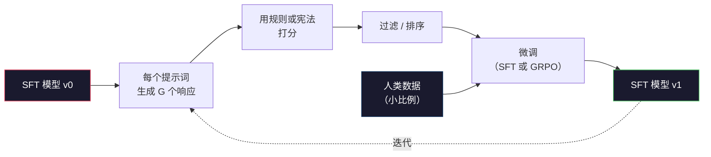

# 宪法 AI 与自我改进

> RLHF 需要人类参与。宪法 AI 用模型本身替代了大多数人类标注者。写下一系列原则，让模型根据这些原则批判自己的输出，然后在批判上进行训练。DeepSeek-R1 在 2025 年将这一想法推向极致：让模型生成数百万条推理轨迹，用规则给它们打分，然后对结果运行 GRPO。2026 年前沿模型中大多数"对齐工作"都是模型自我对齐。本课构建这两个循环。

**类型：** 构建
**语言：** Python（标准库 + numpy）
**前置条件：** 第10阶段，第06-08课（SFT、RLHF、DPO）
**时间：** 约45分钟

## 学习目标

- 实现宪法 AI 两阶段循环：自我批判与修订，然后在修订后的对上进行偏好训练
- 推导 GRPO 目标（DeepSeek-R1 的组相对策略优化），并与 PPO 的价值函数基准进行对比
- 使用基于规则的结果奖励生成可验证的推理轨迹并评分，无需单独的奖励模型
- 判断自我改进何时优于人类偏好数据，何时会退化为模式寻找

## 问题背景

你在第07课构建了 RLHF，在第08课构建了 DPO。两者都依赖相同的昂贵输入：人类偏好对。Anthropic 的 InstructGPT 时代流水线使用了大约 33,000 个比较对。Llama 2 Chat 使用了超过 150 万个。Claude 3 使用的更多。这些数据收集缓慢、代价高昂，并且偏向于标注者在评分当天碰巧持有的观点。

2022 年的宪法 AI 论文提出了一个简单问题：如果让模型自己生成偏好标签会怎样？给它一个书面原则列表——"宪法"——让它批判自己的响应。批判结果成为训练信号。

2024 年，DeepSeek 将这一想法推进了一步。他们表明，对于任何结果可验证的任务（有已知答案的数学题、要么通过测试要么失败的代码、要么赢要么输的游戏），可以完全跳过评论者。生成许多候选解决方案，用确定性规则给每个打分，在奖励上运行策略梯度算法。DeepSeek-R1 几乎没有使用人类偏好数据，以这种方式训练，匹配了 o1 级别的推理性能。

这两个循环——针对主观行为的宪法 AI 和针对可验证行为的基于规则的 RL——是 2026 年主流的对齐方案。曾经用于 RLHF 的人类偏好预算，现在只需要支付一个更小的步骤：选择宪法和选择奖励规则。

## 核心概念

### 宪法 AI 循环

Bai 等人（2022）将流水线分为两个阶段。

**阶段一：来自 AI 反馈的监督学习（SL-CAI）。** 从一个有帮助但可能有害的 SFT 模型开始。用可能有害的请求提示它。对每个响应，让*同一个模型*根据宪法原则批判其响应，然后修订。在修订后的响应上微调。数据集是（提示词，修订响应）对。

**阶段二：来自 AI 反馈的强化学习（RLAIF）。** 采样响应对。让模型判断哪个更符合宪法。成对偏好训练奖励模型，然后用 PPO 或 DPO 训练模型。与 RLHF 的关键区别：偏好来自模型，而非人类。



宪法是调节杠杆。Anthropic 最初有 16 条原则（后来扩展）。一条原则的表述类似于"请选择来自各种文化背景的人最不可能反对的响应"。每一步都选择原则，有时随机选择，有时根据提示词类别选择。

### 宪法实际上做了什么

宪法将对齐契约从*数据*转移到*文本*。在 RLHF 下改变行为意味着重新标注数千个对。在 CAI 下改变行为意味着编辑一个段落。这是主要的实际收益。

但也有代价。模型的自我判断只有在其起始校准足够好时才有效。如果 SFT 模型有盲点——例如，它无法识别操纵性措辞——批判步骤会继承这些盲点。CAI 压缩了对齐循环，但无法将信号放大到基础模型的天花板以上。这就是为什么每个生产 CAI 流水线仍然使用一些人类偏好数据，通常是纯 RLHF 规模的 5-10%。

### GRPO：组相对策略优化

DeepSeek 在 DeepSeekMath 论文（2024）中引入了 GRPO，并将其作为 DeepSeek-R1（2025）的核心。GRPO 是 PPO 的一个变体，消除了价值函数。

回顾第07课的 PPO 目标：

```
L_PPO = E[min(r(theta) * A, clip(r(theta), 1-eps, 1+eps) * A)]
```

其中 `A` 是优势值，通常用学习的价值网络 `V(s)` 通过 GAE 估计。价值网络是与策略相同大小的第二个模型，它使内存翻倍并引入自己的训练循环。

GRPO 抛弃了价值函数。对每个提示词，采样一组 G 个响应（通常 G=16 或 64）。计算每个响应的奖励，然后在组内归一化：

```
A_i = (r_i - mean(r_1, ..., r_G)) / std(r_1, ..., r_G)
```

优势值是响应奖励相对于其同组成员的 z 分数。没有价值函数，组充当自身的基准。

```
L_GRPO = E[min(r(theta) * A_group, clip(r(theta), 1-eps, 1+eps) * A_group)] - beta * KL(pi || pi_ref)
```

与参考模型的 KL 惩罚仍然存在，与 PPO 相同。裁剪比率仍然存在。消失的是独立的评论者网络。

### 为什么 GRPO 对推理任务重要

对于推理任务，奖励通常是稀疏的二元信号：最终答案是对还是错。在稀疏二元奖励上训练的价值函数是一种浪费——它无法学习有用的中间估计，因为几乎每个状态在最终步骤之前都有相同的期望回报。GRPO 的组归一化给你一个即时的相对信号：在同一数学题的 16 次尝试中，哪些尝试高于平均水平？

这正是基于规则的奖励所提供的信号形态：

- **数学**：sympy 或符号检查器决定最终答案是否匹配。
- **代码**：测试套件决定通过/失败。
- **格式**：正则表达式决定答案是否在所需的 XML 标签中。
- **多步骤证明**：证明助手（Lean、Coq）决定有效性。

DeepSeek-R1-Zero 只用两个奖励训练：数学基准的准确性和格式合规性（答案在 `<answer>` 标签内）。没有人类偏好，没有评论者模型。DeepSeek 论文描述的"顿悟时刻"——模型自发学会自我检查和回溯——仅从稀疏规则奖励上的 GRPO 中涌现出来。

### 过程奖励模型 vs 结果奖励模型

你仍然有一个设计选择：奖励最终答案（结果奖励模型，ORM）还是奖励每个中间步骤（过程奖励模型，PRM）。

| 维度 | ORM | PRM |
|------|-----|-----|
| 每条轨迹的信号数 | 1个数值 | N个数值（每步一个）|
| 监督来源 | 最终答案检查 | 步骤级标签或自我判断 |
| 训练成本 | 低廉 | 昂贵 |
| 信用分配 | 稀疏、嘈杂 | 密集、精准 |
| 奖励欺骗风险 | 较低 | 较高（模型优化 PRM 的人工特征）|
| 使用方 | DeepSeek-R1、R1-Zero | OpenAI o1（据称）、Math-Shepherd |

2024-2025 年的共识是 ORM 加 GRPO 比 PRM 更具扩展性。PRM 在每个 token 上更具样本效率，但需要昂贵的步骤标注数据，并且往往会退化为捷径行为（写出对 PRM 看起来好但不推进证明的步骤）。对于大多数团队，ORM + GRPO 是首选方案。

### 自我改进：反馈倍增器

一旦你有了两个循环模式（批判/修订和基于规则奖励的组相对 RL），就可以将它们串联起来。

1. 从 SFT 模型开始。
2. 每个提示词生成多个候选响应。
3. 用基于规则的奖励（对于可验证任务）或宪法评论者（对于主观任务）对它们评分。
4. 将最高分候选保留为新的 SFT 数据或偏好对。
5. 微调，然后用改进后的模型回到步骤2。

DeepSeek 在 R1-Zero 后应用时将此称为"拒绝采样微调"。Anthropic 将早期版本称为"宪法 AI 蒸馏"。规律是：每次迭代放大模型中已有的信号，但不添加新信号。如果模型完全无法解决问题类别 X，再多的自我改进也无法创造出这种能力。

危险在于模式崩溃。自生成数据的分布总是比训练语料库更窄。经过 3-5 轮自蒸馏后，模型通常会在创意任务上失去多样性，变得过度自信，并表现出特有的"AI 腔调"（重复措辞、公式化结构）。生产流水线会将自生成数据与少量新鲜人类数据混合，以保持分布的真实性。



### 何时使用何种方法

- **纯 CAI**：主观行为（语气、安全性、拒绝风格）。你有一个定义明确的宪法，没有干净的可验证结果。
- **GRPO + ORM**：可验证任务（数学、代码、结构化提取）。你能廉价地检查正确性，奖励稀疏且为二元。
- **DPO 在自生成对上**：混合方式。用宪法生成偏好对，然后用 DPO（第08课）而非 PPO/GRPO 训练。
- **完整 RLHF**：当你需要规则或简短宪法都无法表达的多目标权衡时，仍然适用。

大多数 2026 年前沿流水线运行全部四种方法：CAI 用于安全层，GRPO 用于推理后训练阶段，DPO 用于偏好打磨，小规模 RLHF 用于处理其他方法难以解决的残余行为。

## 动手实现

代码用纯 Python + numpy 实现三个功能：宪法 AI 自我批判循环、用于简单算术的基于规则的奖励检查器，以及在第04课微型语言模型上运行的最小 GRPO 训练器。

### 第一步：宪法

一个原则列表。在生产中，每条原则会更丰富并按类别标记。本课保持简短。

```python
CONSTITUTION = [
    "响应必须直接回答所问的问题，不能回避。",
    "响应不能包含不必要的填充内容或冗余。",
    "如果问题有单一数值答案，直接说出数字。",
    "响应不能拒绝合理的良性请求。",
]
```

### 第二步：自我批判与修订

在真实系统中，模型自身进行批判。在本课中，我们用手写的评分标准模拟评论者，这样流水线无需 LLM 调用就能运行。

```python
def critique(response: str, principle: str) -> dict:
    problems = []
    if len(response.split()) > 40 and "plainly" in principle:
        problems.append("answer buried in extra prose")
    if response.strip().lower().startswith(("i can't", "i cannot", "as an ai")):
        problems.append("unwarranted refusal")
    if response.count(",") > 4:
        problems.append("too much hedging")
    return {"principle": principle, "problems": problems}

def revise(response: str, critique_result: dict) -> str:
    if "answer buried" in " ".join(critique_result["problems"]):
        return response.split(".")[-2].strip() + "."
    if "unwarranted refusal" in " ".join(critique_result["problems"]):
        return "Here is the answer: " + response.split(":")[-1].strip()
    return response
```

修订函数只是占位符。在真实 LLM 中，它会是第二个提示词："根据批判，重写响应。"

### 第三步：基于规则的奖励

对于可验证任务，完全替换评论者。这个检查器给算术答案打分。

```python
import re

def reward_math(prompt: str, response: str) -> float:
    try:
        expected = eval(prompt.replace("What is ", "").replace("?", "").strip())
    except Exception:
        return 0.0
    numbers = re.findall(r"-?\d+", response)
    if not numbers:
        return 0.0
    return 1.0 if int(numbers[-1]) == expected else 0.0

def reward_format(response: str) -> float:
    return 1.0 if re.search(r"<answer>.*</answer>", response) else 0.0
```

两条确定性规则，无需训练数据，无需人类标签。组合奖励是 `reward_math + 0.1 * reward_format`，在不淹没正确性的情况下惩罚格式缺失。

### 第四步：组相对优势

给定同一提示词的一组响应的奖励列表，计算 z 分数：

```python
import numpy as np

def group_relative_advantage(rewards: list[float]) -> np.ndarray:
    r = np.array(rewards, dtype=float)
    if r.std() < 1e-8:
        return np.zeros_like(r)
    return (r - r.mean()) / (r.std() + 1e-8)
```

如果组中每个样本都有相同的奖励，优势为零，没有梯度信号流动。这是一个特性，而不是缺陷。它告诉你这个提示词对当前策略来说要么太简单要么太难，应该跳过这一步。

### 第五步：GRPO 更新

一步符号梯度。在生产中这会是 torch autograd 传递。这里直接展示更新规则。

```python
def grpo_step(policy_logprobs: np.ndarray, ref_logprobs: np.ndarray,
              advantages: np.ndarray, beta: float = 0.01, clip_eps: float = 0.2) -> dict:
    ratios = np.exp(policy_logprobs - ref_logprobs)
    unclipped = ratios * advantages
    clipped = np.clip(ratios, 1 - clip_eps, 1 + clip_eps) * advantages
    policy_loss = -np.minimum(unclipped, clipped).mean()
    kl = (ref_logprobs - policy_logprobs).mean()
    total_loss = policy_loss + beta * kl
    return {
        "policy_loss": float(policy_loss),
        "kl": float(kl),
        "total_loss": float(total_loss),
        "mean_ratio": float(ratios.mean()),
    }
```

这是 PPO 的裁剪代理损失，只有一个变化：优势值来自组相对 z 分数，而非价值函数。没有 V(s) 需要训练，没有 GAE，组就是基准。

### 第六步：自我改进轮次

将各部分串联起来。采样一个组，用规则给每个响应打分，计算优势，报告你会输入真实优化器的指标。

```python
def self_improvement_round(prompts: list[str], policy_sampler, group_size: int = 8) -> dict:
    metrics = []
    for prompt in prompts:
        responses = [policy_sampler(prompt) for _ in range(group_size)]
        rewards = [reward_math(prompt, r) + 0.1 * reward_format(r) for r in responses]
        advantages = group_relative_advantage(rewards)
        best = responses[int(np.argmax(rewards))]
        metrics.append({
            "prompt": prompt,
            "mean_reward": float(np.mean(rewards)),
            "best_reward": float(np.max(rewards)),
            "std_reward": float(np.std(rewards)),
            "best_response": best,
            "advantages": advantages.tolist(),
        })
    return {"per_prompt": metrics,
            "overall_mean": float(np.mean([m["mean_reward"] for m in metrics]))}
```

## 运行效果

运行 `code/main.py` 会端到端运行两个循环。CAI 循环生成一小组可以微调的（初始，修订）对。GRPO 循环生成算术题的每提示词奖励统计，展示组相对优势如何让弱采样器在没有价值函数或人类标签的情况下改进。

数字本身不是重点。在使用真实训练模型的实际运行中，平均奖励应该跨轮次上升，奖励标准差应该保持正值（如果崩溃到零，策略已发生模式崩溃，应停止），KL 与参考的散度应缓慢增长。这三条曲线——平均奖励上升、标准差稳定、KL 受限——是 GRPO 或 CAI 流水线的生产健康检查。

## 拓展练习

1. 将第二步中的手写评论者替换为 LLM 调用。使用任何本地聊天模型，测量批判和修订实际上改善响应的频率，与保持不变的比较。

2. 添加第三条关于事实性的宪法原则。在需要事实性声明（首都、日期）的提示词上运行流水线，测量有多少修订删除了事实错误，有多少引入了新错误。

3. 在 CAI 阶段2生成的偏好对上实现 DPO。取 20 个提示词，各生成两个响应，让评论者为每对选出获胜者，然后运行第08课的 DPO 损失。与相同数据上的 GRPO 路径比较。

4. 在 GRPO 目标中添加熵正则化。项 `-alpha * entropy(policy)`（alpha=0.01）鼓励多样化采样。测量在 5 轮自我改进中它是否延迟了模式崩溃。

5. 为两步算术问题构建过程奖励评分器。给定"What is (3+4)*5?"，模型必须展示中间步骤 3+4=7。将中间步骤与最终答案分开打分，在 10 轮中比较 PRM 加权的 GRPO 与纯 ORM 加权的 GRPO。

## 关键术语

| 术语 | 人们的说法 | 实际含义 |
|------|-----------|---------|
| 宪法 AI | "模型自我对齐" | 一个两阶段流水线（自我批判 + RLAIF），用模型对书面宪法的自我判断替代大多数人类偏好标签 |
| RLAIF | "没有人类的 RLHF" | 来自 AI 反馈的强化学习（Reinforcement Learning from AI Feedback）——基于模型自身生成的偏好进行 PPO 或 DPO |
| GRPO | "没有价值函数的 PPO" | 组相对策略优化（Group-Relative Policy Optimization）——每个提示词采样 G 个响应，使用 z 分数组奖励作为优势 |
| ORM | "奖励答案" | 结果奖励模型（Outcome Reward Model）——仅在最终答案上给出单一标量奖励 |
| PRM | "奖励每步" | 过程奖励模型（Process Reward Model）——对每个中间推理步骤给出奖励，通常从步骤标注数据训练 |
| 基于规则的奖励 | "确定性评分器" | 一个验证器（正则表达式、sympy、测试套件），无需学习模型就能返回二元或数值分数 |
| 拒绝采样微调 | "保留获胜者，重新训练" | 采样多个响应，过滤到最高奖励的，添加到 SFT 数据，重新训练 |
| 模式崩溃 | "模型停止多样化" | 后训练策略集中在响应空间的狭窄区域；通过组内奖励标准差下降来衡量 |
| KL 预算 | "可以漂移多远" | 优化器允许从参考模型累积的总 KL 散度，超过后训练停止 |
| R1 时刻 | "模型学会了回溯" | DeepSeek 报告的行为，仅在结果奖励上训练的策略自发地在其思维链中发展出自我检查和回溯 |

## 延伸阅读

- [Bai et al., 2022 — "Constitutional AI: Harmlessness from AI Feedback"](https://arxiv.org/abs/2212.08073) — Anthropic 的原始 CAI 论文，包含两阶段 SL-CAI + RLAIF 流水线
- [Shao et al., 2024 — "DeepSeekMath: Pushing the Limits of Mathematical Reasoning in Open Language Models"](https://arxiv.org/abs/2402.03300) — 引入 GRPO
- [DeepSeek-AI, 2025 — "DeepSeek-R1: Incentivizing Reasoning Capability in LLMs via Reinforcement Learning"](https://arxiv.org/abs/2501.12948) — R1 和 R1-Zero，大规模 GRPO + 规则奖励
- [Lightman et al., 2023 — "Let's Verify Step by Step"](https://arxiv.org/abs/2305.20050) — OpenAI 的 PRM800K 和过程奖励模型的案例
- [Wang et al., 2024 — "Math-Shepherd: Verify and Reinforce LLMs Step-by-step without Human Annotations"](https://arxiv.org/abs/2312.08935) — 通过蒙特卡洛展开自动标注 PRM
- [Huang et al., 2024 — "Large Language Models Cannot Self-Correct Reasoning Yet"](https://arxiv.org/abs/2310.01798) — 关于无外部基础的自我改进的怀疑论反驳
