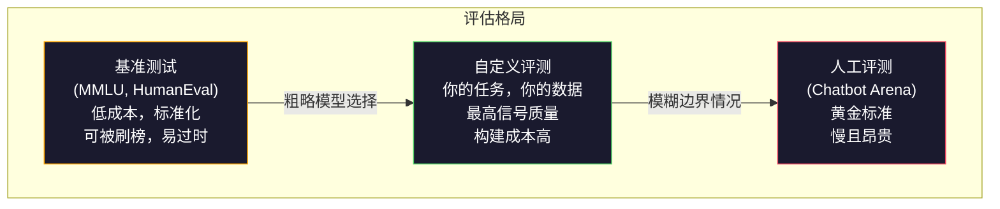
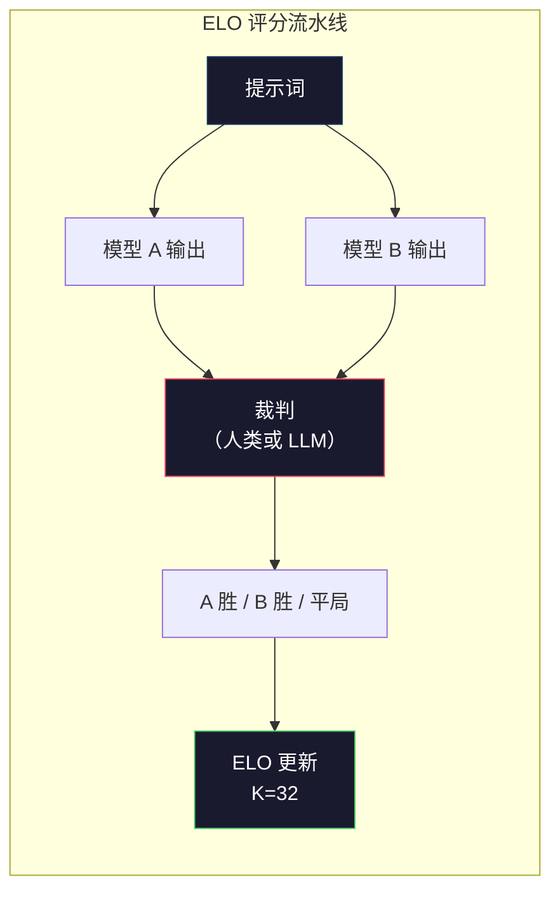

# 评估：基准测试、评测与 LM Harness

> 古德哈特定律：当一个指标成为目标时，它就不再是好的指标。每个前沿实验室都在刷基准分数。MMLU 分数不断上升，但模型仍然无法可靠地数出"strawberry"中有多少个 R。唯一重要的评测是你自己的评测——针对你自己的任务，用你自己的数据。

**类型：** 构建
**语言：** Python
**前置条件：** 第10阶段，第01-05课（从零构建 LLM）
**时间：** 约90分钟

## 学习目标

- 构建自定义评测框架，对语言模型运行多项选择和开放式基准测试
- 解释为什么标准基准（MMLU、HumanEval）会饱和并无法区分前沿模型
- 实现针对特定任务的评测，使用适当的指标：精确匹配、F1、BLEU 和 LLM-as-judge 评分
- 设计针对你特定用例的自定义评测套件，而不是单纯依赖公开排行榜

## 问题背景

MMLU 于2020年发布，包含57个学科的15,908道题。三年内，前沿模型就将其饱和了：GPT-4 得了86.4%，Claude 3 Opus 得了86.8%，Llama 3 405B 得了88.6%。排行榜被压缩到3分差距的范围内，其中的差异是统计噪声，而非真实能力差距。

与此同时，这些模型在一个10岁小孩不假思索就能完成的任务上却会失败。Claude 3.5 Sonnet 在 MMLU 上得了88.7%，却最初无法数出"strawberry"中有多少个字母——这项任务不需要任何世界知识，不需要任何推理，只需要字符级的遍历。HumanEval 有164道代码生成题，模型得分超过90%，却仍然会产生在任何初级开发人员都能发现的边界情况下崩溃的代码。

基准性能与现实世界可靠性之间的差距是 LLM 评估的核心问题。基准测试告诉你模型在基准上的表现，几乎不告诉你该模型在你的特定任务、你的特定数据、你的特定失败模式下的表现。如果你在构建客服机器人，MMLU 无关紧要。如果你在构建代码助手，HumanEval 只覆盖函数级生成——它对跨文件的调试、重构或代码解释什么都不涉及。

你需要自定义评测。不是因为基准测试没用——它们对于粗略的模型选择有用——而是因为最终评估必须与你的部署条件完全匹配。

## 核心概念

### 评估格局

评估分为三类，各有不同的成本和信号质量。

**基准测试（Benchmarks）** 是标准化测试套件：MMLU、HumanEval、SWE-bench、MATH、ARC、HellaSwag。你对基准运行模型得到分数。优点：每个人使用相同的测试，可以比较模型。缺点：模型和训练数据越来越多地污染这些基准。实验室在包含基准题的数据上训练，分数上升，但能力可能并没有提升。

**自定义评测（Custom evals）** 是你为自己特定用例构建的测试套件。你定义输入、预期输出和评分函数。法律文件摘要器在法律文件上评估，SQL 生成器在你的数据库模式上评估。这些创建成本高，但是唯一能预测生产性能的评估。

**人工评测（Human evals）** 使用付费标注者根据帮助性、正确性、流畅性和安全性等标准判断模型输出。对于自动评分失败的开放式任务，这是黄金标准。Chatbot Arena 收集了100多个模型超过200万次人类偏好投票。缺点：成本（每次判断0.10-2.00美元）和速度（数小时到数天）。



### 为什么基准测试会失效

三种机制导致基准分数停止反映真实能力。

**数据污染（Data contamination）。** 训练语料库会爬取互联网，基准题目也存在于互联网上，模型在训练时就见过答案。这不是传统意义上的作弊——实验室不会刻意纳入基准数据，但网络规模的爬取几乎不可能将其排除。

**应试教育（Teaching to the test）。** 实验室优化训练混合比例以提高基准性能。如果训练混合中有5%是 MMLU 风格的多项选择，模型就会学习格式和答案分布。MMLU 是4选1，模型学到答案分布近似均匀于 A/B/C/D，这即使在模型不知道答案时也有帮助。

**饱和（Saturation）。** 当每个前沿模型在基准上得87-90%时，基准就无法区分了。剩余的10-15%可能是歧义题、标注错误或需要偏门领域知识的题。从87%提升到89%可能意味着模型记住了两道更偏门的题，而非变得更聪明。

### 困惑度（Perplexity）：快速健康检查

困惑度（Perplexity，PPL）衡量模型对一串 token 的"惊讶程度"。形式上，它是指数化的平均负对数似然：

```
PPL = exp(-1/N * sum(log P(token_i | context)))
```

困惑度10意味着模型平均而言在每个 token 位置的不确定性相当于从10个选项中均匀选择。越低越好。GPT-2 在 WikiText-103 上的困惑度约为30，GPT-3约为20，Llama 3 8B约为7。

困惑度对于在同一测试集上比较模型很有用，但有盲点。模型可以通过擅长预测常见模式而困惑度很低，同时对罕见但重要的模式表现很差。它也不涉及指令遵循、推理或事实准确性。将其用作健康检查，而非最终裁决。

### LLM-as-Judge

用强模型评估弱模型的输出。思路很简单：让 GPT-4o 或 Claude Sonnet 在1-5分量表上对响应的正确性、帮助性和安全性进行评分。使用 GPT-4o-mini 每次判断大约花费0.01美元，与人类判断的相关性出人意料地好——在大多数任务上约80%的一致性。

评分提示词比模型本身更重要。模糊的提示词（"给这个响应打分"）产生噪声分数。带有评分标准的结构化提示词（"如果答案事实正确且引用了来源，给5分；正确但未引用来源给4分；部分正确给3分……"）产生一致、可重复的分数。

失败模式：裁判模型表现出位置偏差（在两两比较中偏好第一个响应）、冗长偏差（偏好较长的响应）和自我偏好（GPT-4 给 GPT-4 输出的评分高于等价的 Claude 输出）。缓解方法：随机化顺序，按长度归一化，使用与被评估模型不同的裁判。

### 两两比较的 ELO 评分

Chatbot Arena 的方法：展示来自不同模型的同一提示词的两个响应，让人类（或 LLM 裁判）选择更好的那个。通过数千次这样的比较，计算每个模型的 ELO 评分——与国际象棋相同的系统。

ELO 的优势：相对排名比绝对评分更可靠，能优雅处理平局，并且比独立给每个输出打分所需的比较次数更少就能收敛。截至2026年初，Chatbot Arena 排名显示 GPT-4o、Claude 3.5 Sonnet 和 Gemini 1.5 Pro 在顶部相互之间差距不超过20个 ELO 点。



### 评估框架

**lm-evaluation-harness**（EleutherAI）：标准开源评估框架，支持200多个基准。用一条命令对任何 HuggingFace 模型运行 MMLU、HellaSwag、ARC 等测试，Open LLM Leaderboard 也在使用。

**RAGAS**：专门针对 RAG（检索增强生成）流水线的评估框架，衡量忠实性（答案是否与检索的上下文匹配？）、相关性（检索的上下文是否与问题相关？）和答案正确性。

**promptfoo**：配置驱动的提示词工程评测。在 YAML 中定义测试用例，对多个模型运行，得到通过/失败报告。适合提示词的回归测试——确保提示词改动不破坏现有测试用例。

### 构建自定义评测

这是生产环境中唯一重要的评测。流程如下：

1. **定义任务。** 模型具体应该做什么？要精确。"回答问题"太模糊。"给定一封客户投诉邮件，提取产品名称、问题类别和情感倾向"是可以评估的任务。

2. **创建测试用例。** 原型评测至少50个，生产环境200个以上。每个测试用例是一个（输入，预期输出）对。包含边界情况：空输入、对抗性输入、歧义输入、其他语言的输入。

3. **定义评分。** 结构化输出用精确匹配，文本相似度用 BLEU/ROUGE，开放式质量用 LLM-as-judge，提取任务用 F1。用权重组合多个指标。

4. **自动化。** 每次评测用一条命令运行，不需要手动步骤，以可比较历史结果的格式存储结果。

5. **跟踪时间趋势。** 孤立的评测分数没有意义，你需要趋势线。上次提示词改动后分数是否提升？切换模型后是否退步？将评测与提示词版本化管理。

| 评测类型 | 每次判断成本 | 与人类一致性 | 最适合 |
|---------|------------|------------|--------|
| 精确匹配 | ~$0 | 100%（适用时）| 结构化输出、分类 |
| BLEU/ROUGE | ~$0 | ~60% | 翻译、摘要 |
| LLM-as-judge | ~$0.01 | ~80% | 开放式生成 |
| 人工评测 | $0.10-$2.00 | N/A（即黄金标准）| 歧义、高风险任务 |

## 动手实现

### 第一步：最小评测框架

定义核心抽象。评测用例有输入、预期输出和可选的元数据字典。评分器接受预测和参考，返回0到1之间的分数。

```python
import json
from collections import Counter

class EvalCase:
    def __init__(self, input_text, expected, metadata=None):
        self.input_text = input_text
        self.expected = expected
        self.metadata = metadata or {}

class EvalSuite:
    def __init__(self, name, cases, scorers):
        self.name = name
        self.cases = cases
        self.scorers = scorers

    def run(self, model_fn):
        results = []
        for case in self.cases:
            prediction = model_fn(case.input_text)
            scores = {}
            for scorer_name, scorer_fn in self.scorers.items():
                scores[scorer_name] = scorer_fn(prediction, case.expected)
            results.append({
                "input": case.input_text,
                "expected": case.expected,
                "prediction": prediction,
                "scores": scores,
            })
        return results
```

### 第二步：评分函数

构建精确匹配、token F1 和模拟 LLM-as-judge 评分器。

```python
def exact_match(prediction, expected):
    return 1.0 if prediction.strip().lower() == expected.strip().lower() else 0.0

def token_f1(prediction, expected):
    pred_tokens = set(prediction.lower().split())
    exp_tokens = set(expected.lower().split())
    if not pred_tokens or not exp_tokens:
        return 0.0
    common = pred_tokens & exp_tokens
    precision = len(common) / len(pred_tokens)
    recall = len(common) / len(exp_tokens)
    if precision + recall == 0:
        return 0.0
    return 2 * (precision * recall) / (precision + recall)

def llm_judge_simulated(prediction, expected):
    pred_words = set(prediction.lower().split())
    exp_words = set(expected.lower().split())
    if not exp_words:
        return 0.0
    overlap = len(pred_words & exp_words) / len(exp_words)
    length_penalty = min(1.0, len(prediction) / max(len(expected), 1))
    return round(overlap * 0.7 + length_penalty * 0.3, 3)
```

### 第三步：ELO 评分系统

实现两两比较的 ELO 更新，与 Chatbot Arena 用于排名模型的系统完全相同。

```python
class ELOTracker:
    def __init__(self, k=32, initial_rating=1500):
        self.ratings = {}
        self.k = k
        self.initial_rating = initial_rating
        self.history = []

    def _ensure_player(self, name):
        if name not in self.ratings:
            self.ratings[name] = self.initial_rating

    def expected_score(self, rating_a, rating_b):
        return 1 / (1 + 10 ** ((rating_b - rating_a) / 400))

    def record_match(self, player_a, player_b, outcome):
        self._ensure_player(player_a)
        self._ensure_player(player_b)

        ea = self.expected_score(self.ratings[player_a], self.ratings[player_b])
        eb = 1 - ea

        if outcome == "a":
            sa, sb = 1.0, 0.0
        elif outcome == "b":
            sa, sb = 0.0, 1.0
        else:
            sa, sb = 0.5, 0.5

        self.ratings[player_a] += self.k * (sa - ea)
        self.ratings[player_b] += self.k * (sb - eb)

        self.history.append({
            "a": player_a, "b": player_b,
            "outcome": outcome,
            "rating_a": round(self.ratings[player_a], 1),
            "rating_b": round(self.ratings[player_b], 1),
        })

    def leaderboard(self):
        return sorted(self.ratings.items(), key=lambda x: -x[1])
```

### 第四步：困惑度计算

使用 token 概率计算困惑度。实践中你会从模型的 logits 得到这些值，这里用概率分布模拟。

```python
import numpy as np

def perplexity(log_probs):
    if not log_probs:
        return float("inf")
    avg_neg_log_prob = -np.mean(log_probs)
    return float(np.exp(avg_neg_log_prob))

def token_log_probs_simulated(text, model_quality=0.8):
    np.random.seed(hash(text) % 2**31)
    tokens = text.split()
    log_probs = []
    for i, token in enumerate(tokens):
        base_prob = model_quality
        if len(token) > 8:
            base_prob *= 0.6
        if i == 0:
            base_prob *= 0.7
        prob = np.clip(base_prob + np.random.normal(0, 0.1), 0.01, 0.99)
        log_probs.append(float(np.log(prob)))
    return log_probs
```

### 第五步：汇总结果

计算评测运行的汇总统计：均值、中位数、阈值通过率和按指标的明细。

```python
def summarize_results(results, threshold=0.8):
    all_scores = {}
    for r in results:
        for metric, score in r["scores"].items():
            all_scores.setdefault(metric, []).append(score)

    summary = {}
    for metric, scores in all_scores.items():
        arr = np.array(scores)
        summary[metric] = {
            "mean": round(float(np.mean(arr)), 3),
            "median": round(float(np.median(arr)), 3),
            "std": round(float(np.std(arr)), 3),
            "min": round(float(np.min(arr)), 3),
            "max": round(float(np.max(arr)), 3),
            "pass_rate": round(float(np.mean(arr >= threshold)), 3),
            "n": len(scores),
        }
    return summary

def print_summary(summary, suite_name="Eval"):
    print(f"\n{'=' * 60}")
    print(f"  {suite_name} 摘要")
    print(f"{'=' * 60}")
    for metric, stats in summary.items():
        print(f"\n  {metric}:")
        print(f"    均值：      {stats['mean']:.3f}")
        print(f"    中位数：    {stats['median']:.3f}")
        print(f"    标准差：    {stats['std']:.3f}")
        print(f"    范围：      [{stats['min']:.3f}, {stats['max']:.3f}]")
        print(f"    通过率：    {stats['pass_rate']:.1%}（阈值 >= 0.8）")
        print(f"    样本数：    {stats['n']}")
```

### 第六步：运行完整流水线

将所有部分串联起来。定义任务，创建测试用例，模拟两个模型，运行评测，从两两比较计算 ELO，打印排行榜。

```python
def demo_model_good(prompt):
    responses = {
        "What is the capital of France?": "Paris",
        "What is 2 + 2?": "4",
        "Who wrote Hamlet?": "William Shakespeare",
        "What language is PyTorch written in?": "Python and C++",
        "What is the boiling point of water?": "100 degrees Celsius",
    }
    return responses.get(prompt, "I don't know")

def demo_model_bad(prompt):
    responses = {
        "What is the capital of France?": "Paris is the capital city of France",
        "What is 2 + 2?": "The answer is four",
        "Who wrote Hamlet?": "Shakespeare",
        "What language is PyTorch written in?": "Python",
        "What is the boiling point of water?": "212 Fahrenheit",
    }
    return responses.get(prompt, "Unknown")

cases = [
    EvalCase("What is the capital of France?", "Paris"),
    EvalCase("What is 2 + 2?", "4"),
    EvalCase("Who wrote Hamlet?", "William Shakespeare"),
    EvalCase("What language is PyTorch written in?", "Python and C++"),
    EvalCase("What is the boiling point of water?", "100 degrees Celsius"),
]

suite = EvalSuite(
    name="General Knowledge",
    cases=cases,
    scorers={
        "exact_match": exact_match,
        "token_f1": token_f1,
        "llm_judge": llm_judge_simulated,
    },
)

results_good = suite.run(demo_model_good)
results_bad = suite.run(demo_model_bad)

print_summary(summarize_results(results_good), "模型 A（简洁）")
print_summary(summarize_results(results_bad), "模型 B（冗长）")
```

"好"模型给出精确答案，"差"模型给出冗长的改写版本。精确匹配对冗长模型惩罚严重，token F1 和 LLM-as-judge 则更宽容。这说明了为什么指标选择很重要：同一个模型在不同评分方式下看起来可能截然不同。

### 第七步：ELO 锦标赛

在多轮中运行模型之间的两两比较。

```python
elo = ELOTracker(k=32)

for case in cases:
    pred_a = demo_model_good(case.input_text)
    pred_b = demo_model_bad(case.input_text)

    score_a = token_f1(pred_a, case.expected)
    score_b = token_f1(pred_b, case.expected)

    if score_a > score_b:
        outcome = "a"
    elif score_b > score_a:
        outcome = "b"
    else:
        outcome = "tie"

    elo.record_match("model_a_concise", "model_b_verbose", outcome)

print("\nELO 排行榜：")
for name, rating in elo.leaderboard():
    print(f"  {name}: {rating:.0f}")
```

### 第八步：困惑度比较

比较不同质量水平"模型"的困惑度。

```python
test_text = "The quick brown fox jumps over the lazy dog in the garden"

for quality, label in [(0.9, "强模型"), (0.7, "中等模型"), (0.4, "弱模型")]:
    log_probs = token_log_probs_simulated(test_text, model_quality=quality)
    ppl = perplexity(log_probs)
    print(f"  {label}（quality={quality}）：困惑度 = {ppl:.2f}")
```

## 常用工具

### lm-evaluation-harness（EleutherAI）

对任何模型运行基准测试的标准工具。

```python
# pip install lm-eval
# 命令行：
# lm_eval --model hf --model_args pretrained=meta-llama/Llama-3.1-8B --tasks mmlu --batch_size 8

# Python API：
# import lm_eval
# results = lm_eval.simple_evaluate(
#     model="hf",
#     model_args="pretrained=meta-llama/Llama-3.1-8B",
#     tasks=["mmlu", "hellaswag", "arc_easy"],
#     batch_size=8,
# )
# print(results["results"])
```

### promptfoo

配置驱动的提示词工程评测，在 YAML 中定义测试，对多个提供商运行。

```yaml
# promptfoo.yaml
providers:
  - openai:gpt-4o-mini
  - anthropic:claude-3-haiku

prompts:
  - "Answer in one word: {{question}}"

tests:
  - vars:
      question: "What is the capital of France?"
    assert:
      - type: contains
        value: "Paris"
  - vars:
      question: "What is 2 + 2?"
    assert:
      - type: equals
        value: "4"
```

### RAGAS（RAG 评估）

```python
# pip install ragas
# from ragas import evaluate
# from ragas.metrics import faithfulness, answer_relevancy, context_precision
#
# result = evaluate(
#     dataset,
#     metrics=[faithfulness, answer_relevancy, context_precision],
# )
# print(result)
```

RAGAS 衡量通用评测遗漏的内容：模型的答案是否基于检索的上下文，而不仅仅是答案在抽象意义上是否"正确"。

## 拓展练习

1. 添加"一致性"评分器，将同一输入通过模型运行5次，测量输出匹配的频率。对确定性输入的不一致回答揭示了脆弱的提示词或过高的温度设置。

2. 扩展 ELO 追踪器以支持多个裁判函数（精确匹配、F1、LLM-as-judge）并加权。比较当精确匹配权重很高与 F1 权重很高时，排行榜如何变化。

3. 为一个特定任务构建评测套件：将邮件分类为5个类别。创建100个包含各种边界情况的测试用例（可能属于多个类别的邮件、空邮件、其他语言的邮件）。测量不同"模型"（基于规则、关键词匹配、模拟 LLM）的表现。

4. 实现污染检测：给定一组评测题目和训练语料，检查评测题目（或近似改写版本）出现在训练数据中的百分比。这是研究人员审查基准有效性的方法。

5. 构建"模型差异"工具。给定两个模型版本的评测结果，高亮显示哪些具体测试用例有改进、哪些退步、哪些保持不变。这是代码差异的评测等价物——对于理解一次改动是否有帮助至关重要。

## 关键术语

| 术语 | 人们的说法 | 实际含义 |
|------|-----------|---------|
| MMLU | "那个基准" | Massive Multitask Language Understanding——57个学科的15,908道多项选择题，2025年前被饱和至88%以上 |
| HumanEval | "代码评测" | OpenAI 的164道 Python 函数补全题，只测试孤立的函数生成 |
| SWE-bench | "真实编码评测" | 12个 Python 仓库的2,294个 GitHub issue，衡量端到端的 bug 修复（包括测试生成）|
| 困惑度 | "模型有多困惑" | exp(-avg(log P(token_i given context)))——越低说明模型对实际 token 分配的概率越高 |
| ELO 评分 | "模型的象棋排名" | 从两两胜负记录计算的相对技能评分，Chatbot Arena 用它排名100多个模型 |
| LLM-as-judge | "用 AI 给 AI 打分" | 强模型根据评分标准对弱模型的输出打分，~80%与人类裁判一致，~$0.01/次 |
| 数据污染 | "模型见过测试题" | 训练数据包含基准题，在不提升真实能力的情况下虚高分数 |
| 评测套件 | "一堆测试" | 一组版本化的（输入，预期输出，评分器）三元组，用于衡量特定能力 |
| 通过率 | "答对了多少百分比" | 评测用例中分数超过阈值的比例——比均值更能体现可靠性 |
| Chatbot Arena | "模型排名网站" | LMSYS 平台，拥有200万+人类偏好投票，通过 ELO 评分产生最受信任的 LLM 排行榜 |

## 延伸阅读

- [Hendrycks et al., 2021 — "Measuring Massive Multitask Language Understanding"](https://arxiv.org/abs/2009.03300) — MMLU 论文，尽管已饱和，仍是被引用最多的 LLM 基准
- [Chen et al., 2021 — "Evaluating Large Language Models Trained on Code"](https://arxiv.org/abs/2107.03374) — OpenAI 的 HumanEval 论文，建立了代码生成评估方法论
- [Zheng et al., 2023 — "Judging LLM-as-a-Judge"](https://arxiv.org/abs/2306.05685) — 系统分析用 LLM 评估 LLM 的方法，包括位置偏差和冗长偏差的发现
- [LMSYS Chatbot Arena](https://chat.lmsys.org/) — 众包模型比较平台，拥有200万+投票，是最受信任的 LLM 现实排名
