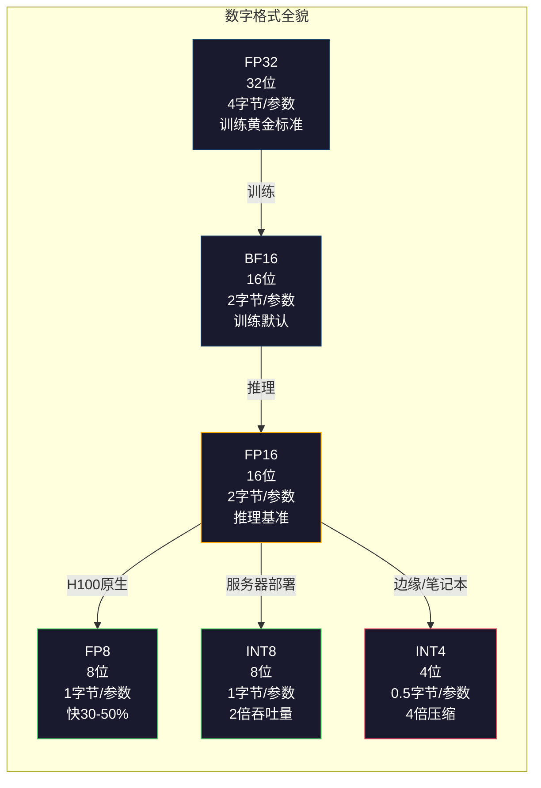
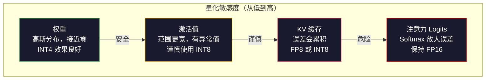
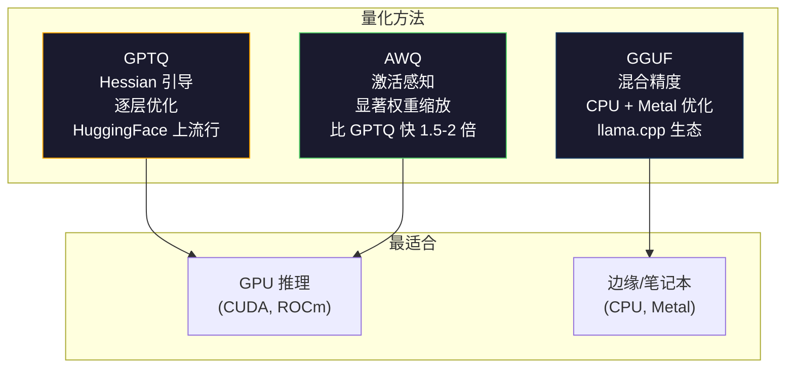

# 量化：让模型适配硬件

> FP16 格式的 70B 模型需要 140GB 显存，仅加载权重就需要两块 A100。量化到 FP8：一块 80GB GPU 就够。INT4：MacBook 也能跑。

**类型：** 构建
**语言：** Python（使用 numpy）
**前置条件：** 第10阶段，第01-10课（从零构建 LLM）
**时间：** 约120分钟

## 学习目标

- 实现从 FP16 到 INT8 和 INT4 的对称和非对称量化，包括逐张量和逐通道缩放
- 计算量化带来的内存节省，确定哪种精度适合给定 GPU 的显存
- 解释训练后量化（PTQ）和量化感知训练（QAT）之间的区别
- 应用 GPTQ 或 AWQ 对真实模型进行量化，并在基准上测量精度-内存的权衡

## 问题背景

Llama 3 70B 有 700 亿个参数，每个参数是 16 位浮点数，共 1400 亿字节，即 140GB。单块 A100 有 80GB 显存，仅加载权重就不够，更别说运行推理了。你需要两块 A100（每小时 $2 每块），仅仅是为了服务一个模型。

但每个参数 16 位是浪费的。神经网络中的大多数权重都集中在零附近。FP16 的完整动态范围（从 0.000000059 到 65,504）几乎完全未被使用。如果测量 Llama 3 70B 中权重的实际分布，95% 的权重在 -0.1 到 +0.1 之间。你用 16 位来表示本可以用 4 位表示的值。

量化用低精度数字替换高精度数字。FP16 到 FP8 内存减半，FP16 到 INT4 缩减到四分之一。那个 140GB 的模型变成 35GB，可以放入单块消费级 GPU。再推进到 2 位量化（激进、有损，但某些任务可用），同一个模型可以在 16GB 的笔记本上运行。

代价是精度。每去掉一位，就会丢失一些信息。问题是你会损失多少精度，以及损失在哪里。量化良好的 INT4 模型在大多数基准上保留了原始模型 95-99% 的质量。粗糙的 INT4 量化可能完全破坏模型，差别在于技术。

社区用 GPTQ 将 Llama 3 量化到 INT4，在 WikiText 上困惑度大约损失 1-2 点。Mistral 发布了 Mixtral 8x22B 的 FP8 检查点，在 MMLU 上质量损失几乎为零。GGUF 格式支持 llama.cpp，在搭载 M 系列芯片的 MacBook 上运行 70B 模型。量化不是黑科技，它是每个超过 7B 规模模型的标准部署路径。

## 核心概念

### 数字格式：每一位的作用

每个浮点数有三个部分：符号位、指数位和尾数位（也称有效数字）。符号位占 1 位，指数决定范围（数字能有多大或多小），尾数决定精度（你能得到多少小数位）。

```
FP32：  [1位符号] [8位指数] [23位尾数]  = 32位
FP16：  [1位符号] [5位指数] [10位尾数]  = 16位
BF16：  [1位符号] [8位指数] [7位尾数]   = 16位
FP8：   [1位符号] [4位指数] [3位尾数]   = 8位 (E4M3)
FP8：   [1位符号] [5位指数] [2位尾数]   = 8位 (E5M2)
INT8：  [1位符号] [7位值]               = 8位 (均匀步长)
INT4：  [1位符号] [3位值]               = 4位 (共16个级别)
```

**FP32** 是全精度。23 位尾数给你约 7 位小数精度，范围约从 1.2×10⁻³⁸ 到 3.4×10³⁸。训练曾经完全在 FP32 下进行，矩阵乘法的累加仍然如此。

**FP16** 位数减半。10 位尾数给约 3.3 位小数。指数缩减到 5 位，大幅减小范围（最大值约 65,504）。对权重来说没问题（权重聚集在零附近），但对训练中可能飙升的激活值和梯度来说很危险。FP16 训练需要损失缩放来防止下溢。

**BF16**（脑浮点 16）保留了 FP32 的 8 位指数，但将尾数缩减到 7 位。与 FP32 范围相同，精度比 FP16 低。Google 专为深度学习设计。直觉是：对神经网络来说范围比精度更重要。在 FP16 中下溢为零的 10⁻²⁰ 梯度在 BF16 中能存活。在 BF16 中四舍五入为 0.0734 的权重 0.07342 已经足够近了。每个现代训练都使用 BF16 或 BF16/FP32 混合精度。

**FP8** 有两种变体。E4M3（4位指数，3位尾数）用于推理的权重和激活。E5M2（5位指数，2位尾数）用于训练中的梯度，范围比精度更重要。H100 GPU 上的 FP8 推理比 FP16 快 30-50%，质量损失可忽略不计。

**INT8** 是整数格式。没有指数，没有尾数，只有从 -128 到 127 的 256 个均匀间隔的值。你需要一个缩放因子将浮点权重映射到这个范围。优点：整数算术比浮点更快、更节能。A100 上的 INT8 矩阵乘法以 624 TOPS 运行，而 FP16 是 312 TFLOPS。

**INT4** 更进一步，只有 16 个可能的值，缩放因子承担重任。质量完全取决于你如何选择缩放和量化哪些权重。最先进的 INT4 方法（GPTQ、AWQ）保留原始模型 95% 以上的质量。



### 量化的工作原理

核心操作很简单：取一组浮点值，找到缩放因子，相乘，四舍五入到最近的整数，存储整数和缩放因子。

**量化：**
```
scale = max(abs(tensor)) / max_int_value
quantized = round(tensor / scale)
```

**反量化：**
```
reconstructed = quantized * scale
```

对称范围 INT8（-127 到 127）：
```
scale = max(abs(tensor)) / 127
quantized = clamp(round(tensor / scale), -128, 127)
```

误差就是舍入误差。每个值最多偏差 `scale / 2`。某一层的总误差取决于权重数量和模型对这些权重扰动的敏感程度。

**逐张量 vs 逐通道量化。** 逐张量对整个权重矩阵使用一个缩放因子——简单但有损失：如果一列有大值而另一列有小值，小值会损失大部分精度。逐通道对每个输出通道（权重矩阵的每行或每列）使用一个缩放因子。更多开销（存储 N 个缩放因子而非 1 个），但质量显著更好。每种生产量化方法都使用逐通道或更细粒度。

**非对称量化** 添加零点偏移：`quantized = round(tensor / scale) + zero_point`。这处理不以零为中心的分布。例如 ReLU 激活始终非负，对称量化浪费了一半整数范围。非对称量化将实际范围 [min, max] 映射到完整整数范围。

### 敏感度层次结构

模型中并非所有内容都对量化具有同等的容忍度。存在一个清晰的层次结构。

**权重（最鲁棒）。** 模型权重在训练中变化缓慢，近似服从以零为中心的高斯分布。它们量化效果很好，逐通道缩放的 INT8 权重产生接近无损的结果，INT4 需要更复杂的方法但可行。

**激活值（中等敏感）。** 激活值是推理时流过网络的中间值，动态范围比权重更宽，包含异常值。单个注意力头可能产生比均值大 100 倍的激活值，这些异常值对模型质量至关重要。粗糙的量化会破坏信息。解决方案：将异常值通道保持在更高精度（LLM.int8()），使用逐 token 或逐通道的激活缩放。

**KV 缓存（高敏感度）。** KV 缓存存储所有之前 token 的注意力状态。在长上下文长度下，KV 缓存主导内存。对于 32K 上下文的 70B 模型，仅 KV 缓存在 FP16 下就有 40GB。将 KV 缓存量化到 FP8 或 INT8 节省大量内存，但任何误差都会在所有未来的注意力计算中累积。质量影响随序列长度增加。

**注意力 logits（最敏感）。** 注意力中的 softmax 对其输入的微小变化高度敏感。注意力前 logit 中 0.01 的量化误差可能显著改变注意力分布。大多数量化方案即使在其他所有内容都量化时，也会将注意力计算保持在更高精度（FP16 或 BF16）。



### PTQ vs QAT

**训练后量化（PTQ）** 对已训练好的模型进行量化，无需重新训练。取 FP16 权重，计算缩放因子，四舍五入，部署。速度快（几分钟到几小时），成本低。对 INT8 和 FP8 效果良好。对 INT4，朴素 PTQ 通常失败，因为舍入误差会累积。高级 PTQ 方法（GPTQ、AWQ）使用校准数据最小化量化误差。

**量化感知训练（QAT）** 在训练过程中在前向传播中插入伪量化操作，模型学会将权重放在舍入误差小的位置。梯度通过直通估计器（STE）流过伪量化操作：假设舍入操作的梯度为1。QAT 比 PTQ 产生更好的 INT4 和 INT2 模型，但需要完整的训练运行。Google 将 QAT 用于 Gemini 的高效服务，Meta 将其用于某些 Llama 部署目标。

| 方面 | PTQ | QAT |
|------|-----|-----|
| 成本 | 几分钟到几小时 | 完整训练运行 |
| INT8 质量 | 极好（< 0.1% 损失）| 极好 |
| INT4 质量 | 使用 GPTQ/AWQ 良好（1-3% 损失）| 更好（< 1% 损失）|
| INT2 质量 | 差 | 某些任务可用 |
| 校准数据 | 128-1024 个样本 | 完整训练数据集 |
| 使用时机 | 部署、迭代 | 在低位宽下追求最高质量 |

### GPTQ、AWQ、GGUF

**GPTQ（GPT 量化）** 是一种一次性 PTQ 方法，逐层量化权重，使用小型校准数据集（通常128个样本）测量 Hessian 矩阵（关于输出对每个权重敏感程度的二阶信息）。Hessian 认为重要的权重会被更仔细地量化。GPTQ 是使 INT4 量化对 LLM 实用的第一种方法。HuggingFace 上的 TheBloke 通过发布数百个模型的 GPTQ 量化版本使其广为人知。

**AWQ（激活感知权重量化）** 观察到少量权重（约 1%）因为与大激活值相乘而不成比例地重要。AWQ 使用校准数据识别这些显著权重，在量化前将其放大（然后相应地缩小对应的激活值），保持重要权重在 INT4 量化准确的范围内。AWQ 通常匹配或略优于 GPTQ 质量，同时应用速度快 1.5-2 倍。

**GGUF（GPT 生成统一格式）** 是 llama.cpp 及其生态系统使用的文件格式，支持混合量化：不同层获得不同的位宽。第一层和最后一层（嵌入层和输出头）通常保持在更高精度，中间层获得 INT4 或 INT3。GGUF 文件是自包含的：权重、分词器、元数据全在一个文件中。该格式针对 CPU 推理和 Apple Silicon 设计，在 CPU 或 Metal GPU 上将整个模型加载到内存并运行矩阵乘法是标准路径。Q4_K_M 是最流行的 GGUF 量化变体，在质量和大小之间取得平衡。



### 质量评估

如何知道量化后的模型是否仍然良好？

**困惑度。** 最常用的指标，越低越好。在留出数据集（WikiText-2 是标准）上对原始和量化模型计算困惑度，差值告诉你量化破坏了多少信息。经验法则：差值 < 0.5 极好，0.5-1.0 良好，1.0-2.0 大多数任务可接受，> 2.0 表示出了问题。

**特定任务基准。** 在 MMLU、HumanEval、GSM8K 或你的自定义评测套件上运行量化模型，与原始模型比较。量化对不同能力的影响不均等：数学和代码任务比通用知识对精度损失更敏感。

**输出比较。** 在相同提示词上从两个模型生成响应并比较。LLM-as-judge（第10课）在这里效果很好。计算胜率：量化模型在多少比例的提示词上能匹配或超越原始模型？

**延迟和吞吐量。** 量化存在的目的是使模型更快更便宜，测量每秒 token 数、首个 token 时间和内存使用。比原始模型慢的量化模型比没用还糟糕。

| 模型 | 格式 | 大小 | 困惑度 (WikiText-2) | MMLU | Tokens/秒 (A100) |
|------|------|------|---------------------|------|-----------------|
| Llama 3 70B | FP16 | 140GB | 3.12 | 79.5% | 38 |
| Llama 3 70B | FP8 | 70GB | 3.14 | 79.3% | 55 |
| Llama 3 70B | GPTQ INT4 | 35GB | 4.32 | 77.8% | 72 |
| Llama 3 70B | AWQ INT4 | 35GB | 4.18 | 78.1% | 75 |
| Llama 3 70B | GGUF Q4_K_M | 40GB | 4.25 | 77.9% | 28（CPU）|

规律：FP8 几乎是免费的。INT4 损失 1-2 个 MMLU 点，但吞吐量翻倍，内存减少四分之三。对几乎所有部署来说都值得。

### 实际数据

FP16 到 H100 上的 FP8：推理加速 30-50%，质量损失 < 0.1%。这是无脑量化方案，每个 H100 部署都应该使用。

FP16 到 INT8（LLM.int8()）：内存减少 2 倍，质量损失 < 0.5%。混合精度方法将异常值特征保持在 FP16，其余量化为 INT8。

FP16 到 INT4（GPTQ/AWQ）：内存减少 4 倍，质量损失 1-3%（取决于模型和方法）。使 70B 模型能在单块 48GB GPU 上运行。

FP16 到 GGUF Q4_K_M：内存减少 3.5 倍，质量损失 1-2%，针对 CPU 推理优化。Q4_K_M 的 70B 模型约 40GB，在搭载 64GB 的 M3 Max 上以 10-15 tokens/秒运行。

FP16 到 INT2：内存减少 8 倍，质量损失 5-15%。只适用于可以容忍退化的特定窄任务，属于研究前沿，尚未为通用生产就绪。

## 动手实现

### 第一步：数字格式表示

构建每种格式的位级表示，看清符号位、指数位和尾数位各自的作用。

```python
import numpy as np


def float_to_fp32_bits(value):
    bits = np.float32(value).view(np.uint32)
    sign = (bits >> 31) & 1
    exponent = (bits >> 23) & 0xFF
    mantissa = bits & 0x7FFFFF
    return {"sign": int(sign), "exponent": int(exponent), "mantissa": int(mantissa),
            "exponent_bits": format(int(exponent), '08b'),
            "mantissa_bits": format(int(mantissa), '023b'),
            "value": float(value),
            "actual_exponent": int(exponent) - 127}


def float_to_fp16_bits(value):
    fp16 = np.float16(value)
    bits = fp16.view(np.uint16)
    sign = (bits >> 15) & 1
    exponent = (bits >> 10) & 0x1F
    mantissa = bits & 0x3FF
    return {"sign": int(sign), "exponent": int(exponent), "mantissa": int(mantissa),
            "exponent_bits": format(int(exponent), '05b'),
            "mantissa_bits": format(int(mantissa), '010b'),
            "value": float(fp16),
            "actual_exponent": int(exponent) - 15}


def float_to_bf16_bits(value):
    fp32_bits = np.float32(value).view(np.uint32)
    bf16_bits = (fp32_bits >> 16).astype(np.uint16)
    sign = (bf16_bits >> 15) & 1
    exponent = (bf16_bits >> 7) & 0xFF
    mantissa = bf16_bits & 0x7F
    reconstructed = np.uint32(bf16_bits.astype(np.uint32) << 16).view(np.float32)
    return {"sign": int(sign), "exponent": int(exponent), "mantissa": int(mantissa),
            "exponent_bits": format(int(exponent), '08b'),
            "mantissa_bits": format(int(mantissa), '07b'),
            "value": float(reconstructed),
            "actual_exponent": int(exponent) - 127}


def simulate_fp8_e4m3(value):
    sign = 1 if value < 0 else 0
    abs_val = abs(value)
    max_val = 448.0
    abs_val = min(abs_val, max_val)
    if abs_val == 0:
        return {"sign": sign, "exponent": 0, "mantissa": 0, "value": 0.0,
                "exponent_bits": "0000", "mantissa_bits": "000"}
    exp = int(np.floor(np.log2(abs_val)))
    exp = max(-6, min(8, exp))
    mantissa_val = abs_val / (2.0 ** exp) - 1.0
    mantissa_quant = round(mantissa_val * 8) / 8
    mantissa_quant = max(0, min(0.875, mantissa_quant))
    reconstructed = (1.0 + mantissa_quant) * (2.0 ** exp)
    if sign:
        reconstructed = -reconstructed
    mantissa_int = int(round(mantissa_quant * 8))
    return {"sign": sign, "exponent": exp + 7, "mantissa": mantissa_int,
            "exponent_bits": format(exp + 7, '04b'),
            "mantissa_bits": format(mantissa_int, '03b'),
            "value": float(reconstructed),
            "actual_exponent": exp}


def display_format_comparison(value):
    fp32 = float_to_fp32_bits(value)
    fp16 = float_to_fp16_bits(value)
    bf16 = float_to_bf16_bits(value)
    fp8 = simulate_fp8_e4m3(value)

    print(f"\n  值：{value}")
    print(f"  {'格式':<8} {'存储值':>14} {'误差':>12} {'符号':>5} {'指数位':>10} {'尾数位':>25}")
    print(f"  {'-'*76}")
    print(f"  {'FP32':<8} {fp32['value']:>14.6f} {abs(fp32['value'] - value):>12.8f} {fp32['sign']:>5} {fp32['exponent_bits']:>10} {fp32['mantissa_bits']:>25}")
    print(f"  {'FP16':<8} {fp16['value']:>14.6f} {abs(fp16['value'] - value):>12.8f} {fp16['sign']:>5} {fp16['exponent_bits']:>10} {fp16['mantissa_bits']:>25}")
    print(f"  {'BF16':<8} {bf16['value']:>14.6f} {abs(bf16['value'] - value):>12.8f} {bf16['sign']:>5} {bf16['exponent_bits']:>10} {bf16['mantissa_bits']:>25}")
    print(f"  {'FP8e4m3':<8} {fp8['value']:>14.6f} {abs(fp8['value'] - value):>12.8f} {fp8['sign']:>5} {fp8['exponent_bits']:>10} {fp8['mantissa_bits']:>25}")
```

### 第二步：对称量化（逐张量和逐通道）

基础量化操作。逐张量对整个矩阵使用一个缩放，逐通道对每行或每列使用一个缩放。

```python
def quantize_symmetric(tensor, num_bits=8):
    qmin = -(2 ** (num_bits - 1))
    qmax = 2 ** (num_bits - 1) - 1
    abs_max = np.max(np.abs(tensor))
    if abs_max == 0:
        return np.zeros_like(tensor, dtype=np.int32), 1.0
    scale = abs_max / qmax
    quantized = np.clip(np.round(tensor / scale), qmin, qmax).astype(np.int32)
    return quantized, float(scale)


def dequantize_symmetric(quantized, scale):
    return quantized.astype(np.float64) * scale


def quantize_per_channel(tensor, num_bits=8, axis=0):
    qmin = -(2 ** (num_bits - 1))
    qmax = 2 ** (num_bits - 1) - 1

    if axis == 0:
        abs_max = np.max(np.abs(tensor), axis=1, keepdims=True)
    else:
        abs_max = np.max(np.abs(tensor), axis=0, keepdims=True)

    abs_max = np.where(abs_max == 0, 1.0, abs_max)
    scales = abs_max / qmax
    quantized = np.clip(np.round(tensor / scales), qmin, qmax).astype(np.int32)
    return quantized, scales.squeeze()


def dequantize_per_channel(quantized, scales, axis=0):
    if axis == 0:
        return quantized.astype(np.float64) * scales.reshape(-1, 1)
    else:
        return quantized.astype(np.float64) * scales.reshape(1, -1)


def quantize_asymmetric(tensor, num_bits=8):
    qmin = 0
    qmax = 2 ** num_bits - 1
    t_min = np.min(tensor)
    t_max = np.max(tensor)
    if t_max == t_min:
        return np.zeros_like(tensor, dtype=np.int32), 1.0, 0
    scale = (t_max - t_min) / (qmax - qmin)
    zero_point = int(np.round(qmin - t_min / scale))
    zero_point = max(qmin, min(qmax, zero_point))
    quantized = np.clip(np.round(tensor / scale + zero_point), qmin, qmax).astype(np.int32)
    return quantized, float(scale), int(zero_point)


def dequantize_asymmetric(quantized, scale, zero_point):
    return (quantized.astype(np.float64) - zero_point) * scale
```

### 第三步：质量测量

测量量化破坏了多少信息：原始张量和重建张量之间的均方误差、信噪比和余弦相似度。

```python
def quantization_error(original, reconstructed):
    diff = original - reconstructed
    mse = float(np.mean(diff ** 2))
    rmse = float(np.sqrt(mse))
    max_error = float(np.max(np.abs(diff)))
    signal_power = float(np.mean(original ** 2))
    snr_db = 10 * np.log10(signal_power / max(mse, 1e-20))

    orig_flat = original.flatten()
    recon_flat = reconstructed.flatten()
    norm_orig = np.linalg.norm(orig_flat)
    norm_recon = np.linalg.norm(recon_flat)
    if norm_orig == 0 or norm_recon == 0:
        cosine_sim = 0.0
    else:
        cosine_sim = float(np.dot(orig_flat, recon_flat) / (norm_orig * norm_recon))

    return {"mse": mse, "rmse": rmse, "max_error": max_error,
            "snr_db": float(snr_db), "cosine_similarity": cosine_sim}


def compare_quantization_methods(tensor, num_bits=8):
    q_pt, s_pt = quantize_symmetric(tensor, num_bits)
    recon_pt = dequantize_symmetric(q_pt, s_pt)
    err_pt = quantization_error(tensor, recon_pt)

    q_pc, s_pc = quantize_per_channel(tensor, num_bits, axis=0)
    recon_pc = dequantize_per_channel(q_pc, s_pc, axis=0)
    err_pc = quantization_error(tensor, recon_pc)

    q_asym, s_asym, zp = quantize_asymmetric(tensor, num_bits)
    recon_asym = dequantize_asymmetric(q_asym, s_asym, zp)
    err_asym = quantization_error(tensor, recon_asym)

    print(f"\n  量化方法比较（{num_bits}位，张量形状 {tensor.shape}）：")
    print(f"  {'方法':<20} {'MSE':>12} {'SNR (dB)':>10} {'余弦相似度':>12} {'最大误差':>12}")
    print(f"  {'-'*68}")
    print(f"  {'逐张量对称':<20} {err_pt['mse']:>12.8f} {err_pt['snr_db']:>10.2f} {err_pt['cosine_similarity']:>12.8f} {err_pt['max_error']:>12.8f}")
    print(f"  {'逐通道对称':<20} {err_pc['mse']:>12.8f} {err_pc['snr_db']:>10.2f} {err_pc['cosine_similarity']:>12.8f} {err_pc['max_error']:>12.8f}")
    print(f"  {'非对称':<20} {err_asym['mse']:>12.8f} {err_asym['snr_db']:>10.2f} {err_asym['cosine_similarity']:>12.8f} {err_asym['max_error']:>12.8f}")

    return {"per_tensor": err_pt, "per_channel": err_pc, "asymmetric": err_asym}
```

### 第四步：位宽扫描

在不同位宽（2、3、4、8、16）下量化同一张量，在每个级别测量质量。这精确展示了质量悬崖在哪里。

```python
def bit_width_sweep(tensor):
    print(f"\n  位宽扫描（张量形状 {tensor.shape}）：")
    print(f"  {'位数':>6} {'级别数':>8} {'MSE':>14} {'SNR (dB)':>10} {'余弦相似度':>12} {'压缩比':>12}")
    print(f"  {'-'*64}")

    results = []
    for bits in [2, 3, 4, 8, 16]:
        q, s = quantize_per_channel(tensor, bits, axis=0)
        recon = dequantize_per_channel(q, s, axis=0)
        err = quantization_error(tensor, recon)
        levels = 2 ** bits
        compression = 32.0 / bits

        print(f"  {bits:>6} {levels:>8} {err['mse']:>14.8f} {err['snr_db']:>10.2f} {err['cosine_similarity']:>12.8f} {compression:>11.1f}x")
        results.append({"bits": bits, "levels": levels, "error": err, "compression": compression})

    return results
```

### 第五步：敏感度实验

模拟对 Transformer 不同部分的量化，测量哪些组件最敏感。这验证了敏感度层次结构：权重 < 激活值 < KV 缓存 < 注意力。

```python
def simulate_transformer_layer(input_data, weights, kv_scale=1.0):
    hidden = input_data @ weights["qkv"]
    seq_len = hidden.shape[1]
    d_model = weights["qkv"].shape[1] // 3
    q, k, v = hidden[:, :, :d_model], hidden[:, :, d_model:2*d_model], hidden[:, :, 2*d_model:]

    attn_scores = (q @ k.transpose(0, 2, 1)) / np.sqrt(d_model) * kv_scale
    attn_max = np.max(attn_scores, axis=-1, keepdims=True)
    attn_exp = np.exp(attn_scores - attn_max)
    attn_weights = attn_exp / np.sum(attn_exp, axis=-1, keepdims=True)

    attn_output = attn_weights @ v
    output = attn_output @ weights["out"]
    return output, {"q": q, "k": k, "v": v, "attn_scores": attn_scores,
                    "attn_weights": attn_weights, "attn_output": attn_output}
```

### 第六步：模拟 GPTQ

GPTQ 逐列量化权重，使用 Hessian 决定如何分配舍入误差。这是一个简化版本，捕获了核心思想：使用校准数据测量权重重要性，然后对最不重要的权重进行更激进的量化。

```python
def simulated_gptq(weight_matrix, calibration_inputs, num_bits=4):
    n_in, n_out = weight_matrix.shape
    qmin = -(2 ** (num_bits - 1))
    qmax = 2 ** (num_bits - 1) - 1

    H = np.zeros((n_in, n_in))
    for x in calibration_inputs:
        x = x.reshape(-1, 1) if x.ndim == 1 else x
        for row in range(x.shape[0]):
            xi = x[row].reshape(-1, 1)
            H += xi @ xi.T
    H /= len(calibration_inputs)
    H += np.eye(n_in) * 1e-4

    weight_importance = np.diag(H)

    quantized = np.zeros_like(weight_matrix, dtype=np.int32)
    scales = np.zeros(n_out)
    errors = np.zeros(n_out)

    W = weight_matrix.copy()

    for col in range(n_out):
        w_col = W[:, col]
        abs_max = np.max(np.abs(w_col))
        if abs_max == 0:
            scales[col] = 1.0
            continue
        scale = abs_max / qmax
        scales[col] = scale

        q_col = np.clip(np.round(w_col / scale), qmin, qmax).astype(np.int32)
        quantized[:, col] = q_col

        quant_error = w_col - q_col * scale
        errors[col] = np.sqrt(np.mean(quant_error ** 2))

        if col < n_out - 1:
            importance_weights = weight_importance / (np.max(weight_importance) + 1e-10)
            for next_col in range(col + 1, min(col + 4, n_out)):
                compensation = quant_error * importance_weights * 0.1
                W[:, next_col] += compensation

    return quantized, scales, {"column_errors": errors,
                               "mean_error": float(np.mean(errors)),
                               "max_error": float(np.max(errors))}
```

### 第七步：AWQ 模拟

AWQ 识别显著权重（与大激活值相乘的权重），在量化前通过缩放保护它们。

```python
def simulated_awq(weight_matrix, calibration_inputs, num_bits=4, salient_fraction=0.01):
    n_in, n_out = weight_matrix.shape
    qmin = -(2 ** (num_bits - 1))
    qmax = 2 ** (num_bits - 1) - 1

    activation_magnitudes = np.zeros(n_in)
    for x in calibration_inputs:
        if x.ndim == 1:
            activation_magnitudes += np.abs(x)
        else:
            activation_magnitudes += np.mean(np.abs(x), axis=0)
    activation_magnitudes /= len(calibration_inputs)

    n_salient = max(1, int(n_in * salient_fraction))
    salient_indices = np.argsort(activation_magnitudes)[-n_salient:]

    scale_factors = np.ones(n_in)
    for idx in salient_indices:
        col_max = np.max(np.abs(weight_matrix[idx, :]))
        if col_max > 0:
            scale_factors[idx] = min(4.0, 1.0 / (col_max + 1e-8) * np.mean(np.abs(weight_matrix)))

    scaled_weights = weight_matrix * scale_factors.reshape(-1, 1)

    quantized, scales = quantize_per_channel(scaled_weights, num_bits, axis=0)
    dequantized = dequantize_per_channel(quantized, scales, axis=0)

    result = dequantized / scale_factors.reshape(-1, 1)

    err = quantization_error(weight_matrix, result)

    return result, {"salient_indices": salient_indices,
                    "scale_factors": scale_factors[salient_indices],
                    "error": err,
                    "n_salient": n_salient}
```

## 工具集成

### 使用 AutoGPTQ 量化

```python
# pip install auto-gptq transformers
# from auto_gptq import AutoGPTQForCausalLM, BaseQuantizeConfig
# from transformers import AutoTokenizer
#
# model_id = "meta-llama/Llama-3.1-8B"
# quantize_config = BaseQuantizeConfig(
#     bits=4,
#     group_size=128,
#     desc_act=False,
# )
#
# tokenizer = AutoTokenizer.from_pretrained(model_id)
# model = AutoGPTQForCausalLM.from_pretrained(model_id, quantize_config)
#
# calibration = [tokenizer(t, return_tensors="pt") for t in calibration_texts[:128]]
# model.quantize(calibration)
# model.save_quantized("llama-8b-gptq-int4")
```

### 使用 AutoAWQ 量化

```python
# pip install autoawq
# from awq import AutoAWQForCausalLM
# from transformers import AutoTokenizer
#
# model_id = "meta-llama/Llama-3.1-8B"
# model = AutoAWQForCausalLM.from_pretrained(model_id)
# tokenizer = AutoTokenizer.from_pretrained(model_id)
#
# model.quantize(tokenizer, quant_config={"zero_point": True, "q_group_size": 128, "w_bit": 4})
# model.save_quantized("llama-8b-awq-int4")
```

### 转换为 GGUF

```bash
# pip install llama-cpp-python
# python convert_hf_to_gguf.py meta-llama/Llama-3.1-8B --outtype q4_k_m --outfile llama-8b-q4km.gguf
# llama-server -m llama-8b-q4km.gguf -c 4096 -ngl 99
```

### 使用 vLLM 服务

```python
# pip install vllm
# vllm serve model-awq --quantization awq --dtype half --max-model-len 8192
```

vLLM 原生支持 AWQ 和 GPTQ 模型，在矩阵乘法期间处理反量化，并使用分页注意力管理 KV 缓存。H100 上的 FP8 添加 `--dtype float8_e4m3fn`。

## 拓展练习

1. 实现分组量化。不是每通道一个缩放，而是对通道内每 128 个权重使用一个缩放——这是 GPTQ 和 AWQ 实际使用的方式。比较分组大小 32、64、128 和 256 在同一权重矩阵上的效果。分组越小质量越好，但缩放因子的存储开销更大。

2. 构建混合精度量化器。对多层网络的第一层和最后一层使用 INT8，中间层使用 INT4。比较端到端输出质量与统一 INT4 和统一 INT8 的差异，测量与全 INT8 相比的内存节省。

3. 实现量化感知训练的直通估计器（STE）。在一个用于回归任务的两层网络的前向传播中插入伪量化/反量化操作。比较正常训练后再 PTQ 到 INT4 的模型与从头使用 QAT 训练的模型的最终损失。

4. 构建受 LLM.int8() 启发的异常值感知量化器。检测激活幅度超过均值 6 倍的通道，将这些通道保持在 FP16，其余量化为 INT8。以不同异常值阈值（3x、6x、10x）测量第五步的 Transformer 层的端到端质量。

5. 构建量化质量仪表板。给定一个权重矩阵，计算并显示：权重分布直方图、量化误差分布、逐通道缩放因子、量化最差的通道（最高重建误差），以及在 100 个随机输入上原始和量化输出之间的余弦相似度。识别哪些通道应保持在更高精度。

## 关键术语

| 术语 | 人们的说法 | 实际含义 |
|------|-----------|---------|
| FP16 | "半精度" | 具有 5 位指数和 10 位尾数的 16 位浮点，最大值 65,504，标准推理格式 |
| BF16 | "脑浮点" | 具有 8 位指数（与 FP32 范围相同）和 7 位尾数的 16 位浮点，Google 为训练设计 |
| FP8 | "8 位浮点" | 两种变体：E4M3（推理，精度更高）和 E5M2（训练，范围更大），H100 原生支持 |
| INT8 | "8 位整数" | 从 -128 到 127 的 256 个均匀间隔值，需要缩放因子从浮点映射 |
| INT4 | "4 位整数" | 共 16 个级别，需要复杂方法（GPTQ、AWQ）来保持质量 |
| 逐通道量化 | "每行一个缩放" | 对每个输出通道使用单独的缩放因子，而非整个张量用一个，大幅减少误差 |
| GPTQ | "Hessian 方法" | 使用二阶信息最小化输出误差的训练后量化，逐层进行 |
| AWQ | "激活感知" | 在量化前缩放显著权重（与大激活值相乘的权重）以保护它们 |
| GGUF | "llama.cpp 格式" | 混合精度层的自包含模型文件，针对 CPU 和 Apple Silicon 推理优化 |
| PTQ | "训练后量化" | 在不重新训练的情况下将训练模型的权重转换为低精度，快速但在极端压缩下受限 |
| QAT | "训练中量化" | 在前向传播中插入伪量化，使模型学会容忍舍入，在 INT4/INT2 时更好 |
| 校准数据 | "那 128 个样本" | 通过模型运行的小型数据集，用于计算设置缩放因子所需的激活统计信息 |
| 缩放因子 | "乘数" | 在浮点范围和整数范围之间转换：`float_val = int_val * scale` |
| 困惑度差值 | "差了多少" | 原始和量化模型之间的困惑度差异，< 0.5 极好，> 2.0 表示出问题了 |

## 延伸阅读

- [Frantar et al., 2022 — "GPTQ: Accurate Post-Training Quantization for Generative Pre-trained Transformers"](https://arxiv.org/abs/2210.17323) — 使用 Hessian 引导权重舍入使 INT4 量化对 LLM 实用的论文
- [Lin et al., 2023 — "AWQ: Activation-aware Weight Quantization for LLM Compression and Acceleration"](https://arxiv.org/abs/2306.00978) — 量化前缩放以保护显著权重，匹配或优于 GPTQ
- [Dettmers et al., 2022 — "LLM.int8(): 8-bit Matrix Multiplication for Transformers at Scale"](https://arxiv.org/abs/2208.07339) — 将异常值特征保持在 FP16 的混合精度 INT8，无质量损失实现 INT8 推理
- [Xiao et al., 2023 — "SmoothQuant: Accurate and Efficient Post-Training Quantization for Large Language Models"](https://arxiv.org/abs/2211.10438) — 将量化困难从激活值迁移到权重，用于 W8A8 部署
- [Micikevicius et al., 2022 — "FP8 Formats for Deep Learning"](https://arxiv.org/abs/2209.05433) — NVIDIA/ARM/Intel 定义 H100 原生支持的 E4M3 和 E5M2 格式的论文
