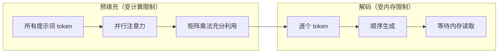
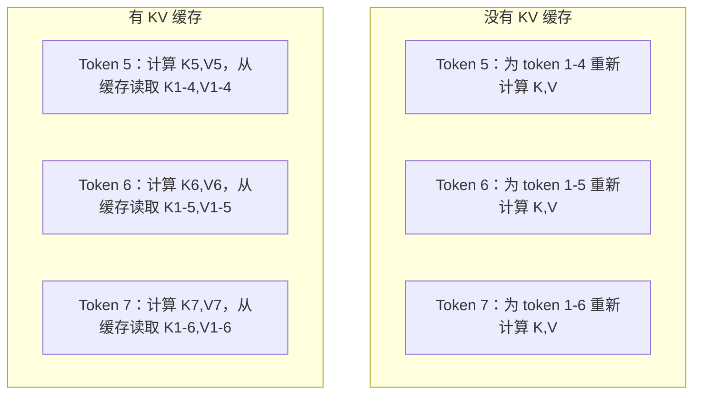
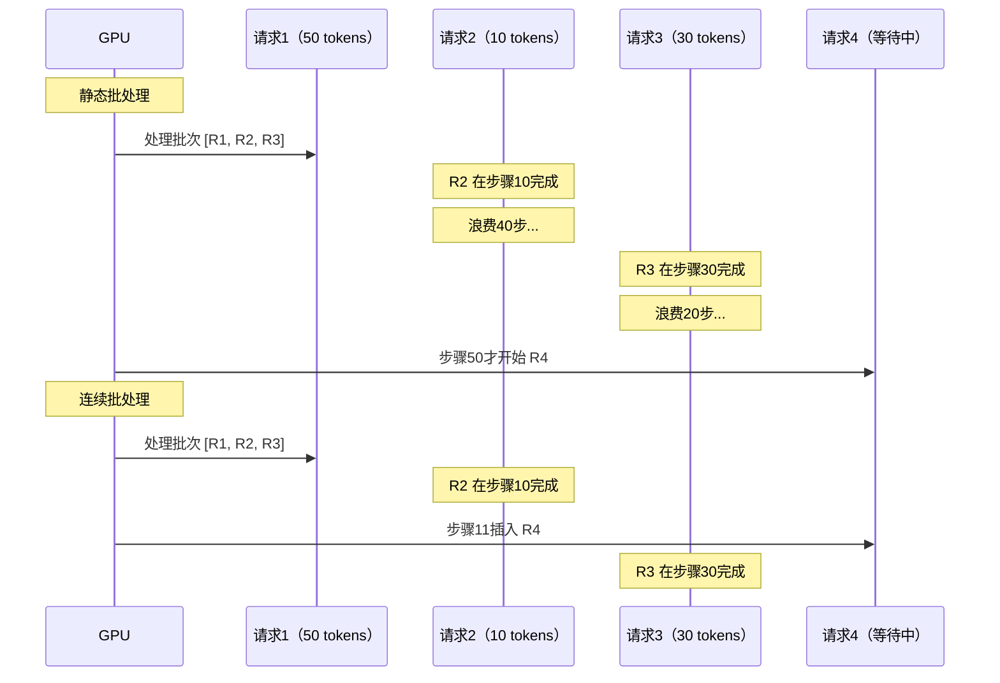
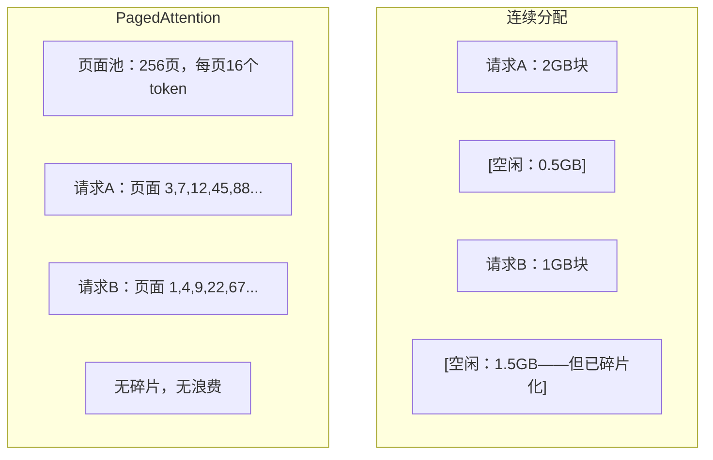
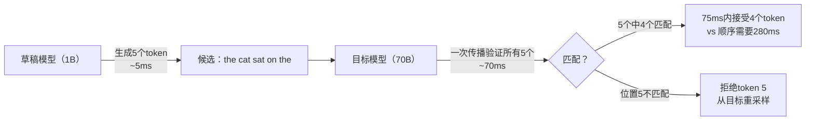

# 推理优化

> 两个阶段定义了 LLM 推理。预填充（Prefill）并行处理提示词——受计算限制。解码（Decode）逐个生成 token——受内存限制。每种优化都针对其中一个或两个阶段。

**类型：** 构建
**语言：** Python
**前置条件：** 第10阶段，第01-08课（Transformer 架构、注意力机制）
**时间：** 约120分钟

## 学习目标

- 实现 KV 缓存，消除自回归 token 生成过程中的冗余计算
- 解释 LLM 推理的预填充与解码阶段，以及为什么每个阶段有不同的瓶颈（计算限制 vs 内存限制）
- 实现连续批处理和 PagedAttention 概念，在并发请求下最大化 GPU 利用率
- 比较推理优化技术（KV 缓存、投机解码、Flash Attention）及其吞吐量/延迟权衡

## 问题背景

你在 4×A100 GPU 上部署 Llama 3 70B。单个用户获得约 50 tokens/秒，感觉很快。然后 100 个用户同时访问端点，吞吐量下降到每用户 3 tokens/秒。你每月 25,000 美元的 GPU 费用提供的响应速度比人类打字还慢。

模型本身在 1 个用户和 100 个用户之间没有变化，相同的权重、相同的架构、相同的数学。变化的是你如何调度工作。朴素推理浪费了 90% 以上的可用 GPU 计算资源。等待第 47 个 token 的用户占用整个批次槽，而 GPU 内存总线在矩阵乘法之间空闲。与此同时，新用户 2,000 个 token 的提示词本可以用有用的计算填补那段死时间。

这不是扩展问题，而是调度问题。本课中的技术——KV 缓存、连续批处理、PagedAttention、投机解码、前缀缓存——是将每月 25,000 美元的推理账单与服务相同流量的 5,000 美元账单区分开来的东西。

vLLM 在 4×A100-80GB 上服务 Llama 3 70B，低并发时实现约 50 TPS/用户，通过连续批处理和 PagedAttention 在 100 个并发请求时维持 15-25 TPS/用户。没有这些优化，相同硬件在该并发量下只能提供 5 TPS/用户。相同的 GPU，相同的模型，4 倍的吞吐量。

## 核心概念

### 预填充 vs 解码

每个 LLM 推理请求有两个不同的阶段。

**预填充（Prefill）** 处理整个输入提示词。所有 token 都是已知的，因此注意力可以在整个序列上并行计算。这是一个大型矩阵乘法——GPU 核心保持忙碌。瓶颈是计算：你的硬件每秒能提供多少 FLOPS。A100 的 BF16 算力为 312 TFLOPS。70B 模型在单块 A100 上预填充 4,096 个 token 大约需要 400ms。

**解码（Decode）** 逐个生成输出 token。每个新 token 关注所有之前的 token，但每次前向传播只产生一个 token。权重矩阵与预填充时一样大，但你在用单个向量而非矩阵乘以它们。GPU 核心在微秒内完成，然后等待下一批权重从内存到达。瓶颈是内存带宽：将模型权重从 HBM 流式传输到计算单元的速度。A100 有 2 TB/s 带宽，FP16 的 70B 模型是 140 GB，读取完整模型一次需要 70ms——这是单个解码步骤的下限。



**算子:字节比**（也称算术强度）捕捉了这种权衡，它衡量每字节内存读取执行多少操作：

```
算子:字节比 = 每个 token 的 FLOPs / 从内存读取的字节数
```

预填充时批次为 4,096 个 token，每加载一个权重执行约 4,096 次乘加运算，比值高——受计算限制。解码时批次大小为 1，每加载一个权重执行约 1 次操作，比值低——受内存限制。

根本洞见：*解码受内存限制是因为你要读取整个模型来产生单个 token*。以下每种优化都旨在减少读取量、增加每次读取处理的 token 批次，或完全避免读取。

### KV 缓存

在注意力机制中，每个 token 的查询（Q）关注每个之前 token 的键（K）和值（V）向量。没有缓存，生成 token N 需要重新计算所有前 N-1 个 token 的键值投影。token 1 在生成 token 2 时被投影，然后生成 token 3 时又来一次，token 4 时再来一次。到 token 1,000 时，token 1 已经被投影了 999 次。

KV 缓存存储所有之前 token 的键值投影。生成 token N 时，你只计算 token N 的键和值，然后与 token 1 到 N-1 的缓存 K/V 拼接。



**KV 缓存内存公式：**

```
KV 缓存大小 = 2 × 层数 × KV 头数 × 头维度 × 序列长度 × 每参数字节数
```

对于 Llama 3 70B（80层，GQA 的 8 个 KV 头，head_dim=128，BF16）：

```
每 token：2 × 80 × 8 × 128 × 2字节 = 327,680字节 = 320 KB
4,096 个 token：320 KB × 4,096 = 1.28 GB
128K 个 token：320 KB × 131,072 = 40 GB
```

Llama 3 70B 的单次 128K 上下文对话消耗 40 GB KV 缓存——半块 A100 的内存。100 个并发用户各使用 4K token，仅 KV 缓存就需要 128 GB。这就是为什么 KV 缓存管理是推理优化的核心挑战。

### 连续批处理

静态批处理等待 N 个请求到达，一起处理，然后等待所有请求完成后再接受新请求。如果一个请求需要 500 个 token，另一个需要 10 个，短请求完成后会在 490 个解码步骤内空转等待。

连续批处理（也称迭代级批处理）在任何请求完成后立即将新请求插入批次。批次在每个解码步骤重新评估，完成 10 个 token 的请求立即被等待中的请求替换。



吞吐量提升取决于输出长度的变化程度。输出长度均匀时，连续批处理与静态批处理相当。输出长度变化时（通常情况），连续批处理能提供 2-5 倍更高的吞吐量，因为 GPU 槽位不会空置。

### PagedAttention

每个请求的 KV 缓存是连续的内存块。随着请求到来和离开，内存会碎片化——就像操作系统中的 RAM 碎片化。4K token 的请求需要 1.28 GB 连续空间。即使你总共有 2 GB 可用，也可能没有 1.28 GB 的*连续*空间。你要么浪费内存，要么拒绝请求。

PagedAttention（来自 vLLM）将操作系统风格的虚拟内存应用于 KV 缓存。不为每个请求分配一个连续块，而是分配固定大小的"页"（通常每页 16 个 token）。页面可以位于 GPU 物理内存的任何位置，页表将每个请求的逻辑序列位置映射到物理页面位置。



PagedAttention 还为共享前缀启用**写时复制**。如果 50 个请求共享同一个系统提示词，该系统提示词的 KV 缓存页面只存储一次，被所有 50 个请求引用。只有当请求产生分歧（不同的用户消息）时，才获得自己的页面。这大幅削减了具有共享系统提示词的应用程序的内存使用。

vLLM 通过 PagedAttention 报告接近零的内存浪费（约 4% vs 朴素分配的 60-80%）。

### 投机解码

解码之所以慢，是因为它是顺序的——生成一个 token，送回，生成下一个。但如果你能廉价地猜测下 5 个 token，然后一次验证所有 5 个呢？

投机解码使用小型快速的**草稿模型**生成 K 个候选 token。大型**目标模型**随后在单次前向传播中处理所有 K 个候选（看起来像预填充——并行、受计算限制、高效）。如果目标模型与草稿模型的预测一致，则在一次目标前向传播的时间内接受所有 K 个 token。如果在位置 j 不一致，接受 1 到 j-1 的 token，丢弃其余。



加速取决于**接受率**——草稿模型的预测与目标匹配的频率。Llama 3 8B 为 Llama 3 70B 起草时，自然语言的接受率通常为 70-85%，对应 2-3 倍的解码加速。

三种投机解码方法：

| 方法 | 草稿来源 | 接受率 | 开销 |
|------|---------|--------|------|
| 草稿-目标（Leviathan等）| 独立的小型模型 | 70-85% | 草稿模型内存 |
| EAGLE（Li等）| 目标模型上的轻量头 | 75-90% | 约 1% 额外参数 |
| N-gram 查找 | Token n-gram 表 | 40-60% | 可忽略不计 |

**EAGLE** 在目标模型的隐藏状态之上训练一个小型自回归头，使用目标模型的倒数第二层特征预测下一个 token 的嵌入。因为它在目标模型自身的表示上操作（而非独立模型），以极少额外内存实现更高的接受率。EAGLE-2 添加了根据上下文动态调整候选数量的动态草稿树。

**N-gram 投机解码** 维护当前上下文或预构建语料库中 n-gram 延续的表。如果草稿与同一对话中之前出现的内容匹配（重复模式、代码、结构化输出），则以零神经网络开销运行。平均接受率较低，但每次投机的成本几乎为零。

投机解码在*数学上是精确的*——输出分布与目标模型的分布完全相同，不是近似。验证步骤确保每个被接受的 token 都有目标模型分配的确切概率。

### 前缀缓存

许多请求共享相同的前缀：聊天机器人的系统提示词、RAG 上下文块、少样本示例集。没有前缀缓存，每个请求都从头重新计算这些共享 token 的 KV 缓存。

前缀缓存存储常见前缀的 KV 缓存，并在请求间复用。当带有已知前缀的新请求到达时，系统复制（或引用）缓存的 KV 条目，只计算唯一后缀的 KV。

对于所有请求共享的 2,000 个 token 系统提示词，前缀缓存每个请求节省约 400ms 的预填充时间。在 100 请求/秒时，这每秒节省 40 秒的 GPU 计算——超过一块 GPU 的工作量。

SGLang 的 RadixAttention 使用以 token 内容索引前缀的基数树（Trie）实现前缀缓存。与存储前缀匹配的任何请求可以免费获得其 KV 缓存。树结构支持部分前缀匹配——如果你与缓存条目共享 2,000 个前缀 token 中的 1,500 个，则复用这 1,500 个，只重新计算 500 个。

### 推理引擎

三个引擎主导生产 LLM 服务：

| 引擎 | 关键创新 | 最适合 |
|------|---------|--------|
| vLLM | PagedAttention、连续批处理 | 通用服务，兼容性最高 |
| SGLang | RadixAttention（前缀缓存）、结构化生成 | 多轮聊天机器人、约束解码 |
| TensorRT-LLM | NVIDIA 内核融合、FP8 量化 | NVIDIA 硬件上最高单 GPU 吞吐量 |

**vLLM** 是默认起点。支持最广泛的模型，在任何 GPU 厂商（NVIDIA、AMD、Intel）上运行，通过 PagedAttention + 连续批处理实现强劲吞吐量。兼容 OpenAI API，可作为任何 OpenAI API 调用的直接替换。

**SGLang** 建立在与 vLLM 相同的基础上，但增加了用于前缀缓存的 RadixAttention 和用于结构化 LLM 程序的领域特定语言。如果你的工作负载涉及多轮对话、工具使用或约束解码（JSON 输出、正则表达式引导的生成），SGLang 通常通过前缀复用比 vLLM 性能高 2-5 倍。

**TensorRT-LLM** 将模型编译为优化的 NVIDIA GPU 内核，融合操作（注意力 + 线性 + 激活在一个内核中），在 H100 GPU 上使用 FP8，并与 NVIDIA Triton 推理服务器集成用于生产部署。在 NVIDIA 硬件上实现最高单 GPU 吞吐量，但需要更多设置，且只适用于 NVIDIA GPU。

Llama 3 70B（4×A100-80GB，BF16）的真实数据：

| 指标 | vLLM | SGLang | TensorRT-LLM |
|------|------|--------|---------------|
| 吞吐量（1用户）| 约 50 TPS | 约 55 TPS | 约 65 TPS |
| 吞吐量（100用户）| 约 2,500 总 TPS | 约 3,200 总 TPS | 约 3,000 总 TPS |
| 首个 token 时间 | 约 400ms | 约 300ms（前缀命中）| 约 350ms |
| 最大上下文 | 128K | 128K | 128K |

### 算子:字节框架

你无法优化你没有测量的东西。算子:字节比告诉你是受计算限制还是受内存限制，这决定了哪些优化重要。

A100 的交叉点约为算子:字节 = 156（312 TFLOPS / 2 TB/s）。低于 156 时受内存限制，高于 156 时受计算限制。连续批处理通过每次迭代打包更多 token 将解码推向这个交叉点。

| 场景 | 算子:字节 | 瓶颈 | 优化方向 |
|------|---------|------|---------|
| 预填充，批次=1 | ~4,096 | 计算 | 内核融合、FP8 |
| 解码，批次=1 | ~1 | 内存 | 量化、KV 压缩 |
| 解码，批次=32 | ~32 | 内存 | 更大批次、连续批处理 |
| 解码，批次=256 | ~256 | 过渡中 | 两者都重要 |
| 解码，批次=1024 | ~1,024 | 计算 | 内核融合、张量并行 |

## 动手实现

### 第一步：从零构建 KV 缓存

构建一个多头 KV 缓存，存储每层每头的键值投影，演示内存增长模式。

```python
import numpy as np

class KVCache:
    def __init__(self, num_layers, num_heads, head_dim, max_seq_len, dtype=np.float16):
        self.num_layers = num_layers
        self.num_heads = num_heads
        self.head_dim = head_dim
        self.max_seq_len = max_seq_len
        self.dtype = dtype

        self.k_cache = np.zeros(
            (num_layers, num_heads, max_seq_len, head_dim), dtype=dtype
        )
        self.v_cache = np.zeros(
            (num_layers, num_heads, max_seq_len, head_dim), dtype=dtype
        )
        self.seq_len = 0

    def update(self, layer_idx, new_keys, new_values):
        num_new = new_keys.shape[1]
        end = self.seq_len + num_new
        self.k_cache[layer_idx, :, self.seq_len:end, :] = new_keys
        self.v_cache[layer_idx, :, self.seq_len:end, :] = new_values
        return (
            self.k_cache[layer_idx, :, :end, :],
            self.v_cache[layer_idx, :, :end, :]
        )

    def advance(self, num_tokens):
        self.seq_len += num_tokens

    def memory_bytes(self):
        return self.k_cache.nbytes + self.v_cache.nbytes

    def used_bytes(self):
        per_token = 2 * self.num_layers * self.num_heads * self.head_dim * np.dtype(self.dtype).itemsize
        return per_token * self.seq_len
```

### 第二步：使用 KV 缓存的注意力

使用 KV 缓存进行解码步骤的简化多头注意力。

```python
def scaled_dot_product_attention(query, keys, values):
    head_dim = query.shape[-1]
    scores = np.matmul(query, keys.transpose(0, 1, 3, 2)) / np.sqrt(head_dim)
    seq_len_q = scores.shape[-2]
    seq_len_k = scores.shape[-1]
    if seq_len_q > 1:
        mask = np.triu(np.ones((seq_len_q, seq_len_k), dtype=np.float32), k=seq_len_k - seq_len_q + 1)
        scores = scores + mask * (-1e9)
    max_scores = np.max(scores, axis=-1, keepdims=True)
    exp_scores = np.exp(scores - max_scores)
    attn_weights = exp_scores / np.sum(exp_scores, axis=-1, keepdims=True)
    return np.matmul(attn_weights, values)


class MultiHeadAttention:
    def __init__(self, d_model, num_heads):
        self.num_heads = num_heads
        self.head_dim = d_model // num_heads
        scale = np.sqrt(2.0 / d_model)
        self.W_q = np.random.randn(d_model, d_model).astype(np.float32) * scale
        self.W_k = np.random.randn(d_model, d_model).astype(np.float32) * scale
        self.W_v = np.random.randn(d_model, d_model).astype(np.float32) * scale
        self.W_o = np.random.randn(d_model, d_model).astype(np.float32) * scale

    def forward(self, x, kv_cache=None, layer_idx=0):
        batch, seq_len, d_model = x.shape
        Q = np.matmul(x, self.W_q).reshape(batch, seq_len, self.num_heads, self.head_dim).transpose(0, 2, 1, 3)
        K = np.matmul(x, self.W_k).reshape(batch, seq_len, self.num_heads, self.head_dim).transpose(0, 2, 1, 3)
        V = np.matmul(x, self.W_v).reshape(batch, seq_len, self.num_heads, self.head_dim).transpose(0, 2, 1, 3)

        if kv_cache is not None:
            K_full, V_full = kv_cache.update(layer_idx, K[0], V[0])
            K = K_full[np.newaxis, :, :, :]
            V = V_full[np.newaxis, :, :, :]
            if seq_len == 1:
                kv_cache.advance(1)

        attn_out = scaled_dot_product_attention(Q, K, V)
        attn_out = attn_out.transpose(0, 2, 1, 3).reshape(batch, -1, d_model)
        return np.matmul(attn_out, self.W_o)
```

### 第三步：连续批处理模拟器

模拟静态批处理和连续批处理之间的调度差异。

```python
import heapq

class Request:
    def __init__(self, request_id, prompt_tokens, output_tokens, arrival_step):
        self.request_id = request_id
        self.prompt_tokens = prompt_tokens
        self.output_tokens = output_tokens
        self.arrival_step = arrival_step
        self.tokens_generated = 0
        self.start_step = None
        self.end_step = None

    def is_done(self):
        return self.tokens_generated >= self.output_tokens


def simulate_static_batching(requests, batch_size):
    step = 0
    completed = []
    queue = list(requests)
    queue.sort(key=lambda r: r.arrival_step)

    while queue:
        batch = []
        while queue and len(batch) < batch_size:
            r = queue.pop(0)
            r.start_step = max(step, r.arrival_step)
            batch.append(r)

        if batch:
            step = max(step, max(r.start_step for r in batch))
            max_output = max(r.output_tokens for r in batch)
            for r in batch:
                r.tokens_generated = r.output_tokens
                r.end_step = step + max_output
            step += max_output
            completed.extend(batch)

    return completed


def simulate_continuous_batching(requests, batch_size):
    step = 0
    completed = []
    queue = sorted(requests, key=lambda r: r.arrival_step)
    queue_idx = 0
    active = []
    waiting = []

    while queue_idx < len(queue) or active or waiting:
        while queue_idx < len(queue) and queue[queue_idx].arrival_step <= step:
            waiting.append(queue[queue_idx])
            queue_idx += 1

        while waiting and len(active) < batch_size:
            r = waiting.pop(0)
            r.start_step = step
            active.append(r)

        if not active:
            if waiting:
                step += 1
                continue
            elif queue_idx < len(queue):
                step = queue[queue_idx].arrival_step
                continue
            else:
                break

        for r in active:
            r.tokens_generated += 1

        done = [r for r in active if r.is_done()]
        for r in done:
            r.end_step = step + 1
            completed.append(r)
        active = [r for r in active if not r.is_done()]

        step += 1

    return completed
```

### 第四步：前缀缓存

基于 Trie 的前缀缓存，为共享前缀存储 KV 条目。

```python
class TrieNode:
    def __init__(self):
        self.children = {}
        self.kv_data = None
        self.hit_count = 0


class PrefixCache:
    def __init__(self, max_entries=1000):
        self.root = TrieNode()
        self.max_entries = max_entries
        self.total_entries = 0
        self.hits = 0
        self.misses = 0

    def lookup(self, token_ids):
        node = self.root
        depth = 0
        for tid in token_ids:
            if tid not in node.children:
                break
            node = node.children[tid]
            depth += 1
        if depth > 0:
            self.hits += 1
            return depth, []
        self.misses += 1
        return 0, []

    def insert(self, token_ids, kv_per_token):
        node = self.root
        for i, tid in enumerate(token_ids):
            if tid not in node.children:
                if self.total_entries >= self.max_entries:
                    return i
                node.children[tid] = TrieNode()
                self.total_entries += 1
            node = node.children[tid]
            if i < len(kv_per_token):
                node.kv_data = kv_per_token[i]
        return len(token_ids)

    def hit_rate(self):
        total = self.hits + self.misses
        return self.hits / total if total > 0 else 0.0
```

### 第五步：投机解码模拟器

使用可配置接受率模拟草稿-目标投机解码。

```python
class DraftModel:
    def __init__(self, vocab_size, acceptance_rate=0.8):
        self.vocab_size = vocab_size
        self.acceptance_rate = acceptance_rate

    def generate(self, context, num_tokens):
        return np.random.randint(0, self.vocab_size, size=num_tokens)

    def get_probs(self, context, token):
        return np.random.dirichlet(np.ones(self.vocab_size))


class TargetModel:
    def __init__(self, vocab_size):
        self.vocab_size = vocab_size

    def get_probs(self, context, tokens=None):
        if tokens is not None:
            return [np.random.dirichlet(np.ones(self.vocab_size)) for _ in tokens]
        return np.random.dirichlet(np.ones(self.vocab_size))


def speculative_decode(draft_model, target_model, context, num_speculative=5,
                       draft_cost=1.0, target_cost=10.0, verify_cost=12.0):
    total_tokens = 0
    total_cost = 0.0
    accepted_counts = []
    context = list(context)
    max_tokens = 100

    while total_tokens < max_tokens:
        draft_tokens = draft_model.generate(context, num_speculative)
        total_cost += draft_cost * num_speculative

        target_probs = target_model.get_probs(context, draft_tokens)
        total_cost += verify_cost

        accepted = 0
        for i, token in enumerate(draft_tokens):
            if np.random.random() < draft_model.acceptance_rate:
                accepted += 1
                context.append(token)
                total_tokens += 1
            else:
                new_token = np.random.choice(draft_model.vocab_size, p=target_probs[i])
                context.append(new_token)
                total_tokens += 1
                break

        accepted_counts.append(accepted)

        if accepted == num_speculative:
            bonus_probs = target_model.get_probs(context)
            bonus_token = np.random.choice(draft_model.vocab_size, p=bonus_probs)
            context.append(bonus_token)
            total_tokens += 1

    sequential_cost = total_tokens * target_cost
    return {
        "total_tokens": total_tokens,
        "speculative_cost": total_cost,
        "sequential_cost": sequential_cost,
        "speedup": sequential_cost / total_cost if total_cost > 0 else 1.0,
        "avg_accepted": np.mean(accepted_counts),
        "acceptance_rate": np.mean(accepted_counts) / num_speculative,
    }
```

## 工具集成

使用 vLLM：

```python
from vllm import LLM, SamplingParams

llm = LLM(
    model="meta-llama/Llama-3-70B-Instruct",
    tensor_parallel_size=4,
    enable_prefix_caching=True,
    max_model_len=8192,
    gpu_memory_utilization=0.9,
)

params = SamplingParams(temperature=0.7, max_tokens=256)
outputs = llm.generate(["用一段话解释推理优化。"], params)
```

使用 SGLang 进行前缀缓存 + 结构化输出：

```python
import sglang as sgl

@sgl.function
def classify(s, text):
    s += sgl.system("You are a classifier. Output JSON only.")
    s += sgl.user(f"Classify this text: {text}")
    s += sgl.assistant(sgl.gen("result", regex=r'\{"label": "(positive|negative|neutral)"\}'))

runtime = sgl.Runtime(model_path="meta-llama/Llama-3-70B-Instruct", tp_size=4)
sgl.set_default_backend(runtime)
```

使用 TensorRT-LLM：

```python
import tensorrt_llm
from tensorrt_llm.runtime import ModelRunner

runner = ModelRunner.from_dir("./llama-70b-trt-engine/", rank=0)

outputs = runner.generate(
    batch_input_ids=[tokenizer.encode("解释 KV 缓存。")],
    max_new_tokens=256,
    temperature=0.7,
)
```

## 拓展练习

1. 修改 KV 缓存分析器，比较 FP16 vs FP8 vs INT4 KV 缓存量化。对于 4K 上下文的 Llama 3 70B，计算每种方案在 4×A100-80GB 上的最大并发用户数。KV 量化到 INT4 应大约将用户容量提高 4 倍。

2. 扩展连续批处理模拟器以跟踪 GPU 利用率（每步填满批次槽的比例）。对两种批处理方式用 50 个输出长度遵循帕累托分布（shape=1.5, scale=20）的请求绘制利用率随时间的变化。连续批处理应保持 >80% 的利用率。

3. 实现分组查询注意力（GQA）版本的 KV 缓存，其中 `num_kv_heads < num_query_heads`。Llama 3 70B 使用 64 个查询头但只有 8 个 KV 头。计算与完整多头注意力相比的内存节省（KV 缓存大小减少 8 倍）。

4. 构建带 LRU 淘汰的前缀缓存。设置 max_entries 为 500，生成 1,000 个请求，其中 60% 共享 5 个常见前缀之一。测量命中率并与无限缓存比较。好的淘汰策略下命中率应保持在 55% 以上。

5. 扩展投机解码模拟器以实现基于树的投机（EAGLE-2 风格）。不是 K 个草稿 token 的单链，而是生成候选树（如 3 层每层 2 个分支 = 8 个叶子候选）。比较每次验证轮次接受的总 token 数与线性投机的差异。

## 关键术语

| 术语 | 人们的说法 | 实际含义 |
|------|-----------|---------|
| 预填充 | "处理提示词" | 并行计算所有输入 token 的注意力——受计算限制，因为完整矩阵乘法使 GPU 核心保持忙碌 |
| 解码 | "生成 token" | 每次前向传播生成一个 token，每次读取完整模型权重——受内存限制，因为计算在下一批权重到达前就完成了 |
| KV 缓存 | "缓存注意力状态" | 存储所有之前 token 的键值投影，不在每个解码步骤重新计算——用内存换计算 |
| 连续批处理 | "动态批处理" | 任何请求完成后立即将新请求插入运行中的批次，而非等待整个批次，在每次解码迭代评估 |
| PagedAttention | "KV 缓存的虚拟内存" | 以固定大小的页面分配 KV 缓存而非连续块，消除内存碎片并为共享前缀启用写时复制 |
| 投机解码 | "草稿与验证" | 使用快速草稿模型提出多个 token，然后在一次目标模型前向传播中验证所有——数学上精确，2-3 倍加速 |
| EAGLE | "自投机解码" | 在目标模型自身隐藏状态上训练轻量头的投机解码变体，比独立草稿模型实现更高接受率 |
| 前缀缓存 | "复用系统提示词 KV" | 存储常见前缀（系统提示词、少样本示例）的计算 KV 缓存条目，跨请求复用以跳过冗余预填充 |
| 算子:字节比 | "算术强度" | 计算操作与内存字节读取之比——决定工作负载是受计算限制（高比值）还是受内存限制（低比值）|
| 首个 token 时间 | "TTFT" | 从接收请求到产生第一个输出 token 的延迟——对长提示词由预填充时间主导 |

## 延伸阅读

- Kwon et al., "Efficient Memory Management for Large Language Model Serving with PagedAttention" (2023) — 引入分页 KV 缓存管理的 vLLM 论文，现为行业推理服务标准
- Leviathan et al., "Fast Inference from Transformers via Speculative Decoding" (2023) — 证明草稿-验证投机产生与目标模型完全相同分布同时实现 2-3 倍加速的基础性论文
- Li et al., "EAGLE: Speculative Sampling Requires Rethinking Feature Uncertainty" (2024) — 通过在目标模型自身特征上训练头而非使用独立草稿模型实现更高接受率
- Zheng et al., "SGLang: Efficient Execution of Structured Language Model Programs" (2024) — 引入用于前缀缓存的 RadixAttention 和多调用 LLM 程序的编程模型
- Williams et al., "Roofline: An Insightful Visual Performance Model for Multicore Architectures" (2009) — 形式化用于推理计算 vs 内存瓶颈的算子:字节框架的原始 Roofline 论文
