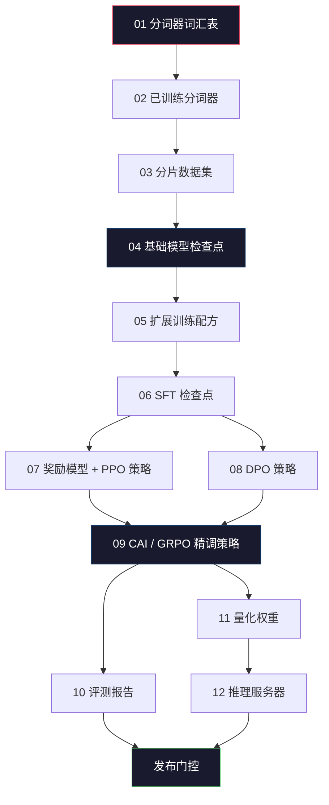
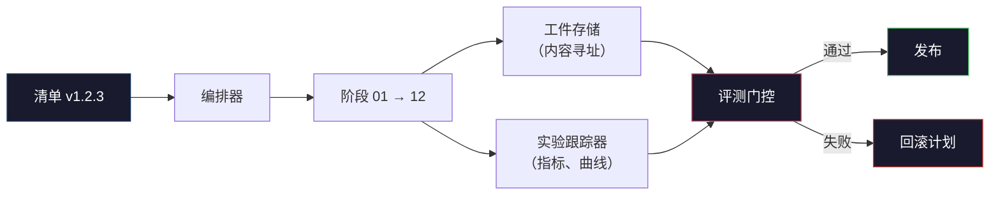

# 构建完整的 LLM 流水线

> 第01到12课的所有内容都是一个流水线的一个阶段。本课是将这些阶段整合为单次端到端运行的脚手架：分词、预训练、扩展、SFT、对齐、评估、量化、服务。你不会在笔记本电脑上训练 70B 模型，但你将生成编排层、清单、评测门控和回滚计划——这些是 2026 年前沿团队用于决定发布什么的工具。这是收官之课。

**类型：** 构建
**语言：** Python（标准库）
**前置条件：** 第10阶段所有第01-12课
**时间：** 约120分钟

## 学习目标

- 将前十一课（分词器、数据、预训练、扩展、SFT、RLHF、DPO、CAI、评估、量化、推理）组合成单一可复现的流水线规格
- 定义各阶段之间的工件契约：每个阶段消费什么、产生什么，以及下一阶段如何验证输入
- 构建编排器，用于跟踪实验、哈希工件，并根据评测阈值控制发布决策
- 设计回滚计划：哪些工件重新运行成本低，哪些昂贵，以及损坏的检查点代价几何

## 问题背景

之前的课程每个都能独立运行：分词器已训练，微型 GPT 已预训练，SFT 数据集已组装，奖励模型已训练，DPO 已运行，评测已测量，量化权重已导出，推理服务已启动。每个都是一个笔记本，都有自己的约定、自己的输出路径、自己的随机种子。

前沿训练运行不是笔记本。Llama 3 405B 在大约54天内使用了3000万 H100 GPU 小时。DeepSeek-V3 使用了约280万 H800 GPU 小时。在这段时间里，一个损坏的检查点、一次数据污染、一次评测退步可能让团队损失一周的时钟时间和一个月的 GPU 预算。团队能够承受这些的方式是通过流水线卫生：每个阶段有确定性的输入、确定性的输出、清单、哈希值和门控。

这是收官之课。你不会在笔记本电脑上端到端运行流水线，但你将编写协调各阶段的编排器、描述运行的清单、控制发布决策的验证器，以及让第三方能从单个文件重新运行你工作的重放计划。代码很小，纪律很大。

这个模式从 1 亿到 1 万亿参数不变地扩展。相同的四个组件——清单、编排器、评测门控、工件存储——既运行 Llama 3，也运行你的爱好 GPT。区别在于每个阶段配置中数字的大小，而不是流水线的形状。

## 核心概念

### 十二个阶段

第10阶段的每节课都是一个阶段。以下是完整的依赖图：



阶段07和08可以并行运行，其他都是硬依赖。阶段02（分词器）的变更会使每个下游工件失效；阶段10（评测）的变更只影响发布决策。

### 清单（Manifest）

清单是一个文件，对一次运行的描述足够完整，可以重放。流水线产生的任何内容都不应依赖清单中没有的状态。这些字段枯燥而强制。

```
pipeline_version: 1.2.3
seed: 42
git_commit: a1b2c3d4
stages:
  01_tokenizer:
    recipe: bpe_32k
    input_hash: sha256:...
    output_hash: sha256:...
    wall_clock_sec: 3600
    cost_usd: 12
```

阶段 N 的输出哈希是阶段 N+1 的输入哈希。任何偏差，流水线就停止。这是你早期发现数据损坏的方式，也是不同大洲的队友验证其重放产生了与你相同工件的方式。

实践中，团队使用小型 YAML 模式加上清单检查器，对比上一次成功运行进行差异比较。预期字段（成本、时钟时间）之外的任何差异都是危险信号。

### 工件类型

每个阶段的输出是有类型的工件，不是目录 blob，不是 pickle，而是具有已知模式的命名类型。

| 阶段 | 工件类型 | 关键字段 |
|------|---------|---------|
| 01-02 | 分词器 | vocab.json, merges.txt, config.json, 哈希 |
| 03 | 数据集 | 分片[], 行数, token 数, 去重统计 |
| 04-05 | 检查点 | weights.safetensors, config.json, 优化器状态, 步数 |
| 06 | SFT 模型 | 检查点 + SFT 配方 + 数据混合 |
| 07 | 奖励模型 | RM 检查点 + 偏好数据哈希 |
| 08-09 | 策略 | 检查点 + 参考哈希 + beta + 已消耗 KL 预算 |
| 10 | 评测报告 | 基准分数 + 回归差异 + 评测数据哈希 |
| 11 | 量化模型 | 量化权重 + 校准数据 + 与 FP16 的精度差 |
| 12 | 服务器规格 | 端点 + 模型哈希 + 配置 + 可观测性钩子 |

类型化防止最常见的失败模式：将阶段08输出用作阶段06的输入，通过 SFT 路径发布 DPO 训练的模型。类型化工件和类型化阶段签名让这些错误成为编译时错误，而非第五天才发现的错误。

### 评测门控

发布不是"训练完成"，发布是"训练完成且评测门控通过"。门控在运行开始前定义。

```
gates:
  mmlu:      >= baseline + 0.5   # 无退步
  humaneval: >= baseline + 1.0
  truthfulqa: >= baseline        # 无下降
  safety_refusal_rate: <= 0.05
  kl_from_reference: <= 25.0
  cost_total_usd: <= 50000
```

每个门控都是数值阈值。没有"看起来不错"的门控，没有主观签字。如果每个门控都通过，工件被标记为可发布。如果任何门控失败，运行被暂停，等待命名审阅者的明确覆盖，覆盖本身也会记录在清单中。

两个门控能捕捉大多数灾难。*回归*门控（新模型在核心基准上必须至少与之前一样好）捕捉训练 bug；*KL 预算*门控（对齐策略与参考的漂移不能超过 X）捕捉对齐过度。每个生产流水线都有这两个。

### 编排器

一小段代码，读取清单、分派阶段、跟踪工件，并在任何契约违反时停止。这不是 Airflow，不是 Kubeflow。为了流水线卫生，你需要一些你自己写的无聊代码。

编排器的职责很窄：

1. 从清单解析 DAG。
2. 对每个阶段，检查预期输出是否已以正确哈希存在（如果是则跳过）。
3. 运行阶段，捕获 stdout/stderr，测量时钟时间和成本。
4. 验证输出哈希与下游阶段的预期输入哈希匹配。
5. 失败时，写入带有精确失败阶段的部分清单并以非零退出。

这大约是200行 Python。实际上，真实流水线使用 `torchrun` 或 `ray` 在集群上执行各个阶段，但编排器本身在单个机器上运行。

### 实验跟踪与工件存储

两个外部系统锚定流水线。

**实验跟踪器（wandb、neptune、mlflow）。** 记录每个阶段的损失曲线、评测指标、系统遥测。跟踪器是你三周后需要比较运行 A 与运行 B 时去的地方。团队几乎总是使用托管跟踪器——自己写会浪费应该用于训练的时间。

**工件存储（S3、R2、GCS）。** 用于检查点、数据集、分词器、评测报告的不可变对象存储。工件按哈希寻址，而非文件名。像 `latest.pt` 这样的文件名是隐患；`ckpt-7b-step-20000-sha256:abc123.safetensors` 是契约。

编排器同时向两者写入：跟踪器供人类看图表，工件存储供下一阶段查找输入。

### 成本管理

前沿运行有附加的美元数字，预算纪律在两处发生。

**运行前估算。** 从清单计算预期 FLOPs（预训练：6 × 参数 × tokens）、预期 GPU 小时数（FLOPs / 峰值吞吐量 / 利用率）以及当前租赁价格下的美元成本。如果估算超过预算门控，流水线拒绝启动。

**运行中跟踪。** 逐阶段的时钟时间和成本记录在清单中。每个阶段之后，检查剩余预算。如果一个阶段超支，下一阶段的门控以新的剩余预算重新评估。你不会在 VC 打电话时才发现钱花完了。

Llama 3 报告的成本为 6100 万美元，DeepSeek-V3 报告主要预训练运行花费 560 万美元。差异主要在于硬件效率加上混合专家模型——但具体成本是可见的，因为两个团队都是逐阶段而非逐运行跟踪的。

### 可复现性 vs 确定性

这两者不同。*可复现*意味着相同的清单加上相同的代码加上相同的基础设施产生下游指标等价的检查点。*确定性*意味着逐位相同的输出。

现代 LLM 训练是可复现的，但不是确定性的。分布式训练的归约顺序、GPU 内核的不确定性（cuBLAS、flash-attn）和混合精度舍入结合起来，产生在两次运行间在 1e-5 级别不同的浮点数。对最终指标来说这没问题，指标不会移动。如果你试图用位级差异调试，这就是致命的。解决方法是记录每个阶段的输入哈希、输出哈希和主要指标——如果这些匹配，即使权重不是逐位相同，运行也是"已复现"的。



### 回滚计划

在运行开始前，写下每个阶段失败时的处理方案。三个类别：

- **重新运行成本低**（小时级）：分词器、评测、量化、推理服务器。直接重新运行。
- **中等成本**（天级）：SFT、DPO、CAI。保留基础模型，只重新运行对齐阶段。
- **高成本**（数周和数百万美元）：预训练。这里的回滚计划不是"重新运行"，而是"使用最后一个好的检查点，用修订后的数据重新运行更便宜的下游阶段"。

因为阶段依赖是类型化和哈希化的，编排器可以自动计算回滚集：使失败的阶段及其每个后代失效。阶段06（SFT）失败使 06、07、08、09、10、11、12 失效；阶段11（量化）失败只使 11 和 12 失效。提前确定这些，避免团队在凌晨4点精疲力竭时即兴发挥。

### 2026 年观察到的生产配方

大多数前沿团队收敛到相同的骨架：

- **分词器**：带字节回退的 128k BPE，在小型、平衡的多语言切片上训练。
- **预训练**：10-20T tokens，主要是网页加代码加合成数据。Muon 或 AdamW 优化器，FSDP2 或 DeepSpeed ZeRO-3，梯度检查点，BF16 权重，FP32 主权重。
- **SFT**：50万-200万指令对，人类和合成混合，严格去重对抗评测集。
- **对齐**：DPO 或 CAI + GRPO。只有当偏好信号维度太多 DPO 无法处理时才用 RLHF。
- **评测**：MMLU-Pro、MATH、HumanEval+、GPQA、SWE-Bench Verified、LiveBench，加上公众永远看不到的私有留存集。
- **量化**：服务用 4 位 GPTQ 或 AWQ，精度差异重要的安全评测用 8 位。
- **服务**：vLLM、TensorRT-LLM 或内部。连续批处理、投机解码、KV 缓存驱逐。

数字每六个月变一次，骨架不变。

## 动手实现

本课代码是一个编排器和清单检查器，不是十二个训练脚本。每个阶段用产生正确形状和哈希的工件占位符模拟。端到端运行编排器证明流水线的管道在你花真实 GPU 预算在各阶段之前正常工作。

参见 `code/main.py` 获取完整实现。关键组件：

- `Manifest` 数据类：流水线版本、种子、git 提交、阶段、门控。
- `Stage` 数据类：名称、类型、输入（哈希）、输出（哈希）、时钟时间、成本。
- `Orchestrator.run()`：解析 DAG，分派阶段，验证哈希，更新清单。
- `EvalGate.check()`：读取阈值，与最新评测报告比较，返回通过/失败。
- `ArtifactStore`（内存存根）：按哈希存取，模拟 S3。
- `CostTracker`：逐阶段和累计，超过上限时停止。

`main.py` 中的流水线运行十二个占位符阶段，生成清单，并演练失败的评测门控以展示被暂停运行的样子。将每个占位符替换为对应课程的真实训练脚本，你就有了真实前沿流水线使用的骨架。

## 运行方式

标准工作流程有三个命令：

```
python code/main.py plan    # 验证清单，计算成本估算，打印 DAG
python code/main.py run     # 执行阶段，写入 manifest.out.yaml
python code/main.py gate    # 读取 manifest.out.yaml，应用评测门控，发布或暂停
```

每次都先运行 `plan`。大多数流水线 bug 在计划时出现——缺少门控阈值、过期哈希、超出预算。运行 `plan` 是免费的，运行 `run` 是昂贵的。在便宜的一侧发现 bug 来省钱。

`gate` 的输出要么是 `SHIP`，要么是 `HOLD: <原因>`。被暂停的运行不是失败；它是一个决策点。命名审阅者要么覆盖（覆盖被记录），要么批准回滚。

## 拓展练习

1. 扩展编排器以支持阶段07和08的并行执行。使用标准库 `concurrent.futures` 模块，确认最终清单记录两个阶段的输出，且阶段09的输入哈希是两者的确定性组合。

2. 添加"污染检查"门控。给定评测数据集哈希和训练数据集分片，计算重叠（精确字符串匹配或13-gram匹配）。如果重叠超过0.1%，门控失败。提供一个被污染的训练集并确认门控暂停运行。

3. 从第一原则实现成本估算器。对阶段04（预训练），将 FLOPs 估算为6 × 参数 × tokens，假设 H100 上 40% MFU，BF16 峰值989 TFLOPs，每 GPU 小时 $2.50。报告在2T tokens上训练7B模型的估算值，与已发布的 Llama 2 数字比较。

4. 构建部分回滚。模拟阶段09（CAI）失败，然后重新运行阶段09到12，同时保持01-08缓存。编排器应通过哈希检测缓存的工件并跳过它们，测量与完全重新运行相比节省的时钟时间。

5. 添加可观测性。为每个阶段发出 OpenTelemetry span，包含参数数量、已见 token、损失和成本的属性。将 span 输入本地收集器。重点不是仪表板，而是每个阶段的健康状态可以从单个跟踪 ID 追踪。

## 关键术语

| 术语 | 人们的说法 | 实际含义 |
|------|-----------|---------|
| 清单 | "配方文件" | 描述流水线版本、种子、逐阶段配置和门控阈值的 YAML 或 JSON——足以重放一次运行 |
| 内容寻址 | "按哈希而非文件名" | 工件以其内容的 SHA-256 存储，因此你永远不会混淆版本 A 和版本 B |
| 评测门控 | "发布标准" | 工件被标记为可发布前必须通过的基准指标和安全分数的数值阈值 |
| KL 预算 | "对齐漂移了多少" | 跨对齐阶段的累计 KL(策略 \|\| 参考)上限，作为门控强制执行 |
| MFU | "你使用了多少 GPU" | 模型 FLOPs 利用率（Model FLOPs Utilization）——实现 FLOPs 除以理论峰值。70B 规模约40%，7B 规模约55% |
| 回滚计划 | "出故障时我们做什么" | 每个阶段失败时预先编写的行动集：重新运行、回退、用修订输入重训 |
| 编排器 | "指挥家" | 读取清单、分派阶段、验证哈希、在任何契约违反时停止的进程 |
| 工件存储 | "权重的版本化 S3" | 不可变的内容寻址对象存储——检查点、数据集、评测报告的单一真实来源 |
| 可复现 | "重放时相同指标" | 不同的位级权重但等价的下游指标——分布式 LLM 训练的现实目标 |
| 成本门控 | "不能超过 X" | 运行前成本估算加运行中跟踪器——如果估算超过预算，流水线拒绝启动 |

## 延伸阅读

- [Dubey et al., 2024 — "The Llama 3 Herd of Models"](https://arxiv.org/abs/2407.21783) — 最详细的公开前沿流水线描述，包括数据、训练、对齐、评测
- [DeepSeek-AI, 2024 — "DeepSeek-V3 Technical Report"](https://arxiv.org/abs/2412.19437) — 约为 Llama 3 类训练成本十分之一的效率优先流水线
- [Kaplan et al., 2020 — "Scaling Laws for Neural Language Models"](https://arxiv.org/abs/2001.08361) — 原始计算-数据-参数扩展关系
- [Hoffmann et al., 2022 — "Training Compute-Optimal Large Language Models (Chinchilla)"](https://arxiv.org/abs/2203.15556) — 重新校准现代数据预算的 Kaplan 修正
- [PyTorch FSDP2 文档](https://pytorch.org/docs/stable/fsdp.html) — PyTorch 2.4+ 中替换 FSDP1 的分布式训练原语
- [Weights & Biases LLM 报告](https://wandb.ai/site/llms) — 开源 LLM 运行的真实清单和实验跟踪器输出，可作为参考模板
