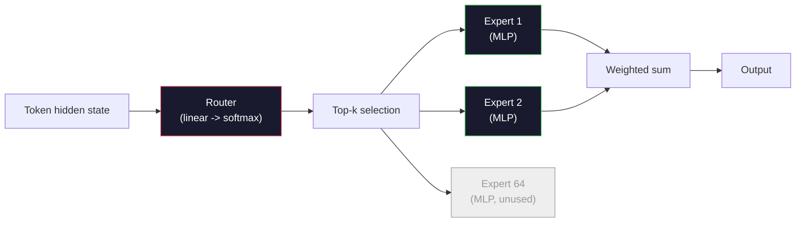

# 开放模型：架构详解

> 你在第04课从头构建了一个 GPT-2 Small。2026 年前沿开放模型属于同一家族，只是做了五六处具体改动：RMSNorm 代替 LayerNorm，SwiGLU 代替 GELU，RoPE 代替学习式位置编码，GQA 或 MLA 代替完整 MHA，以及规模化的混合专家（Mixture-of-Experts）。你已掌握的数学知识覆盖了它们 95% 的内容。本课将 Llama 3、DeepSeek-V3、Mixtral、Qwen 和 Gemma 并排对比，并指出每种架构在哪一行代码上发生了分歧。

**类型：** 学习
**语言：** Python（标准库）
**前置条件：** Phase 10，第04、05、12课（预训练、扩展、推理）
**时间：** 约 45 分钟

## 学习目标

- 读懂 Llama 3、Mistral、Mixtral、Gemma 2、Qwen 2.5 和 DeepSeek-V3 的 config.json，并解释每个字段
- 指出每个模型相比 GPT-2 Small 做出的具体架构改动，并从第一性原理加以说明
- 仅凭配置文件计算任意开放模型的参数量、KV 缓存大小和激活内存
- 在给定延迟、内存和能力约束的部署目标下，选择合适的开放模型

## 问题所在

在第04课中，你用 350 行 numpy 代码构建了一个 GPT-2 形态的模型。Llama 3 405B 有一份 200 页的技术报告。你的直觉可能认为这是两个完全不同的东西——其实不然。这 200 页描述的是同一个对象，只是加了五六处有充分动机的改动，外加一千个关于规模化的实现细节。骨架——嵌入、Transformer 块、注意力、MLP、归一化、输出头——完全没变。

本课是一份差异对比（diff）。对于每个主要的开放模型家族，我们逐一列出相比 GPT-2 改变了什么、为什么改变，以及代价是什么。学完之后，你可以读一张新的模型卡，并在脑海中将它映射回 GPT-2 基线。

这样做的实际价值在于：当 Meta 发布 Llama 5 或 DeepSeek 发布 V4 时，你不需要建立新的心智模型。你只需看一眼配置文件，看看哪些已知的旋钮被调动了，就知道下游影响是什么。2026 年的架构是一个有限的工具箱，每个新模型只是从中选取不同的子集。

## 概念讲解

### 不变的核心

所有自回归开放模型共享以下结构：

- 词元嵌入矩阵（vocab_size × hidden_dim）
- N 个解码器块的堆叠：归一化、自注意力、残差、归一化、MLP、残差
- 最终归一化层和投影到 vocab_size 的线性输出头（通常与嵌入权重共享）
- 因果掩码（causal mask），下一词元交叉熵损失

这就是骨架，其余的都是旋钮。

### 真正会变动的六个旋钮

纵观 2024-2026 年每一个前沿开放模型，反复出现的是同样的六个设计选择：

1. **归一化（Normalization）：** LayerNorm → RMSNorm
2. **位置编码（Positional encoding）：** 学习式绝对位置 → RoPE（及变体：YaRN、NTK）
3. **激活函数（Activation）：** GELU → SwiGLU（或 GeGLU）
4. **注意力头共享（Attention head sharing）：** MHA → GQA → MQA → MLA
5. **密集 vs 稀疏 MLP：** 密集 → 混合专家（Mixture-of-Experts）
6. **Pre-norm 放置：** Pre-norm 保留，Post-norm 已消失

其他所有内容（学习率调度、数据配比、批大小、上下文长度）都在训练配置中，而非架构里。就这六个旋钮。

### 旋钮一：RMSNorm

LayerNorm 会减去均值、除以标准差、进行缩放和平移。RMSNorm 只保留缩放部分：

```
RMSNorm(x) = x / sqrt(mean(x^2) + eps) * gamma
```

不减均值，没有偏置，每个词元少一次矩阵乘法。Zhang 和 Sennrich（2019）论证了它在机器翻译上与 LayerNorm 持平，同时快约 10%。现代所有开放模型都在使用它。

代价：无。收益：小幅吞吐量提升，代码更简洁。

### 旋钮二：RoPE

GPT-2 中的学习式位置嵌入是一个 1024 槽的查找表，上下文 1025 已超出表的边界，模型无法外推到训练长度之外。

旋转位置编码（RoPE，Su 等人，2021）通过在注意力点积之前将每个 Q 和 K 向量成对旋转来注入位置信息。旋转角度是位置的确定性函数，因此没有任何学习参数，也不存在"用完"的问题。借助缩放技巧（NTK 感知插值、YaRN），一个在 8k 上下文上训练的模型可以在推理时以较小的精度损失延伸到 128k。

```
q_rotated = rotate(q, angle(pos))
k_rotated = rotate(k, angle(pos))
score = q_rotated . k_rotated
```

每一个 Llama、Mistral、Qwen、DeepSeek 和 Gemma 都使用 RoPE。Gemma 2 使用混合方式（大部分层用 RoPE，其他层用局部滑动窗口注意力）。

### 旋钮三：SwiGLU

GPT-2 的 MLP 是 `x -> gelu(xW1 + b1) -> (...)W2 + b2`。SwiGLU（Shazeer，2020）将激活函数替换为门控乘积：

```
SwiGLU(x) = (xW1) * sigmoid(xW1) * xV
```

并行两路投影，由 Swish 激活函数进行门控。在每参数困惑度上经验性地更优。Llama 2 采用后，业界纷纷跟随。MLP 的隐藏大小通常被设置为使总参数量与原始密集 MLP 匹配：若 GPT-2 使用 `ff_dim = 4 * hidden`，SwiGLU 使用 `ff_dim = (2/3) * 4 * hidden = 8/3 * hidden`。

### 旋钮四：注意力头共享

GPT-2 使用**多头注意力（MHA）**：每个头有自己的 Q、K、V 投影。

**多查询注意力（MQA，Shazeer，2019）** 在所有头之间共享一个 K 和一个 V。KV 缓存减少 num_heads 倍，对于典型模型是 12x 到 32x 的缩减。在困难基准上精度略有下降。

**分组查询注意力（GQA，Ainslie 等人，2023）** 是折中方案：G 组 Q 头共享一个 K 和一个 V。Llama 3 8B 使用 GQA，32 个 Q 头和 8 个 KV 头（G=8），相比完整 MHA，KV 缓存缩小 4 倍。

**多头潜在注意力（MLA，DeepSeek，2024）** 将 K 和 V 压缩进共享的低秩潜在表示，再逐头解压。进一步减少 KV 缓存的同时保留逐头的表达能力。DeepSeek-V2 和 V3 依靠这一机制实现长上下文性能。

| 方案 | KV 头数 | KV 缓存 | 精度 |
|------|---------|---------|------|
| MHA | num_heads | 完整 | 最优 |
| GQA | num_groups（G < num_heads）| 减少 num_heads/G 倍 | 接近 MHA |
| MQA | 1 | 减少 num_heads 倍 | 小幅损失 |
| MLA | 潜在表示，逐头解压 | 小于 MQA | 接近 MHA |

对于 13B 参数以上的任何模型，GQA 或 MLA 实际上是必须的。完整 MHA 在规模化后 KV 缓存是灾难性的。

### 旋钮五：混合专家（Mixture of Experts）

密集 MLP 为每个词元激活所有参数。MoE MLP 每个块有 K 个专家，路由器（router）为每个词元选取 top-k 个专家（通常是 top-2）。只有被选中的专家的权重才会参与该词元的前向传播。

```
router_logits = xW_r
indices, weights = top_k(router_logits, k=2)
output = sum_i weights[i] * expert[indices[i]](x)
```

其吸引力在于：可以拥有 64 个大小为 7B 的专家（总参数量巨大），但每个词元只运行其中 2 个（每词元计算量相当于一个密集的 7B 模型）。Mixtral 8x7B 总参数量 47B，但每词元只激活 13B。DeepSeek-V3 总参数量 671B，但每词元只激活 37B。



优点：同等计算量、更多参数、更强容量。缺点：专家权重仍需存储在某处（因此服务需要比密集等效模型更多的显存），路由器的负载均衡很困难，对齐阶段微调路由器本身也是一个独立的研究领域。

### 旋钮六：Pre-norm 保留

原始 Transformer 在每个子层之后应用层归一化。GPT-2 以来的每个开放模型都将其放在每个子层**之前**。Pre-norm 在深度模型中训练更为稳定，没有什么可争议的。

### 逐模型差异对比

下表将所有内容具体化。

| 模型 | 年份 | 总参数 | 激活参数 | 归一化 | 激活函数 | 位置编码 | 注意力 | MoE | 上下文 |
|------|------|--------|---------|-------|---------|---------|-------|-----|-------|
| GPT-2 Small | 2019 | 124M | 124M | LayerNorm | GELU | 学习式 | MHA（12头）| 否 | 1k |
| Llama 3 8B | 2024 | 8B | 8B | RMSNorm | SwiGLU | RoPE | GQA（32/8）| 否 | 128k |
| Llama 3 70B | 2024 | 70B | 70B | RMSNorm | SwiGLU | RoPE | GQA（64/8）| 否 | 128k |
| Llama 3 405B | 2024 | 405B | 405B | RMSNorm | SwiGLU | RoPE | GQA（128/16）| 否 | 128k |
| Mistral 7B | 2023 | 7.2B | 7.2B | RMSNorm | SwiGLU | RoPE | GQA | 否 | 32k |
| Mixtral 8x7B | 2023 | 47B | 13B | RMSNorm | SwiGLU | RoPE | GQA | 是（8专家，top-2）| 32k |
| Gemma 2 9B | 2024 | 9B | 9B | RMSNorm（前+后）| GeGLU | RoPE+滑动 | GQA | 否 | 8k |
| Qwen 2.5 72B | 2024 | 72B | 72B | RMSNorm | SwiGLU | RoPE（YaRN）| GQA（64/8）| 否 | 128k |
| DeepSeek V2 236B | 2024 | 236B | 21B | RMSNorm | SwiGLU | RoPE | MLA | 是（160专家，top-6）| 128k |
| DeepSeek V3 | 2024 | 671B | 37B | RMSNorm | SwiGLU | RoPE | MLA | 是（256专家，top-8）| 128k |

扫一眼各列：RMSNorm 是普遍的，SwiGLU 或其 GeGLU 变体是普遍的，RoPE 是普遍的，7B 以上除被 MLA 取代外 GQA 是普遍的。MoE 是顶端模型的差异化所在。

### 读懂 config.json

Llama 3 8B 配置：

```
{
  "hidden_size": 4096,
  "intermediate_size": 14336,
  "num_hidden_layers": 32,
  "num_attention_heads": 32,
  "num_key_value_heads": 8,
  "max_position_embeddings": 131072,
  "rope_theta": 500000.0,
  "rms_norm_eps": 1e-5,
  "vocab_size": 128256
}
```

每个字段都对应你已经实现过的内容：

- `hidden_size`：嵌入维度
- `intermediate_size`：MLP 隐藏大小（SwiGLU 数学：约为 hidden 的 3.5 倍）
- `num_hidden_layers`：堆叠深度
- `num_attention_heads`：Q 头数
- `num_key_value_heads`：KV 头数（GQA）
- `max_position_embeddings`：训练上下文长度
- `rope_theta`：RoPE 基频。Meta 为长上下文外推将其从默认的 10k 调到 500k
- `rms_norm_eps`：数值稳定性
- `vocab_size`：词元数

仅凭这些就可以计算总参数量、KV 缓存和峰值激活内存。参见 `code/main.py` 中的具体公式。

### 激活内存预算

激活内存在数十亿参数以上的训练中占主导地位。使用梯度检查点时的粗略估算：

```
activation_mem ~ batch_size * seq_len * hidden_size * num_layers * bytes_per_element
```

对于 Llama 3 8B，batch 为 1、seq 为 8192、BF16、32 层、hidden 为 4096：使用检查点约需 8 GB，不用检查点约需 40 GB，仅激活内存如此。这正是 flash-attention 和 ring-attention 的意义所在——它们重写注意力计算，使激活内存可以放进去。

### KV 缓存预算

推理时在最大上下文长度下：

```
kv_cache = 2 * num_layers * num_kv_heads * head_dim * max_seq_len * bytes_per_element
```

Llama 3 8B 在 128k 上下文、BF16、head_dim = hidden / num_heads = 128 的情况下：
`2 * 32 * 8 * 128 * 131072 * 2 = 17.2 GB`（每个序列）

8B 权重在 BF16 下为 16 GB，而单个 128k 序列的 KV 缓存比权重还大。这就是驱动 GQA、MLA 和 KV 缓存量化研究的内存压力所在。

### 各模型的适用场景

- **单张 80GB GPU，无 MoE**：Llama 3 8B、Mistral 7B、Gemma 2 9B。易于服务，工具链完善。
- **单节点（8×80GB），大容量**：Llama 3 70B、Qwen 2.5 72B。最强的密集开放模型能力。
- **最大开放能力，接受 MoE 复杂性**：DeepSeek V3、Mixtral 8x22B。每激活 FLOP 能力最佳。
- **长上下文需求**：Llama 3（128k RoPE 缩放）、DeepSeek（MLA 优势）。
- **低延迟服务**：Gemma 2 9B（滑动窗口降低长上下文计算）。

## 动手实践

本课代码是一个计算器。给定任意 config.json，它打印各组件的参数量、最大上下文下的 KV 缓存、SwiGLU MLP 比率，以及对架构的简短判断（密集/GQA/MLA/MoE）。

```python
config = {
    "hidden_size": 4096, "intermediate_size": 14336,
    "num_hidden_layers": 32, "num_attention_heads": 32,
    "num_key_value_heads": 8, "vocab_size": 128256,
    "max_position_embeddings": 131072,
}
```

脚本逐字段遍历架构，计算嵌入、注意力（含 GQA 缩减）、MLP（含 SwiGLU 扩展）、层归一化和输出头的参数量，然后计算给定上下文长度下的 KV 缓存并打印摘要。

完整实现见 `code/main.py`。

## 实际运用

对脚本中内置的 Llama 3 8B、Mistral 7B、Mixtral 8x7B 和 DeepSeek V3 配置运行计算器，对比参数分解结果。注意 MoE 模型的总参数量远超密集模型，但激活参数量往往更小。注意 DeepSeek V3 的 KV 缓存比 Llama 3 405B 更小，尽管总参数量更大——这正是 MLA 的效果。

然后输入你本地任意模型的配置，读取摘要，判断它是否适合你的 GPU。

## 产出物

本课产出 `outputs/skill-open-model-picker.md`。给定一个部署目标（GPU 类型、显存、上下文长度、延迟预算）和任务画像（对话、代码、推理、长上下文），它推荐一个开放模型、来自第11课的量化方案，以及来自第12课的推理栈，并对六个架构旋钮的选择给出明确推理。

## 练习

1. 从 HuggingFace 读取 Qwen 2.5 72B 的配置，从头计算总参数量，与 HF 报告值对比，找出任何差值的来源（头维度舍入、KV 共享因子等）。

2. DeepSeek V3 使用 256 个专家、top-8 路由。计算激活专家与总专家的比例，并与 Mixtral 8x7B 的 8 选 2 对比。从稀疏（25%）到更密集的稀疏（3%）意味着每 FLOP 的容量如何变化？

3. 分别以 FP8 和 BF16 计算 Llama 3 405B 在 128k 上下文下的 KV 缓存。FP8 是 BF16 的一半。在单个 8xH100 节点（每张 80GB，共 640GB，减去权重内存）上，你能并行服务多少个序列？

4. Gemma 2 交替使用全注意力和滑动窗口注意力层。写出当一半层使用 4096 词元滑动窗口而非全上下文时的 KV 缓存数学公式。在 8k 总上下文下，这能节省多少内存？

5. 找一个本课撰写后发布的前沿开放模型，识别它选择了哪些六个旋钮，以及是否引入了第七个旋钮。课程内容总会在新架构发布时显得过时——目标是无需重建心智模型，直接更新你的表格。

## 关键术语

| 术语 | 人们的说法 | 实际含义 |
|------|-----------|---------|
| RMSNorm | "没有均值的 LayerNorm" | 仅用均方根归一化，带学习缩放——比 LayerNorm 更快且效果相当 |
| RoPE | "旋转位置" | 在注意力前将每个 Q 和 K 向量成对旋转一个依赖位置的角度——用缩放技巧可外推到训练长度之外 |
| SwiGLU | "新 MLP 激活函数" | 带 Swish 的门控线性单元：`(xW1) * sigmoid(xW1) * xV`——2024 年后所有开放模型的标准配置 |
| GQA | "折中注意力" | 分组查询注意力：G 组 Q 头共享一个 K 头和 V 头——在不损失 MQA 精度的前提下缩小 KV 缓存 |
| MLA | "DeepSeek 的注意力" | 多头潜在注意力：将 K/V 压缩进共享低秩潜在表示，逐头解压——大型模型中 KV 缓存最小 |
| MoE | "稀疏专家" | 混合专家：每个块有 N 个 MLP，路由器为每个词元选 top-k——总参数量巨大，激活参数量小 |
| Top-k 路由 | "每个词元选 k 个专家" | 路由器为每个专家计算分数，激活 k 个最高分的——典型 k 从 2（Mixtral）到 8（DeepSeek）|
| YaRN | "拉伸 RoPE" | 又一种 RoPE 扩展——插值旋转角度，将推理时上下文从 8k 延伸到 128k+ |
| 滑动窗口注意力 | "不关注所有内容" | 每个词元只关注最近 W 个词元——将注意力代价上限为每词元 O(W)，用于 Gemma 2 和早期 Mistral |
| 激活参数 | "每个词元运行的参数" | 对于 MoE 模型，每个词元前向传播涉及的参数量（远小于总参数量）——决定每词元 FLOPs |

## 延伸阅读

- [Dubey 等人，2024——《Llama 3 模型家族》](https://arxiv.org/abs/2407.21783) —— 密集 Llama 3 家族的架构和训练参考
- [DeepSeek-AI，2024——《DeepSeek-V3 技术报告》](https://arxiv.org/abs/2412.19437) —— MLA 加无辅助损失负载均衡加 671B MoE
- [Jiang 等人，2024——《Mixtral of Experts》](https://arxiv.org/abs/2401.04088) —— 标准 MoE 开放模型论文
- [Su 等人，2021——《RoFormer：带旋转位置嵌入的增强 Transformer》](https://arxiv.org/abs/2104.09864) —— RoPE 原始论文
- [Shazeer，2020——《GLU 变体改进 Transformer》](https://arxiv.org/abs/2002.05202) —— SwiGLU、GeGLU 等
- [Ainslie 等人，2023——《GQA：训练广义多查询 Transformer 模型》](https://arxiv.org/abs/2305.13245) —— GQA 论文
- [Gemma 2 团队，2024——《Gemma 2：实用规模的开放语言模型改进》](https://arxiv.org/abs/2408.00118) —— 混合全注意力+滑动注意力，前+后归一化
- [Qwen 团队，2024——《Qwen 2.5 技术报告》](https://arxiv.org/abs/2412.15115) —— YaRN 上下文扩展和长上下文训练方案
