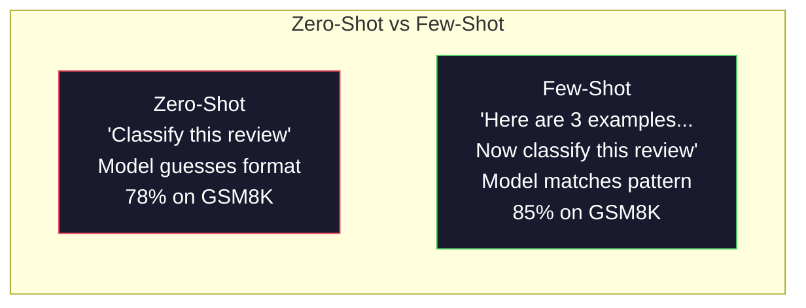
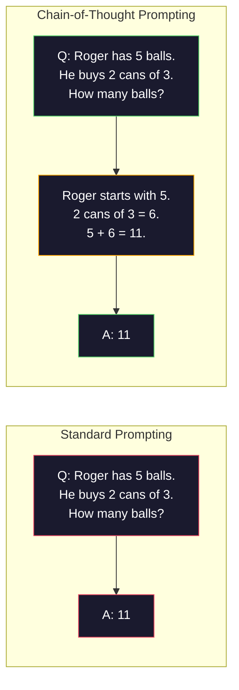
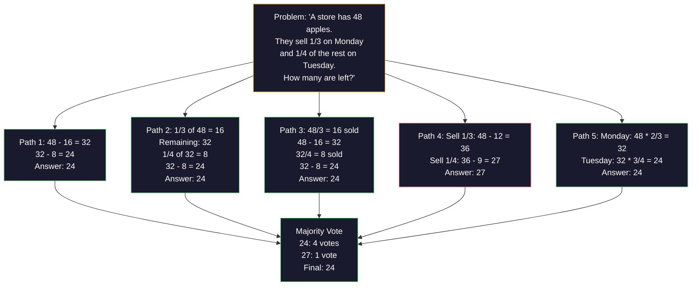
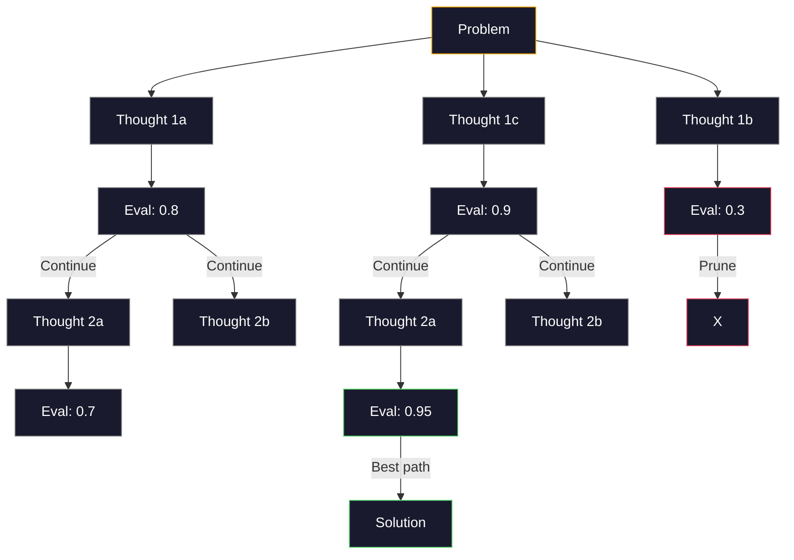
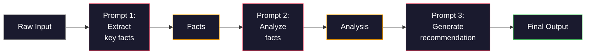

# 少样本、思维链、思维树

> 告诉模型做什么是提示词编写。让它知道如何思考才是工程。同一个模型、同一个任务、同样的数据，从 78% 到 91% 准确率的差距，不是靠更好的模型实现的。而是靠更好的推理策略。

**类型：** 构建实践  
**语言：** Python  
**前置条件：** 第 11.01 课（提示词工程）  
**时间：** 约 45 分钟

## 学习目标

- 通过选择和格式化示例演示，实现能最大化任务准确率的少样本提示词
- 将思维链（CoT）推理应用于多步骤问题（如数学应用题）以提高准确率
- 构建一个思维树提示词，探索多条推理路径并选择最优的那条
- 衡量零样本 vs. 少样本 vs. CoT 在标准基准上的准确率提升

## 问题所在

你构建了一个数学辅导应用。你的提示词是："解这道应用题。"GPT-5 在 GSM8K（标准小学数学基准，8500 道题）上的准确率达到 94%。你以为已经到顶了，但没有——思维链还能再加 3-4 个百分点。

加上五个字——"让我们一步步思考"——准确率跳到 91%。再加几个解题示例，就能达到 95%。同一个模型，同样的温度，同样的 API 成本。唯一的区别是你给了模型一张草稿纸。

这不是技巧。这就是推理的工作方式。人类解决多步骤问题时不会在心里一跃而就。Transformer 也不会。当你强迫模型生成中间 token 时，那些 token 就成为下一个 token 的上下文。每一步推理都为下一步提供素材。模型就是这样一步步计算出答案的。

但是"一步步思考"只是开始，不是终点。如果你采样五条推理路径然后多数投票呢？如果你让模型探索一棵可能性树，评估并剪枝分支呢？如果你将推理与工具调用交织呢？这些不是假设。它们是有测量改进效果的已发表技术，你将在本课中逐一构建。

## 核心概念

### 零样本 vs. 少样本：何时示例胜过指令

零样本（Zero-shot）提示词只给模型一个任务，仅此而已。少样本（Few-shot）提示词先给它一些示例。

Wei 等人（2022）在 8 个基准上对此进行了测量。对于简单任务（如情感分类），零样本和少样本的表现相差不超过 2%。对于复杂任务（如多步算术和符号推理），少样本将准确率提高了 10-25%。

直觉上：示例是压缩的指令。你不需要描述输出格式，而是直接展示它。你不需要解释推理过程，而是直接演示它。模型对示例的模式匹配比解释抽象指令更可靠。



**少样本胜出的场景：** 格式敏感任务、分类、结构化提取、领域特定术语、任何模型需要匹配特定模式的任务。

**零样本胜出的场景：** 简单的事实性问题、示例会约束创意的创意任务、找好示例比写好指令更难的任务。

### 示例选择：相似胜过随机

不是所有示例都平等。选择与目标输入语义相似的示例，在分类任务上比随机选择高出 5-15%（Liu 等人，2022）。三条原则：

1. **语义相似性（Semantic similarity）**：选择嵌入空间中最接近输入的示例
2. **标签多样性（Label diversity）**：在示例中覆盖所有输出类别
3. **难度匹配（Difficulty matching）**：匹配目标问题的复杂程度

大多数任务的最优示例数量是 3-5 个。少于 3 个，模型没有足够的信号来提取模式。超过 5 个，收益递减且浪费上下文窗口 token。对于标签较多的分类任务，每个标签用一个示例。

### 思维链：给模型一张草稿纸

思维链（Chain-of-Thought，CoT）提示词由 Google Brain 的 Wei 等人（2022）提出。核心思想很简单：不要直接问模型答案，而是先让它展示推理步骤。



为什么在机制上有效？Transformer 生成的每个 token 都成为下一个 token 的上下文。没有 CoT，模型必须在单次前向传播的隐藏状态中压缩所有推理。有了 CoT，模型将中间计算外化为 token。每个推理 token 都延伸了有效计算深度。

**GSM8K 基准（小学数学，8500 道题）：**

| 模型 | 零样本 | 零样本 CoT | 少样本 CoT |
|-----|-------|----------|----------|
| GPT-4o | 78% | 91% | 95% |
| GPT-5 | 94% | 97% | 98% |
| o4-mini（推理模型） | 97% | — | — |
| Claude Opus 4.7 | 93% | 97% | 98% |
| Gemini 3 Pro | 92% | 96% | 98% |
| Llama 4 70B | 80% | 89% | 94% |
| DeepSeek-V3.1 | 89% | 94% | 96% |

**关于推理模型的说明。** 像 OpenAI o 系列（o3、o4-mini）和 DeepSeek-R1 这样的模型，在输出答案之前会在内部运行思维链。向推理模型添加"让我们一步步思考"是多余的，有时甚至适得其反——它们已经在内部做了。

CoT 的两种形式：

**零样本 CoT（Zero-shot CoT）**：在提示词后追加"让我们一步步思考"。不需要示例。Kojima 等人（2022）证明这一个句子能在算术、常识和符号推理任务上提高准确率。

**少样本 CoT（Few-shot CoT）**：提供包含推理步骤的示例。比零样本 CoT 更有效，因为模型能看到你期望的确切推理格式。

**CoT 有害的情况**：简单的事实性记忆（"法国的首都是什么？"）、单步分类、速度比准确率更重要的任务。CoT 每次查询会增加 50-200 个 token 的推理开销。对于高吞吐量、低复杂度的任务，这是浪费成本。

### 自一致性：多次采样，一次投票

Wang 等人（2023）提出了自一致性（Self-consistency）。核心洞察：单条 CoT 路径可能包含推理错误。但如果你采样 N 条独立的推理路径（使用 temperature > 0）并对最终答案进行多数投票，错误就会相互抵消。



在原始 PaLM 540B 实验中，自一致性（N=40）将 GSM8K 准确率从 56.5%（单条 CoT）提高到 74.4%。在 GPT-5 上提升很小（97% 到 98%），因为基础准确率已经接近饱和。该技术在基础 CoT 准确率为 60-85% 的模型上最为有效——在这个甜蜜区间内，单路径错误频繁但非系统性。对于推理模型（o 系列、R1），自一致性已被内置的内部采样所涵盖。

权衡：N 次采样意味着 N 倍的 API 成本和延迟。实践中，N=5 能获取大部分收益。N=3 是有意义投票的最低要求。对于大多数任务，N>10 收益递减。

### 思维树：分支探索

Yao 等人（2023）提出了思维树（Tree-of-Thought，ToT）。CoT 沿单一线性推理路径前进，而 ToT 探索多个分支，在继续之前评估哪些分支最有前景。



ToT 有三个组成部分：

1. **思维生成（Thought generation）**：生成多个候选下一步
2. **状态评估（State evaluation）**：对每个候选打分（可以用 LLM 本身作为评估器）
3. **搜索算法（Search algorithm）**：BFS 或 DFS 遍历树，剪除低分分支

在 24 点游戏任务（用 4 个数字通过算术运算得到 24）上，标准提示词下 GPT-4 解决了 7.3% 的问题。CoT 下 4.0%（CoT 在这里实际上有害，因为搜索空间很宽）。ToT 下 74%。

ToT 代价高昂。树中的每个节点都需要一次 LLM 调用。分支因子为 3、深度为 3 的树最多需要 39 次 LLM 调用。只在搜索空间大但可评估的问题上使用它——规划、谜题求解、有约束的创意问题求解。

### ReAct：思考 + 行动

Yao 等人（2022）将推理轨迹与行动相结合。模型在思考（生成推理）和行动（调用工具、搜索、计算）之间交替进行。

```mermaid
graph LR
    Q["Question:\nWhat is the\npopulation of the\ncountry where\nthe Eiffel Tower\nis located?"]
    T1["Thought: I need to\nfind which country\nhas the Eiffel Tower"]
    A1["Action: search\n'Eiffel Tower location'"]
    O1["Observation:\nParis, France"]
    T2["Thought: Now I need\nFrance's population"]
    A2["Action: search\n'France population 2024'"]
    O2["Observation:\n68.4 million"]
    T3["Thought: I have\nthe answer"]
    F["Answer:\n68.4 million"]

    Q --> T1 --> A1 --> O1 --> T2 --> A2 --> O2 --> T3 --> F

    style Q fill:#1a1a2e,stroke:#ffa500,color:#fff
    style T1 fill:#1a1a2e,stroke:#51cf66,color:#fff
    style A1 fill:#1a1a2e,stroke:#e94560,color:#fff
    style O1 fill:#1a1a2e,stroke:#808080,color:#fff
    style T2 fill:#1a1a2e,stroke:#51cf66,color:#fff
    style A2 fill:#1a1a2e,stroke:#e94560,color:#fff
    style O2 fill:#1a1a2e,stroke:#808080,color:#fff
    style T3 fill:#1a1a2e,stroke:#51cf66,color:#fff
    style F fill:#1a1a2e,stroke:#51cf66,color:#fff
```



ReAct 在知识密集型任务上优于纯 CoT，因为它能将推理建立在真实数据上。在 HotpotQA（多跳问答）上，使用 GPT-4 的 ReAct 达到 35.1% 精确匹配，而单纯 CoT 为 29.4%。真正的力量在于推理错误会被观察结果纠正——模型可以在执行过程中更新其计划。

ReAct 是现代 AI 智能体的基础。每个智能体框架（LangChain、CrewAI、AutoGen）都实现了思考-行动-观察循环的某个变体。你将在第 14 阶段构建完整的智能体。本课涵盖提示词模式部分。

### 结构化提示词：XML 标签、分隔符、标题

随着提示词变得复杂，结构化可以防止模型混淆各个部分。三种方式：

**XML 标签**（在 Claude 上效果最佳，在任何地方都可靠）：
```
<context>
You are reviewing a pull request.
The codebase uses TypeScript and React.
</context>

<task>
Review the following diff for bugs, security issues, and style violations.
</task>

<diff>
{diff_content}
</diff>

<output_format>
List each issue with: file, line, severity (critical/warning/info), description.
</output_format>
```

**Markdown 标题**（通用）：
```
## Role
Senior security engineer at a fintech company.

## Task
Analyze this API endpoint for vulnerabilities.

## Input
{api_code}

## Rules
- Focus on OWASP Top 10
- Rate each finding: critical, high, medium, low
- Include remediation steps
```

**分隔符**（简洁但有效）：
```
---INPUT---
{user_text}
---END INPUT---

---INSTRUCTIONS---
Summarize the above in 3 bullet points.
---END INSTRUCTIONS---
```

### 提示词链：顺序分解

有些任务对于单个提示词来说过于复杂。提示词链（Prompt chaining）将它们分解为步骤，其中一个提示词的输出成为下一个的输入。



链式提示词在三个方面优于单提示词：

1. **每步更简单**：模型处理一个专注的任务，而不是同时兼顾所有事情
2. **中间输出可检查**：你可以在步骤之间验证和纠正
3. **不同步骤可使用不同模型**：廉价模型做提取，昂贵模型做推理

### 性能对比

| 技术 | 最适合 | GSM8K 准确率（GPT-5） | API 调用次数 | Token 开销 | 复杂度 |
|-----|------|--------------------|------------|----------|-------|
| 零样本 | 简单任务 | 94% | 1 | 无 | 极低 |
| 少样本 | 格式匹配 | 96% | 1 | 200-500 tokens | 低 |
| 零样本 CoT | 快速推理提升 | 97% | 1 | 50-200 tokens | 极低 |
| 少样本 CoT | 单次调用最高准确率 | 98% | 1 | 300-600 tokens | 低 |
| 自一致性（N=5） | 高风险推理 | 98.5% | 5 | 5倍 token 成本 | 中等 |
| 推理模型（o4-mini） | CoT 即插即用替代 | 97% | 1 | 隐藏（内部 2-10x） | 极低 |
| 思维树 | 搜索/规划问题 | 不适用（24点游戏 74%） | 10-40+ | 10-40倍 token 成本 | 高 |
| ReAct | 知识扎根推理 | 不适用（HotpotQA 35.1%） | 3-10+ | 可变 | 高 |
| 提示词链 | 复杂多步骤任务 | 96%（流水线） | 2-5 | 2-5倍 token 成本 | 中等 |

正确的技术取决于三个因素：准确率要求、延迟预算和成本容忍度。对于大多数生产系统，少样本 CoT 加上 3 次采样的自一致性回退，能覆盖 90% 的用例。

## 构建实践

我们将构建一个数学题解题器，将少样本提示词、思维链推理和自一致性投票组合成一个流水线。然后对难题添加思维树。

完整实现在 `code/advanced_prompting.py` 中。以下是关键组件。

### 步骤 1：少样本示例库

第一个组件管理少样本示例，并为给定问题选择最相关的示例。

```python
GSM8K_EXAMPLES = [
    {
        "question": "Janet's ducks lay 16 eggs per day. She eats three for breakfast every morning and bakes muffins for her friends every day with four. She sells every egg at the farmers' market for $2. How much does she make every day at the farmers' market?",
        "reasoning": "Janet's ducks lay 16 eggs per day. She eats 3 and bakes 4, using 3 + 4 = 7 eggs. So she has 16 - 7 = 9 eggs left. She sells each for $2, so she makes 9 * 2 = $18 per day.",
        "answer": "18"
    },
    ...
]
```

每个示例有三个部分：问题、推理链和最终答案。推理链是将普通少样本示例转化为 CoT 少样本示例的关键。

### 步骤 2：思维链提示词构建器

提示词构建器将系统消息、含推理链的少样本示例和目标问题组装成单个提示词。

```python
def build_cot_prompt(question, examples, num_examples=3):
    system = (
        "You are a math problem solver. "
        "For each problem, show your step-by-step reasoning, "
        "then give the final numerical answer on the last line "
        "in the format: 'The answer is [number]'."
    )

    example_text = ""
    for ex in examples[:num_examples]:
        example_text += f"Q: {ex['question']}\n"
        example_text += f"A: {ex['reasoning']} The answer is {ex['answer']}.\n\n"

    user = f"{example_text}Q: {question}\nA:"
    return system, user
```

格式约束（"The answer is [number]"）至关重要。没有它，自一致性就无法在各采样之间提取和比较答案。

### 步骤 3：自一致性投票

采样 N 条推理路径，取多数答案。

```python
def self_consistency_solve(question, examples, client, model, n_samples=5):
    system, user = build_cot_prompt(question, examples)

    answers = []
    reasonings = []
    for _ in range(n_samples):
        response = client.chat.completions.create(
            model=model,
            messages=[
                {"role": "system", "content": system},
                {"role": "user", "content": user}
            ],
            temperature=0.7
        )
        text = response.choices[0].message.content
        reasonings.append(text)
        answer = extract_answer(text)
        if answer is not None:
            answers.append(answer)

    vote_counts = Counter(answers)
    best_answer = vote_counts.most_common(1)[0][0] if vote_counts else None
    confidence = vote_counts[best_answer] / len(answers) if best_answer else 0

    return best_answer, confidence, reasonings, vote_counts
```

temperature=0.7 很重要。temperature=0.0 时，所有 N 个样本都将完全相同，失去了目的。你需要足够的随机性来产生多样化的推理路径，但又不能随机到模型产生胡言乱语。

### 步骤 4：思维树求解器

对于线性推理失败的问题，ToT 探索多种方法并评估哪个方向最有前景。

```python
def tree_of_thought_solve(question, client, model, breadth=3, depth=3):
    thoughts = generate_initial_thoughts(question, client, model, breadth)
    scored = [(t, evaluate_thought(t, question, client, model)) for t in thoughts]
    scored.sort(key=lambda x: x[1], reverse=True)

    for current_depth in range(1, depth):
        next_thoughts = []
        for thought, score in scored[:2]:
            extensions = extend_thought(thought, question, client, model, breadth)
            for ext in extensions:
                ext_score = evaluate_thought(ext, question, client, model)
                next_thoughts.append((ext, ext_score))
        scored = sorted(next_thoughts, key=lambda x: x[1], reverse=True)

    best_thought = scored[0][0] if scored else ""
    return extract_answer(best_thought), best_thought
```

评估器本身就是一次 LLM 调用。你问模型："从 0.0 到 1.0，这条推理路径解决问题的前景如何？"这是 ToT 的核心洞察——模型评估自己的部分解答。

### 步骤 5：完整流水线

流水线将所有技术与升级策略结合起来。

```python
def solve_with_escalation(question, examples, client, model):
    system, user = build_cot_prompt(question, examples)
    single_response = call_llm(client, model, system, user, temperature=0.0)
    single_answer = extract_answer(single_response)

    sc_answer, confidence, _, _ = self_consistency_solve(
        question, examples, client, model, n_samples=5
    )

    if confidence >= 0.8:
        return sc_answer, "self_consistency", confidence

    tot_answer, _ = tree_of_thought_solve(question, client, model)
    return tot_answer, "tree_of_thought", None
```

升级逻辑：先尝试廉价的（单条 CoT）。如果自一致性置信度低于 0.8（5 个样本中少于 4 个一致），升级到 ToT。这平衡了成本和准确率——大多数问题廉价解决，难题获得更多计算资源。

## 实际使用

### 使用 LangChain

LangChain 为提示词模板和输出解析提供了内置支持，简化了少样本和 CoT 模式：

```python
from langchain_core.prompts import FewShotPromptTemplate, PromptTemplate
from langchain_openai import ChatOpenAI

example_prompt = PromptTemplate(
    input_variables=["question", "reasoning", "answer"],
    template="Q: {question}\nA: {reasoning} The answer is {answer}."
)

few_shot_prompt = FewShotPromptTemplate(
    examples=examples,
    example_prompt=example_prompt,
    suffix="Q: {input}\nA: Let's think step by step.",
    input_variables=["input"]
)

llm = ChatOpenAI(model="gpt-4o", temperature=0.7)
chain = few_shot_prompt | llm
result = chain.invoke({"input": "If a train travels 120 km in 2 hours..."})
```

LangChain 还有用于语义相似性选择的 `ExampleSelector` 类：

```python
from langchain_core.example_selectors import SemanticSimilarityExampleSelector
from langchain_openai import OpenAIEmbeddings

selector = SemanticSimilarityExampleSelector.from_examples(
    examples,
    OpenAIEmbeddings(),
    k=3
)
```

### 使用 DSPy

DSPy 将提示词策略视为可优化的模块。你无需手工制作 CoT 提示词，只需定义一个签名，让 DSPy 优化提示词：

```python
import dspy

dspy.configure(lm=dspy.LM("openai/gpt-4o", temperature=0.7))

class MathSolver(dspy.Module):
    def __init__(self):
        self.solve = dspy.ChainOfThought("question -> answer")

    def forward(self, question):
        return self.solve(question=question)

solver = MathSolver()
result = solver(question="Janet's ducks lay 16 eggs per day...")
```

DSPy 的 `ChainOfThought` 自动添加推理轨迹。`dspy.majority` 实现自一致性：

```python
result = dspy.majority(
    [solver(question=q) for _ in range(5)],
    field="answer"
)
```

### 对比：从零构建 vs. 使用框架

| 特性 | 从零构建（本课） | LangChain | DSPy |
|-----|-------------|---------|------|
| 提示词格式控制 | 完全控制 | 基于模板 | 自动 |
| 自一致性 | 手动投票 | 手动 | 内置（`dspy.majority`） |
| 示例选择 | 自定义逻辑 | `ExampleSelector` | `dspy.BootstrapFewShot` |
| 思维树 | 自定义树搜索 | 社区链 | 未内置 |
| 提示词优化 | 手动迭代 | 手动 | 自动编译 |
| 最适合 | 学习、定制流水线 | 标准工作流 | 研究、优化 |

## 交付成果

本课产出两个制品：

**1. 推理链提示词**（`outputs/prompt-reasoning-chain.md`）：一个可用于生产的少样本 CoT 提示词模板，附带自一致性。填入你的示例和问题领域即可。

**2. CoT 模式选择技能**（`outputs/skill-cot-patterns.md`）：一个决策框架，根据任务类型、准确率要求和成本约束选择正确的推理技术。

## 练习

1. **衡量差距**：取 10 道 GSM8K 题。用零样本、少样本、零样本 CoT 和少样本 CoT 各解一遍。记录每种方法的准确率。哪种技术在你的模型上提升最大？

2. **示例选择实验**：对同样 10 道题，比较随机示例选择 vs. 手工挑选相似示例。衡量准确率差异。在哪个点上示例质量比示例数量更重要？

3. **自一致性成本曲线**：在 20 道 GSM8K 题上，分别用 N=1、3、5、7、10 运行自一致性。绘制准确率与成本（总 token 数）的关系图。你的模型的曲线拐点在哪里？

4. **构建 ReAct 循环**：用计算器工具扩展流水线。当模型生成数学表达式时，用 Python 的 `eval()`（在沙箱中）执行它，并将结果反馈回去。衡量工具辅助推理是否优于纯 CoT。

5. **用 ToT 做创意任务**：将思维树求解器适配用于创意写作任务："写一个既有趣又悲伤的 6 词故事。"用 LLM 作为评估器。分支探索是否比单次生成产生更好的创意输出？

## 关键术语

| 术语 | 人们的说法 | 实际含义 |
|-----|----------|---------|
| 少样本提示（Few-shot prompting） | "给几个示例" | 在提示词中包含输入-输出演示，以锚定模型的输出格式和行为 |
| 思维链（Chain-of-Thought） | "让它一步步思考" | 引导生成中间推理 token，在产生最终答案之前扩展模型的有效计算 |
| 自一致性（Self-Consistency） | "多次运行" | 在 temperature > 0 时采样 N 条多样化推理路径，通过多数投票选择最常见的最终答案 |
| 思维树（Tree-of-Thought） | "让它探索选项" | 在推理分支上进行结构化搜索，评估每个部分解答，只扩展有前景的路径 |
| ReAct | "思考+工具使用" | 在思考-行动-观察循环中将推理轨迹与外部行动（搜索、计算、API 调用）交织 |
| 提示词链（Prompt chaining） | "分步骤" | 将复杂任务分解为顺序提示词，每个输出成为下一个输入 |
| 零样本 CoT（Zero-shot CoT） | "加'一步步思考'就好" | 在没有示例的情况下在提示词后追加推理触发短语，依赖模型的潜在推理能力 |

## 延伸阅读

- [Chain-of-Thought Prompting Elicits Reasoning in Large Language Models](https://arxiv.org/abs/2201.11903) — Wei 等人 2022。来自 Google Brain 的原始 CoT 论文。阅读第 2-3 节获取核心结论。
- [Self-Consistency Improves Chain of Thought Reasoning in Language Models](https://arxiv.org/abs/2203.11171) — Wang 等人 2023。自一致性论文。表 1 包含所有你需要的数据。
- [Tree of Thoughts: Deliberate Problem Solving with Large Language Models](https://arxiv.org/abs/2305.10601) — Yao 等人 2023。ToT 论文。第 4 节中 24 点游戏的结果是亮点。
- [ReAct: Synergizing Reasoning and Acting in Language Models](https://arxiv.org/abs/2210.03629) — Yao 等人 2022。现代 AI 智能体的基础。第 3 节解释了思考-行动-观察循环。
- [Large Language Models are Zero-Shot Reasoners](https://arxiv.org/abs/2205.11916) — Kojima 等人 2022。"让我们一步步思考"论文。以其简单性而言出人意料地有效。
- [DSPy: Compiling Declarative Language Model Calls into Self-Improving Pipelines](https://arxiv.org/abs/2310.03714) — Khattab 等人 2023。将提示词视为编译问题。如果你想超越手工提示词工程，请阅读。
- [OpenAI — Reasoning models guide](https://platform.openai.com/docs/guides/reasoning) — 供应商指南，说明思维链何时变为内部的、按 token 计费的"推理"模式，而非提示词技巧。
- [Lightman et al., "Let's Verify Step by Step" (2023)](https://arxiv.org/abs/2305.20050) — 过程奖励模型（PRM），对链的每一步进行评分；继结果奖励之后的推理监督信号。
- [Snell et al., "Scaling LLM Test-Time Compute Optimally" (2024)](https://arxiv.org/abs/2408.03314) — 对 CoT 长度、自一致性采样和 MCTS 的系统研究；当准确率比延迟更重要时"一步步思考"的走向。
