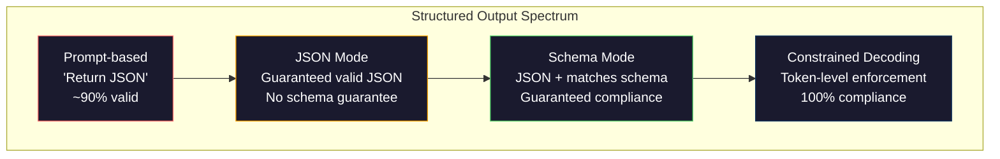
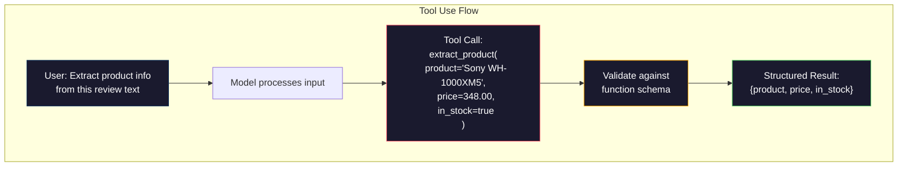

# 结构化输出：JSON、Schema 验证、约束解码

> 你的 LLM 返回一个字符串。你的应用需要 JSON。这个差距造成的生产系统崩溃，比任何模型幻觉都多。结构化输出是自然语言与类型化数据之间的桥梁。做对了，你的 LLM 就成了可靠的 API。做错了，你就会在凌晨 3 点用正则表达式解析自由文本。

**类型：** 构建实践  
**语言：** Python  
**前置条件：** 第 10 阶段第 01-05 课（从零构建 LLM）  
**时间：** 约 90 分钟  
**相关内容：** 第 5 阶段第 20 课（结构化输出与约束解码）涵盖解码器层面的理论（FSM/CFG logit 处理器、Outlines、XGrammar）。本课聚焦于生产 SDK 接口（OpenAI `response_format`、Anthropic 工具调用、Instructor）——如果你想了解 API 之下发生了什么，请先阅读第 5 阶段第 20 课。

## 学习目标

- 使用 OpenAI 和 Anthropic API 参数实现 JSON 模式和 Schema 约束输出
- 构建 Pydantic 验证层，拒绝格式错误的 LLM 输出并带错误反馈重试
- 解释约束解码如何在 token 级别强制输出有效 JSON，无需后处理
- 设计健壮的提取提示词，可靠地将非结构化文本转化为类型化数据结构

## 问题所在

你问一个 LLM："从这段文本中提取产品名称、价格和库存状态。"它回答：

```
The product is the Sony WH-1000XM5 headphones, which cost $348.00 and are currently in stock.
```

这是一个完全正确的回答。对你的应用来说也完全没用。你的库存系统需要 `{"product": "Sony WH-1000XM5", "price": 348.00, "in_stock": true}`。你需要一个具有特定键、特定类型和特定值约束的 JSON 对象，不需要一个句子。

最简单的方案：在提示词中加上"用 JSON 格式回答"。90% 的情况下有效。另外 10% 的情况，模型会把 JSON 包在 markdown 代码块里，或者加上"这是 JSON："这样的前言，或者由于提前关闭括号而产生语法无效的 JSON。你的 JSON 解析器崩溃。你的流水线中断。你加上 try/except 和重试循环。重试有时会产生不同的数据。现在你除了解析问题还多了一个一致性问题。

这不是提示词工程问题。这是解码问题。模型从左到右生成 token。在每个位置，它从包含 10 万多个选项的词汇表中选取最可能的下一个 token。在任何给定位置，大多数选项都会产生无效的 JSON。如果模型刚刚输出了 `{"price":`，下一个 token 必须是数字、引号（用于字符串）、`null`、`true`、`false` 或负号。其他任何 token 都会产生无效 JSON。没有约束，模型可能会选一个语义上完全合理但在语法上灾难性的英文词。

## 核心概念

### 结构化输出的层级谱系

结构化输出控制有四个层级，每个层级比上一个更可靠。



**基于提示词（Prompt-based）**（"用有效 JSON 格式回答"）：无强制执行。模型通常遵守但有时不会。可靠性：约 90%。失败模式：markdown 代码块、前言文本、截断输出、结构错误。

**JSON 模式（JSON mode）**：API 保证输出是有效 JSON。OpenAI 的 `response_format: { type: "json_object" }` 启用此模式。输出将能无错误解析。但它可能不符合你预期的 schema——额外的键、错误的类型、缺失的字段。

**Schema 模式（Schema mode）**：API 接受一个 JSON Schema 并保证输出与之匹配。2026 年，所有主流提供商都原生支持：OpenAI 的 `response_format: { type: "json_schema", json_schema: {...} }`（也可以用 `tool_choice="required"`），Anthropic 的带 `input_schema` 的工具调用，以及 Gemini 的 `response_schema` + `response_mime_type: "application/json"`。输出具有你指定的确切键、类型和约束。

**约束解码（Constrained decoding）**：在生成过程中每个 token 位置，解码器屏蔽所有会产生无效输出的 token。如果 schema 要求一个数字，而模型即将输出一个字母，该 token 的概率被设为零。模型只能产生能导向有效输出的 token。这就是 OpenAI 的结构化输出模式以及 Outlines 和 Guidance 等库在底层实现的内容。

### JSON Schema：契约语言

JSON Schema 是你告诉模型（或验证层）输出必须是什么形状的方式。每个主流结构化输出系统都使用它。

```json
{
  "type": "object",
  "properties": {
    "product": { "type": "string" },
    "price": { "type": "number", "minimum": 0 },
    "in_stock": { "type": "boolean" },
    "categories": {
      "type": "array",
      "items": { "type": "string" }
    }
  },
  "required": ["product", "price", "in_stock"]
}
```

该 schema 表示：输出必须是一个对象，包含字符串类型的 `product`、非负数类型的 `price`、布尔类型的 `in_stock`，以及可选的字符串数组 `categories`。任何不匹配的输出都会被拒绝。

Schema 处理复杂情况：嵌套对象、带类型条目的数组、枚举（将字符串约束为特定值）、模式匹配（字符串上的正则表达式），以及组合器（oneOf、anyOf、allOf 用于多态输出）。

### Pydantic 模式

在 Python 中，你不需要手写 JSON Schema。你定义一个 Pydantic 模型，它会自动为你生成 schema。

```python
from pydantic import BaseModel

class Product(BaseModel):
    product: str
    price: float
    in_stock: bool
    categories: list[str] = []
```

这会生成与上面相同的 JSON Schema。Instructor 库（以及 OpenAI 的 SDK）直接接受 Pydantic 模型：传入模型类，得到一个经过验证的实例。如果 LLM 输出不匹配，Instructor 会自动重试。

### 函数调用/工具调用

同一问题的另一种接口。你不直接让模型生成 JSON，而是定义带类型参数的"工具"（函数）。模型输出一个带结构化参数的函数调用。OpenAI 称之为"函数调用（function calling）"，Anthropic 称之为"工具调用（tool use）"。结果相同：结构化数据。



当模型需要选择调用哪个函数而不仅仅是填写参数时，工具调用更为合适。如果你有 10 个不同的提取 schema，模型必须根据输入选择正确的那个，工具调用同时给你 schema 选择和结构化输出。

### 常见失败模式

即使有 schema 强制执行，结构化输出也可能以微妙的方式失败。

**幻觉值（Hallucinated values）**：输出符合 schema，但包含编造的数据。文本说 $348，模型却生成 `{"price": 299.99}`。Schema 验证无法发现这个问题——类型正确，值错误。

**枚举混淆（Enum confusion）**：你将一个字段约束为 `["in_stock", "out_of_stock", "preorder"]`。模型输出 `"available"`——语义上正确，但不在允许集合中。好的约束解码能防止这种情况。基于提示词的方法则不能。

**嵌套对象深度（Nested object depth）**：深度嵌套的 schema（4 层以上）产生更多错误。每一层嵌套都是模型可能丢失结构的另一个地方。

**数组长度（Array length）**：模型可能在数组中生成过多或过少的条目。Schema 支持 `minItems` 和 `maxItems`，但并非所有提供商都在解码层面强制执行。

**可选字段省略（Optional field omission）**：模型省略技术上可选但对你的用例语义上重要的字段。即使数据有时缺失，也要在 schema 中将它们设为必需——强制模型显式生成 `null`。

## 构建实践

### 步骤 1：JSON Schema 验证器

从头构建一个验证器，检查 Python 对象是否符合 JSON Schema。这是在输出侧运行以验证合规性的内容。

```python
import json

def validate_schema(data, schema):
    errors = []
    _validate(data, schema, "", errors)
    return errors

def _validate(data, schema, path, errors):
    schema_type = schema.get("type")

    if schema_type == "object":
        if not isinstance(data, dict):
            errors.append(f"{path}: expected object, got {type(data).__name__}")
            return
        for key in schema.get("required", []):
            if key not in data:
                errors.append(f"{path}.{key}: required field missing")
        properties = schema.get("properties", {})
        for key, value in data.items():
            if key in properties:
                _validate(value, properties[key], f"{path}.{key}", errors)

    elif schema_type == "array":
        if not isinstance(data, list):
            errors.append(f"{path}: expected array, got {type(data).__name__}")
            return
        min_items = schema.get("minItems", 0)
        max_items = schema.get("maxItems", float("inf"))
        if len(data) < min_items:
            errors.append(f"{path}: array has {len(data)} items, minimum is {min_items}")
        if len(data) > max_items:
            errors.append(f"{path}: array has {len(data)} items, maximum is {max_items}")
        items_schema = schema.get("items", {})
        for i, item in enumerate(data):
            _validate(item, items_schema, f"{path}[{i}]", errors)

    elif schema_type == "string":
        if not isinstance(data, str):
            errors.append(f"{path}: expected string, got {type(data).__name__}")
            return
        enum_values = schema.get("enum")
        if enum_values and data not in enum_values:
            errors.append(f"{path}: '{data}' not in allowed values {enum_values}")

    elif schema_type == "number":
        if not isinstance(data, (int, float)):
            errors.append(f"{path}: expected number, got {type(data).__name__}")
            return
        minimum = schema.get("minimum")
        maximum = schema.get("maximum")
        if minimum is not None and data < minimum:
            errors.append(f"{path}: {data} is less than minimum {minimum}")
        if maximum is not None and data > maximum:
            errors.append(f"{path}: {data} is greater than maximum {maximum}")

    elif schema_type == "boolean":
        if not isinstance(data, bool):
            errors.append(f"{path}: expected boolean, got {type(data).__name__}")

    elif schema_type == "integer":
        if not isinstance(data, int) or isinstance(data, bool):
            errors.append(f"{path}: expected integer, got {type(data).__name__}")
```

### 步骤 2：类 Pydantic 模型到 Schema 的转换

构建一个最小化的类到 schema 转换器。定义一个 Python 类，自动生成其 JSON Schema。

```python
class SchemaField:
    def __init__(self, field_type, required=True, default=None, enum=None, minimum=None, maximum=None):
        self.field_type = field_type
        self.required = required
        self.default = default
        self.enum = enum
        self.minimum = minimum
        self.maximum = maximum

def python_type_to_schema(field):
    type_map = {
        str: "string",
        int: "integer",
        float: "number",
        bool: "boolean",
    }

    schema = {}

    if field.field_type in type_map:
        schema["type"] = type_map[field.field_type]
    elif field.field_type == list:
        schema["type"] = "array"
        schema["items"] = {"type": "string"}
    elif isinstance(field.field_type, dict):
        schema = field.field_type

    if field.enum:
        schema["enum"] = field.enum
    if field.minimum is not None:
        schema["minimum"] = field.minimum
    if field.maximum is not None:
        schema["maximum"] = field.maximum

    return schema

def model_to_schema(name, fields):
    properties = {}
    required = []

    for field_name, field in fields.items():
        properties[field_name] = python_type_to_schema(field)
        if field.required:
            required.append(field_name)

    return {
        "type": "object",
        "properties": properties,
        "required": required,
    }
```

### 步骤 3：约束 Token 过滤器

模拟约束解码。给定一个部分 JSON 字符串和一个 schema，确定当前位置哪些 token 类别是有效的。

```python
def next_valid_tokens(partial_json, schema):
    stripped = partial_json.strip()

    if not stripped:
        return ["{"]

    try:
        json.loads(stripped)
        return ["<EOS>"]
    except json.JSONDecodeError:
        pass

    last_char = stripped[-1] if stripped else ""

    if last_char == "{":
        return ['"', "}"]
    elif last_char == '"':
        if stripped.endswith('":'):
            return ['"', "0-9", "true", "false", "null", "[", "{"]
        return ["a-z", '"']
    elif last_char == ":":
        return [" ", '"', "0-9", "true", "false", "null", "[", "{"]
    elif last_char == ",":
        return [" ", '"', "{", "["]
    elif last_char in "0123456789":
        return ["0-9", ".", ",", "}", "]"]
    elif last_char == "}":
        return [",", "}", "]", "<EOS>"]
    elif last_char == "]":
        return [",", "}", "<EOS>"]
    elif last_char == "[":
        return ['"', "0-9", "true", "false", "null", "{", "[", "]"]
    else:
        return ["any"]

def demonstrate_constrained_decoding():
    partial_states = [
        '',
        '{',
        '{"product"',
        '{"product":',
        '{"product": "Sony"',
        '{"product": "Sony",',
        '{"product": "Sony", "price":',
        '{"product": "Sony", "price": 348',
        '{"product": "Sony", "price": 348}',
    ]

    print(f"{'Partial JSON':<45} {'Valid Next Tokens'}")
    print("-" * 80)
    for state in partial_states:
        valid = next_valid_tokens(state, {})
        display = state if state else "(empty)"
        print(f"{display:<45} {valid}")
```

### 步骤 4：提取流水线

将所有内容组合成一个提取流水线：定义 schema、模拟 LLM 生成结构化输出、验证输出并处理重试。

```python
def simulate_llm_extraction(text, schema, attempt=0):
    if "headphones" in text.lower() or "sony" in text.lower():
        if attempt == 0:
            return '{"product": "Sony WH-1000XM5", "price": 348.00, "in_stock": true, "categories": ["audio", "headphones"]}'
        return '{"product": "Sony WH-1000XM5", "price": 348.00, "in_stock": true}'

    if "laptop" in text.lower():
        return '{"product": "MacBook Pro 16", "price": 2499.00, "in_stock": false, "categories": ["computers"]}'

    return '{"product": "Unknown", "price": 0, "in_stock": false}'

def extract_with_retry(text, schema, max_retries=3):
    for attempt in range(max_retries):
        raw = simulate_llm_extraction(text, schema, attempt)

        try:
            data = json.loads(raw)
        except json.JSONDecodeError as e:
            print(f"  Attempt {attempt + 1}: JSON parse error -- {e}")
            continue

        errors = validate_schema(data, schema)
        if not errors:
            return data

        print(f"  Attempt {attempt + 1}: Schema validation errors -- {errors}")

    return None

product_schema = {
    "type": "object",
    "properties": {
        "product": {"type": "string"},
        "price": {"type": "number", "minimum": 0},
        "in_stock": {"type": "boolean"},
        "categories": {"type": "array", "items": {"type": "string"}},
    },
    "required": ["product", "price", "in_stock"],
}
```

### 步骤 5：运行完整流水线

```python
def run_demo():
    print("=" * 60)
    print("  Structured Output Pipeline Demo")
    print("=" * 60)

    print("\n--- Schema Definition ---")
    product_fields = {
        "product": SchemaField(str),
        "price": SchemaField(float, minimum=0),
        "in_stock": SchemaField(bool),
        "categories": SchemaField(list, required=False),
    }
    generated_schema = model_to_schema("Product", product_fields)
    print(json.dumps(generated_schema, indent=2))

    print("\n--- Schema Validation ---")
    test_cases = [
        ({"product": "Test", "price": 10.0, "in_stock": True}, "Valid object"),
        ({"product": "Test", "price": -5.0, "in_stock": True}, "Negative price"),
        ({"product": "Test", "in_stock": True}, "Missing price"),
        ({"product": "Test", "price": "ten", "in_stock": True}, "String as price"),
        ("not an object", "String instead of object"),
    ]

    for data, label in test_cases:
        errors = validate_schema(data, product_schema)
        status = "PASS" if not errors else f"FAIL: {errors}"
        print(f"  {label}: {status}")

    print("\n--- Constrained Decoding Simulation ---")
    demonstrate_constrained_decoding()

    print("\n--- Extraction Pipeline ---")
    texts = [
        "The Sony WH-1000XM5 headphones are priced at $348 and currently available.",
        "The new MacBook Pro 16-inch laptop costs $2499 but is sold out.",
        "This is a random sentence with no product info.",
    ]

    for text in texts:
        print(f"\n  Input: {text[:60]}...")
        result = extract_with_retry(text, product_schema)
        if result:
            print(f"  Output: {json.dumps(result)}")
        else:
            print(f"  Output: FAILED after retries")
```

## 实际使用

### OpenAI 结构化输出

```python
# from openai import OpenAI
# from pydantic import BaseModel
#
# client = OpenAI()
#
# class Product(BaseModel):
#     product: str
#     price: float
#     in_stock: bool
#
# response = client.beta.chat.completions.parse(
#     model="gpt-5-mini",
#     messages=[
#         {"role": "system", "content": "Extract product information."},
#         {"role": "user", "content": "Sony WH-1000XM5, $348, in stock"},
#     ],
#     response_format=Product,
# )
#
# product = response.choices[0].message.parsed
# print(product.product, product.price, product.in_stock)
```

OpenAI 的结构化输出模式在内部使用约束解码。模型生成的每个 token 都保证产生符合 Pydantic schema 的输出。不需要重试，不需要验证。约束已嵌入解码过程中。

### Anthropic 工具调用

```python
# import anthropic
#
# client = anthropic.Anthropic()
#
# response = client.messages.create(
#     model="claude-opus-4-7",
#     max_tokens=1024,
#     tools=[{
#         "name": "extract_product",
#         "description": "Extract product information from text",
#         "input_schema": {
#             "type": "object",
#             "properties": {
#                 "product": {"type": "string"},
#                 "price": {"type": "number"},
#                 "in_stock": {"type": "boolean"},
#             },
#             "required": ["product", "price", "in_stock"],
#         },
#     }],
#     messages=[{"role": "user", "content": "Extract: Sony WH-1000XM5, $348, in stock"}],
# )
```

Anthropic 通过工具调用实现结构化输出。模型输出一个带结构化参数的工具调用，参数符合 input_schema。结果相同，API 接口不同。

### Instructor 库

```python
# pip install instructor
# import instructor
# from openai import OpenAI
# from pydantic import BaseModel
#
# client = instructor.from_openai(OpenAI())
#
# class Product(BaseModel):
#     product: str
#     price: float
#     in_stock: bool
#
# product = client.chat.completions.create(
#     model="gpt-5-mini",
#     response_model=Product,
#     messages=[{"role": "user", "content": "Sony WH-1000XM5, $348, in stock"}],
# )
```

Instructor 包装任何 LLM 客户端并添加带验证的自动重试。如果第一次尝试验证失败，它将错误作为上下文发回给模型，要求它修正输出。适用于任何提供商，不仅仅是 OpenAI。

## 交付成果

本课产出 `outputs/prompt-structured-extractor.md`——一个可复用的提示词模板，给定 schema 定义和非结构化文本，提取结构化数据并返回经过验证的 JSON。

还产出 `outputs/skill-structured-outputs.md`——一个决策框架，根据你的提供商、可靠性要求和 schema 复杂度选择正确的结构化输出策略。

## 练习

1. 扩展 schema 验证器以支持 `oneOf`（数据必须恰好匹配几个 schema 之一）。这处理多态输出——例如，一个字段可以是具有不同形状的 `Product` 或 `Service` 对象。

2. 构建一个"schema diff"工具，比较两个 schema 并识别破坏性变更（删除了必需字段、改变了类型）与非破坏性变更（添加了可选字段、放宽了约束）。这对于在生产中对提取 schema 进行版本管理至关重要。

3. 实现一个更真实的约束解码模拟器。给定一个 JSON Schema 和包含 100 个 token（字母、数字、标点、关键词）的词汇表，逐步模拟生成过程，在每个位置屏蔽无效 token。衡量每一步中词汇表中有效 token 的百分比。

4. 构建一个提取评估套件。创建 50 个带手动标注 JSON 输出的产品描述。在全部 50 个上运行你的提取流水线，衡量精确匹配率、字段级准确率和类型合规性。识别哪些字段最难正确提取。

5. 为你的提取流水线添加"置信度分数"。对于每个提取的字段，估计模型的置信度（基于 token 概率，或通过运行提取 3 次并衡量一致性）。标记低置信度字段以供人工审查。

## 关键术语

| 术语 | 人们的说法 | 实际含义 |
|-----|----------|---------|
| JSON 模式（JSON mode） | "返回 JSON" | 保证输出为语法有效 JSON 的 API 标志，但不强制任何特定 schema |
| 结构化输出（Structured output） | "类型化 JSON" | 匹配特定 JSON Schema，具有正确键、类型和约束的输出 |
| 约束解码（Constrained decoding） | "引导生成" | 在每个 token 位置，屏蔽会产生无效输出的 token——保证 100% schema 合规 |
| JSON Schema | "JSON 模板" | 用于描述 JSON 数据结构、类型和约束的声明性语言（被 OpenAPI、JSON Forms 等使用） |
| Pydantic | "Python dataclasses 增强版" | 定义带类型验证数据模型的 Python 库，被 FastAPI 和 Instructor 用于生成 JSON Schema |
| 函数调用（Function calling） | "工具调用" | LLM 输出一个结构化函数调用（名称+类型化参数）而非自由文本——OpenAI 和 Anthropic 都支持 |
| Instructor | "LLM 版 Pydantic" | 包装 LLM 客户端以返回经验证的 Pydantic 实例的 Python 库，验证失败时自动重试 |
| Token 屏蔽（Token masking） | "过滤词汇表" | 在生成过程中将特定 token 的概率设为零，使模型无法生成它们 |
| Schema 合规性（Schema compliance） | "符合形状" | 输出包含所有必需字段、正确类型、约束范围内的值，且没有不允许的额外字段 |
| 重试循环（Retry loop） | "一直重试直到成功" | 将验证错误发回给模型，要求它修正输出——Instructor 自动执行此操作，最多可配置次数 |

## 延伸阅读

- [OpenAI Structured Outputs Guide](https://platform.openai.com/docs/guides/structured-outputs) — OpenAI API 中基于 JSON Schema 的约束解码官方文档
- [Willard & Louf, 2023 — "Efficient Guided Generation for Large Language Models"](https://arxiv.org/abs/2307.09702) — Outlines 论文，描述如何将 JSON Schema 编译为有限状态机以实现 token 级约束
- [Instructor documentation](https://python.useinstructor.com/) — 使用 Pydantic 验证和重试从任何 LLM 获取结构化输出的标准库
- [Anthropic Tool Use Guide](https://docs.anthropic.com/en/docs/tool-use) — Claude 如何通过带 JSON Schema input_schema 的工具调用实现结构化输出
- [JSON Schema specification](https://json-schema.org/) — 每个主流结构化输出系统使用的 schema 语言完整规范
- [Outlines library](https://github.com/outlines-dev/outlines) — 使用编译为有限状态机的正则表达式和 JSON Schema 进行开源约束生成
- [Dong et al., "XGrammar: Flexible and Efficient Structured Generation Engine for Large Language Models" (MLSys 2025)](https://arxiv.org/abs/2411.15100) — 当前最先进的语法引擎；下推自动机编译，以约 100 纳秒/token 的速度屏蔽 token
- [Beurer-Kellner et al., "Prompting Is Programming: A Query Language for Large Language Models" (LMQL)](https://arxiv.org/abs/2212.06094) — LMQL 论文，将约束解码框架化为带类型和值约束的查询语言
- [Microsoft Guidance (framework docs)](https://github.com/guidance-ai/guidance) — 模板驱动的约束生成；Outlines 和 XGrammar 的提供商无关补充
