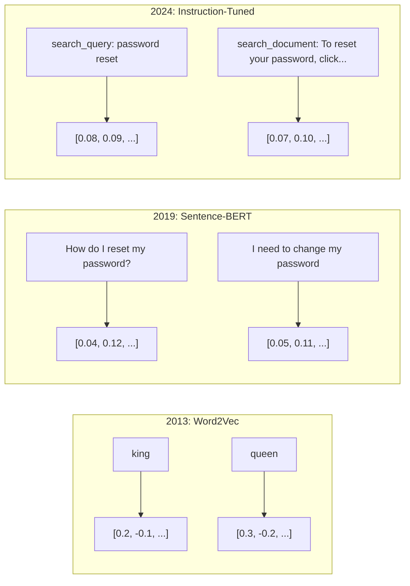
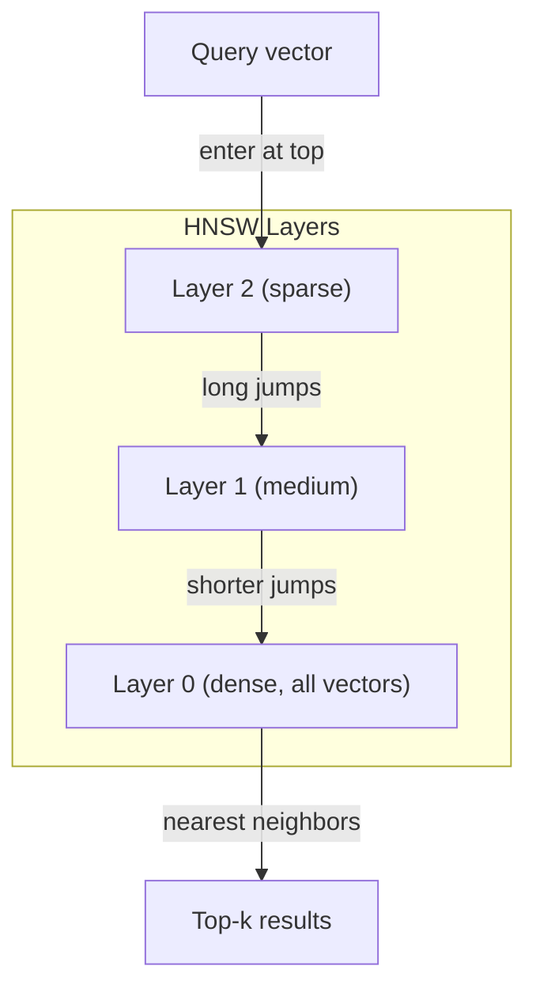
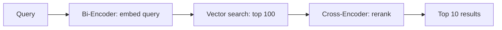

# 嵌入向量与向量表示

> 文本是离散的。数学是连续的。每次你让 LLM 查找"相似"文档、比较含义或超越关键词搜索时，你都依赖于连接这两个世界的桥梁。这座桥梁就是嵌入向量。如果你不理解嵌入向量，你就不真正理解现代 AI——你只是在使用它。

**类型：** 构建实践  
**语言：** Python  
**前置条件：** 第 11 阶段第 01 课（提示词工程）  
**时间：** 约 75 分钟  
**相关内容：** 第 5 阶段第 22 课（嵌入模型深度解析）涵盖稠密 vs. 稀疏 vs. 多向量、Matryoshka 截断和按轴模型选择。本课聚焦于生产流水线（向量数据库、HNSW、相似度计算）。在选择模型之前，请先阅读第 5 阶段第 22 课。

## 学习目标

- 使用 API 提供商和开源模型生成文本嵌入向量，并计算它们之间的余弦相似度
- 解释嵌入向量如何解决关键词搜索无法处理的词汇不匹配问题
- 构建一个按含义而非精确关键词匹配来检索文档的语义搜索索引
- 使用检索基准（precision@k、recall）评估嵌入质量，并为你的任务选择合适的嵌入模型

## 问题所在

你有 10000 张支持票。一位客户写道"我的付款没有成功"。你需要找到类似的历史票据。关键词搜索会找到包含"付款"和"没有成功"的票据。但它会错过"交易失败"、"扣款被拒绝"和"账单错误"。这些票据用完全不同的词描述了完全相同的问题。

这就是词汇不匹配问题。人类语言有几十种方式表达同一件事。关键词搜索将每个词视为没有含义的独立符号。它不知道"被拒绝"和"没有成功"指的是同一个概念。

你需要一种文本表示方式，让含义而非拼写决定相似性。你需要一种方式，让"我的付款没有成功"和"交易被拒绝"在某个数学空间中靠近彼此，同时将"我的付款按时到账"推得很远——尽管它们共享"付款"这个词。

这种表示方式就是嵌入向量（embedding）。

## 核心概念

### 什么是嵌入向量？

嵌入向量（Embedding）是一个表示文本含义的稠密浮点数向量。"稠密（dense）"这个词很重要——每个维度都携带信息，不像稀疏表示（词袋（bag-of-words）、TF-IDF），其中大多数维度为零。

"猫坐在垫子上"变成类似 `[0.023, -0.041, 0.087, ..., 0.012]` 的东西——根据模型不同，是 768 到 3072 个数字的列表。这些数字编码含义。你永远不会直接检查它们。你比较它们。

### Word2Vec 的突破

2013 年，Google 的 Tomas Mikolov 及其同事发表了 Word2Vec。核心洞察：训练一个神经网络，通过其邻近词预测一个词（或通过一个词预测其邻近词），隐藏层的权重就成为有意义的向量表示。

著名结论：

```
king - man + woman = queen
```

词嵌入上的向量算术捕捉了语义关系。从"man"到"woman"的方向，与从"king"到"queen"的方向大致相同。这一刻，该领域意识到几何可以编码含义。

Word2Vec 产生 300 维向量。每个词得到一个向量，无论上下文如何。"river bank（河岸）"和"bank account（银行账户）"中的"bank"有相同的嵌入。这一限制推动了接下来十年的研究。

### 从词到句子

词嵌入表示单个 token。生产系统需要嵌入整个句子、段落或文档。出现了四种方法：

**平均（Averaging）**：取句子中所有词向量的均值。廉价、有损、对短文本效果出人意料地不错。完全丢失词序——"狗咬人"和"人咬狗"会得到相同的嵌入。

**CLS token**：Transformer 模型（BERT，2018）输出一个代表整个输入的特殊 [CLS] token 嵌入。比平均好，但 [CLS] token 是为下一句预测而非相似性任务训练的。

**对比学习（Contrastive learning）**：显式地训练模型，将相似对推近，将不相似对推远。Sentence-BERT（Reimers & Gurevych，2019）采用了这种方法，成为现代嵌入模型的基础。给定"我怎么重置密码？"和"我需要更改密码"，模型学会这些应该有几乎相同的向量。

**指令调优嵌入（Instruction-tuned embeddings）**：最新方法。E5 和 GTE 等模型接受任务前缀（"search_query:"、"search_document:"），告诉模型要生成什么类型的嵌入。这让一个模型可以服务于多个任务。



### 现代嵌入模型

市场已稳定在少数生产级选项上（2026 年初 MTEB v2 评分）：

| 模型 | 提供商 | 维度 | MTEB | 上下文 | 每百万 token 成本 |
|-----|------|-----|------|-------|----------------|
| Gemini Embedding 2 | Google | 3072（Matryoshka） | 67.7（检索） | 8192 | $0.15 |
| embed-v4 | Cohere | 1024（Matryoshka） | 65.2 | 128K | $0.12 |
| voyage-4 | Voyage AI | 1024/2048（Matryoshka） | 66.8 | 32K | $0.12 |
| text-embedding-3-large | OpenAI | 3072（Matryoshka） | 64.6 | 8192 | $0.13 |
| text-embedding-3-small | OpenAI | 1536（Matryoshka） | 62.3 | 8192 | $0.02 |
| BGE-M3 | BAAI | 1024（稠密+稀疏+ColBERT） | 63.0（多语言） | 8192 | 开放权重 |
| Qwen3-Embedding | Alibaba | 4096（Matryoshka） | 66.9 | 32K | 开放权重 |
| Nomic-embed-v2 | Nomic | 768（Matryoshka） | 63.1 | 8192 | 开放权重 |

MTEB（大规模文本嵌入基准）v2 涵盖检索、分类、聚类、重排序和摘要等 100 多个任务。分数越高越好。到 2026 年，开放权重模型（Qwen3-Embedding、BGE-M3）在大多数维度上达到或超过了闭源托管模型。Gemini Embedding 2 在纯检索领域领先；Voyage/Cohere 在特定领域（金融、法律、代码）领先。在做出决定之前，请始终在你自己的查询上进行基准测试。

### 相似度指标

给定两个嵌入向量，三种衡量它们相似程度的方式：

**余弦相似度（Cosine similarity）**：两个向量之间夹角的余弦值。范围从 -1（相反）到 1（方向相同）。忽略大小——一个 10 词的句子和一个 500 词的文档，如果方向相同可以得到 1.0 分。这是 90% 用例的默认选择。

```
cosine_sim(a, b) = dot(a, b) / (||a|| * ||b||)
```

**点积（Dot product）**：两个向量的原始内积。当向量归一化（单位长度）时，与余弦相似度相同。计算更快。OpenAI 的嵌入向量已归一化，所以点积和余弦产生相同的排名。

```
dot(a, b) = sum(a_i * b_i)
```

**欧氏（L2）距离（Euclidean distance）**：向量空间中的直线距离。越小 = 越相似。对大小差异敏感。当绝对空间位置而非方向重要时使用。

```
L2(a, b) = sqrt(sum((a_i - b_i)^2))
```

何时使用哪个：

| 指标 | 使用场景 | 避免场景 |
|-----|---------|---------|
| 余弦相似度 | 比较不同长度的文本；大多数检索任务 | 当大小携带信息时 |
| 点积 | 嵌入已归一化；追求最快速度 | 向量大小不一致时 |
| 欧氏距离 | 聚类；空间最近邻问题 | 比较长度差异极大的文档 |

### 向量数据库与 HNSW

暴力相似度搜索将查询与每个存储的向量进行比较。100 万个向量、1536 维时，每次查询有 15 亿次乘加运算。太慢。

向量数据库使用近似最近邻（Approximate Nearest Neighbor，ANN）算法解决这个问题。主流算法是 HNSW（Hierarchical Navigable Small World，层级可导航小世界）：

1. 构建向量的多层图
2. 顶层是稀疏的——远处聚类之间的长程连接
3. 底层是稠密的——邻近向量之间的细粒度连接
4. 搜索从顶层开始，贪婪地下降以求精
5. 返回近似 top-k 结果，时间复杂度为 O(log n) 而非 O(n)

HNSW 用小量精度损失（通常 95-99% 召回率）换取巨大的速度提升。在 1000 万个向量时，暴力搜索需要秒级时间，HNSW 只需毫秒级。



生产选项：

| 数据库 | 类型 | 最适合 | 最大规模 |
|-------|------|-------|---------|
| Pinecone | 托管 SaaS | 零运维生产 | 十亿级 |
| Weaviate | 开源 | 自托管、混合搜索 | 1 亿+ |
| Qdrant | 开源 | 高性能、过滤 | 1 亿+ |
| ChromaDB | 嵌入式 | 原型开发、本地开发 | 100 万 |
| pgvector | Postgres 扩展 | 已在使用 Postgres | 1000 万 |
| FAISS | 库 | 进程内、研究 | 十亿+ |

### 分块策略

文档太长，无法作为单个向量嵌入。一个 50 页的 PDF 涵盖几十个主题——它的嵌入成为所有内容的平均值，与任何具体内容都不相似。你将文档分割成块（chunk），对每块进行嵌入。

**固定大小分块（Fixed-size chunking）**：每 N 个 token 分割，M 个 token 重叠。简单可预测。当文档没有明确结构时效果良好。512 token 的块、50 token 重叠：第 1 块是 token 0-511，第 2 块是 token 462-973。

**基于句子分块（Sentence-based chunking）**：在句子边界处分割，将句子分组直到达到 token 限制。每块至少包含一个完整句子。比固定大小更好，因为你不会把一个想法切成两半。

**递归分块（Recursive chunking）**：先尝试在最大边界处分割（章节标题）。如果还是太大，尝试段落边界。然后是句子边界，然后是字符限制。这是 LangChain 的 `RecursiveCharacterTextSplitter`，对混合格式语料库效果很好。

**语义分块（Semantic chunking）**：对每个句子进行嵌入，然后将嵌入相似的连续句子分组。当嵌入相似度降至阈值以下时，开始新的一块。代价高昂（需要单独嵌入每个句子），但产生最连贯的块。

| 策略 | 复杂度 | 质量 | 最适合 |
|-----|------|-----|-------|
| 固定大小 | 低 | 一般 | 非结构化文本、日志 |
| 基于句子 | 低 | 良好 | 文章、邮件 |
| 递归 | 中等 | 良好 | Markdown、HTML、混合文档 |
| 语义 | 高 | 最佳 | 关键性检索质量 |

大多数系统的最佳选择：256-512 token 的块，50 token 重叠。

### 双编码器 vs. 交叉编码器

双编码器（Bi-encoder）独立地嵌入查询和文档，然后比较向量。速度快——你只嵌入一次查询，然后与预先计算的文档嵌入进行比较。这是你用于检索的方式。

交叉编码器（Cross-encoder）将查询和文档作为单个输入，输出一个相关性分数。速度慢——它需要对每个查询-文档对通过完整模型处理。但准确率更高，因为它可以同时关注查询和文档 token。

生产模式：双编码器检索前 100 个候选，交叉编码器将它们重排到前 10。这是检索-再排序流水线。



重排序模型：Cohere Rerank 3.5（每 1000 次查询 $2）、BGE-reranker-v2（免费，开源）、Jina Reranker v2（免费，开源）。

### Matryoshka 嵌入

传统嵌入是全有或全无的。1536 维向量使用 1536 个浮点数。你不能在不重新训练的情况下截断到 256 维。

Matryoshka 表示学习（Kusupati 等人，2022）解决了这个问题。模型经过训练，使得前 N 个维度捕获最重要的信息，就像俄罗斯套娃。将 1536 维的 Matryoshka 嵌入截断到 256 维会损失一些精度，但仍然有效。

OpenAI 的 text-embedding-3-small 和 text-embedding-3-large 通过 `dimensions` 参数支持 Matryoshka 截断。请求 256 维而非 1536 维，存储减少 6 倍，MTEB 基准上的精度损失约为 3-5%。

### 二值量化

一个以 float32 存储的 1536 维嵌入占用 6144 字节。乘以 1000 万个文档：仅向量就需要 61 GB。

二值量化（Binary quantization）将每个浮点数转换为单个比特：正值变为 1，负值变为 0。存储从 6144 字节降至 192 字节——减少 32 倍。相似度使用汉明距离（Hamming distance，计算不同的比特数）计算，CPU 可以在单条指令中完成。

准确率损失约为检索召回率的 5-10%。常见模式：对数百万个向量进行二值量化的初步搜索，然后用全精度向量对前 1000 个结果重新打分。这以 32 倍更少的内存获得了 95%+ 的全精度准确率。

## 构建实践

我们从零构建一个语义搜索引擎。不用向量数据库，不用外部嵌入 API，只用 Python 和 numpy 进行数学运算。

### 步骤 1：文本分块

```python
def chunk_text(text, chunk_size=200, overlap=50):
    words = text.split()
    chunks = []
    start = 0
    while start < len(words):
        end = start + chunk_size
        chunk = " ".join(words[start:end])
        chunks.append(chunk)
        start += chunk_size - overlap
    return chunks


def chunk_by_sentences(text, max_chunk_tokens=200):
    sentences = text.replace("\n", " ").split(".")
    sentences = [s.strip() + "." for s in sentences if s.strip()]
    chunks = []
    current_chunk = []
    current_length = 0
    for sentence in sentences:
        sentence_length = len(sentence.split())
        if current_length + sentence_length > max_chunk_tokens and current_chunk:
            chunks.append(" ".join(current_chunk))
            current_chunk = []
            current_length = 0
        current_chunk.append(sentence)
        current_length += sentence_length
    if current_chunk:
        chunks.append(" ".join(current_chunk))
    return chunks
```

### 步骤 2：从零构建嵌入

我们使用带 L2 归一化的 TF-IDF 实现简单的稠密嵌入。这不是神经嵌入，但遵循相同的契约：文本输入，固定大小向量输出，相似文本产生相似向量。

```python
import math
import numpy as np
from collections import Counter

class SimpleEmbedder:
    def __init__(self):
        self.vocab = []
        self.idf = []
        self.word_to_idx = {}

    def fit(self, documents):
        vocab_set = set()
        for doc in documents:
            vocab_set.update(doc.lower().split())
        self.vocab = sorted(vocab_set)
        self.word_to_idx = {w: i for i, w in enumerate(self.vocab)}
        n = len(documents)
        self.idf = np.zeros(len(self.vocab))
        for i, word in enumerate(self.vocab):
            doc_count = sum(1 for doc in documents if word in doc.lower().split())
            self.idf[i] = math.log((n + 1) / (doc_count + 1)) + 1

    def embed(self, text):
        words = text.lower().split()
        count = Counter(words)
        total = len(words) if words else 1
        vec = np.zeros(len(self.vocab))
        for word, freq in count.items():
            if word in self.word_to_idx:
                tf = freq / total
                vec[self.word_to_idx[word]] = tf * self.idf[self.word_to_idx[word]]
        norm = np.linalg.norm(vec)
        if norm > 0:
            vec = vec / norm
        return vec
```

### 步骤 3：相似度函数

```python
def cosine_similarity(a, b):
    dot = np.dot(a, b)
    norm_a = np.linalg.norm(a)
    norm_b = np.linalg.norm(b)
    if norm_a == 0 or norm_b == 0:
        return 0.0
    return float(dot / (norm_a * norm_b))


def dot_product(a, b):
    return float(np.dot(a, b))


def euclidean_distance(a, b):
    return float(np.linalg.norm(a - b))
```

### 步骤 4：带暴力搜索的向量索引

```python
class VectorIndex:
    def __init__(self):
        self.vectors = []
        self.texts = []
        self.metadata = []

    def add(self, vector, text, meta=None):
        self.vectors.append(vector)
        self.texts.append(text)
        self.metadata.append(meta or {})

    def search(self, query_vector, top_k=5, metric="cosine"):
        scores = []
        for i, vec in enumerate(self.vectors):
            if metric == "cosine":
                score = cosine_similarity(query_vector, vec)
            elif metric == "dot":
                score = dot_product(query_vector, vec)
            elif metric == "euclidean":
                score = -euclidean_distance(query_vector, vec)
            else:
                raise ValueError(f"Unknown metric: {metric}")
            scores.append((i, score))
        scores.sort(key=lambda x: x[1], reverse=True)
        results = []
        for idx, score in scores[:top_k]:
            results.append({
                "text": self.texts[idx],
                "score": score,
                "metadata": self.metadata[idx],
                "index": idx
            })
        return results

    def size(self):
        return len(self.vectors)
```

### 步骤 5：语义搜索引擎

```python
class SemanticSearchEngine:
    def __init__(self, chunk_size=200, overlap=50):
        self.embedder = SimpleEmbedder()
        self.index = VectorIndex()
        self.chunk_size = chunk_size
        self.overlap = overlap

    def index_documents(self, documents, source_names=None):
        all_chunks = []
        all_sources = []
        for i, doc in enumerate(documents):
            chunks = chunk_text(doc, self.chunk_size, self.overlap)
            all_chunks.extend(chunks)
            name = source_names[i] if source_names else f"doc_{i}"
            all_sources.extend([name] * len(chunks))
        self.embedder.fit(all_chunks)
        for chunk, source in zip(all_chunks, all_sources):
            vec = self.embedder.embed(chunk)
            self.index.add(vec, chunk, {"source": source})
        return len(all_chunks)

    def search(self, query, top_k=5, metric="cosine"):
        query_vec = self.embedder.embed(query)
        return self.index.search(query_vec, top_k, metric)

    def search_with_scores(self, query, top_k=5):
        results = self.search(query, top_k)
        return [
            {
                "text": r["text"][:200],
                "source": r["metadata"].get("source", "unknown"),
                "score": round(r["score"], 4)
            }
            for r in results
        ]
```

### 步骤 6：比较相似度指标

```python
def compare_metrics(engine, query, top_k=3):
    results = {}
    for metric in ["cosine", "dot", "euclidean"]:
        hits = engine.search(query, top_k=top_k, metric=metric)
        results[metric] = [
            {"score": round(h["score"], 4), "preview": h["text"][:80]}
            for h in hits
        ]
    return results
```

## 实际使用

使用生产嵌入 API 时，架构保持不变。只有嵌入器改变：

```python
from openai import OpenAI

client = OpenAI()

def openai_embed(texts, model="text-embedding-3-small", dimensions=None):
    kwargs = {"model": model, "input": texts}
    if dimensions:
        kwargs["dimensions"] = dimensions
    response = client.embeddings.create(**kwargs)
    return [item.embedding for item in response.data]
```

使用 OpenAI 进行 Matryoshka 截断——同一个模型，更少的维度，更低的存储：

```python
full = openai_embed(["semantic search query"], dimensions=1536)
compact = openai_embed(["semantic search query"], dimensions=256)
```

256 维向量使用的存储减少 6 倍。对于 1000 万个文档，这是 10 GB vs. 61 GB。在标准基准上的准确率损失约为 3-5%。

使用 Cohere 进行重排序：

```python
import cohere

co = cohere.ClientV2()

results = co.rerank(
    model="rerank-v3.5",
    query="What is the refund policy?",
    documents=["Full refund within 30 days...", "No refunds after 90 days..."],
    top_n=3
)
```

使用无 API 依赖的本地嵌入：

```python
from sentence_transformers import SentenceTransformer

model = SentenceTransformer("BAAI/bge-small-en-v1.5")
embeddings = model.encode(["semantic search query", "another document"])
```

我们构建的 `VectorIndex` 类适用于以上任何一种方式。替换嵌入函数，保留搜索逻辑。

## 交付成果

本课产出：
- `outputs/prompt-embedding-advisor.md` — 为特定用例选择嵌入模型和策略的提示词
- `outputs/skill-embedding-patterns.md` — 教导智能体如何在生产中有效使用嵌入的技能

## 练习

1. **指标对比**：用余弦相似度、点积和欧氏距离对样本文档运行相同的 5 个查询。记录每种方式的前 3 个结果。哪些查询的指标结果不一致？为什么？

2. **块大小实验**：用 50、100、200 和 500 词的块大小对样本文档建立索引。对于每种，运行 5 个查询并记录 top-1 相似度分数。绘制块大小与检索质量之间的关系图。找到更大的块开始造成损害的点。

3. **Matryoshka 模拟**：构建一个产生 500 维向量的 SimpleEmbedder。截断到 50、100、200 和 500 维。衡量每次截断时检索召回率如何下降。这模拟了 Matryoshka 行为，无需真正的训练技巧。

4. **二值量化**：对搜索引擎的嵌入进行二值化（正值为 1，负值为 0），并实现汉明距离搜索。将 top-10 结果与全精度余弦相似度进行比较。衡量重叠百分比。

5. **基于句子的分块**：将固定大小分块替换为 `chunk_by_sentences`。运行相同的查询并比较检索分数。尊重句子边界是否改善了结果？

## 关键术语

| 术语 | 人们的说法 | 实际含义 |
|-----|----------|---------|
| 嵌入（Embedding） | "文本变数字" | 一个稠密向量，其中几何上的邻近性编码语义相似性 |
| Word2Vec | "元老级嵌入" | 2013 年通过预测上下文词学习词向量的模型；证明向量算术编码含义 |
| 余弦相似度（Cosine similarity） | "两个向量有多相似" | 向量之间夹角的余弦；1 = 方向相同，0 = 正交，-1 = 相反 |
| HNSW | "快速向量搜索" | 层级可导航小世界图——支持 O(log n) 近似最近邻搜索的多层结构 |
| 双编码器（Bi-encoder） | "独立嵌入，快速比较" | 独立地将查询和文档编码为向量；支持预计算和快速检索 |
| 交叉编码器（Cross-encoder） | "慢但准确的重排序器" | 通过完整模型联合处理查询-文档对；准确率更高，无法预计算 |
| Matryoshka 嵌入 | "可截断向量" | 训练使前 N 个维度捕获最重要信息的嵌入，支持可变大小存储 |
| 二值量化（Binary quantization） | "1 比特嵌入" | 将浮点向量转换为二进制（仅符号位），以汉明距离搜索换取 32 倍存储缩减 |
| 分块（Chunking） | "为嵌入切割文档" | 将文档分割为 256-512 token 的片段，使每个片段可独立嵌入和检索 |
| 向量数据库（Vector database） | "嵌入的搜索引擎" | 为存储向量和大规模近似最近邻搜索而优化的数据存储 |
| 对比学习（Contrastive learning） | "通过比较训练" | 将相似对嵌入推近、将不相似对嵌入推远的训练方法 |
| MTEB | "嵌入基准" | 大规模文本嵌入基准——56 个数据集覆盖 8 个任务；嵌入模型对比的标准 |

## 延伸阅读

- Mikolov 等人，"Efficient Estimation of Word Representations in Vector Space"（2013）— 用国王-王后类比掀起嵌入革命的 Word2Vec 论文
- Reimers & Gurevych，"Sentence-BERT: Sentence Embeddings using Siamese BERT-Networks"（2019）— 如何为句子级相似性训练双编码器，现代嵌入模型的基础
- Kusupati 等人，"Matryoshka Representation Learning"（2022）— OpenAI 为 text-embedding-3 采用的可变维度嵌入技术
- Malkov & Yashunin，"Efficient and Robust Approximate Nearest Neighbor using Hierarchical Navigable Small World Graphs"（2018）— HNSW 论文，大多数生产向量搜索背后的算法
- OpenAI Embeddings Guide (platform.openai.com/docs/guides/embeddings) — text-embedding-3 模型的实用参考，包括 Matryoshka 维度缩减
- MTEB Leaderboard (huggingface.co/spaces/mteb/leaderboard) — 跨任务和语言比较所有嵌入模型的实时基准
- [Muennighoff 等人，"MTEB: Massive Text Embedding Benchmark"（EACL 2023）](https://arxiv.org/abs/2210.07316) — 定义基准榜单报告的 8 个任务类别的基准论文；在信任任何单一 MTEB 分数之前请先阅读
- [Sentence Transformers 文档](https://www.sbert.net/) — 双编码器 vs. 交叉编码器、池化策略，以及本课实现的摄取-分割-嵌入-存储 RAG 流水线的权威参考
