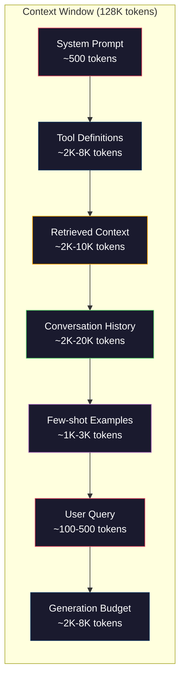
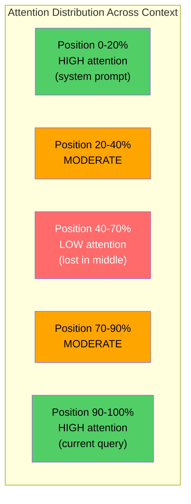
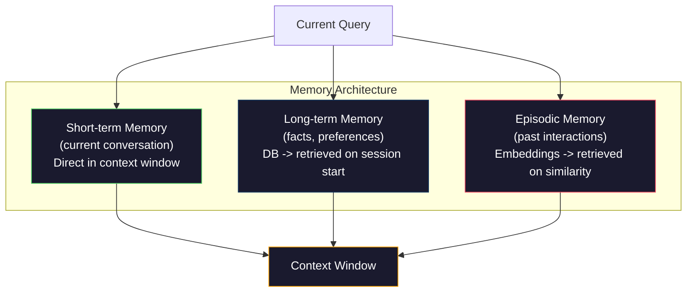

# 上下文工程：窗口、预算、记忆与检索

> 提示词工程是子集。上下文工程才是整个游戏。提示词是你输入的字符串。上下文是进入模型窗口的一切：系统指令、检索到的文档、工具定义、对话历史、少样本示例，以及提示词本身。2026 年最优秀的 AI 工程师是上下文工程师。他们决定什么进入窗口，什么被排除，以及以什么顺序排列。

**类型：** 构建实践  
**语言：** Python  
**前置条件：** 第 10 阶段（从零构建 LLM），第 11 阶段第 01-02 课  
**时间：** 约 90 分钟  
**相关内容：** 第 11 阶段第 15 课（提示词缓存）——缓存友好的布局是上下文工程的延伸。第 5 阶段第 28 课（长上下文评估），了解如何用 NIAH/RULER 测量"中间丢失"问题。

## 学习目标

- 计算所有上下文窗口组件（系统提示词、工具、历史、检索文档、生成预留）的 token 预算
- 实现上下文窗口管理策略：对话历史的截断、摘要化和滑动窗口
- 按优先级排列上下文组件，最大化模型对最相关信息的注意力
- 构建一个上下文组装器，根据查询类型和可用窗口空间动态分配 token

## 问题所在

Claude Opus 4.7 有 20 万 token 的窗口（beta 版 100 万）。GPT-5 有 40 万。Gemini 3 Pro 有 200 万。Llama 4 声称有 1000 万。这些数字听起来巨大，直到你把它们填满。

以下是一个代码助手的真实分解：系统提示词 500 tokens，50 个工具的工具定义 8000 tokens，检索到的文档 4000 tokens，10 轮对话历史 6000 tokens，当前用户查询 200 tokens，生成预算（最大输出）4000 tokens，总计 22700 tokens。这只占 12.8 万 token 窗口的 18%。

但注意力并不随上下文长度线性扩展。一个 12.8 万 token 的上下文模型需要二次方注意力成本（原始 Transformer 中 O(n²)，尽管大多数生产模型使用高效注意力变体）。更重要的是，检索准确率会下降。"针在草堆中"测试表明，模型很难找到放在长上下文中间的信息。Liu 等人（2023）的研究表明，LLM 能以接近完美的准确率检索长上下文开头和结尾的信息，但位于中间（上下文位置 40-70%）的信息准确率下降 10-20%。这种"中间丢失（lost-in-the-middle）"效应因模型而异，但影响所有当前架构。

实际教训：有 20 万 token 可用并不意味着使用 20 万 token 是有效的。精心策划的 1 万 token 上下文通常优于随意堆砌的 10 万 token 上下文。上下文工程是在上下文窗口内最大化信噪比的学科。

你放入窗口的每一个 token 都会置换一个可能携带更相关信息的 token。每一个无关的工具定义、每一个过时的对话轮次、每一段不能回答问题的检索文本——每一个都让模型在这个任务上变得稍差一些。

## 核心概念

### 上下文窗口是稀缺资源

把上下文窗口想象成 RAM，而不是磁盘。它快速且可直接访问，但是有限的。你无法装下所有东西。你必须选择。



每个组件都在争夺空间。增加更多工具定义意味着对话历史的空间更少。增加更多检索上下文意味着少样本示例的空间更少。上下文工程就是分配这个预算以最大化任务性能的艺术。

### 中间丢失

上下文工程中最重要的实证发现。模型对上下文开头和结尾的信息注意力更好。中间的信息获得较低的注意力分数，更容易被忽略。

Liu 等人（2023）系统性地测试了这一点。他们将相关文档放在 20 个不相关文档中的不同位置，并测量答案准确率。当相关文档排在第一位或最后一位时，准确率为 85-90%。当它在中间（20 个中的第 10 位）时，准确率下降到 60-70%。

这对工程有直接影响：

- 把最重要的信息放在最前面（系统提示词、关键指令）
- 把当前查询和最相关的上下文放在最后面（近因偏差有帮助）
- 把上下文中间视为最低优先级区域
- 如果必须在中间包含信息，在结尾重复关键点



### 上下文组件

**系统提示词（System prompt）**：设置角色、约束和行为规则。它排在最前面，在多轮对话中保持不变。Claude Code 的系统提示词大约有 6000 tokens，包括工具定义和行为指令。保持紧凑。系统提示词中的每个词都会在每次 API 调用时重复。

**工具定义（Tool definitions）**：每个工具增加 50-200 tokens（名称、描述、参数 schema）。50 个工具，每个 150 tokens，在任何对话发生之前就有 7500 tokens。动态工具选择——只包含与当前查询相关的工具——可以将这个值减少 60-80%。

**检索上下文（Retrieved context）**：来自向量数据库、搜索结果、文件内容的文档。检索质量直接决定响应质量。糟糕的检索比没有检索更糟——它用噪声填满了窗口，并会主动误导模型。

**对话历史（Conversation history）**：所有之前的用户消息和助手响应。随对话长度线性增长。每轮 200 tokens、50 轮对话就有 1 万 tokens 的历史记录。其中大部分与当前查询无关。

**少样本示例（Few-shot examples）**：展示期望行为的输入/输出对。两三个精心选择的示例通常比数千 tokens 的指令更能提高输出质量。但它们消耗空间。

**生成预算（Generation budget）**：为模型响应保留的 token。如果上下文填满了窗口，模型就没有空间回答。至少保留 2000-4000 tokens 用于生成。

### 上下文压缩策略

**历史摘要化（History summarization）**：不保留所有之前轮次的原文，而是定期对对话进行摘要。"我们讨论了 X，决定了 Y，用户想要 Z"用 100 tokens 替代了占 2000 tokens 的 10 轮对话。当历史超过阈值时运行摘要（例如 5000 tokens）。

**相关性过滤（Relevance filtering）**：对每个检索到的文档与当前查询打分，丢弃低于阈值的文档。如果你检索了 10 个块但只有 3 个相关，丢弃另外 7 个。3 个高度相关的块比 10 个平庸的块更好。

**工具剪枝（Tool pruning）**：分类用户的查询意图，只包含与该意图相关的工具。代码问题不需要日历工具。安排日程问题不需要文件系统工具。这可以将工具定义从 8000 tokens 减少到 1000 tokens。

**递归摘要（Recursive summarization）**：对于非常长的文档，分阶段摘要。先对每个部分摘要，再对摘要进行摘要。一个 50 页的文档变成一个捕获关键点的 500 token 摘要。

### 记忆系统

上下文工程跨越三个时间维度。

**短期记忆（Short-term memory）**：当前对话。直接存储在上下文窗口中。随每轮增长。通过摘要化和截断管理。

**长期记忆（Long-term memory）**：跨对话持续存在的事实和偏好。"用户偏好 TypeScript。""项目使用 PostgreSQL。"存储在数据库中，在会话开始时检索。Claude Code 将这存储在 CLAUDE.md 文件中。ChatGPT 将其存储在其记忆功能中。

**情节记忆（Episodic memory）**：可能相关的特定过去交互。"上周二，我们在 auth 模块中调试了类似的问题。"以嵌入形式存储，当当前对话与过去情节相似时检索。



### 动态上下文组装

关键洞察：不同的查询需要不同的上下文。静态系统提示词 + 静态工具 + 静态历史是浪费的。最好的系统为每个查询动态组装上下文。

1. 分类查询意图
2. 选择相关工具（不是所有工具）
3. 检索相关文档（不是固定集合）
4. 包含相关的历史轮次（不是所有历史）
5. 添加与任务类型匹配的少样本示例
6. 按重要性排序一切：关键的在最前，重要的在最后，可选的在中间

这就是优秀 AI 应用与卓越 AI 应用的区别。模型是相同的。上下文才是差异化因素。

## 构建实践

### 步骤 1：Token 计数器

你无法为无法测量的东西做预算。构建一个简单的 token 计数器（使用空白符分割的近似值，因为精确计数取决于分词器）。

```python
import json
import numpy as np
from collections import OrderedDict

def count_tokens(text):
    if not text:
        return 0
    return int(len(text.split()) * 1.3)

def count_tokens_json(obj):
    return count_tokens(json.dumps(obj))
```

### 步骤 2：上下文预算管理器

核心抽象。预算管理器追踪每个组件使用了多少 token，并强制执行限制。

```python
class ContextBudget:
    def __init__(self, max_tokens=128000, generation_reserve=4000):
        self.max_tokens = max_tokens
        self.generation_reserve = generation_reserve
        self.available = max_tokens - generation_reserve
        self.allocations = OrderedDict()

    def allocate(self, component, content, max_tokens=None):
        tokens = count_tokens(content)
        if max_tokens and tokens > max_tokens:
            words = content.split()
            target_words = int(max_tokens / 1.3)
            content = " ".join(words[:target_words])
            tokens = count_tokens(content)

        used = sum(self.allocations.values())
        if used + tokens > self.available:
            allowed = self.available - used
            if allowed <= 0:
                return None, 0
            words = content.split()
            target_words = int(allowed / 1.3)
            content = " ".join(words[:target_words])
            tokens = count_tokens(content)

        self.allocations[component] = tokens
        return content, tokens

    def remaining(self):
        used = sum(self.allocations.values())
        return self.available - used

    def utilization(self):
        used = sum(self.allocations.values())
        return used / self.max_tokens

    def report(self):
        total_used = sum(self.allocations.values())
        lines = []
        lines.append(f"Context Budget Report ({self.max_tokens:,} token window)")
        lines.append("-" * 50)
        for component, tokens in self.allocations.items():
            pct = tokens / self.max_tokens * 100
            bar = "#" * int(pct / 2)
            lines.append(f"  {component:<25} {tokens:>6} tokens ({pct:>5.1f}%) {bar}")
        lines.append("-" * 50)
        lines.append(f"  {'Used':<25} {total_used:>6} tokens ({total_used/self.max_tokens*100:.1f}%)")
        lines.append(f"  {'Generation reserve':<25} {self.generation_reserve:>6} tokens")
        lines.append(f"  {'Remaining':<25} {self.remaining():>6} tokens")
        return "\n".join(lines)
```

### 步骤 3：中间丢失重排序

实现重排序策略：最重要的条目放在最前和最后，最不重要的放在中间。

```python
def reorder_lost_in_middle(items, scores):
    paired = sorted(zip(scores, items), reverse=True)
    sorted_items = [item for _, item in paired]

    if len(sorted_items) <= 2:
        return sorted_items

    first_half = sorted_items[::2]
    second_half = sorted_items[1::2]
    second_half.reverse()

    return first_half + second_half

def score_relevance(query, documents):
    query_words = set(query.lower().split())
    scores = []
    for doc in documents:
        doc_words = set(doc.lower().split())
        if not query_words:
            scores.append(0.0)
            continue
        overlap = len(query_words & doc_words) / len(query_words)
        scores.append(round(overlap, 3))
    return scores
```

### 步骤 4：对话历史压缩器

摘要化旧的对话轮次以回收 token 预算。

```python
class ConversationManager:
    def __init__(self, max_history_tokens=5000):
        self.turns = []
        self.summaries = []
        self.max_history_tokens = max_history_tokens

    def add_turn(self, role, content):
        self.turns.append({"role": role, "content": content})
        self._compress_if_needed()

    def _compress_if_needed(self):
        total = sum(count_tokens(t["content"]) for t in self.turns)
        if total <= self.max_history_tokens:
            return

        while total > self.max_history_tokens and len(self.turns) > 4:
            old_turns = self.turns[:2]
            summary = self._summarize_turns(old_turns)
            self.summaries.append(summary)
            self.turns = self.turns[2:]
            total = sum(count_tokens(t["content"]) for t in self.turns)

    def _summarize_turns(self, turns):
        parts = []
        for t in turns:
            content = t["content"]
            if len(content) > 100:
                content = content[:100] + "..."
            parts.append(f"{t['role']}: {content}")
        return "Previous: " + " | ".join(parts)

    def get_context(self):
        parts = []
        if self.summaries:
            parts.append("[Conversation Summary]")
            for s in self.summaries:
                parts.append(s)
        parts.append("[Recent Conversation]")
        for t in self.turns:
            parts.append(f"{t['role']}: {t['content']}")
        return "\n".join(parts)

    def token_count(self):
        return count_tokens(self.get_context())
```

### 步骤 5：动态工具选择器

只包含与当前查询相关的工具。分类意图，然后过滤。

```python
TOOL_REGISTRY = {
    "read_file": {
        "description": "Read contents of a file",
        "tokens": 120,
        "categories": ["code", "files"],
    },
    "write_file": {
        "description": "Write content to a file",
        "tokens": 150,
        "categories": ["code", "files"],
    },
    "search_code": {
        "description": "Search for patterns in codebase",
        "tokens": 130,
        "categories": ["code"],
    },
    "run_command": {
        "description": "Execute a shell command",
        "tokens": 140,
        "categories": ["code", "system"],
    },
    "create_calendar_event": {
        "description": "Create a new calendar event",
        "tokens": 180,
        "categories": ["calendar"],
    },
    "list_emails": {
        "description": "List recent emails",
        "tokens": 160,
        "categories": ["email"],
    },
    "send_email": {
        "description": "Send an email message",
        "tokens": 200,
        "categories": ["email"],
    },
    "web_search": {
        "description": "Search the web for information",
        "tokens": 140,
        "categories": ["research"],
    },
    "query_database": {
        "description": "Run a SQL query on the database",
        "tokens": 170,
        "categories": ["code", "data"],
    },
    "generate_chart": {
        "description": "Generate a chart from data",
        "tokens": 190,
        "categories": ["data", "visualization"],
    },
}

def classify_intent(query):
    query_lower = query.lower()

    intent_keywords = {
        "code": ["code", "function", "bug", "error", "file", "implement", "refactor", "debug", "test"],
        "calendar": ["meeting", "schedule", "calendar", "appointment", "event"],
        "email": ["email", "mail", "send", "inbox", "message"],
        "research": ["search", "find", "what is", "how does", "explain", "look up"],
        "data": ["data", "query", "database", "chart", "graph", "analytics", "sql"],
    }

    scores = {}
    for intent, keywords in intent_keywords.items():
        score = sum(1 for kw in keywords if kw in query_lower)
        if score > 0:
            scores[intent] = score

    if not scores:
        return ["code"]

    max_score = max(scores.values())
    return [intent for intent, score in scores.items() if score >= max_score * 0.5]

def select_tools(query, token_budget=2000):
    intents = classify_intent(query)
    relevant = {}
    total_tokens = 0

    for name, tool in TOOL_REGISTRY.items():
        if any(cat in intents for cat in tool["categories"]):
            if total_tokens + tool["tokens"] <= token_budget:
                relevant[name] = tool
                total_tokens += tool["tokens"]

    return relevant, total_tokens
```

### 步骤 6：完整的上下文组装流水线

将所有内容连接在一起。给定一个查询，动态组装最优上下文。

```python
class ContextEngine:
    def __init__(self, max_tokens=128000, generation_reserve=4000):
        self.budget = ContextBudget(max_tokens, generation_reserve)
        self.conversation = ConversationManager(max_history_tokens=5000)
        self.system_prompt = (
            "You are a helpful AI assistant. You have access to tools for "
            "code editing, file management, web search, and data analysis. "
            "Use the appropriate tools for each task. Be concise and accurate."
        )
        self.knowledge_base = [
            "Python 3.12 introduced type parameter syntax for generic classes using bracket notation.",
            "The project uses PostgreSQL 16 with pgvector for embedding storage.",
            "Authentication is handled by Supabase Auth with JWT tokens.",
            "The frontend is built with Next.js 15 using the App Router.",
            "API rate limits are set to 100 requests per minute per user.",
            "The deployment pipeline uses GitHub Actions with Docker multi-stage builds.",
            "Test coverage must be above 80% for all new modules.",
            "The codebase follows the repository pattern for data access.",
        ]

    def assemble(self, query):
        self.budget = ContextBudget(self.budget.max_tokens, self.budget.generation_reserve)

        system_content, _ = self.budget.allocate("system_prompt", self.system_prompt, max_tokens=1000)

        tools, tool_tokens = select_tools(query, token_budget=2000)
        tool_text = json.dumps(list(tools.keys()))
        tool_content, _ = self.budget.allocate("tools", tool_text, max_tokens=2000)

        relevance = score_relevance(query, self.knowledge_base)
        threshold = 0.1
        relevant_docs = [
            doc for doc, score in zip(self.knowledge_base, relevance)
            if score >= threshold
        ]

        if relevant_docs:
            doc_scores = [s for s in relevance if s >= threshold]
            reordered = reorder_lost_in_middle(relevant_docs, doc_scores)
            doc_text = "\n".join(reordered)
            doc_content, _ = self.budget.allocate("retrieved_context", doc_text, max_tokens=3000)

        history_text = self.conversation.get_context()
        if history_text.strip():
            history_content, _ = self.budget.allocate("conversation_history", history_text, max_tokens=5000)

        query_content, _ = self.budget.allocate("user_query", query, max_tokens=500)

        return self.budget

    def chat(self, query):
        self.conversation.add_turn("user", query)
        budget = self.assemble(query)
        response = f"[Response to: {query[:50]}...]"
        self.conversation.add_turn("assistant", response)
        return budget


def run_demo():
    print("=" * 60)
    print("  Context Engineering Pipeline Demo")
    print("=" * 60)

    engine = ContextEngine(max_tokens=128000, generation_reserve=4000)

    print("\n--- Query 1: Code task ---")
    budget = engine.chat("Fix the bug in the authentication module where JWT tokens expire too early")
    print(budget.report())

    print("\n--- Query 2: Research task ---")
    budget = engine.chat("What is the best approach for implementing vector search in PostgreSQL?")
    print(budget.report())

    print("\n--- Query 3: After conversation history builds up ---")
    for i in range(8):
        engine.conversation.add_turn("user", f"Follow-up question number {i+1} about the implementation details of the system")
        engine.conversation.add_turn("assistant", f"Here is the response to follow-up {i+1} with technical details about the architecture")

    budget = engine.chat("Now implement the changes we discussed")
    print(budget.report())

    print("\n--- Tool Selection Examples ---")
    test_queries = [
        "Fix the bug in auth.py",
        "Schedule a meeting with the team for Tuesday",
        "Show me the database query performance stats",
        "Search for best practices on error handling",
    ]

    for q in test_queries:
        tools, tokens = select_tools(q)
        intents = classify_intent(q)
        print(f"\n  Query: {q}")
        print(f"  Intents: {intents}")
        print(f"  Tools: {list(tools.keys())} ({tokens} tokens)")

    print("\n--- Lost-in-the-Middle Reordering ---")
    docs = ["Doc A (most relevant)", "Doc B (somewhat relevant)", "Doc C (least relevant)",
            "Doc D (relevant)", "Doc E (moderately relevant)"]
    scores = [0.95, 0.60, 0.20, 0.80, 0.50]
    reordered = reorder_lost_in_middle(docs, scores)
    print(f"  Original order: {docs}")
    print(f"  Scores:         {scores}")
    print(f"  Reordered:      {reordered}")
    print(f"  (Most relevant at start and end, least relevant in middle)")
```

## 实际使用

### Claude Code 的上下文策略

Claude Code 使用分层方法管理上下文。系统提示词包含行为规则和工具定义（约 6000 tokens）。当你打开文件时，其内容作为上下文注入。当你搜索时，结果被添加。旧的对话轮次被摘要化。CLAUDE.md 提供跨会话持久存在的长期记忆。

关键工程决策：Claude Code 不把你的整个代码库放入上下文。它按需检索相关文件。这就是上下文工程在实践中的样子。

### Cursor 的动态上下文加载

Cursor 将你的整个代码库索引为嵌入向量。当你输入查询时，它使用向量相似度检索最相关的文件和代码块。只有这些片段进入上下文窗口。一个 50 万行的代码库被压缩成 5-10 个最相关的代码块。

这就是模式：嵌入所有内容，按需检索，只包含重要的。

### ChatGPT 记忆

ChatGPT 将用户偏好和事实存储为长期记忆。在每次对话开始时，相关记忆被检索并包含在系统提示词中。"用户偏好 Python"花费 5 个 token，但在多次对话中节省了数百 token 的重复指令。

### RAG 作为上下文工程

检索增强生成（Retrieval-Augmented Generation，RAG）是形式化的上下文工程。你不把知识塞进模型权重（训练）或系统提示词（静态上下文），而是在查询时检索相关文档并注入上下文窗口。整个 RAG 流水线——分块、嵌入、检索、重排序——都是为了解决一个问题：把正确的信息放入上下文窗口。

## 交付成果

本课产出 `outputs/prompt-context-optimizer.md`——一个可复用的提示词，审计上下文组装策略并推荐优化措施。输入你的系统提示词、工具数量、平均历史长度和检索策略，它会识别 token 浪费并提出改进建议。

还产出 `outputs/skill-context-engineering.md`——一个基于任务类型、上下文窗口大小和延迟预算设计上下文组装流水线的决策框架。

## 练习

1. 为 ContextBudget 类添加"token 浪费检测器"。它应该标记使用超过 30% 预算的组件，并针对每种组件类型提出具体的压缩策略（摘要化历史、剪枝工具、重排序文档）。

2. 为检索到的上下文实现语义去重。如果两个检索到的文档相似度超过 80%（按词重叠或其嵌入的余弦相似度），只保留分数较高的那个。衡量这能回收多少 token 预算。

3. 构建一个"上下文回放"工具。给定一份对话记录，通过 ContextEngine 回放它，并可视化预算分配如何随轮次变化。随时间绘制每个组件的 token 使用量。识别上下文开始被压缩的那一轮。

4. 实现基于优先级的工具选择器。不是简单的包含/排除，而是为每个工具对当前查询打相关性分数。按相关性降序包含工具，直到工具预算耗尽。比较包含 5、10、20 和 50 个工具时的任务性能。

5. 构建多策略上下文压缩器。实现三种压缩策略（截断、摘要化、提取关键句子）并在 20 个文档集上进行基准测试。衡量压缩比与信息保留之间的权衡（压缩版本是否仍然包含查询的答案？）。

## 关键术语

| 术语 | 人们的说法 | 实际含义 |
|-----|----------|---------|
| 上下文窗口（Context window） | "模型能读多少" | 模型在单次前向传播中处理的最大 token 数（输入+输出）——GPT-5 40 万，Claude Opus 4.7 20 万（1M beta），Gemini 3 Pro 200 万 |
| 上下文工程（Context engineering） | "高级提示词工程" | 决定什么进入上下文窗口、以什么顺序、优先级如何的学科——涵盖检索、压缩、工具选择和记忆管理 |
| 中间丢失（Lost-in-the-middle） | "模型忘记中间的内容" | 实证发现：LLM 对上下文开头和结尾的信息注意力更好，位于中间的信息准确率下降 10-20% |
| Token 预算（Token budget） | "剩余多少 token" | 上下文窗口容量在各组件（系统提示词、工具、历史、检索、生成）之间的显式分配，含每组件限制 |
| 动态上下文（Dynamic context） | "实时加载内容" | 根据意图分类、相关工具选择和检索结果，为每个查询以不同方式组装上下文窗口 |
| 历史摘要化（History summarization） | "压缩对话" | 用简洁摘要替换逐字记录的旧对话轮次，在保留关键信息的同时降低 token 成本 |
| 工具剪枝（Tool pruning） | "只包含相关工具" | 分类查询意图，只包含匹配的工具定义，将工具 token 成本降低 60-80% |
| 长期记忆（Long-term memory） | "跨会话记忆" | 存储在数据库中并在会话开始时检索的事实和偏好——CLAUDE.md、ChatGPT Memory 等系统 |
| 情节记忆（Episodic memory） | "记住特定过去事件" | 存储为嵌入的过去交互，当当前查询与过去对话相似时检索 |
| 生成预算（Generation budget） | "留给答案的空间" | 为模型输出保留的 token——如果上下文完全填满窗口，模型就没有空间响应 |

## 延伸阅读

- [Liu 等人，2023 — "Lost in the Middle: How Language Models Use Long Contexts"](https://arxiv.org/abs/2307.03172) — 关于位置依赖注意力的权威研究，表明模型在长上下文中间的信息处理上存在困难
- [Anthropic 的 Contextual Retrieval 博客文章](https://www.anthropic.com/news/contextual-retrieval) — Anthropic 如何处理上下文感知的块检索，将检索失败率降低了 49%
- [Simon Willison 的 "Context Engineering"](https://simonwillison.net/2025/Jun/27/context-engineering/) — 命名这个学科并将其与提示词工程区分开来的博客文章
- [LangChain RAG 文档](https://python.langchain.com/docs/tutorials/rag/) — 将检索增强生成作为上下文工程模式的实际实现
- [Greg Kamradt 的 Needle in a Haystack 测试](https://github.com/gkamradt/LLMTest_NeedleInAHaystack) — 揭示所有主要模型中位置依赖检索失败的基准
- [Pope 等人，"Efficiently Scaling Transformer Inference"（2022）](https://arxiv.org/abs/2211.05102) — 为什么上下文长度驱动内存和延迟，以及 KV 缓存、MQA 和 GQA 如何改变预算计算
- [Agrawal 等人，"SARATHI: Efficient LLM Inference by Piggybacking Decodes with Chunked Prefills"（2023）](https://arxiv.org/abs/2308.16369) — 使长提示词在 TTFT 上昂贵但在 TPOT 上廉价的推理两阶段；上下文打包权衡的基本原理
- [Ainslie 等人，"GQA: Training Generalized Multi-Query Transformer Models from Multi-Head Checkpoints"（EMNLP 2023）](https://arxiv.org/abs/2305.13245) — 分组查询注意力论文，在生产解码器中将 KV 内存减少 8 倍而不损失质量
