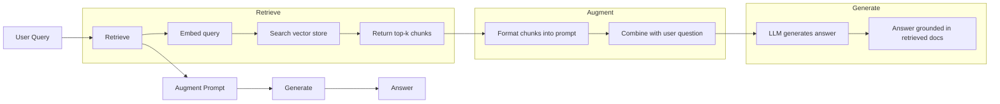
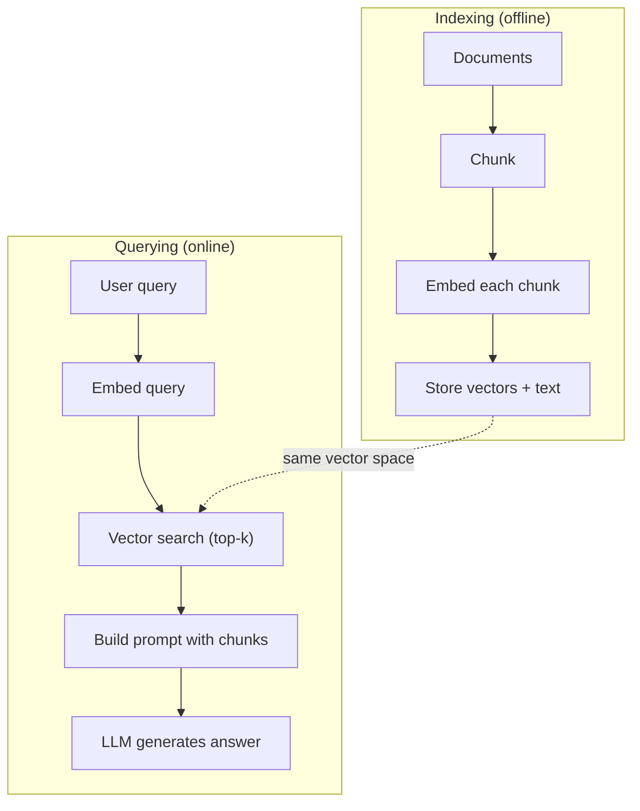

# RAG（检索增强生成）

> 你的 LLM 知道训练截止日期以前的一切。它对你的公司文档、你的代码库或上周的会议记录一无所知。RAG 通过检索相关文档并将其填入提示词来解决这个问题。这是生产 AI 中部署最广泛的模式。如果你从本课程中只构建一件事，那就构建一个 RAG 流水线。

**类型：** 构建实践  
**语言：** Python  
**前置条件：** 第 10 阶段（从零构建 LLM），第 11 阶段第 01-05 课  
**时间：** 约 90 分钟  
**相关内容：** 第 5 阶段第 23 课（RAG 的分块策略），了解六种分块算法及各自的适用场景。第 5 阶段第 22 课（嵌入模型深度解析），了解如何选择嵌入器。第 11 阶段第 07 课（高级 RAG），了解混合搜索、重排序和查询变换。

## 学习目标

- 构建完整的 RAG 流水线：文档加载、分块、嵌入、向量存储、检索和生成
- 使用向量数据库（ChromaDB、FAISS 或 Pinecone）实现带适当索引的语义搜索
- 解释为什么 RAG 优于微调（fine-tuning）用于知识密集型应用（成本、时效性、可溯源性）
- 使用检索指标（precision、recall）和生成指标（忠实性、相关性）评估 RAG 质量

## 问题所在

你为公司构建了一个聊天机器人。客户问："企业计划的退款政策是什么？"LLM 用一个关于典型 SaaS 退款政策的通用答案回应。而实际政策，埋在 200 页的内部 wiki 中，说的是：企业客户享有 60 天退款窗口，并按比例退款。LLM 从未见过这个文档，它无法知道训练数据中没有的内容。

微调（fine-tuning）是一种解决方案。获取 LLM，在你的内部文档上训练它，然后部署更新后的模型。这有效，但存在严重问题。微调在计算上花费数千美元。文档一旦更改，模型就过时了。你无法知道模型从哪个来源得出了答案。如果公司下个月收购了另一个产品线，你还得再次微调。

RAG 是另一种解决方案。保持模型不变。当问题进来时，在你的文档库中搜索相关段落，在问题之前将它们粘贴到提示词中，然后让模型以这些段落为上下文来回答。文档库可以在几分钟内更新。你可以确切地看到检索到了哪些文档。模型本身永远不会改变。这就是为什么 RAG 是生产中的主流模式：它更便宜、更新鲜、更可审计，而且适用于任何 LLM。

## 核心概念

### RAG 模式

整个模式包含四个步骤：



查询 -> 检索 -> 增强提示词 -> 生成。每个 RAG 系统都遵循这个模式。生产 RAG 系统之间的差异在于每个步骤的细节：如何分块、如何嵌入、如何搜索以及如何构建提示词。

### 为什么 RAG 优于微调

| 关注点 | 微调 | RAG |
|-------|-----|-----|
| 成本 | 每次训练 $1,000-$100,000+ | 每次查询 $0.01-$0.10（嵌入 + LLM） |
| 时效性 | 重新训练之前都是过时的 | 重新索引文档后几分钟内更新 |
| 可审计性 | 无法追踪答案来源 | 可以展示确切的检索段落 |
| 幻觉 | 仍然自由地产生幻觉 | 以检索到的文档为依据 |
| 数据隐私 | 训练数据烘焙进权重 | 文档保留在你的向量库中 |

微调永久改变模型的权重。RAG 临时改变模型的上下文。对于大多数应用，临时上下文才是你想要的。

微调胜出的唯一情况：当你需要模型采用一种无法仅通过提示词实现的特定风格、语气或推理模式时。对于事实知识检索，RAG 每次都能赢。

### 嵌入模型

嵌入模型将文本转换为稠密向量。相似的文本在这个高维空间中产生距离相近的向量。"我怎么重置密码？"和"我需要更改密码"产生几乎相同的向量，尽管它们几乎没有共同词汇。"猫坐在垫子上"产生非常不同的向量。

常用嵌入模型（2026 年阵容——完整分析见第 5 阶段第 22 课）：

| 模型 | 维度 | 提供商 | 说明 |
|-----|-----|------|-----|
| text-embedding-3-small | 1536（Matryoshka） | OpenAI | 大多数用例的最佳价格/性能 |
| text-embedding-3-large | 3072（Matryoshka） | OpenAI | 更高准确率，可截断至 256/512/1024 |
| Gemini Embedding 2 | 3072（Matryoshka） | Google | MTEB 检索排名顶端；8K 上下文 |
| voyage-4 | 1024/2048（Matryoshka） | Voyage AI | 域特定变体（代码、金融、法律） |
| Cohere embed-v4 | 1024（Matryoshka） | Cohere | 强多语言支持，128K 上下文 |
| BGE-M3 | 1024（稠密+稀疏+ColBERT） | BAAI（开放权重） | 单模型三视角 |
| Qwen3-Embedding | 4096（Matryoshka） | Alibaba（开放权重） | 最高开放权重检索评分 |
| all-MiniLM-L6-v2 | 384 | 开放权重（Sentence Transformers） | 原型开发基线 |

本课中，我们使用 TF-IDF 构建自己的简单嵌入。不是因为 TF-IDF 是生产系统使用的，而是因为它使概念具体化：文本进入，向量输出，相似文本产生相似向量。

### 向量相似度

给定两个向量，如何衡量相似度？三种选择：

**余弦相似度（Cosine similarity）**：两个向量之间夹角的余弦值。范围从 -1（相反）到 1（相同）。忽略大小，只关心方向。这是 RAG 的默认选择。

```
cosine_sim(a, b) = dot(a, b) / (||a|| * ||b||)
```

**点积（Dot product）**：原始内积。向量越大，分数越高。当大小携带信息时有用（较长的文档可能更相关）。

```
dot(a, b) = sum(a_i * b_i)
```

**L2（欧氏）距离（Euclidean distance）**：向量空间中的直线距离。距离越小 = 越相似。对大小差异敏感。

```
L2(a, b) = sqrt(sum((a_i - b_i)^2))
```

余弦相似度是标准。它优雅地处理不同长度的文档，因为它按大小归一化。当有人说"向量搜索"时，他们几乎总是指余弦相似度。

### 分块策略

文档太长，无法作为单个向量嵌入。一个 50 页的 PDF 可能会产生糟糕的嵌入，因为它包含几十个主题。相反，你将文档分割成块并分别嵌入每个块。

**固定大小分块（Fixed-size chunking）**：每 N 个 token 分割。简单可预测。512 token 的块带 50 token 重叠，意味着第 1 块是 token 0-511，第 2 块是 token 462-973，以此类推。重叠确保不会在不幸的边界处切断句子。

**语义分块（Semantic chunking）**：在自然边界处分割。段落、章节或 markdown 标题。每块是一个连贯的意义单元。实现更复杂，但产生更好的检索效果。

**递归分块（Recursive chunking）**：先尝试在最大边界处分割（章节标题）。如果章节仍然太大，在段落边界处分割。如果段落仍然太大，在句子边界处分割。这是 LangChain `RecursiveCharacterTextSplitter` 的方法，实践中效果很好。

块大小比人们想象的更重要：

- 太小（64-128 token）：每块缺乏上下文。"它上个季度增长了 15%"如果不知道"它"指什么，就毫无意义。
- 太大（2048+ token）：每块涵盖多个主题，稀释了相关性。搜索营收数据时，你得到一个 10% 关于营收、90% 关于人力资源的块。
- 最佳区间（256-512 token）：足够的上下文使其自成一体，又足够聚焦以保持相关性。

大多数生产 RAG 系统使用 256-512 token 的块，50 token 重叠。Anthropic 的 RAG 指南推荐这个范围。

### 向量数据库

有了嵌入向量，你需要一个地方来存储和搜索它们。选项：

| 数据库 | 类型 | 最适合 |
|-------|------|-------|
| FAISS | 库（进程内） | 原型开发，小到中等数据集 |
| Chroma | 轻量级 DB | 本地开发，小型部署 |
| Pinecone | 托管服务 | 无运维负担的生产环境 |
| Weaviate | 开源 DB | 自托管生产环境 |
| pgvector | Postgres 扩展 | 已在使用 Postgres |
| Qdrant | 开源 DB | 高性能自托管 |

本课中，我们构建一个简单的内存向量库。它将向量存储在列表中，并执行暴力余弦相似度搜索。这等同于带平铺索引的 FAISS。在变慢之前大约可以扩展到 10 万个向量。生产系统使用近似最近邻（ANN）算法（如 HNSW）在毫秒级内搜索数百万个向量。

### 完整流水线



索引阶段每个文档运行一次（或在文档更新时运行）。查询阶段在每次用户请求时运行。在生产中，索引可能需要数小时处理数百万个文档。查询必须在一秒内响应。

### 实际数据

大多数生产 RAG 系统使用以下参数：

- **k = 5 到 10**：每次查询检索的块数
- **块大小 = 256 到 512 token**，50 token 重叠
- **上下文预算**：每次查询 2500-5000 tokens 的检索内容
- **完整提示词**：约 8000-16000 tokens（系统提示词 + 检索块 + 对话历史 + 用户查询）
- **嵌入维度**：384-3072，取决于模型
- **索引吞吐量**：API 嵌入每秒 100-1000 个文档
- **查询延迟**：检索 50-200 毫秒，生成 500-3000 毫秒

## 构建实践

### 步骤 1：文档分块

```python
def chunk_text(text, chunk_size=200, overlap=50):
    words = text.split()
    chunks = []
    start = 0
    while start < len(words):
        end = start + chunk_size
        chunk = " ".join(words[start:end])
        chunks.append(chunk)
        start += chunk_size - overlap
    return chunks
```

### 步骤 2：TF-IDF 嵌入

我们构建一个简单的嵌入函数。TF-IDF（词频-逆文档频率，Term Frequency-Inverse Document Frequency）不是神经嵌入，但它以一种捕获词重要性的方式将文本转换为向量。文档中频繁出现的词获得更高的 TF。在整个语料库中罕见的词获得更高的 IDF。乘积给出一个向量，其中重要的、独特的词具有高值。

```python
import math
from collections import Counter

def build_vocabulary(documents):
    vocab = set()
    for doc in documents:
        vocab.update(doc.lower().split())
    return sorted(vocab)

def compute_tf(text, vocab):
    words = text.lower().split()
    count = Counter(words)
    total = len(words)
    return [count.get(word, 0) / total for word in vocab]

def compute_idf(documents, vocab):
    n = len(documents)
    idf = []
    for word in vocab:
        doc_count = sum(1 for doc in documents if word in doc.lower().split())
        idf.append(math.log((n + 1) / (doc_count + 1)) + 1)
    return idf

def tfidf_embed(text, vocab, idf):
    tf = compute_tf(text, vocab)
    return [t * i for t, i in zip(tf, idf)]
```

### 步骤 3：余弦相似度搜索

```python
def cosine_similarity(a, b):
    dot = sum(x * y for x, y in zip(a, b))
    norm_a = math.sqrt(sum(x * x for x in a))
    norm_b = math.sqrt(sum(x * x for x in b))
    if norm_a == 0 or norm_b == 0:
        return 0.0
    return dot / (norm_a * norm_b)

def search(query_embedding, stored_embeddings, top_k=5):
    scores = []
    for i, emb in enumerate(stored_embeddings):
        sim = cosine_similarity(query_embedding, emb)
        scores.append((i, sim))
    scores.sort(key=lambda x: x[1], reverse=True)
    return scores[:top_k]
```

### 步骤 4：提示词构建

这是 RAG 中"增强"发生的地方。获取检索到的块，将它们格式化为提示词，并让 LLM 基于提供的上下文回答。

```python
def build_rag_prompt(query, retrieved_chunks):
    context = "\n\n---\n\n".join(
        f"[Source {i+1}]\n{chunk}"
        for i, chunk in enumerate(retrieved_chunks)
    )
    return f"""Answer the question based ONLY on the following context.
If the context doesn't contain enough information, say "I don't have enough information to answer that."

Context:
{context}

Question: {query}

Answer:"""
```

### 步骤 5：完整的 RAG 流水线

```python
class RAGPipeline:
    def __init__(self):
        self.chunks = []
        self.embeddings = []
        self.vocab = []
        self.idf = []

    def index(self, documents):
        all_chunks = []
        for doc in documents:
            all_chunks.extend(chunk_text(doc))
        self.chunks = all_chunks
        self.vocab = build_vocabulary(all_chunks)
        self.idf = compute_idf(all_chunks, self.vocab)
        self.embeddings = [
            tfidf_embed(chunk, self.vocab, self.idf)
            for chunk in all_chunks
        ]

    def query(self, question, top_k=5):
        query_emb = tfidf_embed(question, self.vocab, self.idf)
        results = search(query_emb, self.embeddings, top_k)
        retrieved = [(self.chunks[i], score) for i, score in results]
        prompt = build_rag_prompt(
            question, [chunk for chunk, _ in retrieved]
        )
        return prompt, retrieved
```

### 步骤 6：生成（模拟）

在生产中，这里是你调用 LLM API 的地方。本课中，我们通过从检索到的上下文中提取最相关的句子来模拟生成。

```python
def simple_generate(prompt, retrieved_chunks):
    query_words = set(prompt.lower().split("question:")[-1].split())
    best_sentence = ""
    best_score = 0
    for chunk in retrieved_chunks:
        for sentence in chunk.split("."):
            sentence = sentence.strip()
            if not sentence:
                continue
            words = set(sentence.lower().split())
            overlap = len(query_words & words)
            if overlap > best_score:
                best_score = overlap
                best_sentence = sentence
    return best_sentence if best_sentence else "I don't have enough information."
```

## 实际使用

使用真实的嵌入模型和 LLM，代码几乎不需要改变：

```python
from openai import OpenAI

client = OpenAI()

def embed(text):
    response = client.embeddings.create(
        model="text-embedding-3-small",
        input=text
    )
    return response.data[0].embedding

def generate(prompt):
    response = client.chat.completions.create(
        model="gpt-4o-mini",
        messages=[{"role": "user", "content": prompt}],
        temperature=0
    )
    return response.choices[0].message.content
```

或使用 Anthropic：

```python
import anthropic

client = anthropic.Anthropic()

def generate(prompt):
    response = client.messages.create(
        model="claude-sonnet-4-20250514",
        max_tokens=1024,
        messages=[{"role": "user", "content": prompt}]
    )
    return response.content[0].text
```

流水线是相同的。替换嵌入函数。替换生成函数。检索逻辑、分块、提示词构建——无论使用哪种模型，一切都相同。

对于大规模向量存储，用适当的向量数据库替换暴力搜索：

```python
import chromadb

client = chromadb.Client()
collection = client.create_collection("my_docs")

collection.add(
    documents=chunks,
    ids=[f"chunk_{i}" for i in range(len(chunks))]
)

results = collection.query(
    query_texts=["What is the refund policy?"],
    n_results=5
)
```

Chroma 内部处理嵌入（默认使用 all-MiniLM-L6-v2）并将向量存储在本地数据库中。相同的模式，不同的管道。

## 交付成果

本课产出：
- `outputs/prompt-rag-architect.md` — 为特定用例设计 RAG 系统的提示词
- `outputs/skill-rag-pipeline.md` — 教导智能体如何构建和调试 RAG 流水线的技能

## 练习

1. 将 TF-IDF 嵌入替换为简单的词袋（bag-of-words）方法（二值化：词存在为 1，不存在为 0）。比较样本文档上的检索质量。TF-IDF 应该更优，因为它对罕见词赋予更高的权重。

2. 实验块大小：在同一文档集上尝试 50、100、200 和 500 词。对于每种大小，运行相同的 5 个查询，计算有多少个在前 3 中返回了相关块。找到检索质量达到峰值的最优区间。

3. 为每个块添加元数据（源文档名称、块位置）。修改提示词模板以包含来源归因，使 LLM 引用其来源。

4. 实现简单的评估：给定 10 个问答对，通过 RAG 流水线运行每个问题，衡量检索到的块中包含答案的百分比。这是 k 处的检索召回率。

5. 构建一个对话感知的 RAG 流水线：维护最近 3 次交流的历史，并将其与检索到的块一起包含在提示词中。用后续问题测试，例如询问定价后问"企业版呢？"

## 关键术语

| 术语 | 人们的说法 | 实际含义 |
|-----|----------|---------|
| RAG | "读你文档的 AI" | 检索相关文档，将其粘贴到提示词中，生成以这些文档为依据的答案 |
| 嵌入（Embedding） | "将文本转成数字" | 文本的稠密向量表示，相似含义产生相似向量 |
| 向量数据库（Vector database） | "AI 的搜索引擎" | 为存储向量和按相似度查找最近邻优化的数据存储 |
| 分块（Chunking） | "把文档切成小块" | 将文档分割成较小的片段（通常 256-512 token），使每个片段可以独立嵌入和检索 |
| 余弦相似度（Cosine similarity） | "两个向量有多相似" | 两个向量之间夹角的余弦；1 = 方向相同，0 = 正交，-1 = 相反 |
| Top-k 检索（Top-k retrieval） | "获取 k 个最佳匹配" | 从向量库中返回与查询最相似的 k 个块 |
| 上下文窗口（Context window） | "LLM 能看多少文本" | LLM 在单次请求中可以处理的最大 token 数；检索到的块必须适合其中 |
| 增强生成（Augmented generation） | "用给定上下文回答" | 使用检索到的文档作为上下文生成响应，而不是单纯依赖训练知识 |
| TF-IDF | "词重要性评分" | 词频×逆文档频率；按词在语料库中的独特性加权 |
| 索引（Indexing） | "为搜索准备文档" | 对文档进行分块、嵌入和存储的离线过程，使其可在查询时被搜索 |

## 延伸阅读

- Lewis 等人，"Retrieval-Augmented Generation for Knowledge-Intensive NLP Tasks"（2020）— 来自 Facebook AI Research 的原始 RAG 论文，将检索-然后-生成模式形式化
- Anthropic 的 RAG 文档（docs.anthropic.com）— 关于块大小、提示词构建和评估的实用指南
- Pinecone Learning Center，"What is RAG?" — RAG 流水线的清晰视觉解释，含生产考量
- Sentence-BERT：Reimers & Gurevych（2019）— all-MiniLM 嵌入模型背后的论文，展示如何为语义相似性训练双编码器
- [Karpukhin 等人，"Dense Passage Retrieval for Open-Domain Question Answering"（EMNLP 2020）](https://arxiv.org/abs/2004.04906) — DPR 论文，证明稠密双编码器检索在开放域问答上优于 BM25，为现代 RAG 检索器设定了模式
- [LlamaIndex 高级概念](https://docs.llamaindex.ai/en/stable/getting_started/concepts.html) — 构建 RAG 流水线时需要了解的主要概念：数据加载器、节点解析器、索引、检索器、响应合成器
- [LangChain RAG 教程](https://python.langchain.com/docs/tutorials/rag/) — 另一种风格的编排框架；相同检索-然后-生成模式的可运行链视角
