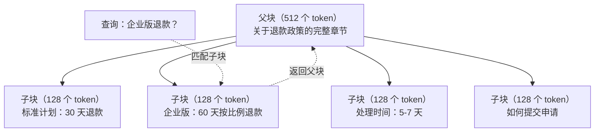
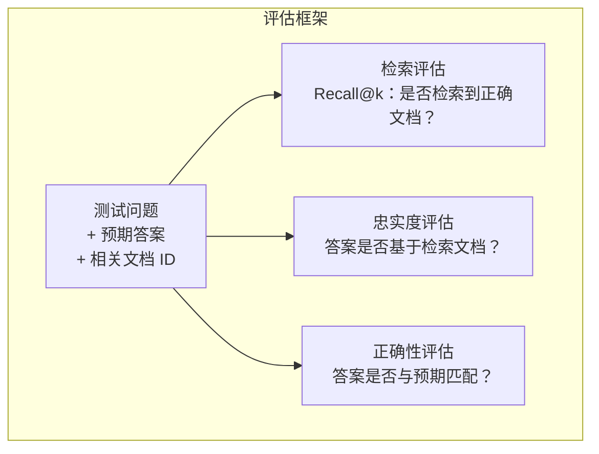

# 高级 RAG（分块、重排序、混合搜索）

> 基础 RAG 检索前 k 个最相似的块。这对简单问题有效，但在多跳推理、模糊查询和大型语料库中会失效。高级 RAG 是一个在 10 个文档上运行的演示与一个在 1000 万个文档上可靠工作的系统之间的区别。

**类型：** 构建
**语言：** Python
**前置条件：** 第 11 阶段，第 06 课（RAG）
**时间：** ~90 分钟
**相关内容：** 阶段 5 · 23（RAG 的分块策略）涵盖所有六种分块算法——递归、语义、句子、父文档、延迟分块、上下文检索——包含 Vectara/Anthropic 基准测试。本课在此基础上扩展：混合搜索、重排序、查询转换。

## 学习目标

- 实现保留文档结构和上下文的高级分块策略（语义、递归、父子）
- 构建结合 BM25 关键词匹配、语义向量搜索和交叉编码器重排序器的混合搜索流水线
- 应用查询转换技术（HyDE、多查询、逐步回退）改进对模糊或复杂问题的检索
- 诊断并修复常见的 RAG 失败：检索到错误的块、答案不在上下文中、多跳推理崩溃

## 问题所在

你在第 06 课构建了基础 RAG 流水线，它对小型语料库上的直接问题有效。现在尝试以下场景：

**模糊查询**："上个季度的营收是多少？"语义搜索返回关于营收战略、营收预测和 CFO 对营收增长看法的块——所有这些在语义上都与"营收"这个词相似，但没有一个包含实际数字。正确的块写着"2025 年 Q3 收入 4720 万美元"，但使用的是"收入"而非"营收"。嵌入模型认为"营收战略"比"Q3 收入为 4720 万美元"更接近查询。

**多跳问题**："哪个团队的客户满意度得分提升最大？"这需要找到每个团队的满意度得分，进行比较，然后找到最大值。没有任何单一的块包含完整答案——信息分散在各团队报告中。

**大型语料库问题**：你有 200 万个块。正确答案在第 1,847,293 号块。你的前 5 检索返回了第 14、89,201、1,200,000、44 和 901,333 号块——在嵌入空间中很近，但没有一个包含答案。在这种规模下，近似最近邻搜索引入了足够的误差，使相关结果被推出前 k 名。

基础 RAG 失败是因为向量相似度不等于相关性。一个块可以在语义上与查询相似，却对回答问题毫无用处。高级 RAG 通过四种技术解决这个问题：混合搜索（添加关键词匹配）、重排序（更仔细地评分候选项）、查询转换（在搜索前修复查询）和更好的分块（在正确的粒度级别检索）。

## 核心概念

### 混合搜索（Hybrid Search）：语义 + 关键词

语义搜索（向量相似度）擅长理解含义。"如何取消我的订阅？"能匹配"终止你的计划的步骤"，即使它们没有共同的词汇。但它会遗漏精确匹配——"错误代码 E-4021"可能无法匹配包含"E-4021"的块，因为嵌入模型将其视为噪音。

关键词搜索（BM25）则相反。它擅长精确匹配。"E-4021"完美匹配。但如果文档说"终止你的计划"，"取消我的订阅"就会返回零结果。

混合搜索同时运行两者，然后合并结果。

**BM25**（Best Matching 25，最佳匹配 25）是标准关键词搜索算法，自 1990 年代以来一直是搜索引擎的骨干。公式为：

```
BM25(q, d) = 对查询 q 中的每个词项 t 求和：
    IDF(t) * (tf(t,d) * (k1 + 1)) / (tf(t,d) + k1 * (1 - b + b * |d| / avgdl))
```

其中 tf(t,d) 是词项 t 在文档 d 中的词频，IDF(t) 是逆文档频率，|d| 是文档长度，avgdl 是平均文档长度，k1 控制词频饱和度（默认 1.2），b 控制长度归一化（默认 0.75）。

简单来说：BM25 对包含查询词项（尤其是罕见词）的文档给出更高分数，但重复词项的回报递减。一个包含 50 次"营收"的文档并不比只包含一次的文档相关 50 倍。

### 互惠秩融合（Reciprocal Rank Fusion，RRF）

你有两个排名列表：一个来自向量搜索，一个来自 BM25。如何合并它们？互惠秩融合（RRF）是标准方法：

```
RRF_score(d) = 对每个排名 R 求和：
    1 / (k + rank_R(d))
```

其中 k 是常数（通常为 60），防止排名第一的结果占主导地位。

在向量搜索中排第 1、在 BM25 中排第 5 的文档得分：1/(60+1) + 1/(60+5) = 0.0164 + 0.0154 = **0.0318**

在向量搜索中排第 3、在 BM25 中排第 2 的文档得分：1/(60+3) + 1/(60+2) = 0.0159 + 0.0161 = **0.0320**

RRF 自然地平衡了两个信号。在两个列表中都排名靠前的文档获得最佳分数。在一个列表中排第 1 但不在另一个列表中的文档获得中等分数。由于使用的是排名而非原始分数，两个系统之间评分分布的差异不会影响结果。

### 重排序（Reranking）

检索（无论是向量、关键词还是混合）速度快但不够精确。它使用双编码器（bi-encoder）：查询和每个文档独立嵌入，然后进行比较。嵌入一次计算后可以缓存，可扩展到数百万文档。

重排序使用交叉编码器（cross-encoder）：查询和候选文档一起输入到一个输出相关性分数的模型中。该模型同时看到两段文本，能够捕捉它们之间的细粒度交互。交叉编码器可以理解"Q3 收入是多少？"与包含"Q3 收入 4720 万美元"的块高度相关，即使双编码器错过了这种联系。

权衡：交叉编码器比双编码器慢 100-1000 倍，因为它联合处理查询-文档对，无法为数百万文档预计算交叉编码器分数。解决方案：先检索较大的候选集（混合搜索的前 50 名），再用交叉编码器重排序得到最终前 5 名。


常见重排序模型（2026 年阵容）：

| 模型 | 类型 | 特点 |
|------|------|------|
| Cohere Rerank 3.5 | 托管 API | 多语言，混合语料库召回率提升最佳 |
| Voyage rerank-2.5 | 托管 API | 托管选项中延迟最低 |
| Jina-Reranker-v2 Multilingual | 开放权重 | 支持 100+ 种语言 |
| bge-reranker-v2-m3 | 开放权重 | 强力基准模型 |
| cross-encoder/ms-marco-MiniLM-L-6-v2 | 开放权重 | 可在 CPU 上运行，适合原型开发 |
| ColBERTv2 / Jina-ColBERT-v2 | 开放权重 | 后期交互多向量重排序器 |

### 查询转换（Query Transformation）

有时问题不在于检索，而在于查询本身。"那个关于新政策变更的东西是什么？"是一个糟糕的搜索查询——它不包含具体词项，嵌入模糊，没有检索系统能从中找到正确文档。

**查询重写（Query rewriting）**：将用户查询改写为更好的搜索查询。LLM 可以做到这一点：

```
用户："那个关于新政策变更的东西是什么？"
改写后："最新政策变更和更新"
```

**HyDE（假设文档嵌入，Hypothetical Document Embeddings）**：不使用查询搜索，而是生成一个假设答案，嵌入它，然后搜索相似的真实文档：

```
查询："企业版的退款政策是什么？"
假设答案："企业客户在购买后 60 天内可获得全额退款。
退款按剩余订阅期间按比例计算，并在 5-7 个工作日内处理。"
```

嵌入假设答案，搜索与之相似的真实文档。直觉在于：假设答案在嵌入空间中比原始问题更接近真实答案——问题和答案具有不同的语言结构，通过生成假设答案，你弥合了"问题空间"和"答案空间"之间的差距。

HyDE 在检索前增加一次 LLM 调用，延迟增加 500-2000ms。当原始查询检索质量较差时值得使用。

### 父子分块（Parent-Child Chunking）

标准分块强制一种权衡：小块用于精确检索，大块提供足够上下文。父子分块消除了这种权衡。

对小块（128 个 token）建立索引用于检索。当小块被检索到时，返回其父块（512 个 token）放入提示词。小块精确匹配查询，父块为 LLM 提供足够的上下文以生成高质量答案。



查询"企业版退款？"精确匹配子块 C2，但提示词接收到完整父块 P，其中包括处理时间和提交流程的上下文。

### 元数据过滤（Metadata Filtering）

在运行向量搜索之前，按元数据过滤语料库：日期、来源、类别、作者、语言。这减少了搜索空间，防止检索到不相关结果。

"上个月安全政策有什么变化？"应该只搜索安全类别中最近 30 天的文档。没有元数据过滤，你会搜索整个语料库，可能检索到一个在语义上相似但已有 2 年历史的安全文档。

生产 RAG 系统在每个块旁边存储元数据：源文档、创建日期、类别、作者、版本。向量数据库支持在相似度搜索之前按元数据预过滤，这对大规模性能至关重要。

### 评估（Evaluation）

你构建了一个 RAG 系统——如何知道它是否有效？三个核心指标：

**检索召回率（Recall@k）**：对于一组已知相关文档的测试问题，相关文档出现在前 k 个结果中的百分比是多少？如果某问题的答案在第 47 号块，那么第 47 号块是否出现在前 5 个结果中？

**忠实度（Faithfulness）**：生成的答案是否基于检索到的文档？如果检索到的块说"60 天退款窗口"，而模型说"90 天退款窗口"，这就是忠实度失败——模型即使拥有正确上下文也产生了幻觉。

**答案正确性（Answer correctness）**：生成的答案是否与预期答案匹配？这是端到端指标，综合了检索质量和生成质量。

简单的忠实度检查：取生成答案中的每个声明，验证它是否（实质上）出现在检索到的块中。如果答案包含任何检索块中都没有的事实，它很可能是幻觉。



## 构建实现

### 步骤 1：BM25 实现

```python
import math
from collections import Counter

class BM25:
    def __init__(self, k1=1.2, b=0.75):
        self.k1 = k1
        self.b = b
        self.docs = []
        self.doc_lengths = []
        self.avg_dl = 0
        self.doc_freqs = {}
        self.n_docs = 0

    def index(self, documents):
        self.docs = documents
        self.n_docs = len(documents)
        self.doc_lengths = []
        self.doc_freqs = {}

        for doc in documents:
            words = doc.lower().split()
            self.doc_lengths.append(len(words))
            unique_words = set(words)
            for word in unique_words:
                self.doc_freqs[word] = self.doc_freqs.get(word, 0) + 1

        self.avg_dl = sum(self.doc_lengths) / self.n_docs if self.n_docs else 1

    def score(self, query, doc_idx):
        query_words = query.lower().split()
        doc_words = self.docs[doc_idx].lower().split()
        doc_len = self.doc_lengths[doc_idx]
        word_counts = Counter(doc_words)
        score = 0.0

        for term in query_words:
            if term not in word_counts:
                continue
            tf = word_counts[term]
            df = self.doc_freqs.get(term, 0)
            idf = math.log((self.n_docs - df + 0.5) / (df + 0.5) + 1)
            numerator = tf * (self.k1 + 1)
            denominator = tf + self.k1 * (1 - self.b + self.b * doc_len / self.avg_dl)
            score += idf * numerator / denominator

        return score

    def search(self, query, top_k=10):
        scores = [(i, self.score(query, i)) for i in range(self.n_docs)]
        scores.sort(key=lambda x: x[1], reverse=True)
        return scores[:top_k]
```

### 步骤 2：互惠秩融合（RRF）

```python
def reciprocal_rank_fusion(ranked_lists, k=60):
    scores = {}
    for ranked_list in ranked_lists:
        for rank, (doc_id, _) in enumerate(ranked_list):
            if doc_id not in scores:
                scores[doc_id] = 0.0
            scores[doc_id] += 1.0 / (k + rank + 1)
    fused = sorted(scores.items(), key=lambda x: x[1], reverse=True)
    return fused
```

### 步骤 3：混合搜索流水线

```python
def hybrid_search(query, chunks, vector_embeddings, vocab, idf, bm25_index, top_k=5, fusion_k=60):
    query_emb = tfidf_embed(query, vocab, idf)
    vector_results = search(query_emb, vector_embeddings, top_k=top_k * 3)
    bm25_results = bm25_index.search(query, top_k=top_k * 3)
    fused = reciprocal_rank_fusion([vector_results, bm25_results], k=fusion_k)
    return fused[:top_k]
```

### 步骤 4：简单重排序器

在生产中，你会使用交叉编码器模型。这里我们构建一个使用词重叠、词项重要性和短语匹配来评分查询-文档相关性的重排序器：

```python
def rerank(query, candidates, chunks):
    query_words = set(query.lower().split())
    stop_words = {"the", "a", "an", "is", "are", "was", "were", "what", "how",
                  "why", "when", "where", "do", "does", "for", "of", "in", "to",
                  "and", "or", "on", "at", "by", "it", "its", "this", "that",
                  "with", "from", "be", "has", "have", "had", "not", "but"}
    query_terms = query_words - stop_words

    scored = []
    for doc_id, initial_score in candidates:
        chunk = chunks[doc_id].lower()
        chunk_words = set(chunk.split())

        term_overlap = len(query_terms & chunk_words)

        query_bigrams = set()
        q_list = [w for w in query.lower().split() if w not in stop_words]
        for i in range(len(q_list) - 1):
            query_bigrams.add(q_list[i] + " " + q_list[i + 1])
        bigram_matches = sum(1 for bg in query_bigrams if bg in chunk)

        position_boost = 0
        for term in query_terms:
            pos = chunk.find(term)
            if pos != -1 and pos < len(chunk) // 3:
                position_boost += 0.5

        rerank_score = (
            term_overlap * 1.0
            + bigram_matches * 2.0
            + position_boost
            + initial_score * 5.0
        )
        scored.append((doc_id, rerank_score))

    scored.sort(key=lambda x: x[1], reverse=True)
    return scored
```

### 步骤 5：HyDE（假设文档嵌入）

```python
def hyde_generate_hypothesis(query):
    templates = {
        "what": "The answer to '{query}' is as follows: Based on our documentation, {topic} involves specific policies and procedures that define how the process works.",
        "how": "To address '{query}': The process involves several steps. First, you need to initiate the request. Then, the system processes it according to the defined rules.",
        "default": "Regarding '{query}': Our records indicate specific details and policies related to this topic that provide a comprehensive answer."
    }
    query_lower = query.lower()
    if query_lower.startswith("what"):
        template = templates["what"]
    elif query_lower.startswith("how"):
        template = templates["how"]
    else:
        template = templates["default"]

    topic_words = [w for w in query.lower().split()
                   if w not in {"what", "is", "the", "how", "do", "does", "a", "an",
                                "for", "of", "to", "in", "on", "at", "by", "and", "or"}]
    topic = " ".join(topic_words) if topic_words else "this topic"

    return template.format(query=query, topic=topic)


def hyde_search(query, chunks, vector_embeddings, vocab, idf, top_k=5):
    hypothesis = hyde_generate_hypothesis(query)
    hypothesis_emb = tfidf_embed(hypothesis, vocab, idf)
    results = search(hypothesis_emb, vector_embeddings, top_k)
    return results, hypothesis
```

### 步骤 6：父子分块

```python
def create_parent_child_chunks(text, parent_size=200, child_size=50):
    words = text.split()
    parents = []
    children = []
    child_to_parent = {}

    parent_idx = 0
    start = 0
    while start < len(words):
        parent_end = min(start + parent_size, len(words))
        parent_text = " ".join(words[start:parent_end])
        parents.append(parent_text)

        child_start = start
        while child_start < parent_end:
            child_end = min(child_start + child_size, parent_end)
            child_text = " ".join(words[child_start:child_end])
            child_idx = len(children)
            children.append(child_text)
            child_to_parent[child_idx] = parent_idx
            child_start += child_size

        parent_idx += 1
        start += parent_size

    return parents, children, child_to_parent
```

### 步骤 7：忠实度评估

```python
def evaluate_faithfulness(answer, retrieved_chunks):
    answer_sentences = [s.strip() for s in answer.split(".") if len(s.strip()) > 10]
    if not answer_sentences:
        return 1.0, []

    grounded = 0
    ungrounded = []
    context = " ".join(retrieved_chunks).lower()

    for sentence in answer_sentences:
        words = set(sentence.lower().split())
        stop_words = {"the", "a", "an", "is", "are", "was", "were", "and", "or",
                      "to", "of", "in", "for", "on", "at", "by", "it", "this", "that"}
        content_words = words - stop_words
        if not content_words:
            grounded += 1
            continue

        matched = sum(1 for w in content_words if w in context)
        ratio = matched / len(content_words) if content_words else 0

        if ratio >= 0.5:
            grounded += 1
        else:
            ungrounded.append(sentence)

    score = grounded / len(answer_sentences) if answer_sentences else 1.0
    return score, ungrounded


def evaluate_retrieval_recall(queries_with_relevant, retrieval_fn, k=5):
    total_recall = 0.0
    results = []

    for query, relevant_indices in queries_with_relevant:
        retrieved = retrieval_fn(query, k)
        retrieved_indices = set(idx for idx, _ in retrieved)
        relevant_set = set(relevant_indices)
        hits = len(retrieved_indices & relevant_set)
        recall = hits / len(relevant_set) if relevant_set else 1.0
        total_recall += recall
        results.append({
            "query": query,
            "recall": recall,
            "hits": hits,
            "total_relevant": len(relevant_set)
        })

    avg_recall = total_recall / len(queries_with_relevant) if queries_with_relevant else 0
    return avg_recall, results
```

## 生产集成

使用真实的交叉编码器进行重排序：

```python
from sentence_transformers import CrossEncoder

reranker = CrossEncoder("cross-encoder/ms-marco-MiniLM-L-6-v2")

def rerank_with_cross_encoder(query, candidates, chunks, top_k=5):
    pairs = [(query, chunks[doc_id]) for doc_id, _ in candidates]
    scores = reranker.predict(pairs)
    scored = list(zip([doc_id for doc_id, _ in candidates], scores))
    scored.sort(key=lambda x: x[1], reverse=True)
    return scored[:top_k]
```

使用 Cohere 托管重排序器：

```python
import cohere

co = cohere.Client()

def rerank_with_cohere(query, candidates, chunks, top_k=5):
    docs = [chunks[doc_id] for doc_id, _ in candidates]
    response = co.rerank(
        model="rerank-english-v3.0",
        query=query,
        documents=docs,
        top_n=top_k
    )
    return [(candidates[r.index][0], r.relevance_score) for r in response.results]
```

使用真实 LLM 的 HyDE：

```python
import anthropic

client = anthropic.Anthropic()

def hyde_with_llm(query):
    response = client.messages.create(
        model="claude-sonnet-4-20250514",
        max_tokens=256,
        messages=[{
            "role": "user",
            "content": f"写一段简短的段落，作为这个问题的好答案。不要说你不知道，只需写出答案的样子。\n\n问题：{query}"
        }]
    )
    return response.content[0].text
```

使用 Weaviate 进行生产混合搜索：

```python
import weaviate

client = weaviate.connect_to_local()

collection = client.collections.get("Documents")
response = collection.query.hybrid(
    query="enterprise refund policy",
    alpha=0.5,
    limit=10
)
```

`alpha` 参数控制平衡：0.0 = 纯关键词（BM25），1.0 = 纯向量，0.5 = 等权重。大多数生产系统使用 0.3 到 0.7 之间的 alpha 值。

## 练习

1. 比较 BM25、向量搜索和混合搜索在示例文档上的表现。对于 5 个测试查询中的每一个，记录哪种方法在第 1 位返回最相关的块。混合搜索应该在至少 3/5 的查询上胜出。

2. 实现元数据过滤。为每个文档添加"category"字段（security、billing、api、product）。在运行向量搜索之前，过滤块到相关类别。测试"使用了什么加密？"并验证它只搜索安全类别的块。

3. 使用第 06 课中的简单生成函数构建完整的 HyDE 流水线。比较 5 个测试查询中直接查询搜索和 HyDE 搜索的检索质量（前 3 相关性）。HyDE 应该改善模糊查询的结果。

4. 在示例文档上实现父子分块策略，使用 child_size=30、parent_size=100。用子块搜索，但在提示词中返回父块。将生成的答案与 chunk_size=50 的标准分块进行比较。

5. 创建评估数据集：10 个已知答案块的问题。测量 (a) 纯向量搜索、(b) 纯 BM25、(c) 混合搜索、(d) 混合搜索 + 重排序的 Recall@3、Recall@5 和 Recall@10。绘制结果并找出重排序最有帮助的地方。

## 关键术语

| 术语 | 通俗说法 | 实际含义 |
|------|---------|---------|
| BM25 | "关键词搜索" | 一种概率排名算法，通过词频、逆文档频率和文档长度归一化对文档评分 |
| 混合搜索（Hybrid search） | "两全其美" | 并行运行语义（向量）和关键词（BM25）搜索，然后通过秩融合合并结果 |
| 互惠秩融合（RRF） | "合并排名列表" | 通过对每个文档在所有列表中求和 1/(k + rank) 来合并多个排名列表 |
| 重排序（Reranking） | "第二次评分" | 使用更昂贵的交叉编码器模型对初始检索的候选集重新评分 |
| 交叉编码器（Cross-encoder） | "联合查询-文档模型" | 将查询和文档作为单一输入，生成相关性分数；比双编码器更准确但对整个语料库搜索太慢 |
| 双编码器（Bi-encoder） | "独立嵌入模型" | 独立嵌入查询和文档；因嵌入预计算而速度快，但不如交叉编码器准确 |
| HyDE | "用假答案搜索" | 让 LLM 生成查询的假设答案，嵌入它，搜索与之相似的真实文档 |
| 父子分块（Parent-child chunking） | "小搜索，大上下文" | 对小块建立索引以精确检索，但返回更大的父块以提供足够上下文 |
| 元数据过滤（Metadata filtering） | "搜索前缩小范围" | 在运行向量搜索前按属性（日期、来源、类别）过滤文档，减少搜索空间 |
| 忠实度（Faithfulness） | "是否保持依据" | 生成的答案是否得到检索文档的支持，而非来自模型训练数据的幻觉 |

## 延伸阅读

- Robertson & Zaragoza，《概率相关性框架：BM25 及其扩展》（2009）——BM25 的权威参考，解释公式背后的概率基础
- Cormack 等，《互惠秩融合优于 Condorcet 和单个秩学习方法》（2009）——原始 RRF 论文，表明它优于更复杂的融合方法
- Gao 等，《无需相关性标签的精确零样本密集检索》（2022）——HyDE 论文，证明假设文档嵌入无需任何训练数据即可改善检索
- Nogueira & Cho，《使用 BERT 进行段落重排序》（2019）——表明在 BM25 之上进行交叉编码器重排序显著提升检索质量
- [Khattab 等，《DSPy：将声明式语言模型调用编译为自改进流水线》（2023）](https://arxiv.org/abs/2310.03714)——将提示构建和权重选择视为检索流水线上的优化问题
- [Edge 等，《从局部到全局：用于查询聚焦摘要的 Graph RAG 方法》（微软研究院 2024）](https://arxiv.org/abs/2404.16130)——GraphRAG 论文：实体关系提取 + Leiden 社区检测
- [Asai 等，《Self-RAG：通过自我反思学习检索、生成和批判》（ICLR 2024）](https://arxiv.org/abs/2310.11511)——带有反思 token 的自评估 RAG，超越静态检索-生成模式
- [LangChain 查询构建博客](https://blog.langchain.dev/query-construction/)——如何将自然语言查询转换为结构化数据库查询（Text-to-SQL、Cypher）
