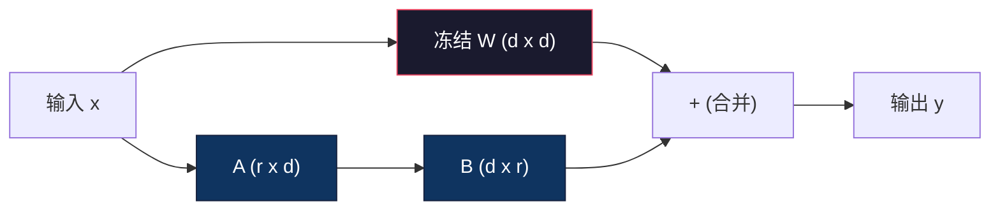
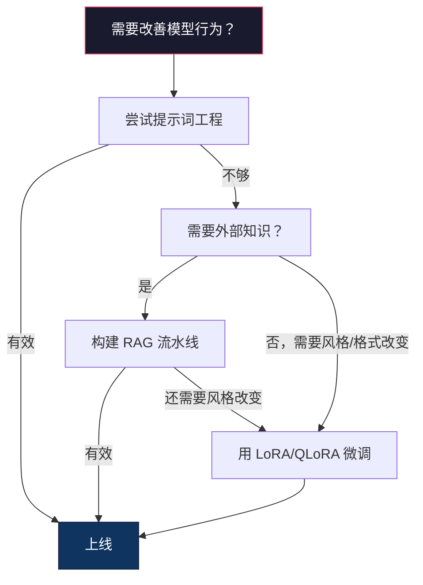

# 使用 LoRA 和 QLoRA 进行微调

> 全量微调 70 亿参数模型需要 56GB 显存，大多数公司根本没有。LoRA 让你通过训练不到 1% 的参数，在 6GB 显存内完成同样的微调——这不是妥协，它在大多数任务上与全量微调质量相当。整个开源微调生态系统都建立在这一技术上。

**类型：** 构建
**语言：** Python
**前置条件：** 第 10 阶段，第 06 课（指令微调 / SFT）
**时间：** ~75 分钟
**相关内容：** 第 10 阶段从零构建 SFT/DPO 循环。本课将其接入 2026 年的 PEFT 工具包（PEFT、TRL、Unsloth、Axolotl、LLaMA-Factory）。

## 学习目标

- 通过向预训练模型的注意力层注入低秩适配器矩阵（A 和 B）来实现 LoRA
- 计算 LoRA 与全量微调的参数节省：秩 r 与 d_model 维度的训练参数为 2*r*d，而非 d²
- 使用 QLoRA（4 位量化基础模型 + LoRA 适配器）在消费级 GPU 显存内进行微调
- 将 LoRA 权重合并回基础模型以部署，并比较有无适配器时的推理速度

## 问题所在

你有一个基础模型——Llama 3 8B——你想让它用公司的口吻回答客服工单。SFT（监督微调）是答案，但 SFT 有成本问题。

全量微调更新模型中的每个参数。Llama 3 8B 有 80 亿个参数，fp16 格式每个参数占 2 字节，仅加载权重就需要 16GB。训练期间还需要梯度（16GB）、Adam 的优化器状态（32GB，用于动量 + 方差）以及激活值。合计：单个 8B 模型大约需要 56GB 显存。

A100 80GB 勉强能容纳。云服务商上两块 A100 每小时约 $3-4。在 5 万个样本上训练 3 个 epoch 需要 6-10 小时，每次实验约 $30-40。为了调好超参数跑 10 次实验，在部署之前已经花了 $400。

扩展到 Llama 3 70B 时数字变得荒谬——仅权重就需要 140GB，需要整个集群，每次实验 $100+。

还有更深层的问题：全量微调修改模型中的每个权重。如果在客服数据上微调，可能会降低模型的通用能力，这被称为灾难性遗忘（catastrophic forgetting）——模型在你的任务上变好，在其他所有事情上变差。

你需要一种训练更少参数、使用更少内存、且不破坏模型现有知识的方法。

## 核心概念

### LoRA：低秩适配（Low-Rank Adaptation）

微软的 Edward Hu 及其同事于 2021 年 6 月发表了 LoRA。核心洞察：微调时的权重更新具有低内在秩。你不需要更新 4096×4096 权重矩阵中的所有 1677 万个参数，更新中的有用信息可以用秩为 16 或 32 的矩阵来捕获。

数学原理：标准线性层计算：

```
y = Wx
```

其中 W 是 d_out × d_in 矩阵。对于 4096×4096 的注意力投影，有 16,777,216 个参数。

LoRA 冻结 W，添加低秩分解：

```
y = Wx + BAx
```

其中 B 是 (d_out × r)，A 是 (r × d_in)，秩 r 远小于 d——通常为 8、16 或 32。

对 4096×4096 层使用 r=16：
- 原始参数：4096 × 4096 = **16,777,216**
- LoRA 参数：(4096 × 16) + (16 × 4096) = 65,536 + 65,536 = **131,072**
- 比例：131,072 / 16,777,216 = **0.78%**

你训练了 0.78% 的参数，获得了 95-100% 的质量。



A 用随机高斯分布初始化，B 初始化为零，使得 LoRA 的贡献从零开始——模型以其原始行为开始训练，然后逐渐学习适应。

### 缩放因子：Alpha

LoRA 引入了一个缩放因子 alpha，控制低秩更新对输出的影响程度：

```
y = Wx + (alpha / r) * BAx
```

当 alpha = r 时，缩放为 1 倍；当 alpha = 2r（常见默认值）时，缩放为 2 倍。这个超参数独立于基础学习率控制 LoRA 路径的学习速率。

实践建议：
- alpha = 2 × rank 是社区惯例（原始论文大多数实验使用 alpha = rank）
- alpha = rank 给出 1 倍缩放，保守但稳定
- 更高的 alpha 意味着每步更新更大，可以加速收敛或导致不稳定

### 在哪里应用 LoRA

Transformer 有许多线性层，不需要对所有层添加 LoRA。原始论文测试了不同组合：

| 目标层 | 可训练参数（7B 模型） | 质量 |
|--------|---------------------|------|
| 仅 q_proj | 4.7M | 好 |
| q_proj + v_proj | 9.4M | 更好 |
| q_proj + k_proj + v_proj + o_proj | 18.9M | 注意力层最佳 |
| 所有线性层（注意力 + MLP） | 37.7M | 边际提升，参数量翻倍 |

大多数任务的最优选择：**q_proj + v_proj**。这针对自注意力中的查询和值投影，控制模型关注什么以及提取什么信息。对代码生成等复杂任务加入 MLP 层有帮助，但对更简单的任务会将参数量翻倍而回报递减。

### 秩的选择

秩 r 控制适配的表达能力：

| 秩 | 每层可训练参数 | 最适用于 |
|-----|--------------|---------|
| 4 | 32,768 | 简单分类、情感分析 |
| 8 | 65,536 | 单领域问答、摘要 |
| 16 | 131,072 | 多领域任务、指令跟随 |
| 32 | 262,144 | 复杂推理、代码生成 |
| 64 | 524,288 | 大多数任务回报递减 |
| 128 | 1,048,576 | 几乎没有理由使用 |

Hu 等人的研究表明，对于简单任务 r=4 已能捕获大部分适应。r=8 和 r=16 是实践中最常见的选择，超过 r=64 很少提升质量，反而会失去 LoRA 的内存优势。

### QLoRA：4 位量化 + LoRA

华盛顿大学的 Tim Dettmers 及其同事于 2023 年 5 月发表了 QLoRA：将冻结的基础模型量化为 4 位精度，然后在顶部附加 fp16 的 LoRA 适配器。

这从根本上改变了内存方程：

| 方法 | 权重内存（7B） | 训练内存（7B） | 所需 GPU |
|------|-------------|-------------|---------|
| 全量微调（fp16） | 14GB | ~56GB | 1× A100 80GB |
| LoRA（fp16 基础） | 14GB | ~18GB | 1× A100 40GB |
| QLoRA（4 位基础） | 3.5GB | ~6GB | 1× RTX 3090 24GB |

QLoRA 的三项技术贡献：

**NF4（Normal Float 4-bit，正态浮点 4 位）**：专为神经网络权重设计的新数据类型。神经网络权重近似服从正态分布，NF4 将其 16 个量化级别放置在标准正态分布的分位数处，对正态分布数据在信息论上是最优的——比均匀 4 位量化（INT4）或标准 Float4 损失更少。

**双重量化（Double quantization）**：量化常数本身占用内存，每个 64 个权重的块需要一个 fp32 缩放因子（4 字节），对 7B 模型额外占用约 0.4GB。双重量化将这些常数量化为 fp8，将开销减少到 0.1GB。

**分页优化器（Paged optimizers）**：训练时，优化器状态（Adam 的动量和方差）可能在长序列上超出 GPU 内存。分页优化器使用 NVIDIA 统一内存，在 GPU 内存耗尽时自动将优化器状态换页到 CPU RAM，需要时再换回，以一定吞吐量损失换取避免 OOM 崩溃。

### 质量对比

减少参数或量化基础模型是否会损害质量？

| 方法 | MMLU（5-shot） | MT-Bench | HumanEval |
|------|--------------|----------|-----------|
| 全量微调（Llama 2 7B） | 48.3 | 6.72 | 14.6 |
| LoRA r=16 | 47.9 | 6.68 | 14.0 |
| QLoRA r=16（NF4） | 47.5 | 6.61 | 13.4 |
| QLoRA r=64（NF4） | 48.1 | 6.70 | 14.2 |

LoRA r=16 在大多数基准上与全量微调差距不超过 1%。QLoRA r=16 再损失一小部分。QLoRA r=64 在使用 90% 更少内存的情况下基本匹配全量微调。

### 实际成本

在 5 万个样本（3 个 epoch）上微调 Llama 3 8B：

| 方法 | GPU | 时间 | 成本 |
|------|-----|------|------|
| 全量微调 | 2× A100 80GB | 8 小时 | ~$32 |
| LoRA r=16 | 1× A100 40GB | 4 小时 | ~$8 |
| QLoRA r=16 | 1× RTX 4090 24GB | 6 小时 | ~$5 |
| QLoRA r=16（Unsloth） | 1× RTX 4090 24GB | 2.5 小时 | ~$2 |
| QLoRA r=16 | 1× T4 16GB | 12 小时 | ~$4 |

在单块消费级 GPU 上用 QLoRA 微调，成本不到一顿午餐。这就是为什么开源权重微调社区在 2023 年爆发，也是为什么 2026 年每个训练框架都默认使用 QLoRA。

### 2026 年 PEFT 技术栈

| 框架 | 是什么 | 何时选用 |
|------|--------|---------|
| **Hugging Face PEFT** | 标准 LoRA/QLoRA/DoRA/IA3 库 | 需要原始控制，且训练循环已基于 `transformers.Trainer` |
| **TRL** | HF 的人类反馈强化训练器（SFT、DPO、GRPO、PPO、ORPO） | SFT 后需要 DPO/GRPO；基于 PEFT 构建 |
| **Unsloth** | Triton 内核重写的前向/反向传播 | 需要 2-5 倍加速 + 一半显存，无精度损失；支持 Llama/Mistral/Qwen 系列 |
| **Axolotl** | PEFT + TRL + DeepSpeed + Unsloth 的 YAML 配置包装 | 需要可复现的版本控制训练运行 |
| **LLaMA-Factory** | PEFT + TRL 的 GUI/CLI/API | 需要零代码微调；支持 100+ 模型系列 |
| **torchtune** | 原生 PyTorch 方案，无 `transformers` 依赖 | 希望最小依赖，且组织已标准化 PyTorch |

经验法则：研究用途或一次性实验 → PEFT。可重复的生产流水线 → 启用 Unsloth 内核的 Axolotl。快速原型 → LLaMA-Factory。

### 合并适配器

训练后，你有两样东西：冻结的基础模型和小型 LoRA 适配器（通常 10-100MB）。你可以：

1. **保持分离**：加载基础模型，在其上加载适配器。为不同任务切换适配器——这是从一个基础模型提供多个微调变体的方式。

2. **永久合并**：计算 W' = W + (alpha/r) × BA 并保存为新的完整模型。合并后的模型与原始模型大小相同，无推理开销，无适配器管理。

提供多个任务时（客服适配器、代码适配器、翻译适配器），保持分离。部署单个专用模型时，合并。

结合多个适配器的高级合并技术：
- **TIES-Merging**（Yadav 等，2023）：修剪小幅度参数，解决符号冲突，然后合并，减少适配器间的干扰
- **DARE**（Yu 等，2023）：合并前随机丢弃适配器参数并重新缩放其余参数，在组合能力方面出奇有效
- **任务算术（Task arithmetic）**：简单地加减适配器权重——将"代码"适配器和"数学"适配器相加，通常产生两者都擅长的模型

### 何时不应该微调

微调是第三个选项，而不是第一个。

**第一步：提示词工程。** 写一个更好的系统提示词，添加少样本示例，使用思维链。这零成本，几分钟完成。如果提示词工程能达到 80% 的目标，可能不需要微调。

**第二步：RAG。** 如果模型需要了解你的特定数据（文档、知识库、产品目录），检索比将其烘焙到权重中更便宜、更易维护。

**第三步：微调。** 当你需要模型采用通过提示词无法实现的特定风格、格式或推理模式时使用——需要一致的结构化输出、将大模型蒸馏到小模型、或延迟很关键无法负担少样本提示词的额外 token。



## 构建实现

我们用纯 PyTorch 从零实现 LoRA，无需库或魔法——构建 LoRA 层，将其注入模型，训练，然后将权重合并回去。

### 步骤 1：LoRA 层

```python
import torch
import torch.nn as nn
import math

class LoRALayer(nn.Module):
    def __init__(self, in_features, out_features, rank=8, alpha=16):
        super().__init__()
        self.rank = rank
        self.alpha = alpha
        self.scaling = alpha / rank

        self.A = nn.Parameter(torch.randn(in_features, rank) * (1 / math.sqrt(rank)))
        self.B = nn.Parameter(torch.zeros(rank, out_features))

    def forward(self, x):
        return (x @ self.A @ self.B) * self.scaling
```

A 用缩放后的随机值初始化，B 初始化为零，使得乘积 BA 从零开始——模型以原始行为开始，逐渐学习适应。

### 步骤 2：带 LoRA 的线性层包装

```python
class LinearWithLoRA(nn.Module):
    def __init__(self, linear, rank=8, alpha=16):
        super().__init__()
        self.linear = linear
        self.lora = LoRALayer(
            linear.in_features, linear.out_features, rank, alpha
        )

        for param in self.linear.parameters():
            param.requires_grad = False

    def forward(self, x):
        return self.linear(x) + self.lora(x)
```

原始线性层被冻结，只有 LoRA 参数（A 和 B）是可训练的。

### 步骤 3：向模型注入 LoRA

```python
def inject_lora(model, target_modules, rank=8, alpha=16):
    for param in model.parameters():
        param.requires_grad = False

    lora_layers = {}
    for name, module in model.named_modules():
        if isinstance(module, nn.Linear):
            if any(t in name for t in target_modules):
                parent_name = ".".join(name.split(".")[:-1])
                child_name = name.split(".")[-1]
                parent = dict(model.named_modules())[parent_name]
                lora_linear = LinearWithLoRA(module, rank, alpha)
                setattr(parent, child_name, lora_linear)
                lora_layers[name] = lora_linear
    return lora_layers
```

首先冻结模型中的每个参数，然后遍历模型树，找到匹配目标名称的线性层，将其替换为 LoRA 包装版本。LoRA 的 A 和 B 矩阵是整个模型中唯一可训练的参数。

### 步骤 4：统计参数量

```python
def count_parameters(model):
    total = sum(p.numel() for p in model.parameters())
    trainable = sum(p.numel() for p in model.parameters() if p.requires_grad)
    frozen = total - trainable
    return {
        "total": total,
        "trainable": trainable,
        "frozen": frozen,
        "trainable_pct": 100 * trainable / total if total > 0 else 0
    }
```

### 步骤 5：将权重合并回基础模型

```python
def merge_lora_weights(model):
    for name, module in model.named_modules():
        if isinstance(module, LinearWithLoRA):
            with torch.no_grad():
                merged = (
                    module.lora.A @ module.lora.B
                ) * module.lora.scaling
                module.linear.weight.data += merged.T
            parent_name = ".".join(name.split(".")[:-1])
            child_name = name.split(".")[-1]
            if parent_name:
                parent = dict(model.named_modules())[parent_name]
            else:
                parent = model
            setattr(parent, child_name, module.linear)
```

合并后，LoRA 层消失，模型与原始模型大小相同，适应已烘焙到权重中，无推理开销。

### 步骤 6：模拟 QLoRA 量化

```python
def quantize_to_nf4(tensor, block_size=64):
    blocks = tensor.reshape(-1, block_size)
    scales = blocks.abs().max(dim=1, keepdim=True).values / 7.0
    scales = torch.clamp(scales, min=1e-8)
    quantized = torch.round(blocks / scales).clamp(-8, 7).to(torch.int8)
    return quantized, scales

def dequantize_from_nf4(quantized, scales, original_shape):
    dequantized = quantized.float() * scales
    return dequantized.reshape(original_shape)
```

这通过在 64 个权重的块内将权重映射到 16 个离散级别来模拟 4 位量化。生产 QLoRA 使用 bitsandbytes 库在 GPU 上实现真正的 NF4。

### 步骤 7：训练循环

```python
def train_lora(model, data, epochs=5, lr=1e-3, batch_size=4):
    optimizer = torch.optim.AdamW(
        [p for p in model.parameters() if p.requires_grad], lr=lr
    )
    criterion = nn.MSELoss()

    losses = []
    for epoch in range(epochs):
        epoch_loss = 0.0
        n_batches = 0
        indices = torch.randperm(len(data["inputs"]))

        for i in range(0, len(indices), batch_size):
            batch_idx = indices[i:i + batch_size]
            x = data["inputs"][batch_idx]
            y = data["targets"][batch_idx]

            output = model(x)
            loss = criterion(output, y)

            optimizer.zero_grad()
            loss.backward()
            optimizer.step()

            epoch_loss += loss.item()
            n_batches += 1

        avg_loss = epoch_loss / n_batches
        losses.append(avg_loss)

    return losses
```

### 步骤 8：完整演示

```python
def demo():
    torch.manual_seed(42)
    d_model = 256
    n_classes = 10

    model = nn.Sequential(
        nn.Linear(d_model, 512),
        nn.ReLU(),
        nn.Linear(512, 512),
        nn.ReLU(),
        nn.Linear(512, n_classes),
    )

    n_samples = 500
    x = torch.randn(n_samples, d_model)
    y = torch.randint(0, n_classes, (n_samples,))
    y_onehot = torch.zeros(n_samples, n_classes).scatter_(1, y.unsqueeze(1), 1.0)

    data = {"inputs": x, "targets": y_onehot}

    params_before = count_parameters(model)

    lora_layers = inject_lora(
        model, target_modules=["0", "2"], rank=8, alpha=16
    )

    params_after = count_parameters(model)

    losses = train_lora(model, data, epochs=20, lr=1e-3)

    merge_lora_weights(model)
    params_merged = count_parameters(model)

    return {
        "params_before": params_before,
        "params_after": params_after,
        "params_merged": params_merged,
        "losses": losses,
    }
```

演示创建一个小模型，向两层注入 LoRA，训练后合并权重。参数量从全量可训练降至 LoRA 训练期间的 ~1% 可训练，合并后恢复到原始架构。

## 生产集成

使用 Hugging Face 生态系统，在真实模型上使用 LoRA 约需 20 行代码：

```python
from transformers import AutoModelForCausalLM, AutoTokenizer
from peft import LoraConfig, get_peft_model, TaskType

model = AutoModelForCausalLM.from_pretrained("meta-llama/Llama-3.1-8B")
tokenizer = AutoTokenizer.from_pretrained("meta-llama/Llama-3.1-8B")

lora_config = LoraConfig(
    task_type=TaskType.CAUSAL_LM,
    r=16,
    lora_alpha=32,
    lora_dropout=0.05,
    target_modules=["q_proj", "v_proj"],
)

model = get_peft_model(model, lora_config)
model.print_trainable_parameters()
```

对于 QLoRA，添加 bitsandbytes 量化：

```python
from transformers import BitsAndBytesConfig

bnb_config = BitsAndBytesConfig(
    load_in_4bit=True,
    bnb_4bit_quant_type="nf4",
    bnb_4bit_compute_dtype=torch.bfloat16,
    bnb_4bit_use_double_quant=True,
)

model = AutoModelForCausalLM.from_pretrained(
    "meta-llama/Llama-3.1-8B",
    quantization_config=bnb_config,
    device_map="auto",
)

model = get_peft_model(model, lora_config)
```

相同的训练循环，相同的数据流水线。基础模型现在以 4 位存在，LoRA 适配器以 fp16 训练，整体适合 6GB 显存。

使用 Hugging Face Trainer 训练：

```python
from transformers import TrainingArguments, Trainer
from datasets import load_dataset

dataset = load_dataset("tatsu-lab/alpaca", split="train[:5000]")

training_args = TrainingArguments(
    output_dir="./lora-llama",
    num_train_epochs=3,
    per_device_train_batch_size=4,
    gradient_accumulation_steps=4,
    learning_rate=2e-4,
    fp16=True,
    logging_steps=10,
    save_strategy="epoch",
    optim="paged_adamw_8bit",
)

trainer = Trainer(
    model=model,
    args=training_args,
    train_dataset=dataset,
)

trainer.train()

model.save_pretrained("./lora-adapter")
```

保存的适配器为 10-100MB。基础模型保持不变。你可以在 Hugging Face Hub 上共享适配器，而无需重新分发完整模型。

## 练习

1. **秩消融研究。** 用秩 2、4、8、16、32 和 64 运行演示，绘制最终损失与秩的关系图，找到翻倍秩不再使损失减半的收益递减点。对于 256 维特征的简单分类任务，这应该在 r=8-16 附近。

2. **目标层对比。** 修改 inject_lora 只针对层"0"、只针对层"2"、只针对层"4"以及全部三层。各训练 20 个 epoch，比较收敛速度和最终损失。这反映了针对 q_proj vs v_proj vs 所有线性层的实际决策。

3. **量化误差分析。** 对训练后模型的权重矩阵，在 quantize_to_nf4 / dequantize_from_nf4 前后计算均方误差、最大绝对误差以及原始权重与重建权重之间的相关性。用 32、64、128 和 256 的 block_size 进行实验。

4. **多适配器服务。** 在不同数据子集（偶数索引 vs 奇数索引）上训练两个 LoRA 适配器，保存两个适配器，加载一次基础模型，然后切换适配器，验证每个适配器在相同输入上产生不同输出。这就是生产系统从一个基础模型提供多个微调模型的方式。

5. **合并 vs 未合并推理。** 比较同样 100 个输入在 merge_lora_weights 前后的 LoRA 模型输出，验证输出相同（在 1e-5 的浮点误差范围内）。然后对两者进行推理速度基准测试——合并后应该稍快，因为是单个矩阵乘法而非两个。

## 关键术语

| 术语 | 通俗说法 | 实际含义 |
|------|---------|---------|
| LoRA | "高效微调" | 低秩适配：冻结基础权重，训练两个小矩阵 A 和 B，其乘积近似完整权重更新 |
| QLoRA | "在笔记本上微调" | 量化 LoRA：以 4 位 NF4 加载基础模型，在其上以 fp16 训练 LoRA 适配器，使 7B 模型在 6GB 显存内微调 |
| 秩（r） | "模型能学多少" | A 和 B 矩阵的内部维度；控制表达能力与参数量的权衡 |
| Alpha | "LoRA 学习率" | 应用于 LoRA 输出的缩放因子；alpha/r 缩放适配对最终输出的贡献 |
| NF4 | "4 位量化" | 正态浮点 4 位：量化级别位于正态分布分位数处的 4 位数据类型，对神经网络权重最优 |
| 适配器（Adapter） | "小的训练部分" | LoRA 的 A 和 B 矩阵，保存为单独文件（10-100MB），可加载到基础模型的任何副本上 |
| 目标层（Target modules） | "对哪些层用 LoRA" | 注入 LoRA 适配器的特定线性层（q_proj、v_proj 等） |
| 合并（Merging） | "烘焙进去" | 计算 W + (alpha/r) × BA 并替换原始权重，消除推理时的适配器开销 |
| 分页优化器（Paged optimizers） | "训练时不 OOM" | 在 GPU 内存耗尽时将优化器状态（Adam 动量、方差）卸载到 CPU |
| 灾难性遗忘（Catastrophic forgetting） | "微调破坏了其他能力" | 更新所有权重导致模型失去之前学到的能力 |

## 延伸阅读

- Hu 等，《LoRA：大型语言模型的低秩适配》（2021）——原始论文，在 GPT-3 175B 上测试，秩低至 4
- Dettmers 等，《QLoRA：量化语言模型的高效微调》（2023）——引入 NF4、双重量化和分页优化器，使 65B 模型可在单块 48GB GPU 上微调
- PEFT 库文档（huggingface.co/docs/peft）——Hugging Face 生态系统中 LoRA、QLoRA 和其他参数高效方法的标准库
- Yadav 等，《TIES-Merging：合并模型时解决干扰》（2023）——结合多个 LoRA 适配器而不损失质量的技术
- [Rafailov 等，《直接偏好优化》（NeurIPS 2023）](https://arxiv.org/abs/2305.18290)——DPO 推导；SFT 之后的偏好调整阶段，无需奖励模型
- [TRL 文档](https://huggingface.co/docs/trl/)——`SFTTrainer`、`DPOTrainer`、`KTOTrainer` 的官方参考
- [Unsloth 文档](https://docs.unsloth.ai/)——融合内核，将微调吞吐量翻倍并减半内存
- [Axolotl 文档](https://axolotl-ai-cloud.github.io/axolotl/)——YAML 配置的多 GPU SFT/DPO/QLoRA 训练器
