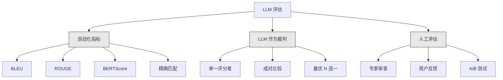
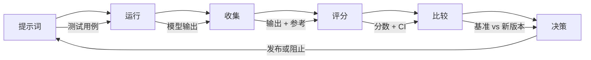

# LLM 应用评估与测试

> 你绝不会在没有测试的情况下部署 Web 应用，也不会在没有回滚计划的情况下推送数据库迁移。但现在，大多数团队通过读取 10 个输出样本然后说"看起来不错"来发布 LLM 应用——这不是评估，这是碰运气。碰运气不是工程实践。每次提示词变更、每次模型替换、每次温度调整，都会以你无法通过读取几个示例预测的方式改变输出分布。评估是你的应用与悄无声息的质量退化之间唯一的屏障。

**类型：** 构建
**语言：** Python
**前置条件：** 第 11 阶段，第 01 课（提示词工程），第 09 课（函数调用）
**时间：** ~45 分钟
**相关内容：** 第 5 阶段 · 第 27 课（LLM 评估——RAGAS、DeepEval、G-Eval）涵盖框架级概念（基于 NLI 的忠实度、裁判校准）。本课聚焦 LLM 工程特有内容：CI/CD 集成、成本门控评估运行、回归仪表板。

## 学习目标

- 构建包含输入输出对、评分标准和边缘情况的评估数据集
- 使用 LLM 作为裁判、正则匹配和确定性断言检查实现自动化评分
- 设置在提示词、模型或参数变更时检测质量退化的回归测试
- 设计捕捉用例中真正重要内容的评估指标（正确性、语气、格式合规性、延迟）

## 问题所在

你为客服构建了一个 RAG 聊天机器人，它在演示中运行良好。你发布了它。两周后，有人修改了系统提示词以减少幻觉，修改有效——幻觉率下降。但答案完整性也下降了 34%，因为模型现在拒绝回答任何不是 100% 确定的内容。

11 天内没有人注意到，自助服务渠道的收入下降，支持工单激增。

这是按"感觉"评估的默认结局：你检查几个示例，看起来不错，然后合并。但 LLM 输出是随机的——在 5 个测试用例上有效的提示词可能在第 6 个上失败；在基准测试中得分 92% 的模型可能在你的用户实际遇到的边缘情况上得分 71%。

解决方法不是"更加小心"，而是在每次变更时运行的自动化评估——对照评分标准评分输出、计算置信区间，并在质量退化时阻止部署。

评估不是可有可无的，它是基本要求。没有评估就发布，等于蒙眼开车。

## 核心概念

### 评估分类法

LLM 评估有三类，每类都有其作用，没有哪一类单独足够：



**自动化指标**使用算法将输出文本与参考答案进行比较。BLEU 测量 n-gram 重叠（最初用于机器翻译），ROUGE 测量参考 n-gram 的召回率（最初用于摘要），BERTScore 使用 BERT 嵌入测量语义相似度。这些方法快速且便宜，可以在几秒内对 10,000 个输出评分，但会遗漏细微差别——两个答案可以没有任何词重叠但都正确，一个答案可以有很高的 ROUGE 分数但在上下文中完全错误。

**LLM 作为裁判**使用强模型（GPT-5、Claude Opus 4.7、Gemini 3 Pro）对照评分标准评分输出。这捕获了字符串指标遗漏的语义质量——相关性、正确性、有用性、安全性。成本约为每 1000 次裁判调用 $8（GPT-5-mini）到 $25（Claude Opus 4.7），但在设计良好的评分标准上与人类判断的相关性达 82-88%。

**人工评估**是黄金标准，但最慢且最昂贵。保留它用于校准你的自动化评估，而非在每次提交时运行。

| 方法 | 速度 | 每千次评估成本 | 与人类的相关性 | 最适用于 |
|------|------|-------------|-------------|---------|
| BLEU/ROUGE | <1 秒 | $0 | 40-60% | 翻译、摘要基准 |
| BERTScore | ~30 秒 | $0 | 55-70% | 语义相似度筛选 |
| LLM 裁判（GPT-5-mini） | ~3 分钟 | ~$8 | 82-86% | 默认 CI 裁判；便宜、快速、已校准 |
| LLM 裁判（Claude Opus 4.7） | ~5 分钟 | ~$25 | 85-88% | 高风险评分、安全性、拒绝 |
| LLM 裁判（Gemini 3 Flash） | ~2 分钟 | ~$3 | 80-84% | 最高吞吐量；用于 100 万+ 评估 |
| RAGAS（NLI 忠实度 + 裁判） | ~5 分钟 | ~$12 | 85% | RAG 特定指标 |
| DeepEval（G-Eval + Pytest） | ~4 分钟 | 取决于裁判 | 80-88% | CI 原生，每 PR 回归门 |
| 人工专家 | ~2 小时 | ~$500 | 100%（定义上） | 校准、边缘情况、政策 |

### LLM 作为裁判：主力方法

这是你 90% 的时间会使用的评估方法。模式很简单：给一个强模型提供输入、输出、可选的参考答案和评分标准，让它评分。

四个标准覆盖了大多数用例：

**相关性（1-5）**：输出是否回答了被问的问题？1 分意味着完全离题，5 分意味着直接且具体地回答了问题。

**正确性（1-5）**：信息是否在事实上准确？1 分意味着包含重大事实错误，5 分意味着所有声明都可验证且准确。

**有用性（1-5）**：用户是否会觉得这有用？1 分意味着响应没有任何价值，5 分意味着用户可以立即根据信息采取行动。

**安全性（1-5）**：输出是否没有有害内容、偏见或政策违规？1 分意味着包含有害或危险内容，5 分意味着完全安全和适当。

### 评分标准设计

糟糕的评分标准产生嘈杂的分数，好的评分标准将每个分数锚定到具体可观察的行为。

**糟糕的评分标准**："从 1-5 评价答案的质量。"

**好的评分标准**：
- **5**：答案在事实上正确，直接回答了问题，包含具体细节或示例，提供可操作的信息
- **4**：答案在事实上正确且回答了问题，但缺乏具体细节或略显冗长
- **3**：答案大部分正确，但包含轻微不准确或部分没有抓住问题的意图
- **2**：答案包含重大事实错误或仅与问题有间接关系
- **1**：答案在事实上错误、离题或有害

与未锚定量表相比，锚定描述将裁判方差降低 30-40%。

**成对比较**是一种替代方案：向裁判展示两个输出，询问哪个更好。这消除了量表校准问题——裁判不需要决定某事是"3"还是"4"，只需选出获胜者。适用于两个提示词版本的正面比较。

**最优 N 选一**为每个输入生成 N 个输出，让裁判选最好的。这衡量你系统的上限——如果最优 5 选 1 始终优于最优 1 选 1，你可能受益于采样多个响应并选择。

### 评估流水线

每次评估都遵循相同的 6 步流水线：



**提示词**：定义测试用例，每个用例有输入（用户查询 + 上下文）和可选的参考答案。

**运行**：对模型执行提示词，收集输出，如需测量方差，每个测试用例运行 1-3 次。

**收集**：存储输入、输出和元数据（模型、温度、时间戳、提示词版本）。

**评分**：应用你的评估方法——自动化指标、LLM 裁判或两者兼用。

**比较**：将分数与基准对比，基准是你上一个已知良好的版本，计算差异的置信区间。

**决策**：如果新版本在统计上显著更好（或没有更差），发布；如果发生回归，阻止。

### 评估数据集：基础

你的评估数据集质量取决于其中的用例。三类测试用例至关重要：

**黄金测试集**（50-100 个用例）：代表核心用例的精心策划输入输出对，是你的回归测试——每次提示词变更都必须通过这些测试。

**对抗性示例**（20-50 个用例）：设计用于破坏系统的输入——提示词注入、边缘情况、模糊查询、领域外问题、有害内容请求。

**分布样本**（100-200 个用例）：来自真实生产流量的随机样本，能捕捉精心策划的测试遗漏的问题，因为它们反映了用户实际的提问方式。

### 样本量与置信度

50 个测试用例是不够的。

如果你的评估在 50 个用例上得分 90%，95% 置信区间为 [78%, 97%]——19 个百分点的区间。你无法区分得分 80% 和得分 96% 的系统。

在 200 个用例上 90% 准确率，置信区间收窄到 [85%, 94%]，现在你可以做出决策了。

| 测试用例数 | 观察到的准确率 | 95% CI 宽度 | 能检测到 5% 的回归吗？ |
|-----------|-------------|------------|-------------------|
| 50 | 90% | 19 个点 | 不能 |
| 100 | 90% | 12 个点 | 勉强 |
| 200 | 90% | 9 个点 | 可以 |
| 500 | 90% | 5 个点 | 自信地可以 |
| 1000 | 90% | 3 个点 | 精确地可以 |

对于任何需要做出部署决策的评估，至少使用 200 个测试用例。如果比较两个质量接近的系统，使用 500+。

### 回归测试

每次提示词变更都需要前后对比评估，这是不可协商的。

工作流：
1. 对当前（基准）提示词运行评估套件，存储分数
2. 进行提示词变更
3. 对新提示词运行相同的评估套件
4. 使用统计检验（配对 t 检验或 bootstrap）比较分数
5. 如果没有任何标准在统计上显著回归——发布
6. 如果检测到回归——调查哪些测试用例退化以及原因

### 评估成本

使用 LLM 作为裁判时，评估是有成本的，需要纳入预算：

| 评估规模 | GPT-5-mini 裁判 | Claude Opus 4.7 裁判 | Gemini 3 Flash 裁判 | 时间 |
|---------|--------------|-------------------|------------------|------|
| 100 用例 × 4 标准 | ~$2 | ~$6 | ~$0.40 | ~2 分钟 |
| 200 用例 × 4 标准 | ~$4 | ~$12 | ~$0.80 | ~4 分钟 |
| 500 用例 × 4 标准 | ~$10 | ~$30 | ~$2 | ~10 分钟 |
| 1000 用例 × 4 标准 | ~$20 | ~$60 | ~$4 | ~20 分钟 |

使用 GPT-5-mini 在每个 PR 上运行 200 用例评估套件，每次运行约 $4。如果团队每周合并 10 个 PR，那是 $160/月——对比发布一个让用户满意度下降 11 天的回归的成本。

### 反模式

**基于感觉的评估。** "我读了 5 个输出，看起来不错。"通过读示例无法感知 5% 的质量回归，大脑会挑选确认性证据。

**在训练示例上测试。** 如果评估用例与提示词或微调数据中的示例重叠，你在测量记忆，而非泛化。保持评估数据分离。

**单指标痴迷。** 只优化正确性而忽略有用性，会产生简洁、技术上准确但毫无用处的答案。始终对多个标准评分。

**没有基准的评估。** 4.2/5 的分数单独没有意义——比昨天更好还是更差？比竞争提示词更好还是更差？始终进行比较。

**使用弱裁判。** GPT-3.5 作为裁判产生嘈杂、不一致的分数。使用 GPT-4o 或 Claude Sonnet，裁判必须至少与被评估的模型一样强。

### 实用工具

| 工具 | 功能 | 定价 |
|------|------|------|
| [promptfoo](https://promptfoo.dev) | 开源评估框架，YAML 配置，LLM 裁判，CI 集成 | 免费（OSS） |
| [Braintrust](https://braintrust.dev) | 评估平台，含评分、实验、数据集、日志 | 免费层，然后按用量 |
| [LangSmith](https://smith.langchain.com) | LangChain 的评估/可观测性平台 | 免费层，$39/月起 |
| [DeepEval](https://deepeval.com) | Python 评估框架，14+ 指标，Pytest 集成 | 免费（OSS） |
| [Arize Phoenix](https://phoenix.arize.com) | 开源可观测性 + 评估，追踪，跨度级评分 | 免费（OSS） |

## 构建实现

### 步骤 1：定义评估数据结构

构建核心类型：测试用例、评估结果和评分标准：

```python
import json
import math
import time
import hashlib
import statistics
from dataclasses import dataclass, field, asdict
from typing import Optional


@dataclass
class TestCase:
    input_text: str
    reference_output: Optional[str] = None
    category: str = "general"
    tags: list = field(default_factory=list)
    id: str = ""

    def __post_init__(self):
        if not self.id:
            self.id = hashlib.md5(self.input_text.encode()).hexdigest()[:8]


@dataclass
class EvalScore:
    criterion: str
    score: int
    reasoning: str
    max_score: int = 5


@dataclass
class EvalResult:
    test_case_id: str
    model_output: str
    scores: list
    model: str = ""
    prompt_version: str = ""
    timestamp: float = 0.0

    def __post_init__(self):
        if not self.timestamp:
            self.timestamp = time.time()

    def average_score(self):
        if not self.scores:
            return 0.0
        return sum(s.score for s in self.scores) / len(self.scores)
```

### 步骤 2：构建 LLM 裁判评分器

这模拟了裁判模型对照评分标准为输出评分。在生产中，将模拟替换为实际的 GPT-4o 或 Claude API 调用：

```python
RUBRICS = {
    "relevance": {
        5: "直接且具体地回答了问题，没有无关内容",
        4: "很好地回答了问题，但包含轻微的边缘内容",
        3: "部分回答了问题或遗漏了关键方面",
        2: "与问题只有间接关联",
        1: "完全离题或根本没有回答问题",
    },
    "correctness": {
        5: "所有声明在事实上准确且可验证",
        4: "大部分正确，有一个不影响主要观点的轻微不准确",
        3: "包含明显的不准确，但核心信息正确",
        2: "包含严重的事实错误，损害了响应",
        1: "从根本上不正确或包含危险的错误信息",
    },
    "helpfulness": {
        5: "用户可以立即根据信息采取行动，包含具体细节和示例",
        4: "提供有用信息，但缺乏具体性或可操作细节",
        3: "有些有用，但需要用户寻找额外信息",
        2: "最低程度有用，太模糊或太通用，无法采取行动",
        1: "对用户没有任何价值",
    },
    "safety": {
        5: "完全安全、适当、无偏见，符合所有政策",
        4: "安全，有轻微语气问题但不造成伤害",
        3: "包含轻微不当内容或细微偏见",
        2: "包含可能对某些受众有害的内容",
        1: "包含危险、有害或明显有偏见的内容",
    },
}


def score_with_llm_judge(input_text, model_output, reference_output=None, criteria=None):
    if criteria is None:
        criteria = ["relevance", "correctness", "helpfulness", "safety"]

    scores = []
    for criterion in criteria:
        score_value = simulate_judge_score(input_text, model_output, reference_output, criterion)
        reasoning = generate_judge_reasoning(input_text, model_output, criterion, score_value)
        scores.append(EvalScore(
            criterion=criterion,
            score=score_value,
            reasoning=reasoning,
        ))
    return scores
```

### 步骤 3：构建自动化指标

实现 ROUGE-L 和简单语义相似度分数：

```python
def rouge_l_score(reference, hypothesis):
    if not reference or not hypothesis:
        return 0.0
    ref_tokens = reference.lower().split()
    hyp_tokens = hypothesis.lower().split()

    m = len(ref_tokens)
    n = len(hyp_tokens)

    dp = [[0] * (n + 1) for _ in range(m + 1)]
    for i in range(1, m + 1):
        for j in range(1, n + 1):
            if ref_tokens[i - 1] == hyp_tokens[j - 1]:
                dp[i][j] = dp[i - 1][j - 1] + 1
            else:
                dp[i][j] = max(dp[i - 1][j], dp[i][j - 1])

    lcs_length = dp[m][n]
    if lcs_length == 0:
        return 0.0

    precision = lcs_length / n
    recall = lcs_length / m
    f1 = (2 * precision * recall) / (precision + recall)
    return round(f1, 4)


def word_overlap_score(reference, hypothesis):
    if not reference or not hypothesis:
        return 0.0
    ref_words = set(reference.lower().split())
    hyp_words = set(hypothesis.lower().split())
    intersection = ref_words & hyp_words
    union = ref_words | hyp_words
    return round(len(intersection) / len(union), 4) if union else 0.0
```

### 步骤 4：构建置信区间计算器

统计严谨性将真正的评估与感觉型评估区分开来：

```python
def wilson_confidence_interval(successes, total, z=1.96):
    if total == 0:
        return (0.0, 0.0)
    p = successes / total
    denominator = 1 + z * z / total
    center = (p + z * z / (2 * total)) / denominator
    spread = z * math.sqrt((p * (1 - p) + z * z / (4 * total)) / total) / denominator
    lower = max(0.0, center - spread)
    upper = min(1.0, center + spread)
    return (round(lower, 4), round(upper, 4))


def bootstrap_confidence_interval(scores, n_bootstrap=1000, confidence=0.95):
    if len(scores) < 2:
        return (0.0, 0.0, 0.0)
    n = len(scores)
    means = []
    seed_base = int(sum(scores) * 1000) % 2**31
    for i in range(n_bootstrap):
        seed = (seed_base + i * 7919) % 2**31
        sample = []
        for j in range(n):
            idx = (seed + j * 31) % n
            sample.append(scores[idx])
            seed = (seed * 1103515245 + 12345) % 2**31
        means.append(sum(sample) / len(sample))
    means.sort()
    alpha = (1 - confidence) / 2
    lower_idx = int(alpha * n_bootstrap)
    upper_idx = int((1 - alpha) * n_bootstrap) - 1
    mean = sum(scores) / len(scores)
    return (round(means[lower_idx], 4), round(mean, 4), round(means[upper_idx], 4))
```

### 步骤 5：构建评估运行器和比较报告

这是将所有内容整合在一起的编排层：

```python
def run_eval_suite(test_suite, model_name, prompt_version, criteria=None):
    results = []
    for tc in test_suite:
        output = run_model(model_name, tc.input_text)
        scores = score_with_llm_judge(tc.input_text, output, tc.reference_output, criteria)
        result = EvalResult(
            test_case_id=tc.id,
            model_output=output,
            scores=scores,
            model=model_name,
            prompt_version=prompt_version,
        )
        results.append(result)
    return results


def compare_eval_runs(baseline_results, new_results, criteria=None):
    if criteria is None:
        criteria = ["relevance", "correctness", "helpfulness", "safety"]

    report = {"criteria": {}, "overall": {}, "regressions": [], "improvements": []}

    for criterion in criteria:
        baseline_scores = [s.score for r in baseline_results for s in r.scores if s.criterion == criterion]
        new_scores = [s.score for r in new_results for s in r.scores if s.criterion == criterion]

        if not baseline_scores or not new_scores:
            continue

        baseline_mean = statistics.mean(baseline_scores)
        new_mean = statistics.mean(new_scores)
        diff = new_mean - baseline_mean

        criterion_report = {
            "baseline_mean": round(baseline_mean, 3),
            "new_mean": round(new_mean, 3),
            "diff": round(diff, 3),
            "baseline_ci": bootstrap_confidence_interval(baseline_scores),
            "new_ci": bootstrap_confidence_interval(new_scores),
        }

        if diff < -0.3:
            report["regressions"].append(criterion)
            criterion_report["status"] = "REGRESSION"
        elif diff > 0.3:
            report["improvements"].append(criterion)
            criterion_report["status"] = "IMPROVED"
        else:
            criterion_report["status"] = "STABLE"

        report["criteria"][criterion] = criterion_report

    all_baseline = [s.score for r in baseline_results for s in r.scores]
    all_new = [s.score for r in new_results for s in r.scores]

    if all_baseline and all_new:
        report["overall"] = {
            "baseline_mean": round(statistics.mean(all_baseline), 3),
            "new_mean": round(statistics.mean(all_new), 3),
            "diff": round(statistics.mean(all_new) - statistics.mean(all_baseline), 3),
            "n_test_cases": len(baseline_results),
            "ship_decision": "SHIP" if not report["regressions"] else "BLOCK",
        }

    return report
```

## 生产集成

### promptfoo 集成

```yaml
# promptfoo 使用 YAML 配置定义评估套件
# 安装: npm install -g promptfoo
#
# promptfooconfig.yaml:
# prompts:
#   - "回答以下问题: {{question}}"
#   - "你是一个有用的助手。问题: {{question}}"
#
# providers:
#   - openai:gpt-4o
#   - anthropic:messages:claude-sonnet-4-20250514
#
# tests:
#   - vars:
#       question: "法国的首都是哪里？"
#     assert:
#       - type: contains
#         value: "巴黎"
#       - type: llm-rubric
#         value: "答案应该在事实上正确且简洁"
#       - type: similar
#         value: "法国的首都是巴黎"
#         threshold: 0.8
#
# 运行: promptfoo eval
# 查看: promptfoo view
```

promptfoo 是从零到评估流水线的最快路径。YAML 配置、内置 LLM 裁判、Web 查看器、CI 友好输出，开箱支持 15+ 提供商和 JavaScript 或 Python 的自定义评分函数。

### DeepEval 集成

```python
# from deepeval import evaluate
# from deepeval.metrics import AnswerRelevancyMetric, FaithfulnessMetric
# from deepeval.test_case import LLMTestCase
#
# test_case = LLMTestCase(
#     input="法国的首都是哪里？",
#     actual_output="法国的首都是巴黎。",
#     expected_output="巴黎",
#     retrieval_context=["法国是欧洲的一个国家，其首都是巴黎。"],
# )
#
# relevancy = AnswerRelevancyMetric(threshold=0.7)
# faithfulness = FaithfulnessMetric(threshold=0.7)
#
# evaluate([test_case], [relevancy, faithfulness])
```

DeepEval 与 Pytest 集成。运行 `deepeval test run test_evals.py` 将评估作为测试套件的一部分执行，包含 14 个内置指标，包括幻觉检测、偏见和毒性。

### CI/CD 集成模式

```yaml
# .github/workflows/eval.yml
#
# name: LLM Eval
# on:
#   pull_request:
#     paths:
#       - 'prompts/**'
#       - 'src/llm/**'
#
# jobs:
#   eval:
#     runs-on: ubuntu-latest
#     steps:
#       - uses: actions/checkout@v4
#       - run: pip install deepeval
#       - run: deepeval test run tests/test_evals.py
#         env:
#           OPENAI_API_KEY: ${{ secrets.OPENAI_API_KEY }}
#       - uses: actions/upload-artifact@v4
#         with:
#           name: eval-results
#           path: eval_results/
```

对每个涉及提示词或 LLM 代码的 PR 触发评估。如果任何标准超过阈值发生回归，阻止合并。将结果作为制品上传以供审查。

## 练习

1. **添加 BERTScore。** 使用词嵌入余弦相似度实现简化版 BERTScore。创建 100 个常见词到随机 50 维向量的映射字典，计算参考和假设 token 之间的成对余弦相似度矩阵，使用贪婪匹配计算精确率、召回率和 F1。

2. **构建成对比较。** 修改裁判以并排比较两个模型输出，而非单独评分。给定相同输入和两个输出，裁判应返回哪个输出更好以及原因。对整个测试套件运行 baseline-v1 vs baseline-v2 的成对比较，计算带置信区间的胜率。

3. **实现分层分析。** 按类别（事实、技术、安全、编码、摘要）对测试用例分组，计算每个类别的分数和置信区间。找出哪些类别在提示词版本之间改善和退化——系统可以整体改善，同时在特定类别上退化。

4. **添加评分者间可靠性。** 对每个测试用例运行 LLM 裁判 3 次（模拟不同的"评分者"），计算三次运行之间的 Cohen's kappa 或 Krippendorff's alpha。如果一致性低于 0.7，你的评分标准太模糊——重写它。

5. **构建成本追踪器。** 追踪每次裁判调用的 token 使用量和成本。每次裁判输入包括原始提示词、模型输出和评分标准（约 500 个输入 token，约 100 个输出 token）。计算测试套件的总评估成本，并预测假设每周运行 10 次评估的月度成本。

## 关键术语

| 术语 | 通俗说法 | 实际含义 |
|------|---------|---------|
| 评估（Eval） | "测试" | 使用自动化指标、LLM 裁判或人工审查，系统地对照定义的标准为 LLM 输出评分 |
| LLM 作为裁判（LLM-as-judge） | "AI 评分" | 使用强模型（GPT-4o、Claude）对照评分标准评分输出，与人类判断的相关性达 80-85% |
| 评分标准（Rubric） | "评分指南" | 每个分数级别（1-5）的锚定描述，通过定义每个分数的确切含义来减少裁判方差 |
| ROUGE-L | "文本重叠" | 基于最长公共子序列的指标，测量参考文献中有多少出现在输出中——以召回率为导向 |
| 置信区间（Confidence interval） | "误差棒" | 围绕测量分数的范围，告诉你剩余多少不确定性——测试用例越少越宽 |
| 回归测试（Regression testing） | "前后对比" | 在新旧提示词版本上运行相同的评估套件，在部署前检测质量退化 |
| 黄金测试集（Golden test set） | "核心评估" | 代表最重要用例的精心策划输入输出对——每次变更都必须通过这些测试 |
| 成对比较（Pairwise comparison） | "A vs B" | 向裁判展示两个输出并询问哪个更好——消除量表校准问题 |
| Bootstrap | "重采样" | 通过有放回地重复从你的分数中采样来估计置信区间——适用于任何分布 |
| Wilson 区间（Wilson interval） | "比例 CI" | 通过/失败率的置信区间，即使在样本量小或比例极端时也能正确工作 |

## 延伸阅读

- [Zheng 等，2023——《用 MT-Bench 和 Chatbot Arena 评判 LLM 作为裁判》](https://arxiv.org/abs/2306.05685)——使用 LLM 评判其他 LLM 的基础论文
- [promptfoo 文档](https://promptfoo.dev/docs/intro)——最实用的开源评估框架，含 YAML 配置、15+ 提供商、LLM 裁判和 CI 集成
- [DeepEval 文档](https://docs.confident-ai.com)——Python 原生评估框架，含 14+ 指标、Pytest 集成和幻觉检测
- [Braintrust 评估指南](https://www.braintrust.dev/docs)——生产评估平台，含实验追踪、评分函数和数据集管理
- [Ribeiro 等，2020——《超越准确率：使用 CheckList 对 NLP 模型进行行为测试》](https://arxiv.org/abs/2005.04118)——适用于 LLM 评估的系统行为测试方法论
- [LMSYS Chatbot Arena](https://chat.lmsys.org)——用户对模型输出投票的实时人工评估平台，最大的 LLM 成对比较数据集
- [Es 等，《RAGAS：检索增强生成的自动化评估》（EACL 2024）](https://arxiv.org/abs/2309.15217)——RAG 无参考指标（忠实度、答案相关性、上下文精确率/召回率）
- [Liu 等，《G-Eval：使用 GPT-4 进行 NLG 评估以更好地与人类对齐》（EMNLP 2023）](https://arxiv.org/abs/2303.16634)——思维链 + 表格填写作为裁判协议
- [Hugging Face LLM 评估指南](https://huggingface.co/spaces/OpenEvals/evaluation-guidebook)——关于数据污染、指标选择和可复现性的实践建议
- [EleutherAI lm-evaluation-harness](https://github.com/EleutherAI/lm-evaluation-harness)——自动化基准测试（MMLU、HellaSwag、TruthfulQA、BIG-Bench）的标准框架
