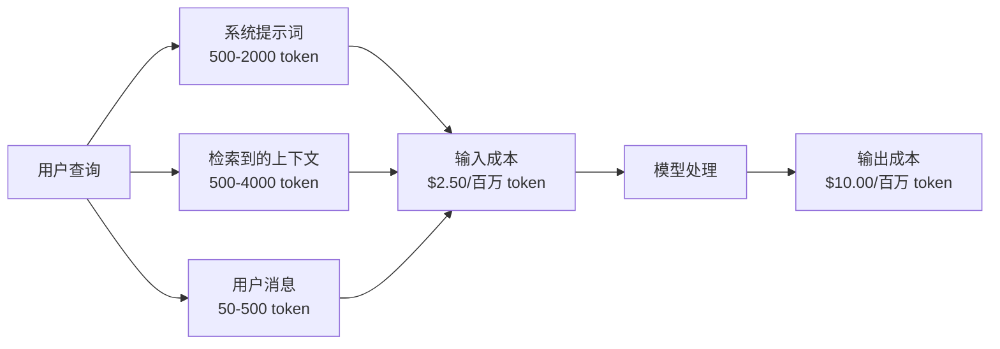
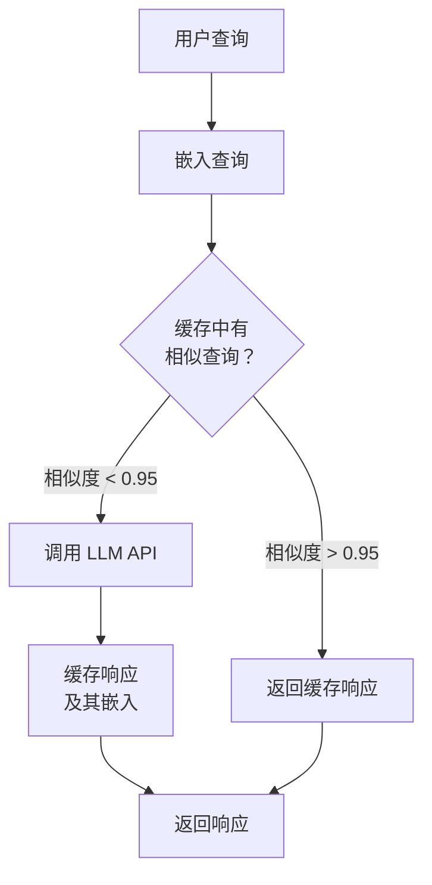
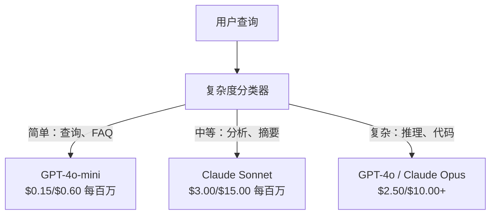

# 缓存、速率限制与成本优化

> 大多数 AI 初创公司的死亡不是因为模型不好，而是因为单位经济学出了问题。单次 GPT-4o 调用只要几分之一美分，但一万个用户每天调用十次，仅输入 token 就要 250 美元——还没从用户那里收一分钱。能生存下来的公司，是那些把每次 API 调用当作金融交易而非函数调用来对待的公司。

**类型：** 构建
**语言：** Python
**前置条件：** 第 11 阶段，第 09 课（函数调用）
**时间：** ~45 分钟
**相关内容：** 第 11 阶段 · 第 15 课（提示词缓存）涵盖提供商层面的提示词缓存（Anthropic cache_control、OpenAI 自动、Gemini CachedContent）。本课涵盖应用层缓存（语义缓存、精确哈希缓存、模型路由）。两者结合可降低 50-95% 的成本。

## 学习目标

- 实现语义缓存，从缓存中处理重复或相似的查询，而非每次发出新的 API 调用
- 跨提供商计算每次请求的成本，实现 token 感知的速率限制和预算告警
- 构建包含提示词压缩、模型路由（贵模型 vs 便宜模型）和响应缓存的成本优化层
- 为不同查询类型设计分层缓存策略：精确匹配、语义相似度和前缀缓存

## 问题所在

你构建了一个 RAG 聊天机器人，运行精美，用户喜爱。然后账单来了。

GPT-5 每百万输入 token 费 5 美元，输出 15 美元。Claude Opus 4.7 输入 15 美元/输出 75 美元。Gemini 3 Pro 输入 1.25 美元/输出 5 美元。GPT-5-mini 是 0.25/2 美元。

以下是杀死初创公司的数学：

- 10,000 个每日活跃用户
- 每用户每天 10 次查询
- 每次查询 1,000 个输入 token（系统提示词 + 上下文 + 用户消息）
- 每次响应 500 个输出 token

**每日输入成本：** 10,000 × 10 × 1,000 / 1,000,000 × $2.50 = **$250/天**
**每日输出成本：** 10,000 × 10 × 500 / 1,000,000 × $10.00 = **$500/天**
**每月总计：** **$22,500/月**

这还只是 LLM，加上嵌入、向量数据库托管、基础设施，一个聊天机器人每月可能花费 30,000 美元。

残酷的部分是：这些查询中 40-60% 是近似重复的——用户用略微不同的措辞问相同的问题。你的系统提示词每次请求都一模一样，却被每次计费。RAG 检索的上下文文档在问同一主题的用户之间重复出现。你在为冗余计算付全价。

## 核心概念

### LLM 调用的成本解剖

每次 API 调用有五个成本组件：



系统提示词是无声的杀手。每次请求发送的 1,500 token 系统提示词，仅这个前缀就要花 3.75 美元/百万次请求。在每天 10 万次请求时，那是 $375/天——$11,250/月——用于永远不会改变的文本。

### 提供商缓存：内置折扣

2026 年三大主要提供商都提供服务端提示词缓存，但机制不同：

| 提供商 | 机制 | 折扣 | 最小值 | 缓存时长 |
|--------|------|------|--------|---------|
| Anthropic | 显式 cache_control 标记 | 缓存命中 90% 折扣（写入时额外付 25%） | 1,024 token（Sonnet/Opus），2,048（Haiku） | 默认 5 分钟；扩展 1 小时（2 倍写入溢价） |
| OpenAI | 自动前缀匹配 | 缓存命中 50% 折扣 | 1,024 token | 尽力保持最长 1 小时 |
| Google Gemini | 显式 CachedContent API | 约 75% 折扣（加存储费） | 4,096（Flash）/ 32,768（Pro） | 用户可配置 TTL |

**Anthropic 的方式**是显式的。你用 `cache_control: {"type": "ephemeral"}` 标记提示词的部分内容。第一次请求支付 25% 的写入溢价，后续具有相同前缀的请求获得 90% 的折扣。一个通常花费 $0.005 的 2,000 token 系统提示词，在缓存命中时只需 $0.000625。在 10 万次请求中，每天节省 $437.50。

**OpenAI 的方式**是自动的。任何与之前请求匹配的提示词前缀自动获得 50% 的折扣，无需标记，但折扣较少、控制较少，实现工作量为零。

### 语义缓存：你的自定义层

提供商缓存只对相同前缀有效，语义缓存处理更难的情况：含义相同的不同查询。

"退款政策是什么？"和"我怎么退货？"是不同的字符串但意图相同。语义缓存嵌入两个查询，计算余弦相似度，如果相似度超过阈值（通常 0.92-0.95），返回缓存响应：



嵌入成本可以忽略不计。OpenAI 的 text-embedding-3-small 每百万 token 只需 $0.02，检查缓存的成本与完整 LLM 调用相比几乎为零。

### 精确缓存：哈希与匹配

对于确定性调用（temperature=0，相同模型，相同提示词），精确缓存更简单更快：对完整提示词取哈希，检查缓存，找到则返回。

这对以下场景非常有效：
- 系统提示词 + 固定上下文 + 相同用户查询
- 使用相同工具定义的函数调用
- 同一文档被多次处理的批量处理

### 速率限制：保护你的预算

速率限制不仅仅是关于公平性，更关乎生存。

**令牌桶算法（Token bucket）**：每个用户有一个 N 个令牌的桶，以每秒 R 的速率重新填充。请求从桶中消耗令牌，如果桶空了，请求被拒绝。这允许突发（一次使用全部桶）同时执行平均速率。

**每用户配额**：按用户层级设置每日/每月 token 限制：

| 层级 | 每日 Token 限制 | 最大请求/分钟 | 模型访问 |
|------|--------------|-------------|---------|
| 免费 | 50,000 | 10 | 仅 GPT-4o-mini |
| 专业 | 500,000 | 60 | GPT-4o、Claude Sonnet |
| 企业 | 5,000,000 | 300 | 所有模型 |

### 模型路由：适合的任务用适合的模型

不是每个查询都需要 GPT-4o。

"商店几点关门？"不需要一个输出 $10/百万 token 的模型。GPT-4o-mini 以 $0.60/百万输出完美处理它，Claude Haiku 以 $1.25/百万输出处理它。一个简单的分类器将便宜的查询路由到便宜的模型，将复杂的查询路由到昂贵的模型：



调优良好的路由器仅在模型成本上就能节省 40-70%。

### 成本追踪：知道钱去哪里了

记录每次 API 调用，包含：时间戳、模型名称、输入 token、输出 token、延迟（ms）、计算成本（$）、用户 ID、缓存命中/未命中、请求类别。

这些数据揭示哪些功能昂贵，哪些用户是重度消费者，以及缓存在哪里影响最大。

### 批处理：批量折扣

OpenAI 的 Batch API 以 50% 的折扣异步处理请求。你提交最多 50,000 个请求的批次，结果在 24 小时内返回。

适用于：夜间文档处理、批量分类、评估运行、数据丰富流水线。
不适用于：实时面向用户的查询（延迟很重要）。

### 预算告警和熔断器

熔断器在你达到限额时停止支出。没有它，一个 bug 或滥用可能在几小时内烧光你的月度预算。

设置三个阈值：
1. **警告**（预算 70%）：发送告警
2. **限流**（预算 85%）：仅切换到便宜模型
3. **停止**（预算 95%）：拒绝新请求，只返回缓存响应

### 优化层叠

按顺序应用这些技术，每层都在前一层基础上叠加：

| 层级 | 技术 | 典型节省 | 实现难度 |
|------|------|---------|---------|
| 1 | 提供商提示词缓存 | 30-50% | 低（添加缓存标记） |
| 2 | 精确缓存 | 10-20% | 低（哈希 + 字典） |
| 3 | 语义缓存 | 15-30% | 中（嵌入 + 相似度） |
| 4 | 模型路由 | 40-70% | 中（分类器） |
| 5 | 速率限制 | 预算保护 | 低（令牌桶） |
| 6 | 提示词压缩 | 10-30% | 中（重写提示词） |
| 7 | 批处理 | 50%（适用时） | 低（Batch API） |

应用第 1-5 层的 RAG 应用通常将成本从 $22,500/月降低到 $4,000-6,000/月。这是在烧钱和建立业务之间的区别。

### 实际节省：前后对比

服务于 10,000 DAU 的 RAG 聊天机器人真实数据：

| 指标 | 优化前 | 优化后 | 节省 |
|------|-------|-------|------|
| 每月 LLM 成本 | $22,500 | $5,200 | 77% |
| 每次查询平均成本 | $0.0075 | $0.0017 | 77% |
| 缓存命中率 | 0% | 52% | -- |
| 路由到 mini 的查询 | 0% | 65% | -- |
| P95 延迟 | 2,800ms | 900ms（缓存命中：50ms） | 68% |
| 每月嵌入成本 | $0 | $180 | （新增成本） |
| 每月总成本 | $22,500 | $5,380 | 76% |

语义缓存的嵌入成本（$180/月）在缓存命中的第一个小时内就能回本。

## 构建实现

### 步骤 1：成本计算器

```python
import hashlib
import time
import json
import math
from dataclasses import dataclass, field


MODEL_PRICING = {
    "gpt-4o": {"input": 2.50, "output": 10.00, "cached_input": 1.25},
    "gpt-4o-mini": {"input": 0.15, "output": 0.60, "cached_input": 0.075},
    "gpt-4.1": {"input": 2.00, "output": 8.00, "cached_input": 0.50},
    "gpt-4.1-mini": {"input": 0.40, "output": 1.60, "cached_input": 0.10},
    "gpt-4.1-nano": {"input": 0.10, "output": 0.40, "cached_input": 0.025},
    "claude-opus-4": {"input": 15.00, "output": 75.00, "cached_input": 1.50},
    "claude-sonnet-4": {"input": 3.00, "output": 15.00, "cached_input": 0.30},
    "claude-haiku-3.5": {"input": 0.80, "output": 4.00, "cached_input": 0.08},
    "gemini-2.5-pro": {"input": 1.25, "output": 10.00, "cached_input": 0.3125},
    "gemini-2.5-flash": {"input": 0.15, "output": 0.60, "cached_input": 0.0375},
}


def calculate_cost(model, input_tokens, output_tokens, cached_input_tokens=0):
    if model not in MODEL_PRICING:
        return {"error": f"未知模型: {model}"}
    pricing = MODEL_PRICING[model]
    non_cached = input_tokens - cached_input_tokens
    input_cost = (non_cached / 1_000_000) * pricing["input"]
    cached_cost = (cached_input_tokens / 1_000_000) * pricing["cached_input"]
    output_cost = (output_tokens / 1_000_000) * pricing["output"]
    total = input_cost + cached_cost + output_cost
    return {
        "model": model,
        "input_tokens": input_tokens,
        "output_tokens": output_tokens,
        "cached_input_tokens": cached_input_tokens,
        "input_cost": round(input_cost, 6),
        "cached_input_cost": round(cached_cost, 6),
        "output_cost": round(output_cost, 6),
        "total_cost": round(total, 6),
    }
```

### 步骤 2：精确缓存

```python
class ExactCache:
    def __init__(self, max_size=1000, ttl_seconds=3600):
        self.cache = {}
        self.max_size = max_size
        self.ttl = ttl_seconds
        self.hits = 0
        self.misses = 0

    def _hash(self, model, messages, temperature):
        key_data = json.dumps({"model": model, "messages": messages, "temperature": temperature}, sort_keys=True)
        return hashlib.sha256(key_data.encode()).hexdigest()

    def get(self, model, messages, temperature=0.0):
        if temperature > 0:
            self.misses += 1
            return None
        key = self._hash(model, messages, temperature)
        if key in self.cache:
            entry = self.cache[key]
            if time.time() - entry["timestamp"] < self.ttl:
                self.hits += 1
                entry["access_count"] += 1
                return entry["response"]
            del self.cache[key]
        self.misses += 1
        return None

    def put(self, model, messages, temperature, response):
        if temperature > 0:
            return
        if len(self.cache) >= self.max_size:
            oldest_key = min(self.cache, key=lambda k: self.cache[k]["timestamp"])
            del self.cache[oldest_key]
        key = self._hash(model, messages, temperature)
        self.cache[key] = {
            "response": response,
            "timestamp": time.time(),
            "access_count": 1,
        }

    def stats(self):
        total = self.hits + self.misses
        return {
            "hits": self.hits,
            "misses": self.misses,
            "hit_rate": round(self.hits / total, 4) if total > 0 else 0,
            "cache_size": len(self.cache),
        }
```

### 步骤 3：语义缓存

```python
def simple_embed(text):
    words = text.lower().split()
    vocab = {}
    for w in words:
        vocab[w] = vocab.get(w, 0) + 1
    norm = math.sqrt(sum(v * v for v in vocab.values()))
    if norm == 0:
        return {}
    return {k: v / norm for k, v in vocab.items()}


def cosine_similarity(a, b):
    if not a or not b:
        return 0.0
    all_keys = set(a) | set(b)
    dot = sum(a.get(k, 0) * b.get(k, 0) for k in all_keys)
    return dot


class SemanticCache:
    def __init__(self, similarity_threshold=0.85, max_size=500, ttl_seconds=3600):
        self.entries = []
        self.threshold = similarity_threshold
        self.max_size = max_size
        self.ttl = ttl_seconds
        self.hits = 0
        self.misses = 0

    def get(self, query):
        query_embedding = simple_embed(query)
        now = time.time()
        best_match = None
        best_sim = 0.0
        for entry in self.entries:
            if now - entry["timestamp"] > self.ttl:
                continue
            sim = cosine_similarity(query_embedding, entry["embedding"])
            if sim > best_sim:
                best_sim = sim
                best_match = entry
        if best_match and best_sim >= self.threshold:
            self.hits += 1
            best_match["access_count"] += 1
            return {"response": best_match["response"], "similarity": round(best_sim, 4), "original_query": best_match["query"]}
        self.misses += 1
        return None

    def put(self, query, response):
        if len(self.entries) >= self.max_size:
            self.entries.sort(key=lambda e: e["timestamp"])
            self.entries.pop(0)
        self.entries.append({
            "query": query,
            "embedding": simple_embed(query),
            "response": response,
            "timestamp": time.time(),
            "access_count": 1,
        })
```

### 步骤 4：速率限制器

```python
class TokenBucketRateLimiter:
    def __init__(self):
        self.buckets = {}
        self.tiers = {
            "free": {"capacity": 50_000, "refill_rate": 500, "max_requests_per_min": 10},
            "pro": {"capacity": 500_000, "refill_rate": 5_000, "max_requests_per_min": 60},
            "enterprise": {"capacity": 5_000_000, "refill_rate": 50_000, "max_requests_per_min": 300},
        }

    def check(self, user_id, tokens_needed, tier="free"):
        bucket = self._get_bucket(user_id, tier)
        self._refill(bucket)
        now = time.time()
        bucket["request_timestamps"] = [t for t in bucket["request_timestamps"] if now - t < 60]
        if len(bucket["request_timestamps"]) >= bucket["max_rpm"]:
            return {"allowed": False, "reason": "rate_limit", "retry_after_seconds": 60 - (now - bucket["request_timestamps"][0])}
        if bucket["tokens"] < tokens_needed:
            deficit = tokens_needed - bucket["tokens"]
            wait = deficit / bucket["refill_rate"]
            return {"allowed": False, "reason": "token_limit", "tokens_available": bucket["tokens"], "retry_after_seconds": round(wait, 1)}
        return {"allowed": True, "tokens_available": bucket["tokens"]}

    def consume(self, user_id, tokens_used, tier="free"):
        bucket = self._get_bucket(user_id, tier)
        bucket["tokens"] -= tokens_used
        bucket["request_timestamps"].append(time.time())
        bucket["total_tokens_used"] += tokens_used
```

### 步骤 5：成本追踪器

```python
class CostTracker:
    def __init__(self, monthly_budget=1000.0):
        self.logs = []
        self.monthly_budget = monthly_budget
        self.alerts = []

    def log_call(self, model, input_tokens, output_tokens, cached_input_tokens=0, latency_ms=0, user_id="anonymous", cache_status="miss"):
        cost = calculate_cost(model, input_tokens, output_tokens, cached_input_tokens)
        entry = {
            "timestamp": time.time(),
            "model": model,
            "input_tokens": input_tokens,
            "output_tokens": output_tokens,
            "cached_input_tokens": cached_input_tokens,
            "latency_ms": latency_ms,
            "cost": cost["total_cost"],
            "user_id": user_id,
            "cache_status": cache_status,
        }
        self.logs.append(entry)
        self._check_budget()
        return entry

    def _check_budget(self):
        total = self.total_cost()
        pct = total / self.monthly_budget if self.monthly_budget > 0 else 0
        if pct >= 0.95 and not any(a["level"] == "stop" for a in self.alerts):
            self.alerts.append({"level": "stop", "message": f"预算消耗 95%: ${total:.2f}/${self.monthly_budget:.2f}", "timestamp": time.time()})
        elif pct >= 0.85 and not any(a["level"] == "throttle" for a in self.alerts):
            self.alerts.append({"level": "throttle", "message": f"预算消耗 85%: ${total:.2f}/${self.monthly_budget:.2f}", "timestamp": time.time()})
        elif pct >= 0.70 and not any(a["level"] == "warning" for a in self.alerts):
            self.alerts.append({"level": "warning", "message": f"预算消耗 70%: ${total:.2f}/${self.monthly_budget:.2f}", "timestamp": time.time()})

    def total_cost(self):
        return round(sum(e["cost"] for e in self.logs), 6)

    def summary(self):
        if not self.logs:
            return {"total_calls": 0, "total_cost": 0}
        total_latency = sum(e["latency_ms"] for e in self.logs)
        cache_hits = sum(1 for e in self.logs if e["cache_status"] == "hit")
        return {
            "total_calls": len(self.logs),
            "total_cost": self.total_cost(),
            "avg_cost_per_call": round(self.total_cost() / len(self.logs), 6),
            "avg_latency_ms": round(total_latency / len(self.logs), 1),
            "cache_hit_rate": round(cache_hits / len(self.logs), 4),
            "budget_remaining": round(self.monthly_budget - self.total_cost(), 2),
            "alerts": self.alerts,
        }
```

### 步骤 6：模型路由器

```python
SIMPLE_KEYWORDS = ["what time", "hours", "address", "phone", "price", "return policy", "hello", "hi", "thanks", "yes", "no"]
COMPLEX_KEYWORDS = ["analyze", "compare", "explain why", "write code", "debug", "architect", "design", "trade-off", "evaluate"]


def classify_complexity(query):
    q = query.lower()
    if len(q.split()) <= 5 or any(kw in q for kw in SIMPLE_KEYWORDS):
        return "simple"
    if any(kw in q for kw in COMPLEX_KEYWORDS):
        return "complex"
    return "medium"


def route_model(query, tier="pro"):
    complexity = classify_complexity(query)
    routing_table = {
        "simple": {"free": "gpt-4.1-nano", "pro": "gpt-4o-mini", "enterprise": "gpt-4o-mini"},
        "medium": {"free": "gpt-4o-mini", "pro": "claude-sonnet-4", "enterprise": "claude-sonnet-4"},
        "complex": {"free": "gpt-4o-mini", "pro": "gpt-4o", "enterprise": "claude-opus-4"},
    }
    model = routing_table[complexity].get(tier, "gpt-4o-mini")
    return {"query": query, "complexity": complexity, "model": model, "tier": tier}
```

## 生产集成

### Anthropic 提示词缓存

```python
# import anthropic
#
# client = anthropic.Anthropic()
#
# response = client.messages.create(
#     model="claude-sonnet-4-20250514",
#     max_tokens=1024,
#     system=[
#         {
#             "type": "text",
#             "text": "你是 Acme Corp 的客服支持助手...",
#             "cache_control": {"type": "ephemeral"},
#         }
#     ],
#     messages=[{"role": "user", "content": "退款政策是什么？"}],
# )
#
# print(f"输入 token: {response.usage.input_tokens}")
# print(f"缓存创建 token: {response.usage.cache_creation_input_tokens}")
# print(f"缓存读取 token: {response.usage.cache_read_input_tokens}")
```

第一次调用写入缓存（25% 溢价），后续具有相同系统提示词前缀的调用从缓存读取（90% 折扣）。缓存持续 5 分钟，每次命中重置计时器。

### OpenAI 自动缓存

```python
# from openai import OpenAI
#
# client = OpenAI()
#
# response = client.chat.completions.create(
#     model="gpt-4o",
#     messages=[
#         {"role": "system", "content": "你是一个有用的客服助手..."},
#         {"role": "user", "content": "退款政策是什么？"},
#     ],
# )
#
# print(f"提示词 token: {response.usage.prompt_tokens}")
# print(f"缓存 token: {response.usage.prompt_tokens_details.cached_tokens}")
# print(f"补全 token: {response.usage.completion_tokens}")
```

OpenAI 自动缓存，任何与最近请求匹配的 1,024+ token 提示词前缀获得 50% 折扣，无需代码更改。

### 使用 Redis 的生产语义缓存

```python
# import redis
# import numpy as np
# from openai import OpenAI
#
# r = redis.Redis()
# client = OpenAI()
#
# def get_embedding(text):
#     response = client.embeddings.create(model="text-embedding-3-small", input=text)
#     return response.data[0].embedding
#
# def semantic_cache_lookup(query, threshold=0.95):
#     query_emb = np.array(get_embedding(query))
#     keys = r.keys("cache:emb:*")
#     best_sim, best_key = 0, None
#     for key in keys:
#         stored_emb = np.frombuffer(r.get(key), dtype=np.float32)
#         sim = np.dot(query_emb, stored_emb) / (np.linalg.norm(query_emb) * np.linalg.norm(stored_emb))
#         if sim > best_sim:
#             best_sim, best_key = sim, key
#     if best_sim >= threshold and best_key:
#         response_key = best_key.decode().replace("cache:emb:", "cache:resp:")
#         return r.get(response_key).decode()
#     return None
```

在生产中，用向量索引（Redis Vector Search、Pinecone 或 pgvector）替换线性扫描。线性扫描适用于 <1,000 个条目，超过这个范围使用 ANN（近似最近邻）实现 O(log n) 查找。

## 练习

1. **为语义缓存实现 LRU 淘汰。** 用最近最少使用替代最旧优先淘汰。追踪每个条目的最后访问时间，当缓存满时淘汰访问时间最旧的条目，在 100 次查询中比较两种策略的命中率。

2. **构建成本预测工具。** 给定 API 调用日志（CostTracker 日志），基于过去 7 天的平均值预测月度成本，考虑工作日/周末模式，如果预测月度成本超出预算 20% 以上则触发告警。

3. **实现分层语义缓存。** 使用两个相似度阈值：0.98 用于高置信度命中（立即返回），0.90 用于中等置信度命中（返回时加免责声明："基于类似的之前问题..."）。追踪每个命中来自哪个层，测量用户满意度差异。

4. **构建模型路由分类器。** 用基于嵌入的分类器替换基于关键词的分类器。嵌入 50 个标注查询（简单/中等/复杂），然后通过找到最近标注示例对新查询分类，在 20 个查询的测试集上测量分类准确率。

5. **实现带退化层级的熔断器。** 在预算 70% 时记录警告，85% 时自动将所有路由切换到最便宜的模型（gpt-4o-mini），95% 时只提供缓存响应并拒绝新查询。通过模拟对 $1.00 预算的 1,000 次请求来测试，验证每个阈值正确触发。

## 关键术语

| 术语 | 通俗说法 | 实际含义 |
|------|---------|---------|
| 提示词缓存（Prompt caching） | "缓存系统提示词" | 提供商级缓存，重复的提示词前缀获得折扣（Anthropic 90%，OpenAI 50%）——OpenAI 无需代码更改，Anthropic 需要显式标记 |
| 语义缓存（Semantic caching） | "智能缓存" | 嵌入查询，计算与过去查询的相似度，如果相似度超过阈值则返回缓存响应——捕捉精确匹配遗漏的改述 |
| 精确缓存（Exact caching） | "哈希缓存" | 对完整提示词（模型 + 消息 + 温度）取哈希，对相同输入返回缓存响应——只适用于 temperature=0 的确定性调用 |
| 令牌桶（Token bucket） | "速率限制器" | 每个用户有 N 个令牌的桶，以每秒 R 的速率重新填充——允许突发到 N 同时执行平均速率 R |
| 模型路由（Model routing） | "节约路由" | 使用分类器将简单查询发送到便宜模型（GPT-4o-mini、Haiku），将复杂查询发送到昂贵模型（GPT-4o、Opus）——节省 40-70% 的模型成本 |
| 成本追踪（Cost tracking） | "计量" | 记录每次 API 调用（模型、token、延迟、成本、用户 ID），让你知道钱去了哪里以及哪些功能最贵 |
| 熔断器（Circuit breaker） | "断路器" | 当支出接近预算限制时自动降级服务（更便宜的模型、仅缓存）或完全停止请求 |
| Batch API | "批量折扣" | OpenAI 的异步处理，所有 token 享有 50% 折扣——提交最多 50,000 个请求，在 24 小时内获得结果 |
| 提示词压缩（Prompt compression） | "Token 节食" | 重写系统提示词和上下文以减少 token 使用，同时保留含义——更短的提示词成本更低，且通常性能更好 |
| 缓存命中率（Cache hit rate） | "缓存效率" | 从缓存而非调用 LLM 处理的请求百分比——生产聊天机器人通常为 40-60%，成本按比例节省 |

## 延伸阅读

- [Anthropic 提示词缓存指南](https://docs.anthropic.com/en/docs/build-with-claude/prompt-caching)——Anthropic 显式 cache_control 标记的官方文档
- [OpenAI 提示词缓存](https://platform.openai.com/docs/guides/prompt-caching)——OpenAI 的自动缓存，如何通过使用字段验证缓存命中
- [OpenAI Batch API](https://platform.openai.com/docs/guides/batch)——50% 折扣的异步处理，JSONL 格式，24 小时完成窗口
- [GPTCache](https://github.com/zilliztech/GPTCache)——开源语义缓存库，支持多种嵌入后端、向量存储和淘汰策略
- [Martian Model Router](https://docs.withmartian.com)——自动选择最便宜的能处理每个查询的模型的生产路由器
- [Not Diamond](https://www.notdiamond.ai)——基于 ML 的模型路由器，从你的流量模式学习，优化跨提供商的成本/质量权衡
- [Helicone](https://www.helicone.ai)——LLM 可观测性平台，作为代理层提供成本追踪、缓存、速率限制和预算告警
- [Dean & Barroso，《尾部规模》（CACM 2013）](https://research.google/pubs/the-tail-at-scale/)——延迟、吞吐量、TTFT/TPOT 百分位和对冲请求
- [Kwon 等，《使用 PagedAttention 的 LLM 服务高效内存管理》（SOSP 2023）](https://arxiv.org/abs/2309.06180)——vLLM 论文；分页 KV 缓存 + 连续批处理比朴素服务器吞吐量高 24 倍
