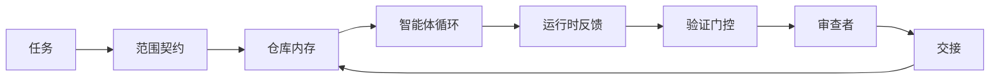

# 智能体工作台工程：为何有能力的模型仍然失败

> 有能力的模型还不够。可靠的智能体需要一个工作台：指令、状态、范围、反馈、验证、审查和交接。去掉这些，即使是前沿模型也会产出无法安全发布的工作。

**类型：** 学习 + 构建
**编程语言：** Python（标准库）
**前置知识：** Phase 14 · 01（智能体循环）、Phase 14 · 26（失败模式）
**预计时间：** 约 45 分钟

## 学习目标

- 将模型能力与执行可靠性分离。
- 列出决定智能体能否发布的七个工作台界面。
- 在一个小型仓库任务上比较仅提示词运行与工作台引导运行的差异。
- 生成一份失败模式报告，将每个缺失的界面映射到它导致的症状。

## 问题背景

你将一个前沿模型放入一个真实仓库，要求它添加输入验证。它打开四个文件，写出看起来合理的代码，宣告成功，然后停止。你运行测试。两个失败了。第三个与验证无关的文件被修改了。没有记录智能体假设了什么，首先尝试了什么，或者还剩什么要做。

模型对 Python 没有错。它对工作理解有误。它不知道什么算作完成、允许在哪里写、哪些测试是权威的，或者下一个会话应该如何接续。

这不是模型的 bug。这是工作台的 bug。围绕智能体的界面缺少将一次性生成转变为可靠、可恢复的工程的部分。

## 核心概念

工作台是在任务期间包裹模型的操作环境。它有七个界面：

| 界面 | 携带的内容 | 缺失时的失败 |
|------|----------|------------|
| 指令 | 启动规则、禁止操作、完成定义 | 智能体猜测发布意味着什么 |
| 状态 | 当前任务、已接触文件、阻碍、下一步操作 | 每次会话从零重新开始 |
| 范围 | 允许的文件、禁止的文件、验收标准 | 编辑泄漏到不相关的代码 |
| 反馈 | 真实命令输出捕获到循环中 | 智能体在 400 错误上宣告成功 |
| 验证 | 测试、lint、冒烟测试、范围检查 | "看起来不错"到达主分支 |
| 审查 | 用不同角色进行第二次检查 | 构建者为自己的作业打分 |
| 交接 | 改变了什么、为什么、还剩什么 | 下一个会话重新发现一切 |

工作台与模型无关。你可以更换模型并保留界面。你不能更换界面并保持可靠性。



循环在状态文件上闭合，而不是在聊天历史上。聊天是易失的。仓库是系统的真实记录。

### 工作台与提示词工程

提示词告诉模型这一轮你想要什么。工作台告诉模型如何跨轮次和跨会话完成工作。大多数智能体失败故事都是穿着提示词工程外衣的工作台失败。

### 工作台与框架

框架给你一个运行时（LangGraph、AutoGen、Agents SDK）。工作台给智能体在该运行时内一个工作的地方。两者都需要。这个小型专题关于的是第二个。

### 从原语推理，而不是从供应商分类法

现在有很多关于"运行框架工程"的文章。Addy Osmani、OpenAI、Anthropic、LangChain、Martin Fowler、MongoDB、HumanLayer、Augment Code、Thoughtworks、walkinglabs 的精选列表，以及 Medium 和 Hacker News 上的稳定文章流都在讨论它。它们在运行框架的边界、范围以及使用哪种词汇上存在分歧。我们不需要选边站。七个界面是一个用户体验层；在每个工作台之下是支撑任何可靠后端的同一套分布式系统原语。

暂时去掉智能体标签。智能体运行是跨越时间、进程和机器的计算。为了使其可靠，你需要任何生产系统所需的相同原语。

| 原语 | 它是什么 | 对智能体携带的内容 |
|------|---------|-----------------|
| 函数 | 类型化处理器。尽可能纯粹。拥有其输入和输出。 | 工具调用、规则检查、验证步骤、模型调用 |
| 工作者 | 长期运行的进程，拥有一个或多个函数和生命周期 | 构建者、审查者、验证器、MCP 服务器 |
| 触发器 | 调用函数的事件源 | 智能体循环滴答、HTTP 请求、队列消息、定时任务、文件变更、钩子 |
| 运行时 | 决定在哪里运行什么、使用什么超时和资源的边界 | Claude Code 的进程、LangGraph 的运行时、工作者容器 |
| HTTP / RPC | 调用者与工作者之间的连线 | 工具调用协议、MCP 请求、模型 API |
| 队列 | 触发器和工作者之间的持久缓冲器；背压、重试、幂等性 | 任务板、反馈日志、审查收件箱 |
| 会话持久化 | 在崩溃、重启、模型替换后存活的状态 | `agent_state.json`、检查点、KV 存储、仓库本身 |
| 授权策略 | 谁可以以哪种范围调用哪个函数 | 允许/禁止的文件、批准边界、MCP 能力列表 |

现在将七个工作台界面映射到这些原语上。

- **指令**——策略 + 函数元数据。规则是检查（函数）。路由器（`AGENTS.md`）是附加到运行时启动的策略。
- **状态**——会话持久化。运行时在每步读取的键值存储。文件、KV 或 DB；持久化语义重要，存储后端不重要。
- **范围**——每任务的授权策略。允许/禁止的 glob 是 ACL。所需批准是权限格。
- **反馈**——写入队列的调用日志。每个 shell 调用是一个记录，持久的，可重放的。
- **验证**——一个函数。在输入上确定性。在任务关闭时触发。失败时关闭。
- **审查**——一个独立的工作者，对构建者工件有只读权限，对审查报告有只写权限。
- **交接**——由会话结束触发器发出的持久记录。下一个会话的启动触发器读取它。

智能体循环本身是一个消耗事件（用户消息、工具结果、计时器滴答）、调用函数（模型，然后是模型选择的工具）、写入记录（状态、反馈）和发出触发器（验证、审查、交接）的工作者。没有神秘；与作业处理器的形态相同。

### 流通中的模式，翻译为原语

每种流行的运行框架模式都归结为这八种原语。翻译表。

| 供应商或社区模式 | 它实际上是什么 |
|--------------|------------|
| Ralph 循环（Claude Code、Codex、agentic_harness 书）——当智能体试图提前停止时，将原始意图重新注入到新鲜上下文窗口 | 一个用干净上下文重新入队任务的触发器；会话持久化向前传递目标 |
| 计划/执行/验证（PEV） | 三个工作者，每个角色一个，通过阶段之间的状态和队列通信 |
| 运行框架-计算分离（OpenAI Agents SDK，2026 年 4 月）——将控制平面与执行平面分离 | 重新表述控制平面/数据平面。比智能体标签早了几十年 |
| 开放智能体通行证（OAP，2026 年 3 月）——在执行前根据声明性策略签名和审计每个工具调用 | 由预操作工作者执行的授权策略，带签名审计队列 |
| 指南和传感器（Birgitta Böckeler / Thoughtworks）——前馈规则 + 反馈可观测性 | 授权策略 + 验证函数 + 可观测性追踪 |
| 渐进压缩，5 阶段（Claude Code 逆向工程，2026 年 4 月） | 一个类似定时任务运行在会话持久化上的状态管理工作者，以保持其在预算内 |
| 钩子/中间件（LangChain、Claude Code）——拦截模型和工具调用 | 包裹在运行时调用路径周围的触发器 + 函数 |
| 带渐进式公开的 Markdown 技能（Anthropic、Flue） | 一个函数注册表，其中函数元数据即时加载到上下文中 |
| 沙箱智能体（Codex、Sandcastle、Vercel Sandbox） | 计算平面：一个带隔离文件系统、网络和生命周期的运行时 |
| MCP 服务器 | 通过稳定 RPC 公开函数的工作者，以能力列表作为授权 |

该表中的每个条目都是智能体社区到达分布式系统中已有名称的原语，并给它一个新名称。对营销有用的标签；作为工程词汇没有用。

### 收据实际上说了什么

运行框架优于模型的声明背后现在有数字了。值得了解，因为它们也是反对"只需等待更智能的模型"的唯一诚实论据。

- Terminal Bench 2.0——相同的模型，运行框架变化将一个编码智能体从前 30 名之外移到了第五名（LangChain，《智能体运行框架的解剖》）。
- Vercel——删除了其智能体 80% 的工具；成功率从 80% 跃升至 100%（MongoDB）。
- Harvey——法律智能体仅通过运行框架优化就将准确率提高了一倍以上（MongoDB）。
- 88% 的企业 AI 智能体项目未能投入生产。失败集中在运行时，而不是推理上（preprints.org，《语言智能体的运行框架工程》，2026 年 3 月）。
- 2025 年一项跨三个流行开源框架的基准研究报告了约 50% 的任务完成率；long-context WebAgent 在长上下文条件下从 40-50% 崩溃到 10% 以下，主要来自无限循环和目标丢失（在 2026 年初的文章中广泛报道）。

结论不是"运行框架永远获胜"。模型确实会随时间吸收运行框架技巧。结论是，今天，承重的工程在模型周围，而不是在模型内部，承载这个负荷的原语正是每个生产系统一直需要的原语。

### 供应商文章停止的地方

这是你不需要客气的部分。

- LangChain 的《智能体运行框架的解剖》列举了十一个组件——提示词、工具、钩子、沙箱、编排、内存、技能、子智能体和运行时"哑循环"。它没有命名队列、作为部署单元的工作者、触发器语义、作为单独关注点的会话持久化，或授权策略。它将运行框架视为你配置的对象，而不是你部署的系统。
- Addy Osmani 的《智能体运行框架工程》提出了 `智能体 = 模型 + 运行框架` 的框架和棘轮模式，但没有说明运行框架是由什么构建的。它读起来像一个立场，而不是一个规范。
- Anthropic 和 OpenAI 在界面上最深入，但停留在自己的运行时内。2026 年 4 月 Agents SDK 中的"运行框架-计算分离"公告是第一个明确背书控制平面/数据平面分离的供应商文章。那是一个原语思想，不是新思想。
- agentic_harness 书将运行框架视为配置对象（Jaymin West 的《代理工程》第 6 章），其中最有力的一句话是"运行框架是代理系统中的主要安全边界。"那只是重新表述的授权策略。
- Hacker News 帖子不断到达同一个地方。2026 年 4 月的帖子《智能体运行框架属于沙箱之外》认为运行框架应该"更像一个坐在一切之外并根据上下文和用户授权访问的管理程序。"那仍然是作为独立平面的授权策略。

你不需要反对这些文章中的任何一篇就能注意到差距。它们在对一个已经存在的系统进行 UX 描述。我们在构建系统。当系统构建正确时，七个界面从原语中产生。当它构建错误时，再多的 `AGENTS.md` 润色也无法修复缺失的队列。

所以当你在其他地方听到"运行框架工程"时，翻译为原语。提示词和规则是策略和函数。脚手架是运行时。防护栏是授权 + 验证。钩子是触发器。内存是会话持久化。Ralph 循环是重新入队。子智能体是工作者。沙箱是计算平面。词汇在变化；工程不变。工作台是面向智能体的用户体验；运行框架，在经过下一次供应商重新定义后仍然存在的意义上，是正确连接在一起的函数、工作者、触发器、运行时、队列、持久化和策略。

## 动手实践

`code/main.py` 运行一个微型仓库任务两次。首先仅使用提示词，然后连接七个界面。相同的模型，相同的任务。脚本统计失败运行中缺失的界面并打印一份失败模式报告。

仓库任务故意很小：向单文件 FastAPI 风格的处理器添加输入验证并编写一个通过的测试。

运行：

```
python3 code/main.py
```

输出：两次运行的并排日志，总结仅提示词运行的 `failure_modes.json`，以及工作台运行的单行判决。

智能体是一个小型基于规则的存根；重点是界面，而不是模型。在这个小专题的其余部分，你将把每个界面重建为真实的、可复用的工件。

## 使用建议

工作台界面已经存在于生产环境中的三个地方，即使没有人这么称呼它们：

- **Claude Code、Codex、Cursor。** `AGENTS.md` 和 `CLAUDE.md` 是指令界面。斜线命令是范围。钩子是验证。
- **LangGraph、OpenAI Agents SDK。** 检查点和会话存储是状态界面。切换是交接界面。
- **真实仓库上的 CI。** 测试、lint 和类型检查是验证。PR 模板是交接。CODEOWNERS 是审查。

工作台工程是使这些界面明确和可复用的学科，而不是让每个团队重新发现它们。

## 产出技能

`outputs/skill-workbench-audit.md` 是一个可移植技能，用于审计现有仓库的七个工作台界面，并报告哪些缺失、哪些部分存在、哪些健康。将其放在任何智能体设置旁边；它告诉你首先修复什么。

## 练习

1. 选择一个你已经运行智能体的仓库。从 0（缺失）到 2（健康）为七个界面打分。你最薄弱的界面是什么？
2. 扩展 `main.py`，使仅提示词运行也产生虚假的"成功"声明。验证验证门控是否能捕获它。
3. 为你自己的产品添加第八个界面。论证它为什么不能归并到现有七个之一中。
4. 使用一个幻觉了额外文件写入的不同存根智能体重新运行脚本。哪个界面首先捕获它？
5. 将 Phase 14 · 26 中的五种行业反复出现的失败模式映射到七个界面。每个界面被设计来吸收哪种模式？

## 关键术语

| 术语 | 常见说法 | 实际含义 |
|------|---------|---------|
| 工作台 | "设置" | 围绕模型的工程化界面，使工作可靠 |
| 界面 | "一个文档"或"一个脚本" | 智能体在每一轮读取或写入的已命名、机器可读的输入 |
| 系统的真实记录 | "笔记" | 当聊天历史消失时，智能体视为真理的文件 |
| 完成定义 | "验收" | 智能体无法伪造的客观、文件支持的检查清单 |
| 工作台审计 | "仓库就绪检查" | 对七个界面的检查，在工作开始前标记缺失的部分 |

## 延伸阅读

将这些作为数据点阅读，而不是权威。每一个都是部分分类法。在决定是否采纳之前，将每个概念翻译回原语（函数、工作者、触发器、运行时、HTTP/RPC、队列、持久化、策略）。

供应商框架：

- [Addy Osmani，智能体运行框架工程](https://addyosmani.com/blog/agent-harness-engineering/) — `智能体 = 模型 + 运行框架` 和棘轮模式；基础设施上较薄
- [LangChain，智能体运行框架的解剖](https://blog.langchain.com/the-anatomy-of-an-agent-harness/) — 十一个组件：提示词、工具、钩子、编排、沙箱、内存、技能、子智能体、运行时；省略了队列、部署、授权
- [OpenAI，运行框架工程：在智能体优先的世界中利用 Codex](https://openai.com/index/harness-engineering/) — Codex 团队对其运行时周围界面的看法
- [OpenAI，展开 Codex 智能体循环](https://openai.com/index/unrolling-the-codex-agent-loop/) — 智能体循环归结为对函数调用的 `while`
- [Anthropic，长时间运行智能体的有效运行框架](https://www.anthropic.com/engineering/effective-harnesses-for-long-running-agents) — 特定运行时内的长时程界面
- [Anthropic，长时间运行应用开发的运行框架设计](https://www.anthropic.com/engineering/harness-design-long-running-apps) — 应用设计笔记
- [LangChain Deep Agents 运行框架能力](https://docs.langchain.com/oss/python/deepagents/harness) — 运行时配置界面

具有可用细节的实践者文章：

- [Martin Fowler / Birgitta Böckeler，编码智能体用户的运行框架工程](https://martinfowler.com/articles/harness-engineering.html) — 指南（前馈）+ 传感器（反馈）；最简洁的控制理论框架
- [HumanLayer，技能问题：编码智能体的运行框架工程](https://www.humanlayer.dev/blog/skill-issue-harness-engineering-for-coding-agents) — "这不是模型问题，这是配置问题"
- [MongoDB，智能体运行框架：为什么 LLM 是你智能体系统中最小的部分](https://www.mongodb.com/company/blog/technical/agent-harness-why-llm-is-smallest-part-of-your-agent-system) — 收据：Vercel 80% 到 100%，Harvey 准确率 2 倍，Terminal Bench 前 30 到前 5
- [Augment Code，AI 编码智能体的运行框架工程](https://www.augmentcode.com/guides/harness-engineering-ai-coding-agents) — 约束优先的演练
- [Sequoia 播客，Harrison Chase 谈上下文工程长时程智能体](https://sequoiacap.com/podcast/context-engineering-our-way-to-long-horizon-agents-langchains-harrison-chase/) — 运行时关注优先于模型关注

书籍、论文和参考实现：

- [Jaymin West，代理工程——第 6 章：运行框架](https://www.jayminwest.com/agentic-engineering-book/6-harnesses) — 书籍长度的处理，将运行框架视为主要安全边界
- [preprints.org，语言智能体的运行框架工程（2026 年 3 月）](https://www.preprints.org/manuscript/202603.1756) — 作为控制/代理/运行时的学术框架
- [walkinglabs/awesome-harness-engineering](https://github.com/walkinglabs/awesome-harness-engineering) — 跨上下文、评估、可观测性、编排的精选阅读列表
- [ai-boost/awesome-harness-engineering](https://github.com/ai-boost/awesome-harness-engineering) — 备选精选列表（工具、评估、内存、MCP、权限）
- [andrewgarst/agentic_harness](https://github.com/andrewgarst/agentic_harness) — 带 Redis 支持内存和评估套件的生产就绪参考实现
- [HKUDS/OpenHarness](https://github.com/HKUDS/OpenHarness) — 带内置个人智能体的开放智能体运行框架

值得阅读其分歧而非共识的 Hacker News 帖子：

- [HN：长时间运行智能体的有效运行框架](https://news.ycombinator.com/item?id=46081704)
- [HN：一个下午改进 15 个 LLM 的编码能力。只有运行框架改变了](https://news.ycombinator.com/item?id=46988596)
- [HN：智能体运行框架属于沙箱之外](https://news.ycombinator.com/item?id=47990675) — 主张授权作为独立平面

本课程内的交叉引用：

- Phase 14 · 23 — OpenTelemetry GenAI 约定：传感器文献指向的可观测性层
- Phase 14 · 26 — 失败模式目录，七个界面被设计来吸收的失败
- Phase 14 · 27 — 提示词注入防御，位于授权策略原语
- Phase 14 · 29 — 生产运行时（队列、事件、定时任务）：本课中的原语在部署中的位置
