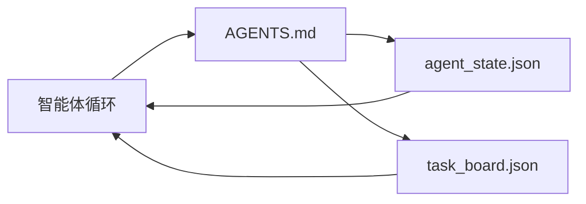

# 最小智能体工作台

> 最小可用的工作台由三个文件组成：一个根指令路由器、一个状态文件和一个任务板。其他一切都是在此之上分层的。如果一个仓库无法支撑这三个文件，没有任何模型能拯救它。

**类型：** 构建
**编程语言：** Python（标准库）
**前置知识：** Phase 14 · 31（为何有能力的模型仍然失败）
**预计时间：** 约 45 分钟

## 学习目标

- 定义构成最小可用工作台的三个文件。
- 解释为什么简短的根路由器优于冗长的单体 `AGENTS.md`。
- 构建一个智能体在每轮可以读取、结束时可以写入的状态文件。
- 构建一个在没有聊天历史的多会话工作中也能存活的任务板。

## 问题背景

大多数团队通过写一个 3000 行的 `AGENTS.md` 来构建工作台，然后称之为完成。模型加载它，忽略无法总结的部分，并仍然在一直失败的相同界面上失败。

你需要相反的东西。一个微小的根文件，仅在相关时将智能体路由到更深层的文件。智能体在操作前读取、操作后写入的持久状态。一个说明正在进行什么、什么被阻塞、下一步是什么的任务板。

三个文件。每个都有一个职责。每个都足够机器可读，可以在之后演变为真正的系统。

## 核心概念



### AGENTS.md 是路由器，不是手册

好的 `AGENTS.md` 很简短。它将智能体指向：

- 状态文件（你在哪里）。
- 任务板（还剩什么）。
- 更深层的规则（在 `docs/agent-rules.md` 下）。
- 验证命令（如何知道它有效）。

任何更长的内容都放在更深层的文档中，仅在需要时加载。长手册会被忽略。简短路由器会被遵循。

### agent_state.json 是系统的真实记录

状态携带：活跃任务 ID、已接触的文件、所做的假设、阻碍因素和下一步操作。智能体在每轮都读取它。下一个会话读取它而不是重放聊天。

状态存在文件中，因为聊天历史是不可靠的。会话会结束。对话会被裁剪。文件不会。

### task_board.json 是队列

任务板携带每个任务及其状态 `todo | in_progress | done | blocked`。当状态为空时，这是智能体从中拉取的队列，也是你想知道智能体是否走在正轨上时读取的队列。

板上的任务有 ID、目标、所有者（`builder`、`reviewer` 或 `human`），以及验收标准。板故意很小：当它增长超过一屏时，你有一个规划问题，而不是板的问题。

### 三个文件是底线，不是天花板

后续课程添加范围契约、反馈运行器、验证门控、审查者检查清单和交接包。这里的三个文件是所有这些都假设存在的基础。

## 动手实践

`code/main.py` 将最小工作台写入空仓库，并演示单个智能体轮次，该轮次：

1. 读取 `agent_state.json`。
2. 如果状态为空，从 `task_board.json` 中拉取下一个任务。
3. 在范围内触碰单个文件。
4. 写回更新的状态。

运行：

```
python3 code/main.py
```

脚本在自身旁边创建 `workdir/`，布置三个文件，运行一轮，并打印差异。重新运行它可以看到第二轮如何从第一轮停止的地方接续。

## 使用建议

在生产智能体产品中，相同的三个文件以不同的名称出现：

- **Claude Code：** `AGENTS.md` 或 `CLAUDE.md` 作为路由器，`.claude/state.json` 风格的存储作为状态，钩子作为板。
- **Codex / Cursor：** 工作区规则作为路由器，会话内存作为状态，聊天侧边栏中的排队任务作为板。
- **自定义 Python 智能体：** 你刚刚写的相同文件。

名称会变化。形态不变。

## 生产中的模式

当三种模式分层在其上时，最小工作台能在真实单体仓库中存活。它们是独立的；选择你的仓库实际需要的那些。

**带最近优先优先级的嵌套 `AGENTS.md`。** OpenAI 在其主仓库中发布了 88 个 `AGENTS.md` 文件，每个子组件一个。Codex、Cursor、Claude Code 和 Copilot 都从工作文件向仓库根目录走，并连接它们沿途找到的每个 `AGENTS.md`。子目录文件扩展根文件。Codex 添加 `AGENTS.override.md` 来替换而不是扩展；覆盖机制是 Codex 特有的，跨工具工作时避免使用。Augment Code 的测量是最重要的一行：最好的 `AGENTS.md` 文件带来的质量跃升相当于从 Haiku 升级到 Opus；最差的会让输出比没有文件更糟糕。

**即使看起来像覆盖也要拒绝的反模式。** 冲突指令会悄悄将智能体从交互模式降至贪婪模式（ICLR 2026 AMBIG-SWE：48.8% → 28% 解决率）；用数字排列优先级而不是平铺它们。无法验证的风格规则（"遵循 Google Python 风格指南"）没有执行命令，让智能体发明合规；用确切的 lint 命令配对每条风格规则。以风格而不是命令开头会埋没验证路径；命令优先，风格最后。为人类而不是智能体写作会浪费上下文预算；简洁是一个特性。

**跨工具符号链接。** 带符号链接的单根文件（`ln -s AGENTS.md CLAUDE.md`、`ln -s AGENTS.md .github/copilot-instructions.md`、`ln -s AGENTS.md .cursorrules`）使每个编码智能体保持在同一个真实来源上。Nx 的 `nx ai-setup` 从单个配置跨 Claude Code、Cursor、Copilot、Gemini、Codex 和 OpenCode 自动化了这一过程。

## 产出技能

`outputs/skill-minimal-workbench.md` 为任何新仓库生成三文件工作台：一个针对项目调整的 `AGENTS.md` 路由器、一个带正确键的 `agent_state.json`，以及一个用当前积压工作初始化的 `task_board.json`。

## 练习

1. 向 `agent_state.json` 添加 `last_run` 时间戳。如果文件超过 24 小时，拒绝运行，除非操作员确认。
2. 向任务板添加 `priority` 字段，并更改拉取器以始终选择优先级最高的 `todo`。
3. 将 `task_board.json` 迁移到 JSON Lines，使每个任务是一行，差异在版本控制中干净。
4. 编写一个 `lint_workbench.py`，如果 `AGENTS.md` 超过 80 行或引用了不存在的文件，则失败。
5. 决定三个文件中哪一个最难丢失。为它辩护。

## 关键术语

| 术语 | 常见说法 | 实际含义 |
|------|---------|---------|
| 路由器 | `AGENTS.md` | 将智能体指向更深层文档和文件的简短根文件 |
| 状态文件 | "笔记" | 智能体位置的机器可读记录，每轮写入 |
| 任务板 | "积压" | 带状态、所有者、验收条件的 JSON 工作队列 |
| 系统的真实记录 | "真实来源" | 当聊天消失时工作台视为权威的文件 |

## 延伸阅读

- [agents.md——开放规范](https://agents.md/) — 被 Cursor、Codex、Claude Code、Copilot、Gemini、OpenCode 采用
- [Augment Code，好的 AGENTS.md 相当于模型升级。坏的比没有文档更糟糕](https://www.augmentcode.com/blog/how-to-write-good-agents-dot-md-files) — 测量的质量跃升
- [Blake Crosley，AGENTS.md 模式：什么真正改变了智能体行为](https://blakecrosley.com/blog/agents-md-patterns) — 经验上有效的和无效的
- [Datadog 前端，在 AGENTS.md 中引导单体仓库中的 AI 智能体](https://dev.to/datadog-frontend-dev/steering-ai-agents-in-monorepos-with-agentsmd-13g0) — 实践中的嵌套优先级
- [Nx Blog，教你的 AI 智能体如何在单体仓库中工作](https://nx.dev/blog/nx-ai-agent-skills) — 跨六个工具的单源生成
- [The Prompt Shelf，AGENTS.md 最佳实践：结构、范围和真实示例](https://thepromptshelf.dev/blog/agents-md-best-practices/) — 能通过审查的章节排序
- [Anthropic，Claude Code 子智能体和会话存储](https://docs.anthropic.com/en/docs/agents-and-tools/claude-code/sub-agents)
- Phase 14 · 31 — 这个最小工作台吸收的失败模式
- Phase 14 · 34 — 本课预览的持久状态 schema
