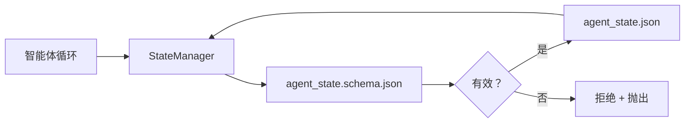

# 仓库内存与持久状态

> 聊天历史是易失的。仓库是持久的。工作台将智能体状态存储在版本化文件中，使下一个会话、下一个智能体和下一个审查者都从相同的真实来源读取。

**类型：** 构建
**编程语言：** Python（标准库 + 可选 `jsonschema`）
**前置知识：** Phase 14 · 32（最小工作台）
**预计时间：** 约 60 分钟

## 学习目标

- 定义什么属于仓库内存，什么属于聊天历史。
- 为 `agent_state.json` 和 `task_board.json` 编写 JSON Schema。
- 构建一个原子地加载、验证、修改和持久化状态的状态管理器。
- 使用 schema 在不良写入损坏工作台之前拒绝它们。

## 问题背景

智能体完成一个会话。聊天关闭。下一个会话打开并询问从哪里开始。模型说"让我检查文件"，读取陈旧的笔记，并重做已经完成的工作。或者更糟糕的是，它重写了一个已完成的文件，因为没有人告诉它这个文件已经完成了。

工作台的解决方案是仓库内存：状态存储在仓库的 JSON 文件中，按 schema 写入，原子持久化，在代码审查中对差异友好。聊天是瞬态的；仓库是系统的真实记录。

## 核心概念



### 什么属于仓库内存

| 属于 | 不属于 |
|------|-------|
| 活跃任务 ID | 原始聊天记录 |
| 本会话已接触的文件 | Token 级别的推理追踪 |
| 智能体做出的假设 | "用户似乎很沮丧" |
| 开放的阻碍因素 | 采样的补全 |
| 下一步操作 | 供应商特定的模型 ID |

测试是持久性：三个月后在 CI 重新运行时这会有用吗？如果是，属于仓库。如果否，属于遥测。

### Schema 优先的状态

JSON Schema 是契约。没有它，每个智能体都发明新字段，每个审查者都要学习新形态，每个 CI 脚本都要特殊处理过去的版本。有了它，不良写入就是被拒绝的写入。

Schema 涵盖：

- 必需键。
- 允许的 `status` 值。
- 禁止的值（例如，数组的 `null`）。
- 模式约束（任务 ID 匹配 `T-\d{3,}`）。
- 用于迁移的版本字段。

### 原子写入

状态写入需要能在部分失败中存活：写入临时文件，fsync，重命名覆盖目标。状态文件是真实来源；一个写了一半的文件比没有文件更糟糕。

### 迁移

当 schema 更改时，随 schema 升级一起发布迁移脚本。状态文件携带 `schema_version` 字段；管理器拒绝加载它无法迁移的版本的文件。

## 动手实践

`code/main.py` 实现：

- `agent_state.schema.json` 和 `task_board.schema.json`。
- 仅标准库的验证器（JSON Schema 子集：required、type、enum、pattern、items）。
- 带原子临时文件-重命名写入的 `StateManager.load`、`StateManager.update`、`StateManager.commit`。
- 一个修改状态、持久化、重新加载并证明往返的演示。

运行：

```
python3 code/main.py
```

脚本写入 `workdir/agent_state.json` 和 `workdir/task_board.json`，在两轮中修改它们，并在每步打印验证的状态。

## 生产中的模式

四种模式将本课的最小实现转化为多智能体单体仓库可以承受的东西。

**原子临时文件-重命名不是可选的。** 2026 年 3 月的 Hive 项目 bug 报告清楚地记录了失败模式：`state.json` 通过 `write_text()` 写入，异常被捕获并忽略。部分写入让会话在没有任何信号的情况下恢复到损坏的状态。解决方案始终是：在目标所在的同一目录中 `tempfile.mkstemp`，写入，`fsync`，`os.replace`（POSIX 和 Windows 上的原子重命名）。本课的 `atomic_write` 正是这样做的。

**每个非幂等工具调用的幂等性键。** 如果智能体在调用工具之后、检查点结果之前崩溃，恢复会重试工具调用。对读取是安全的；对邮件、数据库插入、文件上传是危险的。模式：在执行之前将每个工具调用 ID 记录到 `pending_calls.jsonl` 中。重试时，检查 ID；如果存在，跳过调用并使用缓存结果。Anthropic 和 LangChain 都在 2026 年的指南中指出了这一点；LangGraph 的检查点器出于同样的原因持久化待处理的写入。

**将大型工件与状态分离。** 不要将 CSV、长记录或生成的文件存储在 `agent_state.json` 中。将工件保存为单独的文件（或上传到对象存储），在状态中只保留路径。检查点保持小而快；工件独立增长。

**用于审计的事件溯源，用于恢复的快照。** 在每次修改时追加到事件日志（`state.events.jsonl`）；定期快照到 `state.json`。恢复读取快照，然后重放快照时间戳之后的任何事件。这消耗更多磁盘，但让你可以逐字重放智能体决策——在调试长时程运行时至关重要。与 Postgres 内部使用 WAL 的形态相同。

**Schema 迁移或拒绝加载。** `schema_version` 整数是契约。当管理器加载一个版本未知的文件时，它拒绝读取。随 schema 升级发布迁移脚本；`tools/migrate_state.py` 在每次启动时幂等运行。

## 使用建议

在生产中：

- **LangGraph 检查点器。** 相同的思想，不同的存储。检查点器将图状态持久化到 SQLite、Postgres 或自定义后端。当检查点器失败时，本课教授的 schema 是你手动读取状态的依据。
- **Letta 内存块。** 带结构化 schema 的持久块（Phase 14 · 08）。相同的规范，范围在长期运行的角色上。
- **OpenAI Agents SDK 会话存储。** 可插拔后端，schema 感知。本课的状态文件是本地文件后端。

## 产出技能

`outputs/skill-state-schema.md` 生成特定于项目的 JSON Schema 对（状态 + 板）、接入原子写入的 Python `StateManager`，以及迁移脚手架，使下一次 schema 升级不会破坏工作台。

## 练习

1. 添加 `last_human_touch` 时间戳。拒绝在人类编辑后五秒内的任何智能体写入。
2. 扩展验证器以支持 `oneOf`，使任务可以是带不同必需字段的构建任务或审查任务。
3. 添加 `schema_version` 字段并编写从 v1 到 v2 的迁移（将 `blockers` 重命名为 `risks`）。
4. 将存储后端从本地文件移动到 SQLite。保持 `StateManager` API 完全相同。
5. 用 50ms 写入竞争对相同的状态文件运行两个智能体。什么出了问题，原子重命名如何拯救你？

## 关键术语

| 术语 | 常见说法 | 实际含义 |
|------|---------|---------|
| 仓库内存 | "笔记文件" | 存储在仓库跟踪文件中的状态，按 schema |
| Schema 优先 | "验证输入" | 在写入者之前定义契约，拒绝漂移 |
| 原子写入 | "只是重命名" | 写入临时文件，fsync，重命名，使部分失败不能损坏 |
| 迁移 | "Schema 升级" | 将 vN 状态转换为 v(N+1) 状态的脚本 |
| 系统的真实记录 | "真实来源" | 工作台视为权威的工件 |

## 延伸阅读

- [JSON Schema 规范](https://json-schema.org/specification.html)
- [LangGraph 检查点器](https://langchain-ai.github.io/langgraph/concepts/persistence/)
- [Letta 内存块](https://docs.letta.com/concepts/memory)
- [Fast.io，AI 智能体状态检查点：实践指南](https://fast.io/resources/ai-agent-state-checkpointing/) — 带幂等性的 schema 优先检查点
- [Fast.io，AI 智能体工作流状态持久化：2026 年最佳实践](https://fast.io/resources/ai-agent-workflow-state-persistence/) — 并发控制、TTL、事件溯源
- [Hive Issue #6263 — 非原子 state.json 写入被静默忽略](https://github.com/aden-hive/hive/issues/6263) — 真实项目中的失败模式
- [eunomia，检查点/恢复系统：AI 智能体中的演进、技术、应用](https://eunomia.dev/blog/2025/05/11/checkpointrestore-systems-evolution-techniques-and-applications-in-ai-agents/) — 从操作系统历史应用到智能体的 CR 原语
- [Indium，2026 年长时间运行 AI 智能体的 7 种状态持久化策略](https://www.indium.tech/blog/7-state-persistence-strategies-ai-agents-2026/)
- [Microsoft Agent Framework，压缩](https://learn.microsoft.com/en-us/agent-framework/agents/conversations/compaction) — 供应商检查点管理器
- Phase 14 · 08 — 内存块和睡眠时间计算
- Phase 14 · 32 — 本课 schema 化的三文件最小工作台
- Phase 14 · 40 — 从相同 schema 读取的交接包
