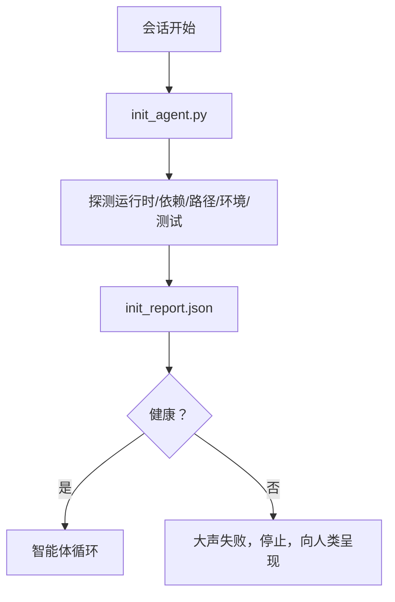

# 智能体初始化脚本

> 每个冷启动会话都要付出代价。智能体读取相同的文件，重试相同的探针，重新发现相同的路径。初始化脚本只付一次代价，将答案写入状态。

**类型：** 构建
**编程语言：** Python（标准库）
**前置知识：** Phase 14 · 32（最小工作台）、Phase 14 · 34（仓库内存）
**预计时间：** 约 45 分钟

## 学习目标

- 识别智能体每个会话永远不应重复做的工作。
- 构建一个确定性的初始化脚本，探测运行时、依赖项和仓库健康状况。
- 持久化探测结果，使智能体读取它而不是重新运行检查。
- 在初始化失败时大声、快速地失败，并有一个地方可以查看。

## 问题背景

打开一个会话。智能体猜测 Python 版本。猜测测试命令。列出仓库根目录五次以找到入口点。尝试导入一个未安装的包。询问用户配置文件在哪里。当它真正开始编辑时，一万个 token 已经用在了本应是单个脚本的设置工作上。

解决方案是一个初始化脚本，在智能体做任何其他事情之前运行，并写入智能体在启动时读取的 `init_report.json`。

## 核心概念



### 初始化脚本探测的内容

| 探测 | 为什么重要 |
|------|---------|
| 运行时版本 | 错误的 Python 或 Node 版本意味着静默的版本错误 |
| 依赖可用性 | 后来发现缺少包的代价是现在捕获它的十倍 |
| 测试命令 | 智能体必须知道如何验证；如果命令缺失则工作台损坏 |
| 仓库路径 | 硬编码路径会漂移；解析一次并固定 |
| 环境变量 | 缺少 `OPENAI_API_KEY` 是一个失败界面，不是运行时谜题 |
| 状态 + 板的新鲜度 | 来自崩溃会话的陈旧状态是一个陷阱 |
| 最后已知良好提交 | 会话结束时交接差异的锚点 |

### 大声失败，快速失败，在一个地方失败

探测失败意味着停止并向人类呈现。没有"智能体会搞定的"。初始化的全部意义在于当工作台损坏时拒绝启动。

### 幂等

连续运行两次。第二次运行除了新的时间戳外应该是无操作的。幂等性是让你将脚本接入 CI、钩子或预任务斜线命令的原因。

### 初始化与启动规则

规则（Phase 14 · 33）描述了操作前必须为真的条件。初始化是建立那些规则可以被检查的脚本。没有初始化的规则变成"要小心"。没有规则的初始化变成精美的失败。

## 动手实践

`code/main.py` 实现 `init_agent.py`：

- 五个探测：Python 版本、通过 `importlib.util.find_spec` 列出的依赖项、测试命令可解析性、必需环境变量、状态文件新鲜度。
- 每个探测返回 `(name, status, detail)`。
- 脚本写入包含完整探测集的 `init_report.json`，如果任何 block 严重性探测失败则以非零退出。

运行：

```
python3 code/main.py
```

脚本打印探测表，写入 `init_report.json`，在成功路径上以零退出或以非零退出并列出失败的探测。

## 生产中的模式

三种模式将有用的初始化脚本与仪式区分开来。

**最后已知良好提交锚定。** 将当前提交与在上次成功合并时写入的 `LKG` 文件对比探测。如果差异超过预算（默认 50 个文件），拒绝启动并要求人类批准新基线。这是 Cloudflare 的 AI 代码审查用来限定审查者智能体范围的方法：每个审查会话都锚定在相同的最后已知良好上，从不跨会话积累漂移。

**带 TTL 的锁文件。** 在第一次成功探测通过后写入 `prereqs.lock`。后续运行在 N 小时内（默认 24 小时）信任锁并跳过昂贵的探测。初始化脚本首先读取锁；如果它是新鲜的且依赖清单哈希匹配，则短路。这与 Docker 用于层缓存的模式相同：幂等探测 + 内容哈希 = 跳过。

**热路径中不网络、不 LLM、不惊喜。** 初始化探测是确定性的管道。一个调用 LLM 来分类失败的探测，或者访问外部服务来检查许可证的探测，不是探测；它是一个工作流。如果一个探测在干运行中需要超过三秒，将其视为工作台气味，要么将其移出初始化，要么缓存其结果。

## 使用建议

在生产中：

- **Claude Code 钩子。** `pre-task` 钩子调用初始化脚本，如果失败则拒绝启动智能体。
- **GitHub Actions。** `setup-agent` 作业运行初始化脚本；智能体作业依赖于它。
- **Docker 入口点。** 智能体容器在 exec 智能体运行时之前运行初始化脚本；失败时日志呈现。

初始化脚本是可移植的，因为它不调用特定框架。Bash、Make 或任务文件都可以包装它。

## 产出技能

`outputs/skill-init-script.md` 访谈项目，将其设置工作分类为探测，并生成特定于项目的 `init_agent.py` 加 CI 工作流，在任何智能体步骤之前运行它。

## 练习

1. 添加一个将当前提交与最后已知良好提交对比的探测，如果超过 50 个文件改变则拒绝启动。
2. 将脚本接入写入 `prereqs.lock` 文件，并如果锁超过七天则拒绝启动。
3. 添加 `--fix` 标志，自动安装缺失的开发依赖项，但未经批准永不修改运行时依赖项。
4. 将探测从硬编码函数移动到 YAML 注册表。为权衡辩护。
5. 为每个探测添加计时预算。运行时间超过三秒的探测是工作台气味。

## 关键术语

| 术语 | 常见说法 | 实际含义 |
|------|---------|---------|
| 探测 | "检查" | 返回 `(name, status, detail)` 的确定性函数 |
| 初始化报告 | "设置输出" | 写在状态旁边的包含探测结果的 JSON |
| 幂等 | "可安全重新运行" | 连续两次运行产生相同的报告（除时间戳外） |
| 大声失败 | "不要吞掉" | 停止并向人类呈现；不静默回退 |
| 设置代价 | "引导成本" | 智能体每个会话花在重新发现明显内容上的 token |

## 延伸阅读

- [Anthropic，长时间运行智能体的有效运行框架](https://www.anthropic.com/engineering/effective-harnesses-for-long-running-agents)
- [GitHub Actions，用于设置的复合操作](https://docs.github.com/en/actions/sharing-automations/creating-actions/creating-a-composite-action)
- [microservices.io，GenAI 开发平台：防护栏](https://microservices.io/post/architecture/2026/03/09/genai-development-platform-part-1-development-guardrails.html) — 预提交 + CI 检查作为初始化
- [Augment Code，如何构建你的 AGENTS.md（2026）](https://www.augmentcode.com/guides/how-to-build-agents-md) — 初始化预期
- [Codex Blog，Codex CLI 上下文压缩](https://codex.danielvaughan.com/2026/03/31/codex-cli-context-compaction-architecture/) — 会话开始作为压缩感知初始化
- Phase 14 · 33 — 此脚本启用的规则集
- Phase 14 · 34 — 此脚本播种的状态文件
- Phase 14 · 38 — 初始化脚本馈送的验证门控
- Phase 14 · 40 — 消耗初始化报告最后已知良好的交接
