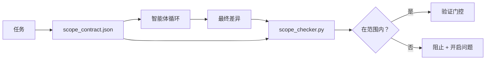

# 范围契约与任务边界

> 模型不知道工作在哪里结束。范围契约是一个每任务文件，说明工作从哪里开始、在哪里结束，以及如果溢出如何回滚。契约将"保持在范围内"从愿望变成检查。

**类型：** 构建
**编程语言：** Python（标准库）
**前置知识：** Phase 14 · 32（最小工作台）、Phase 14 · 33（规则即约束）
**预计时间：** 约 50 分钟

## 学习目标

- 编写一个智能体在任务开始时读取、验证者在任务结束时读取的范围契约。
- 指定允许的文件、禁止的文件、验收标准、回滚计划和批准边界。
- 实现一个将差异与契约对比并标记违规的范围检查器。
- 使范围蔓延可见、自动化且可审查。

## 问题背景

智能体会蔓延。任务是"修复登录 bug"。差异触及了登录路由、邮件助手、数据库驱动程序、README 和发布脚本。每次触及在当时都有一个看似合理的原因。合在一起，它们是一个与被审查的不同的变更。

范围蔓延是智能体工作中监控最不足的失败模式，因为智能体真诚地讲述每个步骤。解决方案不是更严格的提示词。解决方案是磁盘上的一个契约，说明什么是被承诺的，以及将结果与承诺进行比较的检查。

## 核心概念



### 范围契约包含什么

| 字段 | 用途 |
|------|------|
| `task_id` | 链接到板上的任务 |
| `goal` | 审查者可以验证的一句话 |
| `allowed_files` | 智能体可以写入的 glob |
| `forbidden_files` | 智能体即使意外也不得触及的 glob |
| `acceptance_criteria` | 证明完成的测试命令或断言行 |
| `rollback_plan` | 操作员在需要停止时可以执行的一段话 |
| `approvals_required` | 需要明确人类签字的范围外操作 |

没有 `forbidden_files` 的契约是不完整的。负空间是契约的一半。

### Glob，而不是原始路径

真实仓库会移动文件。将契约固定到 glob（`app/**/*.py`、`tests/test_signup*.py`），这样会话之间的重构不会使契约失效。

### 回滚是范围的一部分

列出如何回滚会迫使契约作者思考可能出什么问题。你无法从中回滚的契约不应该被批准。

### 范围检查是差异检查

智能体写入差异。检查器读取差异、允许的 glob、禁止的 glob，以及运行的任何验收命令的列表。每个违规都是验证门控可以拒绝的标记发现。

## 动手实践

`code/main.py` 实现：

- `scope_contract.json` schema（JSON Schema 子集，glob 数组）。
- 一个将触及文件列表加上运行命令列表转换为 `RunSummary` 的差异解析器。
- 一个根据契约返回 `(violations, in_scope, off_scope)` 的 `scope_check`。
- 两次演示运行：一次保持在范围内，一次蔓延。检查器用确切的文件和原因标记蔓延。

运行：

```
python3 code/main.py
```

输出：契约、两次运行、每次运行的判决，以及保存的 `scope_report.json`。

## 生产中的模式

一位运行"specsmaxxing"（在调用智能体之前用 YAML 编写范围契约）的实践者报告说，在三周内不改变智能体的情况下，跑偏率从 52% 降至 21%。契约做了这项工作，而不是模型。三种模式使收益持续。

**违规预算，而不是二元失败。** `agent-guardrails`（由 Claude Code、Cursor、Windsurf、Codex 通过 MCP 使用的 OSS 合并门控）为每个任务提供 `violationBudget`：预算内的轻微范围偏差作为警告呈现；只有当预算超出时合并门控才拒绝。与 `violationSeverity: "error" | "warning"` 配合使用。预算是能发布的门控与被团队禁用的门控之间的差别。

**按路径族的严重性不对称。** 对 `docs/**` 的越范写入通常是 `warn`；对 `scripts/**`、`migrations/**`、`config/prod/**` 的越范写入始终是 `block`。这种不对称必须存在于契约中，而不是运行时中，因为它是特定于项目的，并且每个任务都会变化。

**文件预算旁边的时间和网络预算。** `time_budget_minutes` 字段限制墙钟时间；运行时在未重新批准的情况下拒绝继续超过它。主机名上的 `network_egress` 白名单防止智能体悄悄访问不属于任务的外部 API。这些也是范围维度；文件 glob 是必要的，但不是充分的。

**多契约合并语义（最小权限）。** 当两个范围契约适用（例如，项目级契约加任务特定契约）时，合并为：**交集** `allowed_files`（两个契约都必须允许该路径），**并集** `forbidden_files`（任一可以禁止），`time_budget_minutes` 是最严格的（最小值），`approvals_required` 累积。`network_egress` 为 `None` 表示不执行，`[]` 表示拒绝全部，`[...]` 作为白名单；合并时，`None` 推迟到另一方，两个列表求交集，拒绝全部保持拒绝全部。在契约 schema 中说明这一点，使合并机械化且可审查。

## 使用建议

生产模式：

- **Claude Code 斜线命令。** `/scope` 命令写入契约并将其固定为会话上下文。子智能体在操作前读取契约。
- **GitHub PR。** 将契约作为 JSON 文件推送到 PR 正文或作为已检入的工件。CI 针对合并差异运行范围检查器。
- **LangGraph 中断。** 范围违规触发中断；处理器询问人类契约是否需要扩展或智能体是否需要退后。

契约随任务传播。当任务关闭时，契约被归档在 `outputs/scope/closed/` 下。

## 产出技能

`outputs/skill-scope-contract.md` 为任务描述生成范围契约，以及一个在 CI 中针对每个智能体差异运行的 glob 感知检查器。

## 练习

1. 添加 `network_egress` 字段，列出允许的外部主机。拒绝触及其他主机的运行。
2. 扩展检查器，在 `docs/**` 上软失败，在 `scripts/**` 上硬失败。为不对称辩护。
3. 使契约使用静态规则集（无 LLM）从 `goal` 字段派生 `allowed_files`。第一个边缘情况出了什么问题？
4. 添加 `time_budget_minutes`，一旦墙钟超出则拒绝继续。
5. 针对同一差异运行两个契约。当两者都适用时，正确的合并语义是什么？

## 关键术语

| 术语 | 常见说法 | 实际含义 |
|------|---------|---------|
| 范围契约 | "任务简介" | 每任务 JSON，列出允许/禁止文件、验收、回滚 |
| 范围蔓延 | "它还触及了..." | 同一任务中契约外的文件被修改 |
| 回滚计划 | "我们可以回退" | 操作员停止时的一段话操作手册 |
| 批准边界 | "需要签字" | 契约中列出的需要明确人类批准的操作 |
| 差异检查 | "路径审计" | 将触及的文件与契约 glob 对比 |

## 延伸阅读

- [LangGraph 人机协同中断](https://langchain-ai.github.io/langgraph/concepts/human_in_the_loop/)
- [OpenAI Agents SDK 工具批准策略](https://platform.openai.com/docs/guides/agents-sdk)
- [logi-cmd/agent-guardrails — 合并门控和范围验证](https://github.com/logi-cmd/agent-guardrails) — 违规预算，严重性层级
- [Dev|Journal，用智能体契约测试防止 AI 智能体配置漂移](https://earezki.com/ai-news/2026-05-05-i-built-a-tiny-ci-tool-to-keep-ai-agent-configs-from-drifting-in-my-repo/) — 无外部依赖的 `--strict` 模式
- [代理编码不是陷阱（生产日志）](https://dev.to/jtorchia/agentic-coding-is-not-a-trap-i-answered-the-viral-hn-post-with-my-own-production-logs-33d9) — specsmaxxing 收据：52% → 21%
- [OpenCode 权限 glob](https://opencode.ai/docs/agents/) — 细粒度每权限范围
- [Knostic，AI 编码智能体安全：威胁模型和保护策略](https://www.knostic.ai/blog/ai-coding-agent-security) — 作为最小权限的范围
- [Augment Code，AI 规范模板](https://www.augmentcode.com/guides/ai-spec-template) — 三层边界系统（必须/询问/永不）
- Phase 14 · 27 — 与范围锁配合的提示词注入防御
- Phase 14 · 33 — 此契约为每个任务专门化的规则集
- Phase 14 · 38 — 检查器报告进入的验证门控
