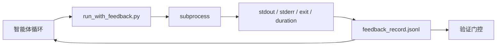

# 运行时反馈循环

> 看不到真实命令输出的智能体靠猜测。反馈运行器将 stdout、stderr、退出码和计时捕获为下一轮可以读取的结构化记录。这样智能体就能响应事实，而不是响应对事实的预测。

**类型：** 构建
**编程语言：** Python（标准库）
**前置知识：** Phase 14 · 32（最小工作台）、Phase 14 · 35（初始化脚本）
**预计时间：** 约 50 分钟

## 学习目标

- 区分运行时反馈与可观测性遥测。
- 构建一个包装 shell 命令并持久化结构化记录的反馈运行器。
- 确定性地截断大型输出，使循环保持在 token 预算内。
- 当反馈缺失时拒绝推进循环。

## 问题背景

智能体说"现在运行测试。"下一条消息说"所有测试通过。"现实是没有测试运行。智能体想象了输出，或者它运行了命令但从不读取结果，或者它读取了结果但静默地截断了失败行。

反馈运行器消除了这个差距。每个命令都通过运行器。每条记录携带命令、捕获的 stdout 和 stderr、退出码、墙钟持续时间和一行智能体注释。智能体在下一轮读取记录。验证门控在任务结束时读取记录。

## 核心概念



### 反馈记录包含什么

| 字段 | 为什么重要 |
|------|---------|
| `command` | 精确的 argv，没有 shell 展开惊喜 |
| `stdout_tail` | 最后 N 行，确定性截断 |
| `stderr_tail` | 最后 N 行，与 stdout 分离 |
| `exit_code` | 明确的成功信号 |
| `duration_ms` | 呈现慢探测和失控进程 |
| `started_at` | 重放的时间戳 |
| `agent_note` | 智能体写的关于它期望什么的一行 |

### 截断是确定性的

50 MB 的日志会摧毁循环。运行器用 `...truncated N lines...` 标记截断头部和尾部，确定性的，使相同的输出始终产生相同的记录。不采样；智能体需要看到的部分（最终错误、最终摘要）在尾部。

### 反馈与遥测

遥测（Phase 14 · 23，OTel GenAI 约定）是供人类操作员跨时间审查运行的。反馈是供此次运行的下一轮使用的。它们共享字段，但存在于具有不同保留期的不同文件中。

### 没有反馈时拒绝推进

如果运行器在捕获退出前出错，记录携带 `exit_code: null` 和 `error: <reason>`。智能体循环必须拒绝在 `null` 退出时声称成功。没有退出，没有进展。

## 动手实践

`code/main.py` 实现：

- `run_with_feedback(command, agent_note)`，包装 `subprocess.run`，捕获 stdout/stderr/exit/duration，确定性截断，追加到 `feedback_record.jsonl`。
- 一个将 JSONL 流式加载到 Python 列表的小型加载器。
- 一个运行三个命令（成功、失败、慢）并打印每个命令最后一条记录的演示。

运行：

```
python3 code/main.py
```

输出：三条反馈记录追加到 `feedback_record.jsonl`，每条的最后一条内联打印。跨重新运行 tail 文件可以看到循环积累。

## 生产中的模式

三种模式将运行器硬化到足以发布。

**写入时脱敏，而不是读取时脱敏。** 任何触及 stdout 或 stderr 的记录都可能泄露密钥。运行器在 JSONL 追加之前进行脱敏：剥去匹配 `^Bearer `、`password=`、`api[_-]?key=`、`AKIA[0-9A-Z]{16}`（AWS）、`xox[baprs]-`（Slack）的行。读取时脱敏是一个陷阱；磁盘上的文件是攻击者能到达的。每季度针对生产运行时观察到的密钥格式审计脱敏模式。

**轮换策略，而不是单一文件。** 将 `feedback_record.jsonl` 限制为每文件 1 MB；溢出时轮换到 `.1`、`.2`，丢弃 `.5`。智能体的循环只读取当前文件，因此运行时成本是有界的。CI 工件存储获得完整的轮换集。没有轮换，文件会成为每次加载器调用的瓶颈。

**重试链的父命令 ID。** 每条记录获得 `command_id`；重试携带指向前一次尝试的 `parent_command_id`。审查者的"失败尝试"列表（Phase 14 · 40）和验证门控的审计都沿着链追踪。没有这个链接，重试看起来像独立的成功，审计会隐藏失败历史。

## 使用建议

生产模式：

- **Claude Code Bash 工具。** 该工具已经捕获 stdout、stderr、exit 和 duration。本课的运行器是任何智能体产品的框架无关等价物。
- **LangGraph 节点。** 将任何 shell 节点包装在运行器中，使记录在图状态之外持久化。
- **CI 日志。** 将 JSONL 管道传输到你的 CI 工件存储；审查者可以重放任何命令而无需重新运行会话。

运行器是一个薄包装器，在每次框架迁移中都能存活，因为它拥有记录的形状。

## 产出技能

`outputs/skill-feedback-runner.md` 生成特定于项目的 `run_with_feedback.py`，带正确的截断预算、接入工作台的 JSONL 写入器，以及智能体在每轮读取的加载器。

## 练习

1. 每条记录添加 `cwd` 字段，使从不同目录运行的相同命令可区分。
2. 添加一个 `redaction` 步骤，剥去匹配 `^Bearer ` 或 `password=` 的行。在固定记录上测试。
3. 通过轮换到 `.1`、`.2` 文件，将总 `feedback_record.jsonl` 大小限制在 1 MB。为轮换策略辩护。
4. 添加 `parent_command_id`，使重试链可见：哪个命令产生了下一个命令消耗的输入。
5. 将 JSONL 管道传输到一个高亮显示最新非零退出的微型 TUI。TUI 要在审查中有用必须显示的八个关键特性。

## 关键术语

| 术语 | 常见说法 | 实际含义 |
|------|---------|---------|
| 反馈记录 | "运行日志" | 带命令、输出、退出、持续时间的结构化 JSONL 条目 |
| 尾部截断 | "修剪日志" | 确定性的头+尾捕获，使记录适合 token 预算 |
| null 时拒绝 | "阻止缺失数据" | 当 `exit_code` 为 null 时循环不能推进 |
| 智能体注释 | "期望标签" | 智能体在读取结果之前写的一行预测 |
| 遥测分离 | "两个日志文件" | 反馈供下一轮，遥测供操作员 |

## 延伸阅读

- [OpenTelemetry GenAI 语义约定](https://opentelemetry.io/docs/specs/semconv/gen-ai/)
- [Anthropic，长时间运行智能体的有效运行框架](https://www.anthropic.com/engineering/effective-harnesses-for-long-running-agents)
- [Guardrails AI x MLflow — 确定性安全、PII、质量验证器](https://guardrailsai.com/blog/guardrails-mlflow) — 作为回归测试的脱敏模式
- [Aport.io，2026 年最佳 AI 智能体防护栏：预操作授权比较](https://aport.io/blog/best-ai-agent-guardrails-2026-pre-action-authorization-compared/) — 工具前/后捕获
- [Andrii Furmanets，2026 年 AI 智能体：工具、内存、评估、防护栏的实践架构](https://andriifurmanets.com/blogs/ai-agents-2026-practical-architecture-tools-memory-evals-guardrails) — 可观测性界面
- Phase 14 · 23 — 遥测侧的 OTel GenAI 约定
- Phase 14 · 24 — 智能体可观测性平台（Langfuse、Phoenix、Opik）
- Phase 14 · 33 — 要求在宣告完成之前获得反馈的规则
- Phase 14 · 38 — 读取 JSONL 的验证门控
