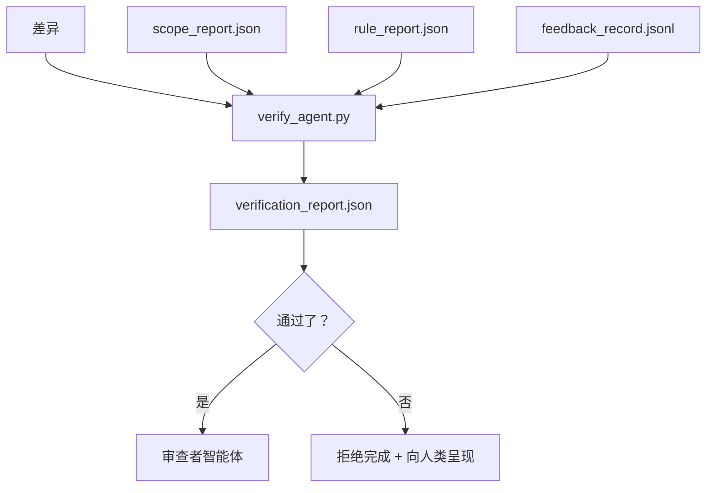

# 验证门控

> 智能体不能将自己的工作标记为完成。验证门控读取范围契约、反馈日志、规则报告和差异，并回答一个单一问题：这个任务实际上完成了吗？如果门控说否，任务就没有完成，无论聊天说什么。

**类型：** 构建
**编程语言：** Python（标准库）
**前置知识：** Phase 14 · 33（规则）、Phase 14 · 36（范围）、Phase 14 · 37（反馈）
**预计时间：** 约 55 分钟

## 学习目标

- 将验证门控定义为工作台工件上的确定性函数。
- 将规则报告、范围报告、反馈记录和差异组合为单一判决。
- 发出审查者智能体和 CI 都可以读取的 `verification_report.json`。
- 对任何 block 严重性失败，无一例外地拒绝推进任务。

## 问题背景

智能体过于容易地宣告成功。三种失败形态占主导：

- "看起来不错。"模型读取了自己的差异并决定它是正确的。
- "测试通过了。"充满自信地说出。没有测试实际运行的记录。
- "验收达到了。"验收标准解释得足够宽松，意味着"任何类似完成的东西。"

工作台的解决方案是一个单一验证门控，读取智能体已经产生的工件并做出判断。门控是确定性的。门控在版本控制中。门控接入 CI。智能体无法贿赂它。

## 核心概念



### 门控检查的内容

| 检查 | 源工件 | 严重性 |
|------|-------|-------|
| 所有验收命令都已运行 | `feedback_record.jsonl` | block |
| 所有验收命令以零退出 | `feedback_record.jsonl` | block |
| 范围检查没有禁止写入 | `scope_report.json` | block |
| 范围检查没有越范写入 | `scope_report.json` | block 或 warn |
| 所有 block 严重性规则通过 | `rule_report.json` | block |
| 反馈中没有 `null` 退出码 | `feedback_record.jsonl` | block |
| 触及的文件匹配 `scope.allowed_files` | 两者 | warn |

`warn` 发现会注释判决；`block` 发现会阻止 `passed: true`。

### 确定性，而不是概率性

门控必须对相同的工件集每次都产生相同的判决。没有 LLM 判断器。LLM 判断器属于审查者侧（Phase 14 · 39），那里的目标是定性评估，而不是状态。

### 一份报告，一条路径

门控在每次任务关闭时发出一份 `verification_report.json`，写在 `outputs/verification/<task_id>.json` 下。CI 消费相同的路径。具有不同路径的多个门控会分叉真实来源。

### 无例外地拒绝

Block 严重性发现不能被智能体覆盖。它们只能由人类覆盖，带有记录的 `override_reason` 和 `overridden_by` 用户 ID。覆盖是签名的变更，而不是智能体决定。

## 动手实践

`code/main.py` 实现：

- 每个输入工件的加载器，全部本地存根，使课程自包含。
- 一个 `verify(task_id, artifacts) -> VerdictReport` 纯函数。
- 一个显示每次检查结果和最终通过/失败的打印器。
- 包含三种任务场景的演示：清洁通过、范围蔓延、缺少验收。

运行：

```
python3 code/main.py
```

输出：三份判决报告，每份保存在脚本旁边。

## 生产中的模式

四种模式将门控从"另一个 lint 作业"提升到"决定性边缘"。

**深度防御，而不是单一门控。** 预提交钩子 → CI 状态检查 → 预工具授权钩子 → 预合并门控。每一层都是确定性的，所以一层的失败会被下一层捕获。microservices.io 的 2026 年 3 月操作手册明确指出：预提交钩子是不可绕过的，因为与模型侧技能不同，它不依赖智能体遵循指令。验证门控位于 CI/预合并层。

**确定性检查防御，模型判断器只用于细微差别。** Anthropic 的 2026 年混合规范配对：可验证奖励（单元测试、schema 检查、退出码）回答"代码解决了问题吗？"——LLM 评分标准回答"代码是否可读、安全、符合风格？"门控运行第一类；审查者（Phase 14 · 39）运行第二类。混合它们会崩溃信号。

**签名覆盖日志，而不是 Slack 帖子。** 每次覆盖在 `outputs/verification/overrides.jsonl` 中发出一行：时间戳、发现码、原因、签名用户、当前 HEAD 提交。运行时拒绝任何缺少签名的覆盖；审计追踪是 git 跟踪的。这是覆盖策略与覆盖戏剧之间的界线。

**覆盖率下限作为一等检查。** `coverage_report.json` 提供给 `coverage_floor`（默认 80%）检查。如果测量的覆盖率低于下限或低于上次合并的下限超过 1 个百分点，门控失败。没有这个检查，智能体会悄悄删除失败的测试，验证报告仍然保持绿色。

**`--strict` 模式将 warn 提升为 block。** 对于发布分支、阻断发布的 PR 或事后分析，`--strict` 使每个警告成为硬失败。该标志按分支选择加入；不是全局默认，因为严格模式对所有内容都会腐蚀日常工作流。

## 使用建议

生产模式：

- **CI 步骤。** `verify_agent` 作业针对智能体的最终工件运行门控。合并保护在没有 `passed: true` 时拒绝。
- **预交接钩子。** 智能体运行时在生成交接文档之前调用门控。没有绿色判决，没有交接。
- **人工分类。** 当智能体声称成功而人类怀疑时，操作员读取报告。

门控是工作台流程中的决定性边缘。每个其他界面都在它的上游。

## 产出技能

`outputs/skill-verification-gate.md` 将门控接入特定项目：哪些验收命令提供给它，哪些规则是 block 严重性，哪些越范写入是被容忍的，覆盖审计日志如何存储。

## 练习

1. 添加 `coverage_floor` 检查：测试命令必须产生至少 80% 覆盖率的报告。决定哪个工件携带下限。
2. 支持 `--strict` 模式，将每个 `warn` 提升为 `block`。记录严格模式是正确默认的情况。
3. 让门控除 JSON 外还生成 Markdown 摘要。为哪些字段属于摘要辩护。
4. 添加 `time_since_last_human_touch` 检查：在人类击键后 60 秒内编辑的任何文件都免于越范标记。
5. 对你产品中的真实智能体差异运行门控。有多少发现是真实的，有多少是噪音？门控在哪里需要增长？

## 关键术语

| 术语 | 常见说法 | 实际含义 |
|------|---------|---------|
| 验证门控 | "阻止事物的检查" | 工作台工件上的确定性函数，产生通过/失败判决 |
| Block 严重性 | "硬失败" | 阻止 `passed: true` 并需要签名覆盖的发现 |
| 覆盖日志 | "我们为什么放行" | 带原因和用户 ID 的签名条目，由审查审计 |
| 验收命令 | "证明" | 零退出意味着 `done` 的 shell 命令 |
| 一条报告路径 | "真实来源" | `outputs/verification/<task_id>.json`，由 CI 和人类共同消费 |

## 延伸阅读

- [Anthropic，长时间运行应用开发的运行框架设计](https://www.anthropic.com/engineering/harness-design-long-running-apps)
- [OpenAI Agents SDK 防护栏](https://platform.openai.com/docs/guides/agents-sdk/guardrails)
- [microservices.io，GenAI 开发平台：防护栏](https://microservices.io/post/architecture/2026/03/09/genai-development-platform-part-1-development-guardrails.html) — 预提交和 CI 之间的深度防御
- [ICMD，2026 年代理 AI 运维操作手册](https://icmd.app/article/the-2026-playbook-for-agentic-ai-ops-guardrails-costs-and-reliability-at-scale-1776661990431) — 批准门控梯子（草稿→批准→阈值以下自动）
- [类型检查合规性：确定性防护栏（arXiv 2604.01483）](https://arxiv.org/pdf/2604.01483) — Lean 4 作为确定性门控的上限
- [logi-cmd/agent-guardrails — 合并门控规范](https://github.com/logi-cmd/agent-guardrails) — 范围 + 变异测试门控
- [Guardrails AI x MLflow](https://guardrailsai.com/blog/guardrails-mlflow) — 作为 CI 评分器的确定性验证器
- [Akira，代理系统的实时防护栏](https://www.akira.ai/blog/real-time-guardrails-agentic-systems) — 工具前/后门控
- Phase 14 · 27 — 提示词注入防御（门控的对抗配对）
- Phase 14 · 36 — 此门控执行的范围契约
- Phase 14 · 37 — 此门控评分的反馈日志
- Phase 14 · 39 — 门控交接给的审查者智能体
