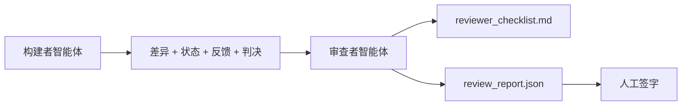

# 审查者智能体：将构建者与评分者分离

> 写了代码的智能体不能给它打分。审查者是一个拥有不同系统提示、不同目标、对构建者产出所有内容只读访问权限的第二个循环。构建者与审查者之间的差距是大多数可靠性所在的地方。

**类型：** 构建
**编程语言：** Python（标准库）
**前置知识：** Phase 14 · 38（验证门控）
**预计时间：** 约 55 分钟

## 学习目标

- 阐述为什么同一个智能体无法可靠地审查自己的工作。
- 构建一个消耗构建者工件并发出结构化审查报告的审查者智能体循环。
- 编写按具体维度评分而不是凭感觉的审查者评分标准。
- 将审查者接入工作台，使人工审查步骤从真实工件开始。

## 问题背景

你要求智能体修复一个 bug。它编辑了四个文件，运行了测试，报告完成。验证门控（Phase 14 · 38）确认验收运行了，范围保持了。门控说 `passed: true`。你合并了。两天后你发现修复只解决了 bug 的一半。

验收是必要的，但不充分。审查者提出验收无法提出的问题：这是否解决了正确的问题？它是否在没有标记的情况下扩大了范围？它是否记录了应该被质疑的假设？它是否让工作台处于下一个会话可以接续的状态？

## 核心概念



### 审查者评分标准

五个维度，每个从 0 到 2 评分。

| 维度 | 问题 |
|------|------|
| 问题契合 | 变更是否解决了所述任务，而不是附近的任务？ |
| 范围纪律 | 编辑是否局限于契约，还是契约被故意扩大了？ |
| 假设 | 所有隐藏假设是否都写在可审查的地方？ |
| 验证质量 | 验收命令是否真正证明了目标，还是它证明了更弱的版本？ |
| 交接就绪 | 下一个会话能否从当前状态干净地接续？ |

总分满分 10 分。低于 7 分是软失败；低于 5 分是硬失败。

### 审查者是一个单独的角色，而不是单独的模型

你可以用与构建者相同的模型运行审查者。纪律在于角色分离：不同的系统提示、不同的输入、对差异没有写入权限。姿态的变化是信号的变化。

### 审查者不能编辑差异

审查者读取差异、状态、反馈、判决。它写一份报告。它不修补差异。如果报告说"修复这个"，下一个构建者轮次做修复；审查者回到审查。混合角色会破坏差距。

### 审查者评分标准与验证门控

门控（Phase 14 · 38）检查确定性事实：验收是否运行，规则是否通过，范围是否保持。审查者做出定性判断：这是否是正确的工作，是否有记录，交接是否可用。两者都是必需的。

## 动手实践

`code/main.py` 实现：

- 一个捆绑审查者读取的工件的 `ReviewerInputs` 数据类。
- 一个每维度一个函数的评分标准评分器。每个函数对本课来说是确定性和存根级别的；真实实现会调用 LLM。
- 一个带五个分数、总分和判决（`pass`、`soft_fail`、`hard_fail`）的 `review_report.json` 写入器。
- 两个演示案例：一个干净的变更和一个"正确测试，错误问题"的变更。

运行：

```
python3 code/main.py
```

输出：两份写入磁盘的审查报告和维度分数的控制台表格。

## 生产中的模式

收据：Cloudflare 的 2026 年 4 月 AI 代码审查系统在 30 天内跨 5,169 个仓库的 48,095 个合并请求中运行了 131,246 次审查。中位审查在 3 分 39 秒内完成。最多七个专家审查者（安全、性能、代码质量、文档、发布管理、合规、Engineering Codex）在审查协调者下并行运行，协调者去重发现并判断严重性。顶级模型专门保留给协调者；专家在更便宜的层级上运行。

四种模式使其在规模上有效。

**专家池，而不是一个大审查者。** 带 5 维度评分标准的单一审查者对单一仓库有效。一旦代码库有安全关键、性能关键和文档界面，就分成带更小提示词的专家。协调者做去重；专家从不运行完整的评分标准。模型层级分离随之而来：便宜的专家，昂贵的协调者。

**偏见缓解作为设计要求，而不是优化。** LLM 判断器表现出四种可靠偏见（Adnan Masood，2026 年 4 月）：位置偏见（GPT-4 在 (A,B) 与 (B,A) 排序上约 40% 不一致）、冗长偏见（对较长输出约 15% 分数膨胀）、自我偏好（判断器偏好来自同一模型家族的输出）、权威（判断器过高评价对知名作者的引用）。缓解措施：评估两种排序，只计算一致的胜利；使用明确奖励简洁的 1-4 量表；跨模型家族轮换判断器；在评分前去除作者名字。

**校准集，而不是感觉。** 一个带已知正确判决的 10-20 任务历史集。每次提示词变化时对其运行审查者。如果与历史记录的一致性低于 80%，评分标准在审查者发布前需要修订。这是每个团队最终重新发现的；最好从一开始就有它。

**与门控的混合规范。** 验证门控（Phase 14 · 38）处理确定性检查（验收是否运行，测试是否通过，范围是否保持）。审查者处理语义检查（这是否是正确的工作，假设是否有记录，交接是否可用）。Anthropic 的 2026 年指南明确说明了这种分离：不要要求审查者重做门控已经证明的事情。

## 使用建议

生产模式：

- **Claude Code 子智能体。** 审查者子智能体在构建者关闭任务后运行。它在 PR 上发布带评分标准分数的评论。
- **OpenAI Agents SDK 切换。** 构建者在任务完成时切换给审查者。审查者可以带发现列表切换回来或交给人类。
- **双模型配对。** 构建者在更快更便宜的模型上运行。审查者在更强的模型上运行，带更小的上下文，专注于判断。

审查者是工作台在人类无法自己做每次审查时增长的第二双眼睛。

## 产出技能

`outputs/skill-reviewer-agent.md` 生成特定于项目的审查者评分标准、接入构建者工件的审查者智能体存根，以及与验证门控的集成，使人工审查从书面报告而不是空白页开始。

## 练习

1. 为你的产品领域添加第六个维度。为什么它不被现有五个维度吸收。
2. 用两个不同的系统提示（简洁、冗长）运行审查者。哪个产生人类更可能阅读的报告？
3. 每个维度添加 `confidence` 字段。当最低维度的置信度低于 0.6 时，拒绝发布报告。
4. 构建校准集：10 个带已知正确判决的历史任务关闭。对其运行审查者。它在哪里与历史记录不一致？
5. 添加"请求更多证据"功能：审查者在评分前可以要求构建者进行特定测试运行。正确的后退策略是什么，使其不循环？

## 关键术语

| 术语 | 常见说法 | 实际含义 |
|------|---------|---------|
| 审查者评分标准 | "检查清单" | 带每维度书面问题的五维度 0-2 评分 |
| 软失败 | "需要修订" | 总分低于 7；构建者得到待解决的发现 |
| 硬失败 | "拒绝" | 总分低于 5 或任何维度为 0；停止并向人类呈现 |
| 角色分离 | "不同提示词" | 相同模型可以是两种角色；纪律在于输入和姿态 |
| 置信度下限 | "不发布低信号报告" | 当评分标准不确定时拒绝发出判决 |

## 延伸阅读

- [OpenAI Agents SDK 切换](https://platform.openai.com/docs/guides/agents-sdk/handoffs)
- [Anthropic Claude Code 子智能体](https://docs.anthropic.com/en/docs/agents-and-tools/claude-code/sub-agents)
- [Cloudflare，大规模编排 AI 代码审查](https://blog.cloudflare.com/ai-code-review/) — 7 个专家 + 协调者架构，每 30 天 13.1 万次运行
- [智能体作为判断器：用智能体评估智能体（OpenReview / ICLR）](https://openreview.net/forum?id=DeVm3YUnpj) — DevAI 基准，366 个层次化解决方案要求
- [Adnan Masood，基于评分标准的评估和 LLM 作为判断器：方法、偏见、实证验证](https://medium.com/@adnanmasood/rubric-based-evals-llm-as-a-judge-methodologies-and-empirical-validation-in-domain-context-71936b989e80) — 4 种偏见及缓解措施
- [MLflow，LLM 作为判断器评估](https://mlflow.org/llm-as-a-judge) — 分离的构建者/评估者的生产工具
- [LangChain，如何用人工修正校准 LLM 作为判断器](https://www.langchain.com/articles/llm-as-a-judge) — 校准集工作流
- [Evidently AI，LLM 作为判断器：完整指南](https://www.evidentlyai.com/llm-guide/llm-as-a-judge)
- [Arize，LLM 作为判断器——入门和预构建评估器](https://arize.com/llm-as-a-judge/)
- Phase 14 · 05 — Self-Refine 与 CRITIC（单智能体自我审查基线）
- Phase 14 · 30 — 评估驱动的智能体开发（校准集生成器）
- Phase 14 · 38 — 审查者读取的验证门控
- Phase 14 · 40 — 审查者报告馈送的交接包
