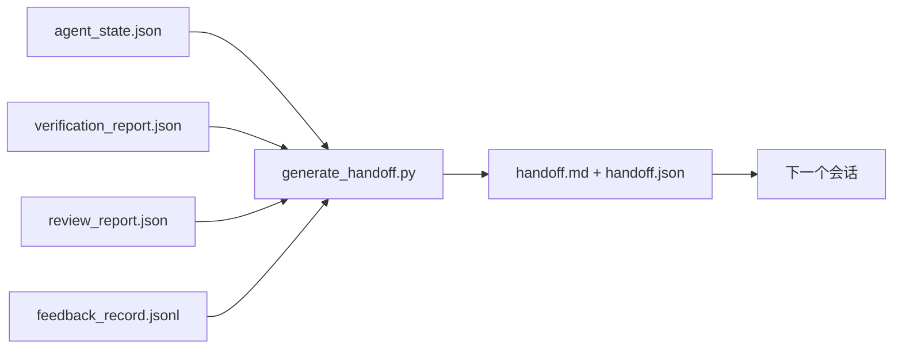

# 多会话交接

> 会话将要结束。工作没有结束。交接包是将"智能体工作了一个小时"转变为"下一个会话在第一分钟就有生产力"的工件。有目的地构建它，而不是事后补救。

**类型：** 构建
**编程语言：** Python（标准库）
**前置知识：** Phase 14 · 34（仓库内存）、Phase 14 · 38（验证）、Phase 14 · 39（审查者）
**预计时间：** 约 50 分钟

## 学习目标

- 识别每个交接包需要的七个字段。
- 从工作台工件生成交接，而不是手写散文。
- 将大型反馈日志裁剪为交接大小的摘要。
- 使下一个会话的第一个操作确定化。

## 问题背景

会话结束了。智能体说"太好了，我们取得了进展。"下一个会话打开了。下一个智能体问"我们从哪里离开的？"第一个智能体的答案消失了。下一个智能体重新发现，重新运行相同的命令，重新向人类问同样的问题，花了三十分钟恢复前一个会话最后三十秒的内容。

糟糕交接的成本在任务生命周期的每个会话中都要付出。解决方案是在会话结束时自动生成的包：什么改变了，为什么，尝试了什么，失败了什么，还剩什么，下次先做什么。

## 核心概念



### 每个交接携带的七个字段

| 字段 | 它回答的问题 |
|------|-----------|
| `summary` | 做了什么的一段话 |
| `changed_files` | 一眼可见的差异 |
| `commands_run` | 实际执行了什么 |
| `failed_attempts` | 尝试了什么以及为什么没有成功 |
| `open_risks` | 下一个会话可能踩坑的地方，带严重性 |
| `next_action` | 下一个会话采取的第一个具体步骤 |
| `verdict_pointer` | 验证 + 审查报告的路径 |

`next_action` 字段是承重的。没有 `next_action` 的交接是状态报告，不是交接。

### 交接是生成的，而不是手写的

手写的交接是在艰难的一天会被跳过的交接。生成器读取工作台工件并发出包。智能体的工作是将工作台保持在生成器可以总结的状态，而不是写摘要。

### 两种形式：人类可读和机器可读

`handoff.md` 是人类读取的。`handoff.json` 是下一个智能体加载的。两者来自相同的源工件。如果它们分歧，JSON 获胜。

### 反馈日志裁剪

完整的 `feedback_record.jsonl` 可能有数百条记录。交接只携带最后 K 条，加上每条非零退出的条目。下一个会话在需要时加载完整日志，但包保持小巧。

## 动手实践

`code/main.py` 实现：

- 一个将状态、判决、审查和反馈收集到单个 `WorkbenchSnapshot` 的加载器。
- 一个 `generate_handoff(snapshot) -> (markdown, payload)` 函数。
- 一个选取最后 K 条反馈条目加上所有非零退出的过滤器。
- 一个在脚本旁边写入 `handoff.md` 和 `handoff.json` 的演示运行。

运行：

```
python3 code/main.py
```

输出：打印的交接正文，加上磁盘上的两个文件。

## 生产中的模式

Codex CLI、Claude Code 和 OpenCode 各自发布了不同的压缩方案；结构化交接包位于所有三者之上。

**压缩策略各不相同；包 schema 不变。** Codex CLI 的 POST /v1/responses/compact 是服务器端不透明的 AES blob（OpenAI 模型的快速路径）；回退是作为 `_summary` 用户角色消息追加的本地"交接摘要"。Claude Code 在上下文的 95% 时运行五阶段渐进压缩。OpenCode 基于时间戳的消息隐藏加上 5 个标题的 LLM 摘要。三种不同的机制，相同的需求：将压缩后存活下来的内容序列化为可移植的工件。包就是那个工件。

**新会话交接不是压缩。** 压缩延长一个会话；交接干净地关闭一个并启动下一个。Hermes Issue #20372 的框架（2026 年 4 月）是正确的：当就地压缩开始降级时，智能体应该写一个紧凑的交接，结束会话，然后在新鲜的上下文中恢复。包是使这种转换廉价的东西。错误是不断压缩直到质量崩溃；解决方案是为早期、干净的交接做预算。

**每个分支和主题一个活跃交接。** 多智能体协调在陈旧交接上比在糟糕的模型输出上更容易出故障。始终包含 `branch`、`last_known_good_commit` 和 `active | superseded | archived` 的 `status`。陈旧交接被归档；只有活跃的交接驱动下一个会话。这是交接即笔记与交接即状态之间的差别。

**在 50-75% 上下文时收尾，而不是在满时。** 手写模式操作手册（CLAUDE.md + HANDOVER.md）报告当会话在 50-75% 上下文预算而不是 95% 时结束，效果最好。包生成器在压缩工件污染源状态之前干净地运行。上下文完整时写起来便宜；模型已经失去位置时很昂贵。

## 使用建议

生产模式：

- **会话结束钩子。** 运行时在用户关闭聊天时触发生成器。包进入 `outputs/handoff/<session_id>/`。
- **PR 模板。** 生成器的 markdown 也是 PR 正文。审查者不用打开其他五个文件就能读到。
- **跨智能体交接。** 用一个产品（Claude Code）构建，用另一个（Codex）继续。包是通用语言。

包很小、规则、生成成本低。节省的成本随每个会话复利。

## 产出技能

`outputs/skill-handoff-generator.md` 生成调整到项目工件路径的生成器、运行它的会话结束钩子，以及下一个智能体在启动时读取的 `handoff.json` schema。

## 练习

1. 添加 `assumptions_to_validate` 字段，呈现构建者记录但审查者没有评分超过 1 分的每个假设。
2. 对失败运行与通过运行以不同方式裁剪反馈摘要。为不对称辩护。
3. 包含"给人类的问题"列表。问题进入包与进入聊天消息的阈值是什么？
4. 使生成器幂等：运行两次产生相同的包。为了保持这一点，什么需要稳定？
5. 添加"下一个会话前置条件"部分，精确列出下一个会话在操作前必须加载的工件。

## 关键术语

| 术语 | 常见说法 | 实际含义 |
|------|---------|---------|
| 交接包 | "会话摘要" | 携带七个字段的生成工件，既有 markdown 也有 JSON |
| 下一步操作 | "先做什么" | 启动下一个会话的一个具体步骤 |
| 反馈裁剪 | "日志摘要" | 最后 K 条记录加上每条非零退出 |
| 状态报告 | "我们做了什么" | 缺少 `next_action` 的文档；有用，但不是交接 |
| 判决指针 | "收据" | 验证 + 审查报告的路径，用于可追溯性 |

## 延伸阅读

- [Anthropic，长时间运行智能体的有效运行框架](https://www.anthropic.com/engineering/effective-harnesses-for-long-running-agents)
- [OpenAI Agents SDK 切换](https://platform.openai.com/docs/guides/agents-sdk/handoffs)
- [Codex Blog，Codex CLI 上下文压缩：架构、配置、管理长会话](https://codex.danielvaughan.com/2026/03/31/codex-cli-context-compaction-architecture/) — POST /v1/responses/compact 和本地回退
- [Justin3go，卸下沉重的记忆：Codex、Claude Code、OpenCode 中的上下文压缩](https://justin3go.com/en/posts/2026/04/09-context-compaction-in-codex-claude-code-and-opencode) — 三家供应商压缩对比
- [JD Hodges，Claude 交接提示词：如何跨会话保持上下文（2026）](https://www.jdhodges.com/blog/ai-session-handoffs-keep-context-across-conversations/) — CLAUDE.md + HANDOVER.md，50-75% 上下文预算
- [Mervin Praison，管理多智能体编码会话中的交接：保持连续性而不丢失新鲜上下文](https://mer.vin/2026/04/managing-handoffs-in-multi-agent-coding-sessions-fresh-context-without-losing-continuity/) — 分布式系统框架
- [Hermes Issue #20372 — 当压缩变得有风险时自动新鲜会话交接](https://github.com/NousResearch/hermes-agent/issues/20372)
- [Hermes Issue #499 — 上下文压缩质量改进](https://github.com/NousResearch/hermes-agent/issues/499) — Codex CLI 中的交接导向提示词
- [Microsoft Agent Framework，压缩](https://learn.microsoft.com/en-us/agent-framework/agents/conversations/compaction)
- [OpenCode，上下文管理和压缩](https://deepwiki.com/sst/opencode/2.4-context-management-and-compaction)
- [LangChain，智能体的上下文工程](https://www.langchain.com/blog/context-engineering-for-agents)
- Phase 14 · 34 — 生成器读取的状态文件
- Phase 14 · 38 — 包指向的验证判决
- Phase 14 · 39 — 捆绑到包中的审查者报告
