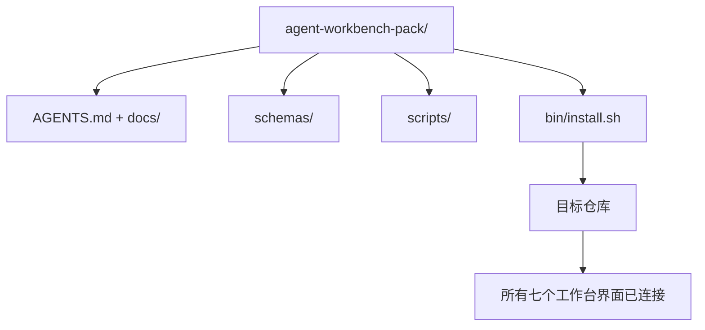

# 综合项目：发布可复用的智能体工作台包

> 小专题以一个你可以放入任何仓库的包结束。十一节课的界面压缩到一个你可以 `cp -r` 的目录，第二天早上就能让智能体可靠地工作。综合项目是这个课程所交换的工件。

**类型：** 构建
**编程语言：** Python（标准库）
**前置知识：** Phase 14 · 31 到 Phase 14 · 41
**预计时间：** 约 75 分钟

## 学习目标

- 将七个工作台界面打包到一个可即插即用的目录中。
- 固定 schema、脚本和模板，使新仓库获得已知良好的基线。
- 添加一个幂等地放置包的单一安装程序脚本。
- 决定包中保留什么，包中排除什么，为每个选择辩护。

## 问题背景

存在于 Google 文档、聊天历史和三个半记忆脚本中的工作台，是一个每个季度都会被重建的工作台。解决方案是一个版本化的包：一个带界面、schema、脚本和一键安装程序的仓库或目录。

你将以磁盘上发布的 `outputs/agent-workbench-pack/` 和一个将其放入任何目标仓库的 `bin/install.sh` 结束本课。

## 核心概念



### 包的布局

```
outputs/agent-workbench-pack/
├── AGENTS.md
├── docs/
│   ├── agent-rules.md
│   ├── reliability-policy.md
│   ├── handoff-protocol.md
│   └── reviewer-rubric.md
├── schemas/
│   ├── agent_state.schema.json
│   ├── task_board.schema.json
│   └── scope_contract.schema.json
├── scripts/
│   ├── init_agent.py
│   ├── run_with_feedback.py
│   ├── verify_agent.py
│   └── generate_handoff.py
├── bin/
│   └── install.sh
└── README.md
```

### 什么保留在包中，什么保留在包外

保留：

- 界面 schema。它们是契约。
- 以上四个脚本。它们是运行时。
- 四个文档。它们是规则和评分标准。

排除：

- 特定于项目的任务。任务属于目标仓库的板，而不是包中。
- 供应商 SDK 调用。包是框架无关的。
- 入职散文。包与团队现有的入职文档并存，而不是在其中。

### 安装程序

一个简短的 `bin/install.sh`（或 `bin/install.py`）：

1. 拒绝在没有 `--force` 的情况下覆盖现有包。
2. 将包复制到目标仓库。
3. 如果存在 `.github/workflows/`，则连接 CI。
4. 打印后续步骤：填写板，设置验收命令，运行初始化脚本。

### 版本控制

包携带一个 `VERSION` 文件。需要迁移的 schema 升级和脚本更改会升级主版本。仅文档更改会升级补丁版本。目标仓库的 `agent_state.json` 记录它是针对哪个包版本初始化的。

## 动手实践

`code/main.py` 将包组装到课程旁边的 `outputs/agent-workbench-pack/` 中，以之前小专题课程中的 schema 和脚本以及你已经写好的文档作为种子。

运行：

```
python3 code/main.py
```

脚本复制并固定界面，写入 README，打印包树，以零退出。重新运行是幂等的。

## 生产中的模式

只有当包能在分叉、更新和不友好的上游中存活时，它才有价值。四种模式使其有效。

**`VERSION` 是契约，不是营销。** 主版本升级需要状态迁移。次版本升级需要检查器重新运行。补丁升级仅限文档。安装程序在每次安装时将 `.workbench-version` 写入目标仓库；`lint_pack.py` 在目标锁与包的 `VERSION` 不一致时拒绝发布。这就是 `npm`、`Cargo` 和 `pyproject.toml` 在 10 年的变化中存活的方式；关于智能体的任何内容都不改变规则。

**跨工具分发的单一来源。** Nx 发布一个 `nx ai-setup`，从单个配置布置 `AGENTS.md`、`CLAUDE.md`、`.cursor/rules/`、`.github/copilot-instructions.md` 和 MCP 服务器。包应该做同样的事情；安装程序发出符号链接（`ln -s AGENTS.md CLAUDE.md`），使单一真实来源传播到每个编码智能体。为了支持一个工具而分叉包是一种失败模式。

**拒绝在非平凡状态上运行的 `uninstall.sh`。** 卸载包不得删除用户的 `agent_state.json`、`task_board.json` 或 `outputs/`。卸载程序删除 schema、脚本、文档和 `AGENTS.md`（带 `--keep-agents-md` 退出选项），如果状态文件有任何未提交的变更则拒绝继续。状态属于用户；包不拥有它。

**技能即可发布。SkillKit 风格分发。** 包以 SkillKit 技能的形式发布：`skillkit install agent-workbench-pack` 从单一来源跨 32 个 AI 智能体布置它。包仓库是真实来源；SkillKit 是分发渠道。供应商锁定崩溃；七个界面保持不变。

## 使用建议

包发布到三个地方：

- **作为你放入仓库的目录。** `cp -r outputs/agent-workbench-pack /path/to/repo`。
- **作为公共模板仓库。** Fork 并自定义，`VERSION` 控制漂移。
- **作为 SkillKit 技能。** 接入你的智能体产品，使单个命令布置它。

包是食谱。每次安装是一次服务。

## 产出技能

`outputs/skill-workbench-pack.md` 生成一个针对项目调整的包：针对团队历史锐化的规则，与仓库匹配的范围 glob，用一个领域特定条目扩展的评分标准维度。

## 练习

1. 决定哪个可选的第五个文档值得晋升为规范包中的一部分。为选择辩护。
2. 用带 `--dry-run` 标志的 Python 重写安装程序。比较与 bash 的人机工程学。
3. 添加一个 `bin/uninstall.sh`，安全地删除包，如果状态文件有非平凡历史则拒绝。什么算作非平凡？
4. 添加一个 `lint_pack.py`，当包偏离 `VERSION` 时失败。将其接入包自己仓库的 CI。
5. 编写从手工搭建的工作台迁移到此包的迁移操作手册。最小化停机时间的操作顺序是什么？

## 关键术语

| 术语 | 常见说法 | 实际含义 |
|------|---------|---------|
| 工作台包 | "入门套件" | 携带所有七个界面的版本化目录 |
| 安装程序 | "设置脚本" | 幂等地布置包的 `bin/install.sh` |
| 包版本 | "VERSION" | schema/脚本更改升级主版本，仅文档升级补丁 |
| 即插即用包 | "cp -r 然后就行" | 包在第一天无需每仓库自定义即可工作 |
| 可分叉模板 | "GitHub 模板" | GitHub 的"使用此模板"可以克隆的公共仓库 |

## 延伸阅读

- Phase 14 · 31 到 14 · 41 — 此包捆绑的每个界面
- [SkillKit](https://github.com/rohitg00/skillkit) — 跨 32 个 AI 智能体安装此技能
- [Nx Blog，教你的 AI 智能体如何在单体仓库中工作](https://nx.dev/blog/nx-ai-agent-skills) — 跨六个工具的单源生成器
- [agents.md——开放规范](https://agents.md/) — 你的包的路由器必须实现的内容
- [HKUDS/OpenHarness](https://github.com/HKUDS/OpenHarness) — 包等价物的参考实现
- [andrewgarst/agentic_harness](https://github.com/andrewgarst/agentic_harness) — 带评估套件的 Redis 支持参考
- [Augment Code，好的 AGENTS.md 相当于模型升级](https://www.augmentcode.com/blog/how-to-write-good-agents-dot-md-files) — 包文档质量标准
- [Anthropic，长时间运行智能体的有效运行框架](https://www.anthropic.com/engineering/effective-harnesses-for-long-running-agents)
- [Anthropic，长时间运行应用开发的运行框架设计](https://www.anthropic.com/engineering/harness-design-long-running-apps)
- Phase 14 · 30 — 消耗包的验证门控的评估驱动智能体开发
- Phase 14 · 41 — 此包改进的前后基准
